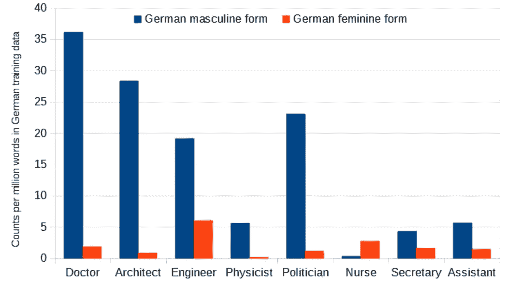
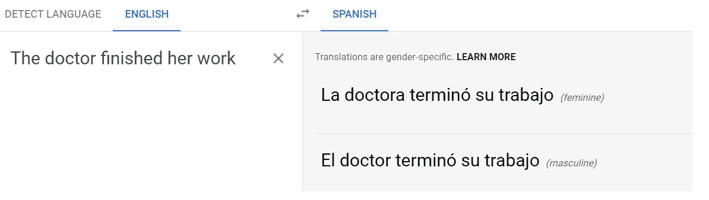
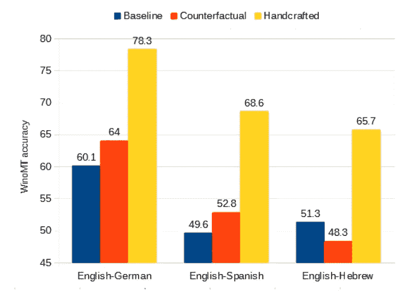
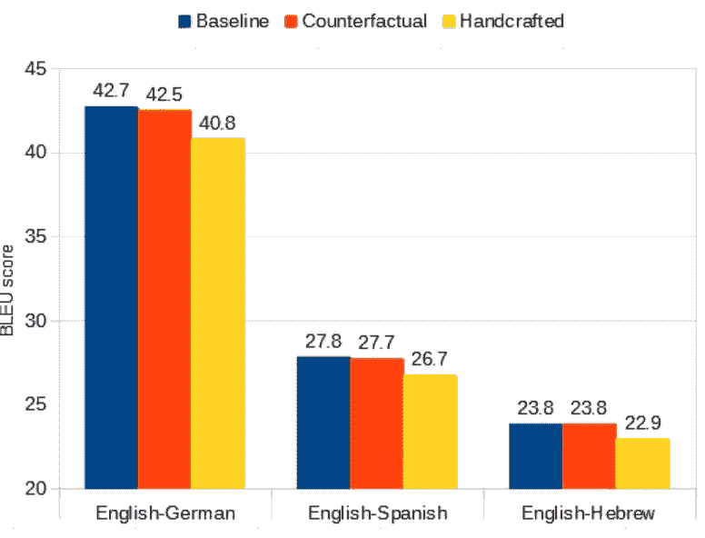
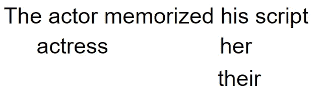

# 减轻机器翻译中的性别偏见:适应，然后纠正

> 原文：<https://medium.com/analytics-vidhya/reducing-gender-bias-in-neural-machine-translation-as-a-domain-adaptation-problem-d5597c52b129?source=collection_archive---------23----------------------->

机器翻译努力翻译人们的性别。相反，它反映了大量训练句子中的性别偏见。但是，从头开始重新训练计算密集型机器翻译是低效的，并且从庞大的数据集中消除微妙的不平衡可能是不可能的。

*相反，我们决定通过*调整*现有模型以适应新数据来减少偏见行为，从而避开这两个问题。请继续阅读我们是如何做到这一点的总结以及我们的发现，或者参见我们的* [*ACL 2020 论文，“*减少神经机器翻译中的性别偏见作为领域适应问题”](https://www.aclweb.org/anthology/2020.acl-main.690/)，*了解所有细节。*

**翻译(人类)性别**

德语、西班牙语、希伯来语、阿拉伯语和俄语只是众多具有丰富语法性别的语言中的一小部分。对于这些语言来说，一个句子只有在它的单词具有一致的语法性别时才是正确的。

对于一些词，像“桌子”，性别是固定的。然而，对于指代一个人的单词，语法上的性别可能取决于这个人的性别。像这样的人指词存在于英语中，通常作为职业使用——例如，“女演员”是“演员”的阴性形式。

在语法性别比英语丰富的语言中，更多的人指词被性别化。对于这些语言，机器翻译需要正确一致地翻译人类性别。最近几年，特别是 Stanovsky 等人发现，机器翻译在这一点上失败了。

相反，机器翻译的工作方式看起来很像性别刻板印象。默认情况下，医生和工程师往往被翻译成阳性形式，而护士和秘书往往被翻译成阴性形式。

**机器翻译为什么会刻板化性别？**

通过向机器翻译系统“展示”成对的句子及其翻译，训练机器翻译系统从一种语言翻译成另一种语言。良好的性能可能需要数百万个示例。

当我们观察目标语言中带有性别的词时，比如“医生”，我们发现它们通常偏向于带有阳性或阴性形式的例子。

主要来源于新闻报道的 2300 万单词的英德数据集中德语专业术语的阳性和阴性形式的每百万单词的频率

例如，在德国培训的例子中，男性医生的例子要多得多。这可能是因为数据集中有更多的男性医生，或者可能是因为在没有其他上下文的情况下，使用阳性作为默认的约定，就像句子“医生同意这一点”

因此，当翻译新句子时，“最佳猜测”最终会默认这种模式。

常规翻译发生在什么时候？

有趣的是，这种通过翻译产生的性别刻板印象*不仅仅发生在无法辨别性别的模糊* *句子*中。

当要翻译的句子中有一个代词时，也会发生这种情况，就像这个德国例子，这是不一致的:“医生”被翻译成阳性，“她的工作”被翻译成正确的阴性。[1]

1 月 21 日进行英语到德语的翻译。性别翻译是不一致和不正确的。

谷歌自己的解决机器翻译中性别偏见的方案是提供两个版本的翻译，一个使用阳性形式，一个使用阴性形式。

当从一种语法性别不丰富的语言(如土耳其语)翻译成一种通常指定性别的语言(如英语)时，这很有意义。

但是当翻译一个可以从原句中合理推断出性别的例子时，比如这个英语到西班牙语的例子，似乎应该有更好的方法。

从英语到西班牙语的翻译，于 1 月 21 日进行。谷歌为某些语言制作了特定性别的翻译，以应对性别歧义。这句话似乎没那么暧昧。

从英语到西班牙语的翻译，于 1 月 21 日进行。阳性形式不会被解读为含糊不清。

要强调的是，这不仅仅是关于在没有其他信息的情况下对刻板印象的懒惰依赖。这是关于懒惰的依赖刻板印象，这与源句的明确含义背道而驰。

**这是个问题吗？**

好吧，最好的情况是，这种行为对用户来说有点令人讨厌或沮丧，这已经是一个糟糕的开始。但是考虑机器翻译的用例:用一种新的语言起草一封电子邮件或一条信息，或者阅读一个翻译的网页。

带有刻板印象的翻译歪曲了被翻译的词和作者。

**我们如何衡量这种影响？**

[WinoMT 测试集](https://github.com/gabrielStanovsky/mt_gender)是在从英语翻译成语法性别更丰富的语言时评估这个问题的测试集。它包含了大约 4000 个句子，每个句子有两个人指词和一个代词。

摘自 Stanovsky 等人 2019 年的《评估机器翻译中的性别偏见》。英语句子来自 WinoMT。西班牙译文把代词和错误的人对上了。

主要目标是提高与代词相关的职业的性别准确性，尽管在论文中我们也探索了更详细的结果，如阳性和阴性标记句子的不同表现。

值得记住的是，职业的选择使得翻译每句话的性别刻板印象将达到 50%的准确率。

**我们的方法:使现有的机器翻译模型适应“手工制作”的数据集**

机器翻译模型需要大量的时间、计算能力和数据才能很好地工作。每当我们发现新的不良行为时，我们都希望避免从头开始。

但是他们可以很快适应一套新的例句。这是一种广泛使用的方法，可以让系统在特定的“领域”中很好地翻译，比如科学论文，或者来自某个个人客户的文档。

我们的想法是定义一个男性和女性实体数量相等的句子“域”。[2]

为此，我们按照一个模板定义了一个非常简单的不到 400 个句子的集合:

**【职业】**完成了**【他|她】**的工作

我们从先前公布的名单中挑选职业。每种职业在性别语言中都出现两次，分别带有阳性和阴性的变化。

其中一些职业可能会出现在 WinoMT 测试句子中，因此我们也创建了一个没有这些重叠职业的集合，而是混合了基于形容词的句子:

**【形容词】【男|女】**完成**【他|她】**工作

这里的结果是为了适应这种不重叠的“手工制作”的设置，这种设置记忆职业的机会较少。

**为什么不对原句进行平衡？**

虽然人们已经尝试了“反事实增强”，或者试图以这种方式平衡英语文本，但对语法性别化的语言做同样的事情会变得非常复杂，因为太多的单词可能需要调整以保持语法正确。

然而，我们也比较适应一种来自原始训练集的“平衡”文本形式。第一，创造要慢很多倍，适应也要慢很多倍。

实验上，我们没有发现适应“自然的”反事实集合比基线模型提高了 WinoMT 性别准确性太多。

当使基线模型适应大型自然反事实集时，以及当使基线适应小型“手工制作”集时，WinoMT 性别准确性。注意:随机选取阳性或阴性变化的模型在这个数据集上的准确率为 50%。

适应过程中的“灾难性遗忘”:性别准确性提高，但总体翻译能力下降。

神经网络适应看似不可避免的权衡是，模型学会了做新的事情，但失去了以前能做的任何事情的能力。

在这种情况下，它以前可以做的是将各种句子翻译成目标语言。机器翻译质量是用 BLEU 评分来衡量的，0 BLEU 是完全无意义的，100 BLEU 是与某些人工翻译完美匹配的翻译。

当模型适应手工制作的数据集时，与基线相比，BLEU 得分降低。

检查适应模型的标准测试集上的 BLEU 分数，我们看到当强烈适应手工制作的模型时，遗忘的证据减少了 BLEU 分数。

阻止这种情况的一种方法是像弹性权重合并这样的正则化方案。这阻止了神经网络改变太多，但是引入了折衷。它忘记的少，但学的也少。

我们建议的另一种方法是将此视为一个纠错问题。

**想法:先适应，再纠正性别错误**

原模型可能擅长翻译范围广泛的句子。但我们知道它在与人类所指的性别术语作斗争。

改编后的模型可以高度专门化，以便很好地翻译这些术语。但是大多数单词都不是指人的性别术语。

我们的想法是用原始模型生成第一遍翻译，然后用修改后的模型生成第二遍翻译。但至关重要的是，改编模式只能将原译文中的单词改变为同一单词不同语法性别的其他形式。

例如，在英语中，可以允许模型在“他的”、“她”和“他们的”之间变化，作为不同性别的所有格代词。它可以在“男演员”和“女演员”之间变化，作为该词的两种性别变化。但是，不允许将“他的”改为“演员”。单词“the”、“memorized”和“script”都将保持不变，因为它们在英语中没有交替的性别形式。

单词可以变成其他性别屈折变化的版本，但不能变成不相关的单词。

在[我们的 github 上可以找到这个过程的演练，链接到一个带有脚本和数据的驱动账户。](https://github.com/DCSaunders/gender-debias)

对于我们感兴趣的语法性别语言，更多的单词有不同的性别形式，比如德语。像 [spaCy](https://spacy.io/) 这样的现有工具可以用来收集这些。

**效果如何？**

我们发现这个非常好用！在标准翻译测试集上，我们几乎没有看到 BLEU 的减少。在 WinoMT 上，性别准确率仍然大幅提高。事实上，因为我们不必担心遗忘的权衡，我们可以比上面的图更好地提高准确性。

对于英语到西班牙语和英语到希伯来语，性别准确率从 50%左右——非常接近二进制 WinoMT 测试集上的随机猜测——到 60%左右。对于英语到德语，我们的最佳初始模型，WinoMT 准确率从 60.1%提高到 80%以上。

总的来说，我们看到在没有性别术语的句子中，相对准确率比基线提高了大约 30%,而性能基本上没有变化。

**下一步是什么？**

这项调查的结果很有希望。我们使用非常少量的容易准备的*适应*数据来将现有的机器翻译模型集中在性别术语上，并潜在地减轻预先存在的性别偏见。

就应用而言，本文提供了两种特定的途径:

*   一个途径与我们考虑的性别变化类型有关。人类的性别不是二元的，越来越多的人更喜欢使用代词和其他男性/女性默认值之外的术语。然而，许多语言对于人类指称的词只有二元语法性别约定。我们能否为灵活定义的新性别变化开发一个框架来扩展——并评估——我们的方法？
*   另一个途径是关于我们对一个孤立的句子中提到的任何一个人的性别有多确定。正如我们之前提到的，有可能出现代词-实体链接的任何组合都是合理的情况。但是如果我们确定地知道，比如说，医生是女的，护士是男的呢？这里描述的方法可以利用带有某种性别标签的信息吗？

在后续的论文中， [*神经机器翻译不会正确翻译性别共指，除非你使其*](https://www.aclweb.org/anthology/2020.gebnlp-1.4/) ，我们表明这两个问题的答案都是肯定的——在某些情况下。那篇论文的一篇评论现在也上来了！

[1]任何人类语言的例子都可能有歧义。在这个例子中，你可以争辩说医生可能正在完成别人的工作。出于本文的目的，我们着重于不需要外部环境的解释。在后续论文中，我们探索了可控性别转换的可能性，消除了这种模糊性。

[2]在本文中，仅使用阳性和阴性语法性别允许我们直接使用 WinoMT 并与已发表的结果进行比较——在我们的[后续论文](https://daniellecsaunders.medium.com/machine-translation-doesnt-translate-gender-right-unless-you-make-it-5342899c2fbc)中，我们将想法和测试集扩展到引入非二进制语法屈折的更复杂场景。