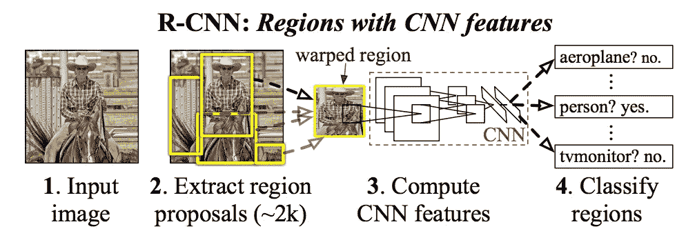
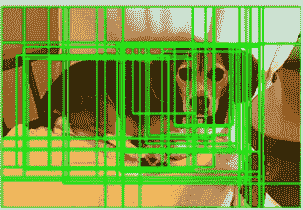

# 基于区域的卷积神经网络

> 原文：<https://medium.com/analytics-vidhya/region-based-convolutional-neural-network-rcnn-b68ada0db871?source=collection_archive---------5----------------------->

R-CNN 是由加州大学伯克利分校的 Girshick 等人在 2014 年开发的基于区域的对象检测算法。在进入该算法之前，让我们试着理解对象检测实际上意味着什么，以及它与图像分类有何不同。

# **什么是物体检测？**

以上面给出的图像为例，考虑图像分类。从第一个例子中，我们将能够对给定的图像是否是狗/猫进行分类，而在第二个例子中，除非我们分别检测狗和猫，否则我们不能进行分类。在现实世界中，我们总是在一幅图像中有多个物体。这就是物体检测的重要性所在。

**图像分类**:预测图像中物体的类型或类别。

*   *输入*:单个物体的图像，如照片。
*   *输出*:一个类标签(例如，映射到类标签的一个或多个整数)。

**物体检测**:用边界框定位物体的存在，以及在图像中定位的物体的类型或类别。

*   *输入*:带有一个或多个物体的图像，如照片。
*   *输出*:一个或多个边界框(例如，由点、宽度和高度定义)，以及每个边界框的类别标签。

# **R-CNN 算法**

为了理解 R-CNN，我们需要有一些关于卷积神经网络如何工作以及什么是平均精度(mAP)度量来测量性能的先验知识。

> **链接:**
> 
> CNN—[https://adeshpande 3 . github . io/A-初学者% 27s-理解指南-卷积神经网络/](https://adeshpande3.github.io/A-Beginner%27s-Guide-To-Understanding-Convolutional-Neural-Networks/)
> 
> mAP—[https://data NICs . blogspot . com/2020/11/understanding-mean-average-precision . html？m=1](https://datanics.blogspot.com/2020/11/understanding-mean-average-precision.html?m=1)

R-CNN( [论文](https://arxiv.org/pdf/1311.2524v5.pdf))卷积神经网络首次大规模成功应用于对象定位、检测和分割问题之一。该方法在基准数据集上进行了验证，在 VOC-2012 数据集和 200 类 ILSVRC-2013 目标检测数据集上取得了最新的结果。

> **架构:**

基于区域的 CNN 包括三个模块——区域提议、特征提取和分类器。

**区域建议:**当给定一幅输入图像时，区域建议试图检测不同大小和纵横比的不同区域(~2000)。换句话说，它在输入图像中绘制了多个边界框，如下所示。

区域建议结果

**特征提取器:**CNN 网络将训练每个提议区域，最后一层(4096 个特征)将被提取为特征，因此特征提取器的最终输出将是**提议区域数 x 4096**

**分类器:**一旦特征被提取出来，我们需要对每个区域内的物体进行分类。为此，线性 SVM 模型被训练用于分类，具体地，每个类别一个 [SVM 模型](https://www.analyticsvidhya.com/blog/2017/09/understaing-support-vector-machine-example-code/)。

# **R-CNN 的缺点:**

*   训练网络需要花费大量的时间，因为你必须对每幅图像的 2000 个区域提议进行分类。
*   它不能实时实现，因为每个测试图像需要大约 47 秒。
*   选择性搜索算法是一种固定算法。因此，在那个阶段没有学习发生。这可能导致产生坏的候选区域提议。

感谢阅读！！！