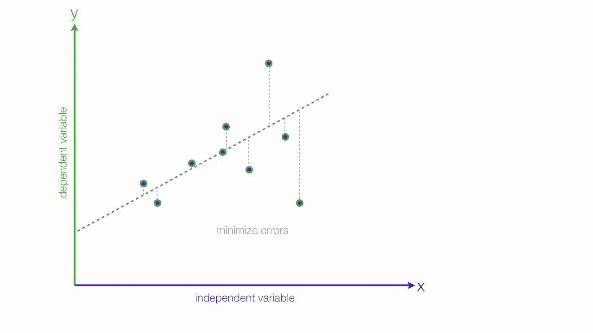

# 1 分钟内的回归分析

> 原文：<https://medium.com/analytics-vidhya/regression-analysis-90d2944f7ecb?source=collection_archive---------27----------------------->

回归分析是一种测量或估计变量之间关系的技术。

回归分析根据自变量的值提供因变量**的估计值。**

回归线描述了存在于 **x** 和 **y** 之间的平均关系。

> **相关分析和回归分析的区别**

1.  **相关系数**是对 **x** 和 **y** 之间 **共变异性**程度的**度量，而**回归分析**的目的是研究**的**性质。**
2.  在**相关性分析**中 **rₓᵧ或 rᵧₓ都是对称的(rₓᵧ=rᵧₓ)** 。在**回归分析中，bₓᵧ和 bᵧₓ** 是**不对称(bₓᵧ =/= bᵧₓ)** 。
3.  在**相关性分析**中，我们不能说**一个变量是“原因”**而**另一个是“结果”**，但是在**回归分析**中，可以研究**因果关系**。
4.  相关性分析中可能存在**无意义相关性**与**无实际相关性***收入增加和体重增加的例子。*回归分析上没有这些东西。
5.  **相关系数**是**独立于原点和标度**的变化。**回归系数**与原点变化无关，而**与标度无关。**

> **相似之处**

相关系数(r)和回归系数(bₓᵧ和 bᵧₓ)总是具有相同的符号。