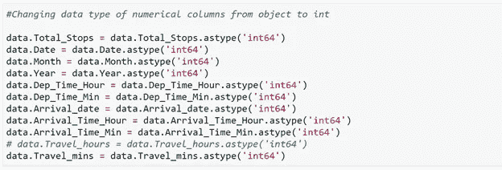
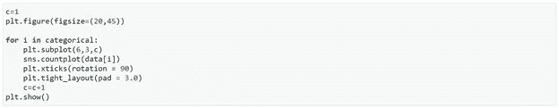
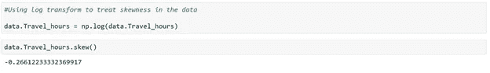
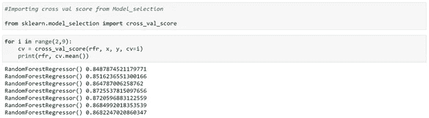

# 回归-航班价格预测

> 原文：<https://medium.com/analytics-vidhya/regression-flight-price-prediction-6771fc4d1fb3?source=collection_archive---------0----------------------->

机器学习(ML)是对计算机算法的研究，它随着经验和数据的使用而改进。机器学习算法基于样本数据(训练数据)建立模型，并使用该模型进行预测或决策，而无需编程。

机器学习算法有广泛的应用，如欺诈检测、电子邮件过滤等。机器学习的一个应用是在“航空业”，预测航班价格。影响航班价格的因素/特征多种多样——距离、飞行时间、经停次数等。这些因素有助于创建一个决定航班价格的模式，机器学习模型在这个模式上接受训练，以在未来做出预测，自动化这个过程，使这个过程更快。

# 问题陈述

机票价格可能很难猜测，今天我们可能会看到一个价格，明天查看同一航班的价格，这将是一个不同的故事。

为了解决这个问题，我们已经获得了 2019 年 3 月至 6 月期间各航空公司和各城市之间的机票价格，我们旨在使用这些价格建立一个模型，该模型使用各种输入特征预测航班价格。

# 数据集

数据集链接—[https://github . com/DSR scientist/Data-Science-ML-Capstone-Projects](https://github.com/dsrscientist/Data-Science-ML-Capstone-Projects)

我们这里有 2 个数据集—训练集和测试集。

训练集包含这些功能，以及航班的价格。它包含 10683 条记录、10 个输入特征和 1 个输出列—“价格”。

测试集包含 2671 条记录和 10 个输入特征。需要在该集合中预测输出“价格”列。这里我们将使用回归技术，因为预测的输出将是一个连续的值。

以下是数据集中可用要素的描述

1.**航空公司**:航空公司的名称。

2.**旅程日期**:旅程的日期

3. **Source** :服务开始的来源。

4.**目的地**:服务结束的目的地。

5.**航线**:航班到达目的地所走的航线。

6. **Dep_Time** :旅程从源头开始的时间。

7.**到达时间**:到达目的地的时间。

8.**持续时间**:飞行总持续时间。

9. **Total_Stops** :出发地和目的地之间的总停留次数。

10.**附加信息**:关于航班的附加信息

11.**价格**:门票的价格

# 文章的内容

本文解释了构建机器学习模型的完整过程。下面提到的是我们将在整个项目中经历的各个阶段-

1.探索性数据分析和数据建模

2.异常值检测和偏斜度处理

3.编码数据—标签编码器

4.缩放数据—标准缩放器

5.拟合机器学习模型

6.所选模型的交叉验证

7.模型超调

8.保存最终模型并使用保存的模型进行预测

因此，让我们开始探索我们的数据集，并开始建立一个预测模型。

# 探索性数据分析和数据建模

我们使用熊猫库加载训练数据集

第一步是看看我们的数据样本——

我们首先确定了以下几点

1.Route 列包含我们需要分离的城市列表，因为我们的数据集中有多个组合。

2.“到达时间”列附有日期，我们需要将其分开。这些都是航班在某个日期从出发地起飞，第二天到达目的地的情况。

3.持续时间是字符串格式，我们需要将其转换为整数类型。

4.“总停车次数”还添加了文本“停车次数”以及停车次数，某些列为“非停车”，我们需要将其转换为整数类型。

我们进一步探索数据集。

我们运行 data.info()命令，该命令为我们提供了关于每一列中存在的值的数量以及每一列的数据类型的信息。

我们发现所有的列都是“object”数据类型，只有“Price”列(输出)是整数类型。因为我们知道我们的列意味着什么，所以我们知道我们需要处理哪些列！

现在，我们检查数据集中 NaN (null)值的计数，结果得到以下结果

我们在“路线”列中缺少一个值，在“总停靠点”列中缺少一个值。我们将进一步有意义地替换丢失的值。

我们现在开始研究数据集中可用的列。我们要做的第一件事是创建分类列的列表，并检查这些列中存在的唯一值

我们观察到

1.  航空公司列有 12 个唯一值- 'IndiGo '，'印度航空'，'印度航空'，' SpiceJet '，'多家航空公司'，' GoAir '，' Vistara '，'亚洲航空'，' Vistara Premium economy '，'印度航空商务'，'多家航空公司 Premium economy '，' Trujet '。
2.  2.源列有 5 个唯一值-“班加罗尔”、“加尔各答”、“钦奈”、“德里”和“孟买”。
3.  3.目的地列有 6 个唯一值-'新德里'，'邦洛尔'，'科钦'，'加尔各答'，'德里'，'海德拉巴'。
4.  4.附加信息列有 10 个唯一值:“无信息”、“不含机上餐食”、“不含托运行李”、“1 次短暂停留”、“无信息”、“1 次长期停留”、“变更机场”、“商务舱”、“红眼航班”、“2 次长期停留”。

现在，我们拆分日期列以提取“日期”、“月份”和“年份”值，并将它们存储在数据帧的新列中。

此外，我们拆分 Route 列来创建多个列，其中包含航班经过的城市。我们检查航班的最大停留次数，以确定最长航线的最大城市数

因为站点的最大数量是 4 个，所以在任何特定的路线中最多应该有 6 个城市。我们在 route 列中拆分数据，并将所有城市名称存储在单独的列中——

以类似的方式，我们拆分 Dep_time 列，并为出发小时和分钟创建单独的列

此外，为了将到达日期和到达时间分离，我们拆分了“到达时间”列，并创建了“到达日期”列。我们还拆分了时间，将其分为“到达时间小时”和“到达时间分钟”，类似于我们对“Dep_time”列所做的操作

接下来，我们将“持续时间”列分为“行程小时数”和“行程分钟数”

我们还处理“总停留次数”列，用 0 值替换直飞航班，并提取“总停留次数”列的整数部分

我们继续到“Additional_info”列，在那里我们观察到有 2 个类别表示“No info ”,由于“No Info”中的“I”是大写字母，所以分为 2 个类别。我们将“无信息”替换为“无信息”,将其合并为一个类别——

我们现在删除所有从中提取有用信息的列(原始列)。我们还删除了一些列，如“城市 6”和“城市 5”，因为这些列中的大部分数据是 NaN(空)。结果，我们现在获得了 20 个不同的列，我们将把它们输入到 ML 模型中。但是首先，我们处理丢失的值，并研究列中的内容及其对航班价格的影响，以分离出最终列集的列表。

# 替换丢失的值

由于引入了新的列，我们在数据集中引入了许多 NaN 值，现在我们需要对其进行整理。

我们选择删除“城市”列，因为 10683 行中的 9117 个值包含 NaN 值。然后，我们打印出缺少“城市 1”数据的行。

我们发现这是丢失“Route”的同一行。此行还将“Total_stops”作为 NaN。我们将这一行中的城市 1 替换为“德尔”，将“城市 2”替换为“COK”。我们在这里将“总停车次数”替换为 0。

我们进一步用“无”替换“城市”中的“南”值，因为缺少“城市”的行没有任何停靠点，只有源和目的地。

我们还用“日期”列中的值替换“到达日期”列中缺少的值，因为缺少的值是航班在同一天起飞和降落的值。

我们还将“Travel_mins”中缺少的值替换为 0，因为缺少的值表示行程时间仅按小时计算，没有额外的分钟。

使用上述步骤，我们成功地处理了数据中所有缺失的值。我们再次检查数据中的信息，发现数据集仍有多个列的数据类型为“object ”,而它应该是“int”—

因此，我们试图改变所需列的数据类型

在此步骤中，我们面临转换“Travel_hours”列的问题，即该列的数据为“5m”，这不允许将其转换为“int”。

我们打印这一行来检查一次数据——

数据显示飞行时间是“5 分钟”，这显然是错误的，因为飞机不可能在 5 分钟内从孟买->果阿->浦那->海德拉巴！(该航班的“总停留次数”为 2)

由于该行中存在不正确的数据，我们选择删除该行。

然后，我们将“Travel_hours”列转换为“int”数据类型，操作成功完成。

我们现在有一个处理过的数据集，有 10682 行和 19 列(18 个自变量和 1 个因变量)。

我们创建分类列和数字列的单独列表，用于绘制和分析数据——

使用 seaborn、matplotlib 库继续绘制和分析数据——

绘制分类数据的计数图–

我们使用上面的图进行下面提到的观察——

**航空公司**

*   Jet Airways 是最受欢迎的航空公司，排在第一位，其次是 Indigo 和 AirIndia。
*   Vistara Premium economy、Trujet、Multiple carries premium economy 和 Jet airways 的业务很低。

**来源**

*   大多数航班都是从德里起飞的
*   钦奈的航班起飞次数最少

**目的地**

*   最大数量的航班在科钦着陆
*   加尔各答接待航班的数量最少

**附加信息**

*   最大行数没有 info 作为值。
*   我们需要检查这个专栏如何影响价格

**城市 1**

*   城市 1 具有与源列相同的数据
*   “DEL”还有一个额外的值，在名称中有一个额外的空格，这个值非常低。我们将把这个和' DEL '合并。

**城市 2**

*   大多数航班都在孟买停留。
*   有许多城市的停车次数很少。我们将检查带有 1 个停靠点的航班如何影响航班价格，以及是否与停靠地点有任何关系。

**城市**

*   大多数航班没有第二站
*   如果有第二站，很有可能是科钦。

我们现在绘制分布图来检查数字数据的分布

我们从数字数据中得出以下观察结果——

**总停止次数**

*   大多数航班的停靠站为 1，停靠站为 3 和 4 的航班非常少

**日期**

*   没有航班旅行的具体日期；所有日期的分布几乎相似

**月**

*   人们倾向于在四月少旅行
*   -五月和六月的航班数量较多，似乎人们会在假期旅行

**年**

*   此列只有 2019 作为值，可以删除

**Dep_Time_Hour**

*   大多数航班倾向于在清晨起飞
*   16:00 - 23:00 起飞的航班数量也很多，下午的航班数量较少。

**Dep_Time_Min**

*   大多数航班整点起飞(分钟为 00)

**到达日期**

*   在大多数情况下，航班在同一天起飞和降落

**到达时间小时**

*   大多数航班在晚上 18:00-19:00 左右到达目的地
*   这似乎是因为大多数航班的起飞时间在早上，因此在晚上降落

**最小到达时间**

*   这种分布是类似的，并没有给出任何专门的信息

**行驶时间**

*   大多数航班的旅行时间大约为 2-3 小时，这似乎是可以的，因为这些都是国内航班
*   一些航班也有大约 30 个小时的时间，这可能是因为中间停站的数量

**出行分钟**

-数据被分割，不指向任何特定点

**“价格”栏的分布**

price 列包含最小值 1759 和最大值 79512。大多数航班的价格范围在 1759-20k 之间，价格高于 20k 的航班数量很少。价格范围向右倾斜。

我们现在将独立功能与“价格”列进行比较，以检查对“价格”的影响。

我们提出以下意见——

- Jet airways 商务舱的价格最高，在 5 万到 8 万之间

-所有高成本航班都从班加罗尔出发，其余航班的价格在 3k-50k 之间

-所有高成本航班的目的地都是德里，其余航班的价格在 3k-50k 之间

-如果航班是商务舱，其价格会很高

-价格高的航班有 1 站，停在孟买

-价格较高的两站航班经停德里。

价格高于 50k 的数据就更少了。我们检查这些行一次–

我们观察到以下情况

-我们观察到价格高的航班有 8 个。

-这些航班中的大多数都是从同一条路线起飞的——BLR-> BOM-> DEL

-大多数航班属于商务舱

-所有的航班都有喷气航空公司。

-所有这些航班都是在 3 月份起飞的

我们现在继续检查“价格”列与数字数据的关系

我们观察到

-随着止损次数的增加，价格范围缩小到一个更小的价格窗口(10k-22k)

-高价航班在月末会减少

-三月份的价格较高

-随着旅行时间的增加，价格上涨，但航班数量减少。

经过上述分析，我们删除了不需要的栏目，我们认为这些栏目对航班价格没有影响。这些列包括' Dep_Time_Min '，' Arrival_Time_Min '，' Travel_mins '，' Year '，' City1 '。

我们现在有了最终的数据集，有 10682 行和 14 列(包括“价格”列)。

# 离群点检测

我们现在绘制箱线图来检查数据中是否存在异常值

我们得出以下结论

-异常值出现在总时数、总停留次数和价格中

-我们不会从总停靠点中移除异常值，因为价格受停靠点数量的影响

-我们不会删除高小时数的数据，小时数的增加显示了上图中为 EDA 绘制的价格模式。

# 偏斜处理

我们现在继续处理数据中的偏斜度，这允许我们将数据拟合为对称分布，这进一步允许我们的模型更好地学习。

我们需要处理“Travel_hours”列的偏斜度，考虑偏斜度的阈值为+/-0.5(我们不会转换“Price”列，因为它是我们的目标变量)。

我们使用对数变换方法来消除偏斜——

我们已经成功地处理了数据中的偏态。我们现在将进行“编码”步骤。

# 对分类数据进行编码

在这一步中，我们对分类数据进行编码，将其转换为整数类型，因为该模型不适用于“字符串”数据。我们使用“标签编码器”来达到预期的效果——

我们转换后的数据看起来像这样——

# 缩放数据

下一步是使数据达到一个共同的尺度，因为有些列的值很小，有些列的值很大。这个过程很重要，因为相似尺度的值允许模型更好地学习。

我们在此过程中使用标准定标器——

***'*** *标准标度遵循标准正态分布(SND)。因此，它使平均值= 0，并将数据缩放到单位方差'*

我们的缩放数据如下所示

# 拟合回归模型

我们现在进行机器学习的主要步骤，拟合模型并预测输出。我们将数据拟合到多个回归模型中，以比较所有模型的性能，并选择最佳模型

我们使用下面提到的代码将数据拟合到 ML 模型中并预测输出——

我们使用 K-Neighbors 回归器获得了最好的分数，r2_score 为 81%。我们还利用该模型获得了平均绝对误差、平均平方误差和均方根误差(回归度量)的最小值。

我们尝试使用集合模型来检验我们的性能是否有所提高

我们观察到以下情况

随机森林模型为我们提供了最好的准确性，R2 分数为 87%，但该模型对训练数据过度拟合。

我们将尝试调整这个模型，以检查我们是否可以消除过度拟合。

该模型的平均绝对误差约为 723，RMSE 约为 1607。

梯度提升也给出了 84%的分数，这比 K-Neighbors 更好，并且模型也没有过度拟合。

该模型的平均绝对误差为～1234，RMSE 为～1753(接近随机森林)

# 交互效度分析

我们对我们的模型进行交叉验证，通过使用 k-folds 检查模型对新数据进行预测的能力，来检查模型是否有任何过度拟合的问题。我们测试了随机森林和梯度推进回归的交叉验证。

随机森林回归为我们提供了 86%的交叉验证分数，梯度推进回归给出了 82%的分数。我们将超调这两个模型，以检查我们的准确性是否提高。

# 过度调整模型

GridSearch CV 是一种使用不同参数组合来验证模型的技术，通过创建参数网格并尝试所有组合来比较哪个组合给出了最佳结果。我们在模型上应用网格搜索——

与给出 82%准确度的随机森林回归器相比，梯度增强回归器接收的 r2_score 在过度调整后变得更好，为 86%。MAE 的值也降低了，表明我们能够调整我们的模型。

因此，我们选择梯度推进回归器作为我们的最终模型，使用最佳参数保存模型，并使用 joblib 创建模型对象。

# 结论

我们进一步测试使用 joblib 保存的对象，并创建预测值的数据框架

我们收到以下指标作为最终指标——

我们已经实现了 87%的 r2_score 值，这意味着对于大多数行，我们实际上能够预测非常接近实际价格的值。下面附上我们得到的数据框架。

这些是对训练数据的预测，但我们也有一个测试文件，我们需要预测其输出。

我们加载测试文件，对测试数据应用所有的数据建模过程和操作，就像我们对训练数据所做的一样，然后使用保存的模型对象进行最终预测。

因此，最后，我们成功地训练了我们的回归模型“梯度推进回归器”,以 87%的 r2_score 预测价格的波动，并成功地完成了所需的任务。