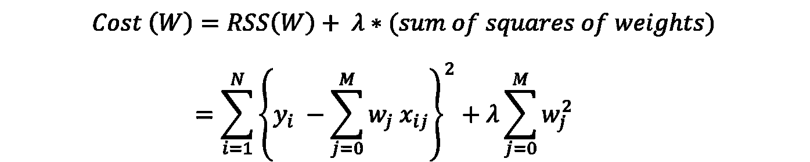
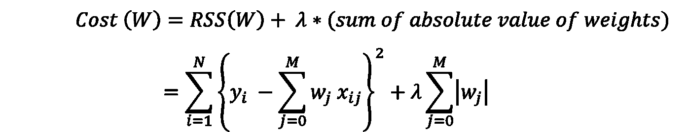

# 回归正则化技术—脊和套索

> 原文：<https://medium.com/analytics-vidhya/regression-regularization-techniques-ridge-and-lasso-c464f24a4ed1?source=collection_archive---------0----------------------->

无论走到哪里，我们都会听到很多关于 T2、回归、T4 和 T5 的故事。所以让我们跳过这一点。在本文中，我们将假设我们是*回归*的大师，并且我们已经在给定的数据集上完成了*线性回归模型*的构建。

现在，从模型中，您会注意到它有 ***过度拟合*** *—过度拟合*是数据科学中使用的一个术语，用于描述统计模型完美地拟合其训练数据，而算法无法针对未知数据准确执行，从而否定了该方法的目标。现在这个*过度拟合*可能是因为模型太复杂了。必须降低这种复杂性，以改进模型并消除*过拟合*。

> 为此，我们可以降低某些*回归系数*的数值，和/或我们可以丢弃一些对最终预测没有显著价值的特征。我们将应用的过程叫做 ***规则化*** 。

所以我们来到了这篇文章的结尾。谢谢你。

Lol，开个玩笑。好吧，反正大多数关于这个话题的文章都是这样的。但相信我，这次会不同的。让我带你经历完整的体验——从理解我们为什么和在哪里需要它，它的统计重要性，以及我们如何在 Python 上实现它开始。

# **理解偏差和方差**

让我们再一次回到基础——偏差*和方差*。**

*当模型在训练数据集上表现不佳时，我们说模型的*偏差*高。当模型在测试数据集上表现不佳时，可以说*方差*很高。我举个例子让你更清楚。*

## ***场景 1:***

**

*假设你正在准备考试(是的，请假设。)而你在这一章的最后只看了 5 个问题的答案。有了这个，如果考试有和你准备的一样的 5 道题，你就能答得很好。但是你将无法回答考试中已经问过的其他问题。这是一个 ***低偏差*** 和 ***高偏差*** 的例子。*

## *场景 2:*

**

*但在另一种情况下，让我们说，你已经通过实际浏览整个章节并理解概念而不是记住 5 个问题的答案来准备考试。有了这个，你将能够回答考试中出现的任何问题，但你不能完全按照书中给出的答案来回答。这是一个 ***高偏差******低方差*** 的例子。*

*现在，回到 D *数据科学*术语——重要的是要明白，在你构建的任何模型中，总是要在*偏差*和*方差*之间进行权衡。看看这个图表，它显示了不同*模型复杂度的*方差*和*偏差*。具有*低复杂度的模型或简单模型*将具有*高偏差*和*低方差*，而*高度复杂的* *模型*通常将具有*低偏差*和*高方差。(试着把这个和我上面给出的考试例子联系起来。)还要注意，无论是非常简单的模型还是高度复杂的模型，模型的*总误差(偏差+方差)*都将是*最大*。***

**

*偏差-方差权衡*

*因此，现在可以有把握地说，我们将需要建立一个具有*最低总误差*的模型——一个能够识别来自*训练数据*的所有模式，并且在它之前没有见过的数据(即*测试数据*上也表现良好的模型。*

# *正则化对模型复杂性有什么帮助？*

**正则化*在我们需要考虑模型复杂性以平衡*偏差-方差时出现。*正则化有助于将模型系数的大小降低至 0(当系数变为 0 时，也有助于从模型中完全移除特征)，从而降低模型的复杂性。这反过来将减少模型的过度拟合，并降低总误差，这正是我们想要实现的。*

*考虑*普通最小二乘法* (OLS 回归)——*残差平方和*或*成本函数*由下式给出:*

**

*残差平方和 RSS —回归成本函数*

*当我们建立回归模型时，我们以成本函数或 RSS 最小的方式构造特征系数。请注意，该 RSS 仅考虑模型产生的*偏差*，而不考虑*方差*。因此，模型可能会尝试减少*偏差*并过度拟合训练数据集——这将导致模型具有*高方差*。*

*因此，*正则化*通过稍微修改模型的*成本函数*来帮助我们降低模型复杂度，从而减少*过拟合*。*

## *那么我们实际上是怎么做的呢？*

*在*正则化*中，我们将*惩罚*项添加到*成本函数*中，这将帮助我们控制模型的复杂性。*

> *在*正则化之后，代价函数*变成了 ***RSS +惩罚*** *，即我们在代价函数中给正则 RSS 增加了一个惩罚项。**

# ***岭回归***

> *在*岭回归中，*我们添加了一个惩罚项，它是***lambda(***λ)***乘以权重(模型系数)的平方和。****

**

*岭回归方程*

*注意，惩罚项(称为 ***收缩惩罚*** )具有权重的平方和。所以在*回归*中，我们通过尝试降低*成本函数来建立模型。*因此，这里的模型将试图降低模型系数(权重)以降低成本函数，从而降低模型复杂度。*

*现在让我们明白***λ***(**λ)**在这里做什么。λ是**调谐参数。**将 0 赋给λ将使整个惩罚项为 0，模型系数不会减少(无收缩),导致*过拟合*。但是当λ达到非常高的值时，惩罚项也会增加，从而降低模型系数，并可能导致*欠拟合*。*

*这就是为什么我们必须选择正确的λ值，以确保模型复杂性得到有效降低，但不会出现*过拟合*或*欠拟合*。在岭回归中选择合适的λ值可以通过 ***超参数调谐来完成。****

*请注意，在执行*岭回归*之前，数据集必须经过*标准化*。这是因为我们正在处理模型的系数，如果它们在同一尺度上，这将是有意义的。*

# *套索回归*

*岭回归和套索回归的重要区别在于惩罚项。*

> *在 *Lasso 回归中，*我们添加了一个惩罚项，它是***λ乘以权重(模型系数)的绝对值之和。****

**

*拉索回归方程*

*其余的原则和惩罚项降低模型系数以降低模型复杂性的方式与*岭回归*相似。*

> *但是这里必须注意的一个区别是，在*套索回归*的情况下，*收缩项(惩罚项)*迫使一些模型系数*恰好变为 0* ，从而*从模型中移除整个特征*(假定λ值足够大)。这给出了套索回归的一个全新应用— ***特征选择*** 。*在岭回归的情况下，这是不可能的。**

*请注意，与*岭回归*类似，在执行*套索回归*之前，数据集必须*标准化*。这是因为我们正在处理模型的系数，如果它们在同一尺度上，这将是有意义的。*

# ***正则化技术的 Python 实现——山脊和套索***

*岭和套索回归的整个实施，以及从探索性数据分析开始的数据集的详细分析，多元线性回归，包括多重共线性、VIF 分析等。可以在这里找到。*

*本实施中使用的数据集是“ ***惊喜住房案例研究*** ”的数据集。*

*你可以在这里找到到 Python 实现的 ***Github*** 链接:*

* [## GitHub-Adhithia/regressionwithregonization:多元线性回归与…

### 多重线性回归与正则化技术一起执行，包括山脊和套索。惊喜住房…

github.com](https://github.com/Adhithia/RegressionWithRegularization) 

您可以在 Kaggle 上编辑和协作同一个项目:

 [## 使用岭和套索正则化的回归

### 使用 Kaggle 笔记本探索和运行机器学习代码|使用来自无附加数据源的数据

www.kaggle.com](https://www.kaggle.com/adhithia/regression-with-ridge-and-lasso-regularization) 

## 片段—岭回归实现

## 片段—套索回归实现

这就是*回归正则化技术——脊和套索*的结束。你可以在这里查看我的其他作品:

 [## 使用深度学习发现胸部 X 射线扫描中的异常

### 使用卷积神经网络将扫描分类为“渗出”或“正常”。

medium.com](/analytics-vidhya/spotting-anomalies-in-chest-x-ray-scans-using-deep-learning-4b8195a7b7bb)  [## 使用卷积神经网络的皮肤癌检测

### 黑色素瘤是一种癌症，如果不及早发现，可能会致命。它占皮肤癌死亡的 75%。一个…

adhithia.medium.com](https://adhithia.medium.com/skin-cancer-detection-using-convolutional-neural-networks-38f386cdc6d7)*