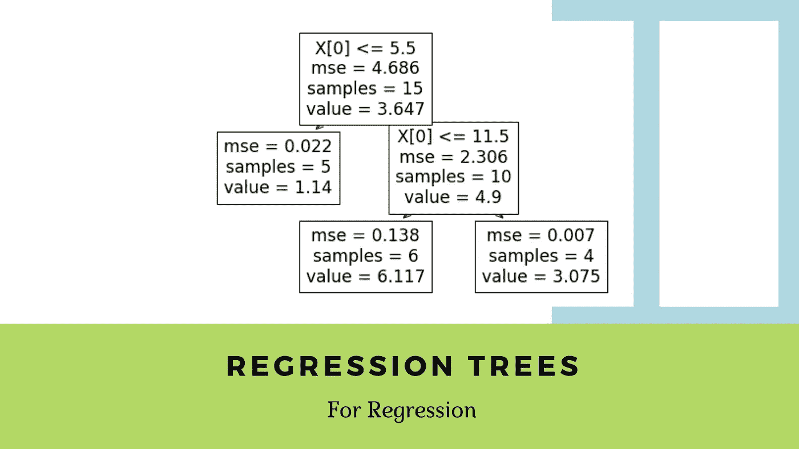
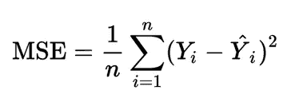
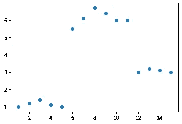
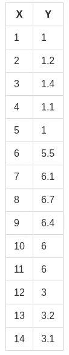
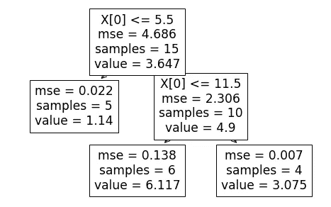
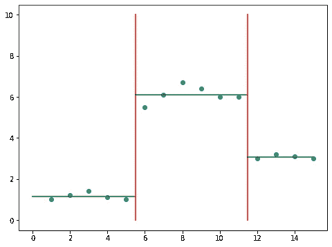

# 回归树|回归决策树|机器学习

> 原文：<https://medium.com/analytics-vidhya/regression-trees-decision-tree-for-regression-machine-learning-e4d7525d8047?source=collection_archive---------0----------------------->

## 回归树如何用于解决回归问题？如何建立一个？

这篇博客假设读者熟悉决策树和回归的概念。如果没有，请参考下面的博客。

*   [决策树](/analytics-vidhya/decision-trees-for-classification-id3-machine-learning-6844f026bf1a)
*   [机器学习入门](/analytics-vidhya/introduction-to-machine-learning-and-artificial-intelligence-cebb3528c823)
*   [带梯度下降的线性回归](/analytics-vidhya/linear-regression-with-gradient-descent-derivation-c10685ddf0f4)

# 什么是回归树？

阅读了上面的博客或者已经熟悉了相关的主题，现在你有希望理解什么是决策树(我们用于分类任务的那个)。回归树基本上是用于回归任务的决策树，可用于预测连续值输出而不是离散输出。

# 均方误差

在用于分类的决策树中，我们看到了树如何在正确的节点提出正确的问题，以便给出准确有效的分类。在分类树中实现这一点的方法是使用两种度量，即熵和信息增益。但是既然我们预测的是连续变量，我们就不能计算熵，也不能经历同样的过程。我们现在需要一个不同的衡量标准。一个告诉我们我们的预测偏离原始目标多少的度量，这是均方差的切入点。

图 1.1:均方值

**Y** 是实际值 **Y_hat** 是预测值，我们只关心预测值与目标值相差多少。不是哪个方向。因此，我们计算差值的平方，然后将总和除以记录总数。

在回归树算法中，我们做与分类树相同的事情。但是，我们试图减少每个孩子的均方差，而不是熵。

# 构建回归树

让我们考虑一个数据集，其中有两个变量，如下所示

图 2.1:数据集，X 是一个连续变量，Y 是另一个连续变量

图 2.2:实际的数据集表

我们需要建立一个回归树，在给定 x 的情况下最好地预测 Y。

## **第一步**

第一步是基于 X 对数据进行排序(本例中的*，已经排序了*)。然后，取变量 X 中前 2 行的平均值(根据给定数据集为(1+2)/2 = 1.5)。将数据集分成 2 部分*(A 部分和 B 部分)*，由 x < 1.5 和 X ≥ 1.5 分隔。

现在，A 部分仅包含一个点，即第一行(1，1)，所有其他点都在 B 部分中。现在，分别取 A 部分中所有 Y 值的平均值和 B 部分中所有 Y 值的平均值。这两个值是 x < 1.5 and x ≥ 1.5 respectively. Using the predicted and original values, calculate the mean square error and note it down.

## Step 2

In step 1, we calculated the average for the first 2 numbers of sorted X and split the dataset based on that and calculated the predictions. Then, we do the same process again but this time, we calculate the average for the second 2 numbers of sorted X ( (2+3)/2 = 2.5 ). Then, we split the dataset again based on X < 2.5 and X ≥ 2.5 into Part A and Part B again and predict outputs, find mean square error as shown in step 1\. This process is repeated for the third 2 numbers, the fourth 2 numbers, the 5th, 6th, 7th till n-1th 2 numbers (*的决策树的预测输出，其中 n 是数据集*中的记录或行数。

## 第三步

现在我们已经计算了 n-1 个均方误差，我们需要选择分割数据集的点。这个点是分裂时产生最小均方误差的点。在这种情况下，点是 x=5.5。因此，这棵树将被分成两部分。x <5.5 and x≥ 5.5\. The Root node is selected this way and the data points that go towards the left child and right child of the root node are further recursively exposed to the same algorithm for further splitting.

# Brief Explanation of What the algorithm is doing

The basic idea behind the algorithm is to find the point in the independent variable to split the data-set into 2 parts, so that the mean squared error is the minimised at that point. The algorithm does this in a repetitive fashion and forms a tree-like structure.

A regression tree for the above shown dataset would look like this

fig 3.1: The resultant Decision Tree

and the resultant prediction visualisation would be this

fig 3.2: The Decision Boundary

well, The logic behind the algorithm itself is not rocket science. All we are doing is splitting the data-set by selecting certain points that best splits the data-set and minimises the mean square error.
我们选择这些点的方式是通过一个迭代过程来计算所有分割的均方误差，并选择具有最小 *mse* 值的分割。所以，这很自然。

# 当有多个自变量时会发生什么？

让我们考虑有 3 个变量类似于图 2.2 中的自变量 **X** 。
在每个节点，所有 3 个变量都将经历与上面例子中 **X** 所经历的相同的过程。数据将根据 3 个变量分别排序。
计算所有 3 个变量中最小化 mse 的点。从 3 个变量和为它们计算的点数中，选择 mse 最小的一个。

# 分类变量是如何处理的？

当我们使用连续变量作为独立变量时，我们使用如上所述的迭代算法选择具有最小 mse 的点。当给定一个分类变量时，我们简单地通过询问一个二元问题来分割它(*通常是*)。例如，假设我们有一个以分类术语指定肿瘤大小的列。说**小号，中号**和**大号。**

该树将根据**肿瘤大小=小**或**肿瘤大小=大**或**肿瘤大小=中等**来分割数据集，或者在某些情况下也可以根据哪个问题最大程度地减少 *mse* 来合并多个值。这成为这个变量*(肿瘤大小)的首要竞争者。*将其他变量的前竞争者与此进行比较，选择过程类似于*中提到的情况“当有多个自变量时会发生什么？”*

# 处理过度拟合以及何时停止构建树？

在阅读之前的博客时，人们可能会理解过度拟合的问题以及它如何影响机器学习模型。回归树容易出现这个问题。

当我们希望减少均方误差时，决策树可以递归地将数据集分成大量的子集，直到一个集合只包含一行或一条记录。尽管这可能会将 mse 降低到零，但这显然不是一件好事。

这就是著名的过拟合问题，也是它自己的一个话题。基本要点是，这些模型与现有数据的拟合过于完美，以至于无法用新数据进行概括。我们可以使用交叉验证方法来避免这种情况。

对于回归树，防止这种情况的一种方法是预先指定 Aleaf 节点可以拥有的最小记录数或行数。当涉及到大型数据集时，准确的数字并不容易知道。但是，交叉验证可以用于此目的。

# 结论

总之，回归树是调用用于回归的决策树的另一种方式，它在许多变量之间的关系是非线性的领域非常有用。需要记住的一点是，算法容易过拟合。因此，最好总是预先指定每个叶节点的最小子节点数，并使用交叉验证来找到这个值。

# 谢谢你