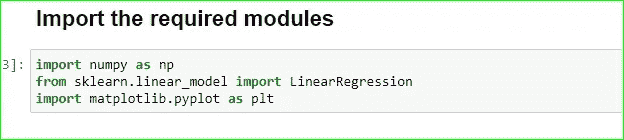

# 使用 PYTHON 回归

> 原文：<https://medium.com/analytics-vidhya/regression-using-python-3cf00a362614?source=collection_archive---------20----------------------->

好好好！！！！！！！！

我们在这里尽可能简单地讨论回归。

让我们从基础开始。

回归只是一种描述变量之间关系的方法或工具，它帮助我们根据这种关系进行估计或预测。简单地说，这是一种从大量数据中预测有意义的单个值的方法。

好吧，如果你到现在还不明白，那就等几秒钟，直到你开始编码。使用实践经验比天衣无缝地阅读理论更容易理解一些东西。

注意:我们在这里做简单的线性回归，从长远来看，这是多元线性回归的基础，稍后会公布。

伙计们，我们开始吧。我们正在一步一步地做这件事:

## **第一步:**打开 google colab 或者任何你熟悉的平台。并导入数据，如下所示。

Jupyter 笔记本是二手的，但也可以和 colab 一起使用。

这里需要 numpy 来创建数据。Scikit learn 用于导入模型，matplotlib 用于可视化数据。你只需要知道 numpy 和 sklearn，但 matplotlib 将有助于轻松获得要点。

## 步骤 2:使用 numpy 准备好数据

这里你只需要把 X 数据写在第一个数组里，把 Y 数据写在第二个数组里。

在简单线性回归中，Y=a+bX。

y 是 X 的因变量，X 是自变量。

## 第三步:让我们将数据可视化，以检查是否有任何模式。

哇哦。！使用散点图，我们可以看到 Y 随着 X 的增加而增加的模式。这就是为什么视觉化真的很有帮助。

## 第四步:将数据纳入我们的线性回归

这里第一行 model=LinearRegression()意味着我们正在实例化 LinearRegression 类的对象。

喔…那到底是什么意思？

我知道对于不熟悉面向对象编程的人来说，这可能很难理解。简单来说，这意味着我们有了方程

> Y=a+bX 其中 a = X 的截距和系数

并要求我们将数据放入该等式，以找到 a 和 b 的值。因此，第一行是让 Y=a+bX 准备好获取数据。将数据放入等式是通过第二行代码完成的。

## 步骤 5:从模型中获得我们需要的 a 和 b 的值

这里我们得到了我们需要的 a 和 b 的值，这只是代码的问题。

你不需要理解太多，因为 a 和 b 在前面的步骤中已经解释过了。

## 步骤 6:可视化我们的模型是否符合数据

这里我们可以看到，在获得 a 和 b 的值后，我们从方程中获得的线以更有效的方式拟合了数据。这也是我们的模式应该实现的。

## 步骤 7:测试 R 平方

这表明 Y 有 83%受 X 影响，其余受其他因素影响。

恭喜你。您终于使用 python 执行了简单的线性回归。

还可以扩展到大问题，甚至多元线性回归。我希望很快看到你这样做。现在，这是你开始回归需要知道的基础。

我将发布更多关于使用 python 的统计方法。敬请关注。

谢谢你陪了我这么久。我很感激。💖