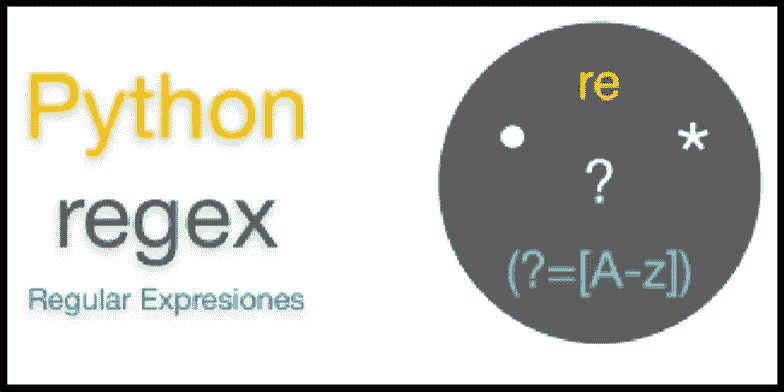

# Python 中的正则表达式

> 原文：<https://medium.com/analytics-vidhya/regular-expression-in-python-5ab2e8b707f1?source=collection_archive---------5----------------------->



[https://tutorial . eye hunts . com/python/python-regex-regular-expression-re-example](https://tutorial.eyehunts.com/python/python-regex-regular-expression-re-example/)

简而言之，正则表达式也称为 RE 或 RegEx。它是构成搜索模式的字符序列。它用于检查给定字符串中是否存在搜索模式。乍一看，由于像^$.这样怪异的符号，它似乎很复杂*+-等。但是，这是一个值得学习的强大工具。在文章的最后，我们将看到一些真实应用程序的有用的正则表达式示例。

# Python 模块(re)

Python 有一个名为 **re、**的模块，可以让你处理正则表达式。许多正则表达式功能驻留在模块中。

```
import re
```

让我们看看`re`模块的一些重要功能。

## re.findall()

它返回所有匹配模式的列表。

```
re.findall(pattern, string)
```

*例如:*

## 重新搜索()

它返回字符串中模式的第一个位置的匹配对象。

```
re.search(pattern, string)
```

*例如:*

## 重新拆分()

它返回一个列表，其中的字符串在每次匹配时都被拆分。

```
re.split(pattern, string)
```

*例如:*

## re.sub()

它用一个字符串替换一个或多个匹配。

```
re.sub(pattern, replace, string, count=0)
```

这里，count 的默认值等于零，这意味着它将替换字符串中所有匹配的模式。如果我们传递 count 的非零值，那么这将是字符串中匹配模式的数量。

*例如:*

*再比如:*

现在，我们将看到特殊字符和特殊序列。通过使用这些，您可以定义自己的正则表达式。

# 特殊字符

我创建了一个特殊字符表。之后，我们将详细了解所有这些特殊字符。

```
**^ :** Matches the start of the string**$ :** Matches the end of the string**. :** Matches any character except a newline**? :** Repeats a character zero or one time**+ :** Matches one or more repetitions of the preceding RE**+? :** Matches one or more repetitions of the preceding RE(non-greedy)*** :** Matches zero or more repetitions of the preceding RE***? :** Matches zero or more repetitions of the preceding RE(non-greedy)**\ :** Signals a special sequence**| :** Used for alternation**[] :** Used to indicate a set of characters**() :** Matches whatever regular expression is inside the parentheses, and indicates the start and end of a group**{m} :** Specifies that exactly *m* copies of the previous RE should be matched**{m,n} :** Matches from *m* to *n* repetitions of the preceding RE, attempting to match as many repetitions as possible
```

## **^(脱字符)**

它匹配字符串的开头。*例如:*

## $(美元)

它匹配字符串的结尾。*例如:*

## 。(圆点)

它匹配除换行符以外的任何字符。*比如:*

## ？(问号)

它匹配前面 RE 的零个或一个重复。*例如:*

在上面的例子中，*‘a’*在字符串中没有重复。让我们看另一个例子，其中*‘a’*将与一个重复匹配。

如果字符串中有多个“a”，会发生什么情况(例如“maan”)。让我们再看一个例子:

你在上面的例子中看到，如果重复超过一次，它就不匹配。

## +(加号)

它匹配前面 re 的一个或多个重复。*例如:*

*再比如:*

在上面的例子中，'^F'意味着字符串以' f '和'开头。“+”表示匹配任意字符任意次(≥1)，直到字符“:”(即“F”和“:”之间至少有一个字符)。

因为'+'是一种贪婪的手段，它匹配尽可能多的字符串(或文本)。所以，它一开始不会停止扫描“:”。它一直扫描到字符串的末尾。因此，输出是 *['From:使用:']* 。

## +?

它匹配前面 re 的一个或多个重复(非贪婪)。非贪婪意味着它匹配尽可能少的字符串(或文本)。*例如:*

在上面的例子中，由于`+?`的非贪婪行为，它一直扫描到第一个':'。

## *(星形)

它匹配前面 re 的零次或多次重复。也是贪婪。*例如:*

上述示例与您已经看到的`+`示例相同。那么，`+`和`*`有什么区别呢？让我们看另一个例子:

在上面的例子中，模式也与“Heo”匹配。' l* '表示零次或多次' l '。在上面的例子中,“l”的数字是零。这就是它匹配的原因，但是如果我在模式中写'+'而不是' * '，那么字符串中至少应该有一个' l'。

*再比如:*

## *?

它匹配前面 re 的零次或多次重复(非贪婪)。*例如:*

它是非贪婪的。所以，它尽可能少的匹配(即零重复)。这样，输出就是 *['他']* 。

## \(反斜杠)

它标志着一个特殊的序列。我们将在`Special Sequences`中详细看到这个话题。

## |(交替)

它用于交替。像 A|B 一样，其中 A 和 B 可以是任意的 REs，它将匹配任何包含 A 或 B 的字符串。*例如:*

## [](方括号)

它用来表示一组字符。比如，

```
**[aeiou] :** Matches a single character in the listed set**[^xyz] :** Matches a single character not in the listed set**[a-z0-9] :** Matches a single character between a to z or 0 to 9.
```

*例如:*

*再比如:*

*再举一个例子:*

## ()(括号)

它匹配括号内的任何正则表达式，并指示一个组的开始和结束。*例如:*

在上面的例子中，它匹配从' From '开始的字符串，之后匹配任何字符任意次，直到' @ '，然后根据括号内的 RE 匹配除空格(')之外的任何字符。它只返回根据括号内的 RE 匹配的字符。

## {m}

它指定应该精确匹配前一个 RE 的 m 个副本。*例如:*

在上面的例子中，“i{3}”表示三次“I”。所以，输出是 *['Mississippiii']。*

## {m，n}

它匹配前面 RE 的从 *m* 到 *n* 个重复，试图匹配尽可能多的重复。*例如:*

# 特殊序列

```
**\s :** Matches any whitespace character (i.e. equivalent to the class [ \t\n\r\f\v])**\S :** Matches any non-whitespace character (i.e. equivalent to the class [^ \t\n\r\f\v])**\d :** Matches any decimal digit (i.e. equivalent to the class [0-9])**\D :** Matches any non-digit character (i.e. equivalent to the class      [^0-9])**\w :** Matches any alphanumeric character (i.e. equivalent to the class [a-zA-Z0-9_])**\W :** Matches any non-alphanumeric character (i.e. equivalent to the class [^a-zA-Z0-9_])
```

*举例:*

真实世界应用程序的一些有用的正则表达式示例:

**示例 1:从字符串中提取日期**

**例 2:检查电子邮件是否有效**

**例 3:检查 URL 是否有效**

# 摘要

Regex 用于检查给定字符串中是否存在搜索模式。在 Python 中，有一个名为`re`的内置库，用于处理正则表达式。我想我已经用合适的例子介绍了大部分的概念。

如果你有任何问题或建议，请在下面的评论中留下。

感谢阅读，祝学习愉快！