# 正则化:解决机器学习中过拟合的一种方法

> 原文：<https://medium.com/analytics-vidhya/regularization-a-method-to-solve-overfitting-in-machine-learning-ed5f13647b91?source=collection_archive---------14----------------------->

## 了解正则化，它是什么，它的类型以及它如何减少方差和解决过度拟合。

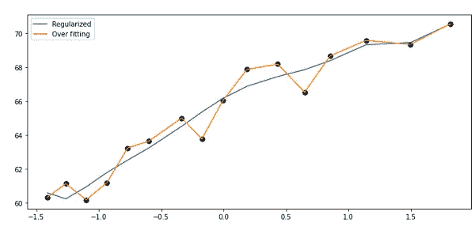

**先决条件**:

*   在阅读本文之前，请确保您对机器学习环境中的偏差和方差有很好的了解，并且知道过度拟合。如果没有，请先查看[这篇](/analytics-vidhya/bias-and-variance-613ff5c9ef5c)文章。
*   你还需要熟悉成本函数和梯度下降。如果没有，请在此阅读关于它们的[。](https://towardsdatascience.com/machine-leaning-cost-function-and-gradient-descend-75821535b2ef)

您还记得在我们之前的文章 [***偏差和方差***](/analytics-vidhya/bias-and-variance-613ff5c9ef5c) 中，我们的一个模型具有低偏差和高方差。我们称之为过度拟合，因为回归线完美地拟合了训练数据，但它未能拟合甚至给出测试数据的良好预测。过拟合是机器学习中最常见的问题之一，它是由于大量输入/特征或者如果训练数据样本很小而导致的。

高方差模型非常关注数据中的噪声，并且该模型对数据中的任何微小波动都变得非常敏感。

**我们的目标**是让模型对那些波动不那么敏感，并且不要把噪音当作可以学习的东西。

解决过拟合问题最流行的方法之一是正则化。

## 什么是正规化？

简单地说，正则化是某种平滑。

## 正规化是如何运作的？

它试图调整目标函数中的参数，希望使模型对波动不那么敏感。它只是在用于评估模型的成本函数中增加了一个额外的项。这一项控制目标函数中的参数，并确保它们不取极值。我们准备看看实际效果如何，大家不要慌:)。

一般的优化函数形式是:

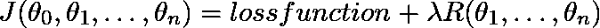

其中:

*   **θ’**s 是正在调整的因子/权重。
*   **‘λ’**是正则化率，它控制应用于模型的正则化量。它是通过交叉验证选择的。
*   **‘R’**是正则化函数，根据正则化类型不同而不同。
*   该模型试图最小化 **J(θ)** 。

> **注:**如果你不熟悉交叉验证，就把它想象成你只是在尝试不同的值，然后挑选出给你最好结果的值。

在实践中，正则化通常会导致稍高的偏差，但会显著降低方差。这就是我们所说的**偏差-方差权衡**。

你可能注意到，正则化函数没有考虑模型方程中的常数项'*θo '*(x⁰***的系数*** )。

> [**回答**](https://stackoverflow.com/questions/12578336/why-is-the-bias-term-not-regularized-in-ridge-regression)**from stack overflow** 假设这个简单的模型:
> `Y = aX + b`
> 
> 正则化是基于这样一种想法，即`Y`上的过度拟合是由`a`的“过度特定”引起的。`b`仅仅抵消了这种关系，因此它的规模对这个问题来说远没有那么重要。此外，如果出于某种原因需要较大的偏移量，将其正则化将会妨碍找到正确的关系。
> 
> 所以答案就在于此:在`Y = aX + b`中，`a`乘以解释/自变量，`b`加在上面。
> 
> [**Shruti Jadon**](/@shrutijadon10104776/why-we-dont-use-bias-in-regularization-5a86905dfcd6)虽然我们可以使用它，但在神经网络的情况下它不会有任何区别。但是我们可能会面临将‘θo*’*值降低太多的问题，这可能会混淆数据点。因此，在正则化中最好不要使用'θo *'* 。

## **但是，降低θ如何能使模型更好，对波动更不敏感呢？**

考虑这个非常简单的例子: ***y=ax+b.*** 其中***【a】***是这条线的斜率，请看下图:

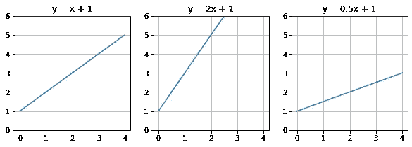

1-如果斜率为 1，那么对于' *x'* 中的每一个单位变化， *y* 中也会有一个单位变化。

2-如果斜率为 2，那么对于'*' x '*， *'y'* 中的半个单位变化，将会改变一个单位。因此，模型对输入数据的变化更敏感，在我们的例子中，输入数据是*‘x’的值。*

3-如果斜率为 0.5，那么对于' *x'* '中 2 个单位的变化，' *y'* 将仅变化 1 个单位。这导致了一个不太敏感的模型，这是我们的目标。

正规化有三种类型。我们将通过一个实例详细讨论它们。

# (1) L1 正则化

它也被称为**、【L1-诺姆】、**、【拉索回归】、**。【Lasso 代表“最小绝对收缩和选择算子”。**

Lasso 回归增加了模型系数绝对值之和的因子。套索回归试图最小化以下函数:

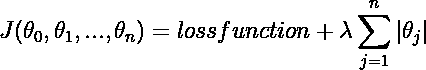

Lasso 回归成本函数

套索回归也可用于要素选择，因为不太重要的要素的 coefficients 会减少到零。

如果**‘λ’**很大，那么正则项会很高，代价函数也会很高，所以梯度下降会尽量使所有 *θ的*的值都趋向于 0 以降低代价。

不同的λ可以将不同的参数(θ)缩小到零，例如“λ1”可以惩罚θ2、θ3 和θ4，而“λ2”可以只惩罚θ2 和θ3。另一方面，λ3 可能不会惩罚任何θ。

**但是为什么‘λ2’只惩罚θ2 和θ3 而不惩罚θ4 呢？？** 权重(θ)根据以下等式更新:

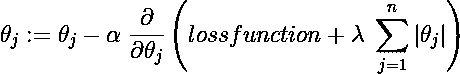

θj 的新值取决于其之前的值和 J(θ)对该θj 的偏导数。换句话说，我们可以认为θj 的变化量取决于因该θj 之前的值而发生的成本函数的变化。如果成本高，这意味着该特定θj 需要降低。 **λ** 的存在迫使θj 进一步减小，如果 **λ** 非常大，θj 可能会变为零，因此与θj 相关的特征 **' *x* '** 将会消失。

> *所以，Lasso 算法本身并不能决定收缩哪些特征。但是，它是套索和交叉验证的组合，允许我们确定最佳回归率‘λ’。*

让我们通过这个简单的例子来看看它的实际应用:

假设我们有一个遵循这个等式的模型: ***y=x .*** 我们将使用 **RSS** 函数(残差平方和)作为我们的损失函数。

假设我们不知道“真实”的关系，我们想为这个问题建立一个回归模型。因此，我们将从大量的功能开始，希望建立一个好的模型。我们的特色将是( *x，x，x，…，x ⁰* )。我们知道( *x，…，x ⁰* )的系数应该尽可能小。但让我们看看拉索会做出什么决定。

当我们用不同的' *λ'应用套索回归时，我们得到以下结果:*

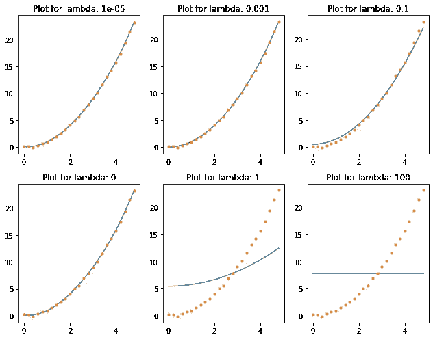

θ的值为:

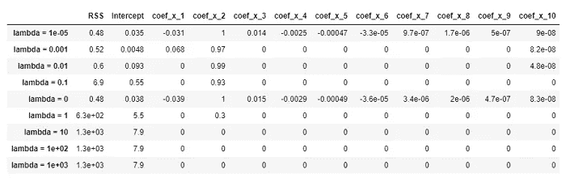

套索回归的系数。

## **观察:**

*   当*‘λ’*很大(10，100，1000)时，套索消除所有特征。
*   当*‘λ’*为零时，不应用正则化，所有特征都存在，RSS 最低。这就是过拟合的情况。
*   在*‘λ’*非常低(0.00001)时，Lass 考虑了所有特征，但θ的值低于 *λ=* 0 时的值。
*   在 *λ =* (0.01，0.1) *，*处，尽管 RSS 更高，但是模型更好，因为它接近真实关系而没有过度拟合。

# (2) L2 正规化

也被称为**、【L2-诺姆】、**或**、【岭回归】、**

岭回归增加了模型系数平方值之和的因子。岭回归试图最小化以下函数:

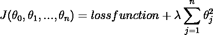

岭回归优化函数

L2 正则化迫使权重变小，但不会使它们为零。

让我们将岭回归应用到前面的例子中:

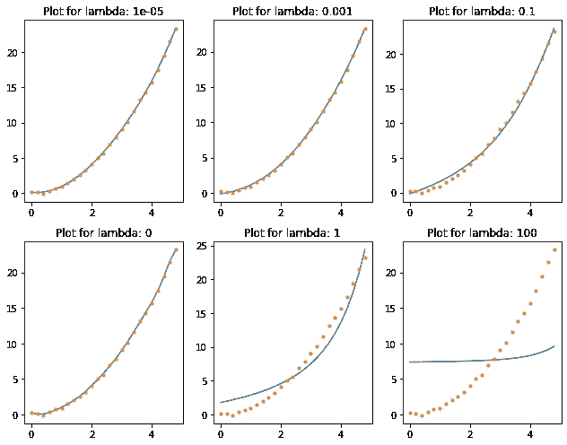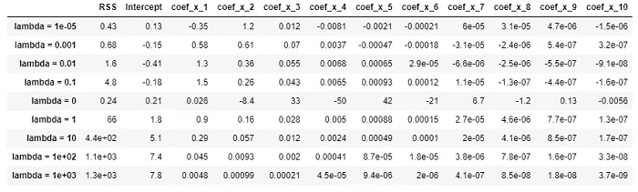

岭回归中的系数。

## 观察:

*   尽管θ的值非常小，但它们都不等于 0。
*   当*‘λ’*为零时，不应用正则化，所有特征都存在，RSS 最低。这就是过拟合的情况。

L2 对异常值并不稳健，因为平方项放大了异常值的误差差，所以正则化项试图通过惩罚权重来解决这个问题。

# (3)弹性网正则化

创建弹性网是为了改进 Lasso 回归，Lasso 回归的变量选择过程可能过于依赖数据，因而不稳定。

**Lasso 回归有一定的局限性:**

*   如果变量/特征的数量(n)大于训练样本的数量，Lasso 最多选择“n”个变量。因此，所选特征/变量的数量受到样本数量的限制。
*   如果某些要素高度相关，Lasso 倾向于从中选择一个要素，而忽略其他要素。这可能导致不准确的模型，因为那些特征可能是重要的。

为了解决这个问题，弹性网结合了脊和套索的特性，并试图最小化以下损失函数:

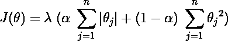

弹性净成本函数

通过添加二次部分，即 L2 范数:

*   这消除了对所选变量数量的限制。
*   鼓励算法考虑更多变量，不要忽略高度相关的变量/特征。
*   让套索更稳定。

弹性网方法同时执行变量选择和正则化，从而产生最佳输出。

在上面的方程中，'𝞪'被称为'**弹性网混合参数**，它不同于梯度下降方程中的'𝞪'，后者被称为学习率。

Elastic Net 还允许我们调整每个正则化的比例，(因此得名 Elastic)。我们可以选择 0 到 1 之间的'𝞪'值来优化弹性网。将𝞪设定为 0 对应于山脊，𝞪 = 1 对应于套索。

让我们将这个应用到同一个问题中，选择𝞪 **=0.5** ，这意味着有 50%的套索和 50%的山脊。

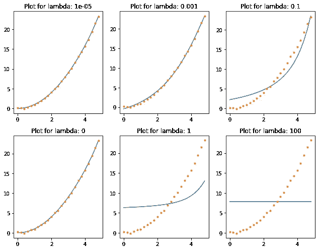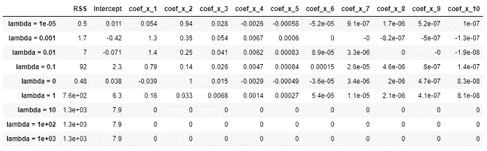

弹性网的系数。

## 观察:

*   零的数量比套索的少得多。

# 什么时候用哪个？

*   如果希望保留所有特征并避免模型对训练数据中的噪声/波动过于敏感，则岭回归是合适的。
*   如果您认为只有少数特征是有用的，那么使用套索回归或弹性网会更好，因为它们会将不太重要的特征的权重设置为零。但请记住，Lasso 提供了更高的稀疏度，即大多数系数都设置为零。
*   通常，弹性网优于套索，因为当要素数量大于训练样本数量或许多要素高度相关时，套索可能会以不可预测的方式表现。

# 附加说明:

*   正则化项**应仅在训练**期间添加到成本函数中。一旦模型经过训练，您就可以使用未规范化的性能度量来评估模型的性能。
*   在执行正则化之前缩放(归一化/标准化 **)** 数据很重要，因为它对输入要素的比例很敏感。正则化会影响系数的大小，因此所有预测变量(要素)必须在相同的比例上。
*   当存在相关变量时，Lasso 和 Ridge 的作用不同。Ridge 以相同的方式处理相关变量，(即，它以类似的方式缩小它们的系数，并将其全部用于拟合)，而在 Lasso 中，其中一个相关变量/预测值具有较大的系数，而其余的几乎为零。(即 Lasso 从拟合中删除共线变量)。
*   正则化减少了异常值对解的影响。如果离群值使变量/系数具有非常高的值，那么正则化项通过增加损失函数值来降低它。

感谢阅读，我希望你喜欢这篇文章，如果你有任何意见，请告诉我。

## 参考资料:

*   Datacamp: [教程-山脊-套索-弹力网](https://www.datacamp.com/community/tutorials/tutorial-ridge-lasso-elastic-net)
*   IQ.opengeus: [弹性网络正则化](https://iq.opengenus.org/elastic-net-regularization/)
*   Stanford . edu:[enet _ talk . pdf](https://web.stanford.edu/~hastie/TALKS/enet_talk.pdf)
*   Quora: [为什么岭回归不强制系数正好为零](https://qr.ae/pNDDW9)
*   复数视线:[线性-套索-岭回归](https://www.pluralsight.com/guides/linear-lasso-ridge-regression-scikit-learn)
*   奥雷利图书馆:[动手机器学习](https://www.oreilly.com/library/view/hands-on-machine-learning/9781491962282/ch04.html)
*   安德烈·布尔科夫的百页机器学习书:[第五章](https://www.dropbox.com/s/nije38rerpfa18o/Chapter5.pdf?dl=0)