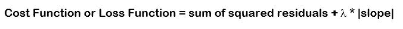
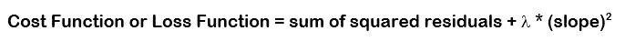
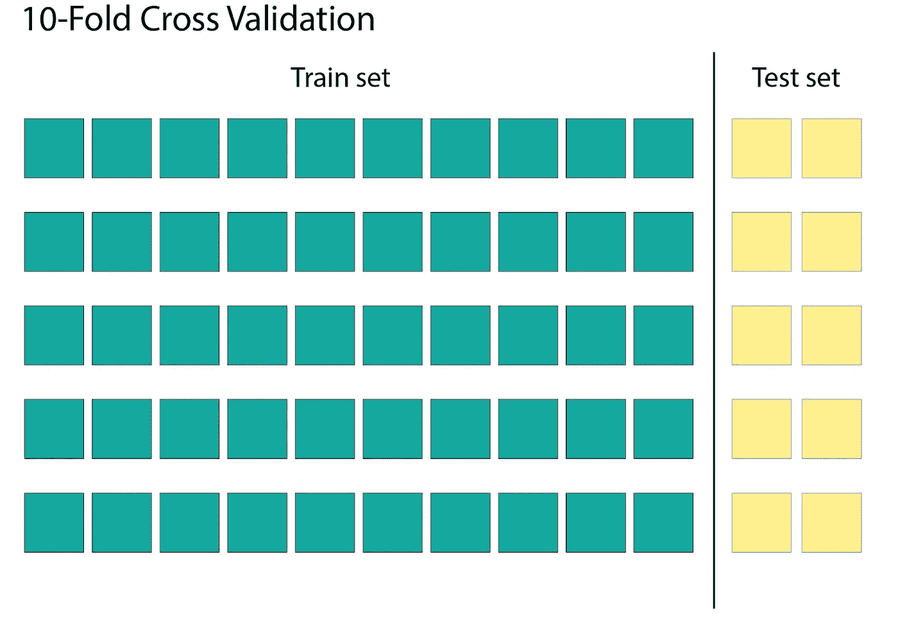
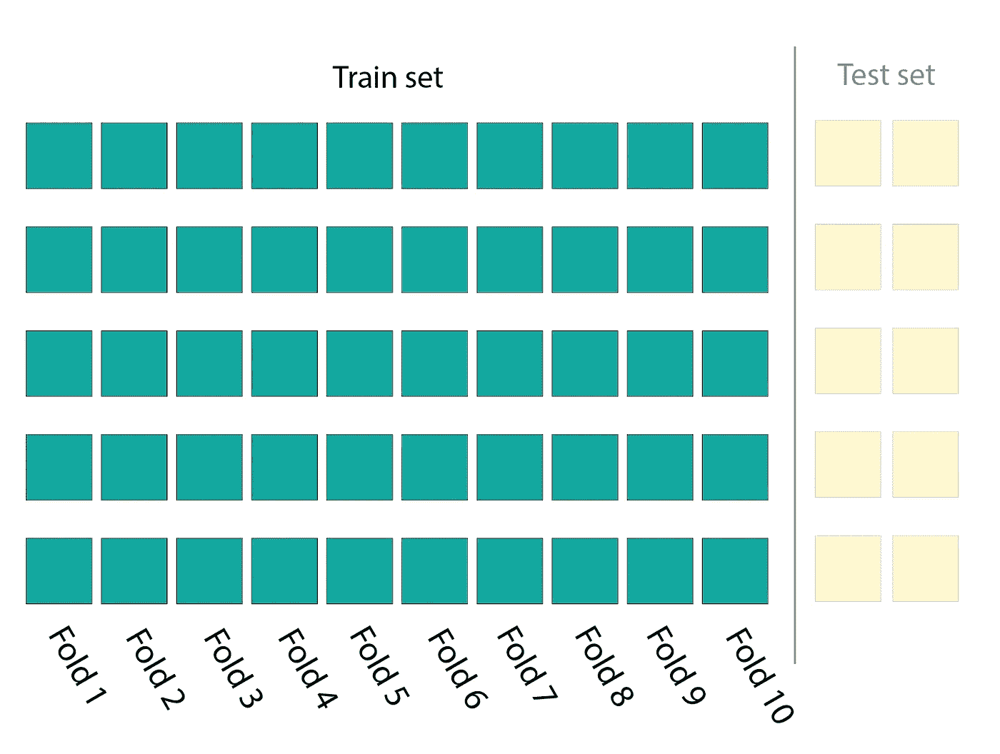
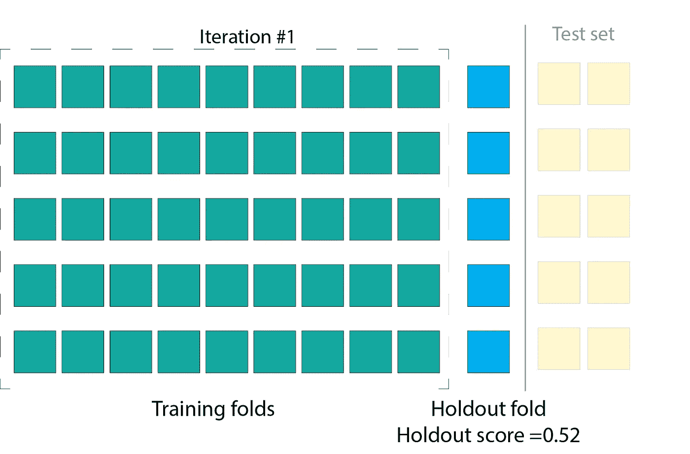
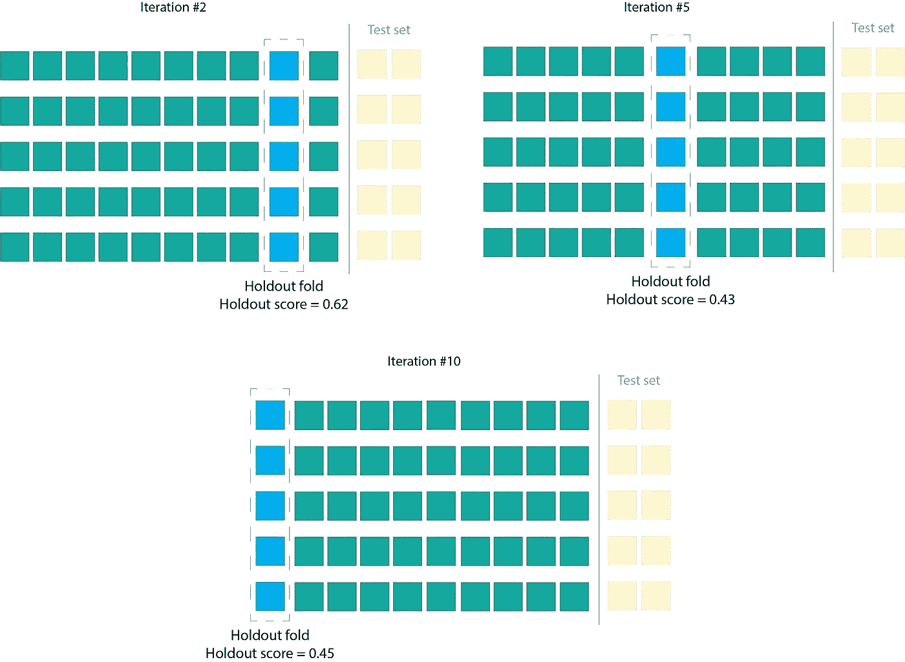
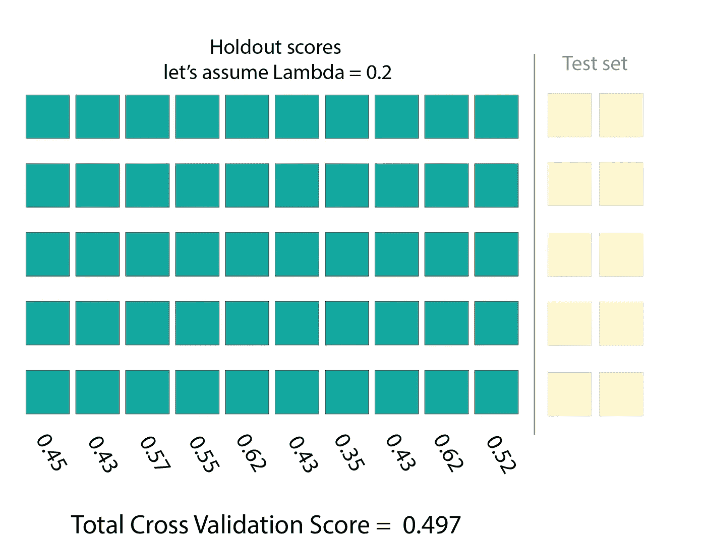
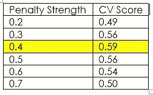

# 正则化和交叉验证—如何选择罚值(λ)

> 原文：<https://medium.com/analytics-vidhya/regularization-and-cross-validation-how-to-choose-the-penalty-value-lambda-1217fa4351e5?source=collection_archive---------1----------------------->

## 超参数调整| L1 VS L2 正则化|监督学习

## 使用交叉验证选择正确的超参数值

简单线性回归有两个主要缺陷:

1.  它容易与许多输入特征过度匹配，
2.  它不容易表达非线性/曲线关系。

解决这些问题的一种方法是增加模型的复杂性。通过使用决策树和多项式回归来表示非线性关系，可以增加模型的复杂性。

由于复杂性增加，这些算法也容易过度拟合。因此，为了在不过度拟合的情况下表示非线性函数，我们利用了正则化技术。

正则化技术用于校准线性/非线性回归模型，以便最小化调整后的损失函数并防止过拟合。

两种常见的正则化方法是:

1.  LASSO(最小绝对收缩和选择算子)回归或 **L1 惩罚**

2.岭回归还是 **L2 被罚**

降低**λ**的值会使模型复杂，反之亦然。我们应该找到完美的平衡来防止过度拟合。**λ**为正值，范围从 0 到正无穷大。但是通常选择在 0 到 10 之间。

那么，我们如何选择惩罚值**λ呢？**答案是交叉验证。

交叉验证是一种仅使用训练数据来调整超参数的方法。交叉验证有不同的变体，但最常见的是 10 重交叉验证。

请记住，数据是有限的资源，我们必须明智地使用它。这里要记住的主要事情是，我们必须让测试数据远离算法，并且只对训练数据进行所有的验证。

步骤 1:首先将整个数据集分成训练集和测试集。(70%-30%或者 80%-20%)。

步骤 2:现在把测试集放在一边，把训练数据分成 10 等份。

第三步:现在说我们选择λ= 0.2。在 9 个折叠上训练模型，并在维持折叠(现在作为训练数据中的测试数据)上评估模型，并获得维持分数，这是该模型的性能分数。假设我们得到 0.52

第 4 步:重复第 3 步 9 次，每次在不同的维持折叠，并记录他们的维持分数。

步骤 5:在所有的迭代完成之后，模型将每次使用 10 个不同的保持折叠上的不同折叠进行训练，给出 10 个不同的保持分数。要获得最终的交叉验证分数，请取所有单个拒绝分数的平均值。

交叉验证分数是对数据集使用一组特定的超参数值(在本例中为λ= 0.2)的模型的性能。

现在，对您想要尝试的其他 lambda 集执行从 1 到 5 的**步骤。最后，你会得到这样的东西，**

λ值为 0.4 时获得最佳交叉验证分数。这是你的最佳λ值。

现在用λ= 0.4 的超参数值在整个初始训练数据集上训练模型

这就是我们如何选择具有最佳超参数值的估计最佳模型。对不同类型的算法使用相同的过程，如山脊、套索、弹性网、随机森林和增强树。在这样做的时候，我们需要为不同的算法设置不同的超参数。例如，随机森林不具有 alpha 超参数，它具有最大叶子样本大小。

感谢您的阅读。如果您有任何问题，请通过 LinkedIn 联系。

 [## Swapnil Kangralkar

### Swapnil Kangralkar。我是一名驻加拿大渥太华的中级数据科学家。

swapnilin.github.io](https://swapnilin.github.io/)