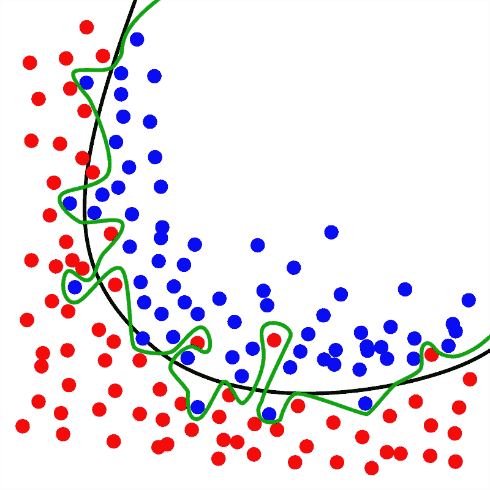
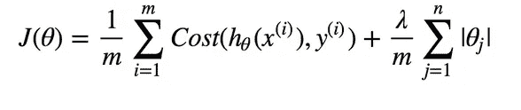
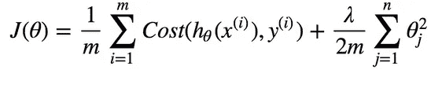

# 机器学习中的正则化

> 原文：<https://medium.com/analytics-vidhya/regularization-in-machine-learning-7fb4e9d51f1d?source=collection_archive---------12----------------------->

每个机器学习模型面临的一个关键问题是过拟合问题。那么什么是过度拟合，我们如何将其最小化？什么是正规化？到文章结束的时候，你就会清楚这些概念了。

为了理解这些概念，我们必须回答以下问题

1.  什么是过度拟合？
2.  什么是正规化？
3.  正规化的类型

# 1.什么是过度拟合？

> **过度拟合**发生在模型学习训练数据中的细节和噪声，以至于对新数据的模型性能产生负面影响的时候。

对上述定义的简单解释是，过度拟合是指一个模型考虑了几乎所有的特征。当这种情况发生时，模型可能会“记住”这些特征。**过度拟合也被称为方差。**下图中的绿线代表过度拟合。

图片来自[维基百科](https://en.wikipedia.org/wiki/Overfitting)

解决过拟合的方法之一是**正则化**。

# 2.什么是正规化？

正规化的正式定义如下

> 这是一种回归形式，它将系数估计值约束/调整或缩小到零。

简而言之，正则化是一种考虑所有要素但限制这些要素对模型输出的影响的技术。让我们通过一个例子来理解这一点。

让我们用线性回归来举房价的例子。这个问题可能有很多特点需要考虑。为了简单起见，我们假设它有大约 100 个特性。在这个问题中，模型将试图考虑所有的特征来给出一个输出。这将最终导致模型“记住”数据集中的要素。因此，该模型在训练集中表现良好，但在测试集中表现很差，因为数据对它来说是新的。

这就是正规化发挥重要作用的地方。它确保模型考虑了特征，但使用超参数“正则化常数”λ来限制这些特征对输出的影响，并防止模型过度拟合。

# 3.正规化的类型

有 3 种类型的正规化。我们将在本文中讨论前两个问题

1.  l1 正则化
2.  l2 正则化
3.  辍学正规化

## 1.l1 正则化

使用 l1 正则化的模型称为 Lasso 回归。Lasso 回归(最小绝对收缩和选择算子)将系数大小的绝对值作为惩罚项添加到损失函数中。

λ的值必须平衡。非常小的值将导致 OLS(普通最小二乘法)，而非常大的值将使系数为零。因此，该模型将会不适合。

图片来自 [StackOverflow](https://stackoverflow.com/questions/58905671/compute-the-loss-of-l1-and-l2-regularization)

## 2.l2 正则化

使用 l2 正则化的模型称为岭回归。这是应用较为广泛的技术之一。这种技术将系数的“平方值”作为损失函数的惩罚。这里，应该像 l1 正则化一样适当地选择λ的值。λ的小值将导致 OLS，而大值将导致拟合不足的问题。

图片来自 [StackOverflow](https://stackoverflow.com/questions/58905671/compute-the-loss-of-l1-and-l2-regularization)

> **注**:这两种技术的主要区别在于惩罚期限。

关于 l1 正则化(或套索)回归需要注意的一个关键点是，它**将不太重要的特征收缩为零**，这对于**特征选择**非常有用。

总之，有几种其他方法可以解决过拟合问题，但是上面讨论的技术对于大型数据集非常有效。