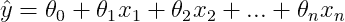
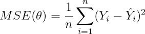
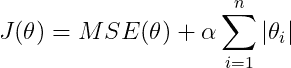
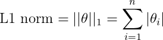
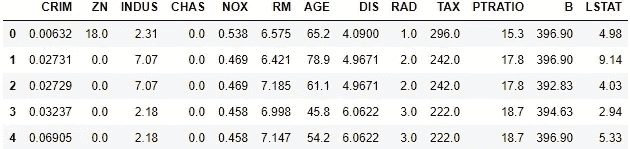
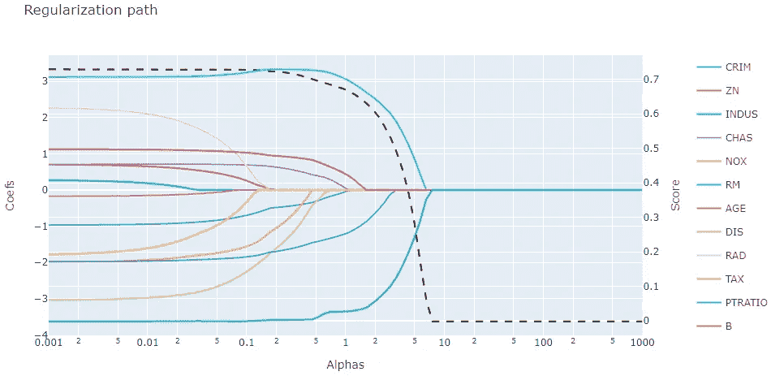

# 使用套索回归的正则化路径。

> 原文：<https://medium.com/analytics-vidhya/regularization-path-using-lasso-regression-c450eea9321e?source=collection_archive---------4----------------------->

*什么是正规化道路，为什么要走正规化道路！*

使用套索回归的通往更美好世界之路

# 首先…什么是线性回归？

线性回归是一种表示目标和解释变量之间的*关系*的线性方法。一个*预测*可以这样计算。

其中，ŷ是预测值，xᵢ是变量，θᵢ是系数。

这是变量的**加权和**加上**截距**。好的，但是我们如何获得θ变量呢？为了找到最佳的θ，我们需要一个最小化函数。你好 **MSE** ( *均方差*)！

其中，Yᵢ是线性回归的第一个实际值，ŷᵢ是第一个预测值。

MSE 是误差平方的平均值，它是线性回归中最常用的*成本函数*。

# **从线性回归到套索回归**

一个套索回归(*最小绝对收缩和选择算子*)是一个**正则化的** **线性回归。**线性回归的*成本函数(MSE)* 中增加了一个正则化项。

套索回归的成本函数

与线性回归一样，θ = (θ₁,…,θₙ)是特征的**权重向量**，而 **MSE** ( *均方误差*)仍然是误差平方的平均值。但这最后一个术语是什么？是正则项！

Lasso 回归的正则项

通过添加这个正则项，对应于权重的 *L1 范数*，它**将迫使** **不太重要的特征为零**。换句话说套索回归是在做一个**特征选择**，**越高**阿尔法的值越少**特征被选择。**

# 让我们创造自己的正规化道路！

现在我们知道什么是套索回归，我们可以创建我们的正则化路径，**正则化路径**是所有系数值对阿尔法值的绘图。这是观察套索回归**行为**的最佳方式。

首先，我们需要从 *sklearn 库导入一些库以及*波士顿房价*数据集。*

波士顿数据集的负责人

现在我们已经导入了库和数据，我们可以*创建我们的正则化路径。*

然后我们*标准化*我们的数据，并绘制我们的正则化路径！

太神奇了！基于阿尔法值，拉索选择了一些功能！

正如我们可以看到的，当 alpha 值**太高**时，Lasso 回归无法将权重拟合到特征，这就是为什么我们有这样的**低分**，此外**太低** alpha 是没有用的，成本函数已经**收敛到下限。**

# 性能和可解释性之间的权衡

如果我们看一看我们的正则化路径，我们可以看到，当 alpha 为 0.1 左右时，套索选择了 **4 个附加特征**来对**的得分进行轻微的改进**。

这些特性是真正的改进吗？不尽然，它们可以被认为是*噪音*，它们会因为分数的**轻微增加**而大幅**降低可解释性**。

这些特征可能是**过度拟合**的结果，它们相互抵消以给出稍微好一点的分数。我们绝对不希望这样。

# **极限值**

当特征数的**比变量数**的**大**时，或者当特征数**强相关**时，套索回归可能*不可预测*！*不要跳过特征工程！*****

# 结论

规则化路径是一个神奇的工具，可以看到我们的套索回归的**行为**，它让我们了解**特征的重要性**以及我们可以预期的分数！但是任何事情都是有代价的，拟合大量的回归可能在计算上**很昂贵。**

# *奖金*

*对于[脊](https://scikit-learn.org/stable/modules/generated/sklearn.linear_model.Ridge.html)或[弹力网](https://scikit-learn.org/stable/modules/generated/sklearn.linear_model.ElasticNet.html)的回归也可以完全相同；)*

*如果你不想像我一样，让自己的*变得惊艳而互动*正规化；)可以使用 sklearn 库中的[sk learn . linear _ model . lasso _ path](https://scikit-learn.org/stable/modules/generated/sklearn.linear_model.lasso_path.html)函数。*

# *感谢阅读！*

*如果你觉得有趣，请给我点个赞或通过 LinkedIn 联系我！*

**