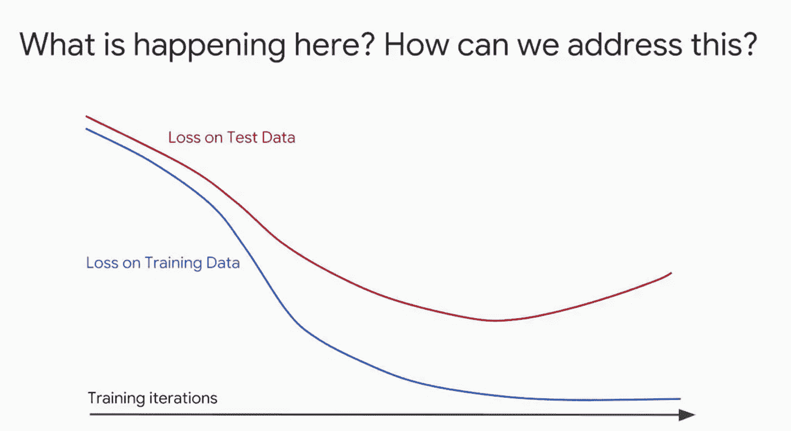
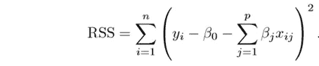
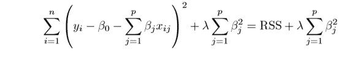

# 正规化！

> 原文：<https://medium.com/analytics-vidhya/regularization-understanding-fb8cd7b7c0e2?source=collection_archive---------2----------------------->

读者你好，

这篇博文将帮助你理解为什么正则化在训练机器学习模型中是重要的，以及为什么它是 ML 领域中谈论最多的话题。

## **让我们开始**

那么，让我们看看这个图。我们从中破译了什么？
在该图中，x 轴是迭代所用的时间，y 轴是训练和测试数据的损失。你能注意到这里有什么不对吗？

是的，损失值在训练数据上很好地趋于下降，但在测试数据的某个点上却迅速上升。这可不好。测试数据存在一定程度的过度拟合。我们如何解决这个问题？

我们可以做一件事，我们可以提前停止迭代以避免过度拟合。这被称为**提前停止**。**提前停止**是一项功能，当选择的指标停止改善时，该功能可以自动停止训练。但是提前停止的一个问题是**模型没有利用所有可用的训练数据，因此使得训练数据非常有限。**

那么现在应该怎么做呢？这就是正规化可以拯救的地方。
正则化是将系数估计值最小化为零的技术。这意味着它可以防止模型学习数据的复杂性，并避免过度拟合。

有两种类型的正则化技术:

1.  里脊回归
2.  套索回归

## 里脊回归

岭回归是一种正则化技术，其中我们引入了一个称为**岭回归损失**的小偏差。这也被称为 L-2 正则化

在简单回归中，这是拟合过程，损失函数是**残差平方和**。在等式中，Y 是具有特征和斜率的线。看下面的等式。
如果我们有一个特征，那么它将是**Y =*βx*+c
+如果我们有两个特征，那么它将是**Y =*β1x 1*+*β2x 2*+c** 并且对于多个特征来说，情况是这样的 ***Y≈β0+β1x 1+β2x 2+…+βpXp【t3x】*****

残差平方和

所以 RSS 是线性回归的成本函数，因此岭回归的成本函数变成 **RSS + λ(slope)**

岭回归的成本函数

因此，我们必须通过添加偏差值来惩罚拟合线，从而降低该值。这将减少过度拟合的机会。 **λ** 值介于 0-1 之间。

## 套索回归

这也称为 L-1 正则化。Lasso 回归的工作方式与 Ridge 相似，但唯一的区别是惩罚项。在山脊中，我们取斜率的平方，而在套索中，我们取斜率的大小。

套索回归的成本函数

我们使用斜率大小，因为我们不仅避免了过度拟合，而且使用它进行特征选择。

在岭回归中，当我们增加罚项时，斜率将慢慢趋向于零，但在套索回归中，当我们增加罚项时，斜率将变为零。这就是我们使用 lasso 回归作为特征选择方法的原因。因为在增加罚项之后，一些特征值将变为零，因此我们得出结论，这些特征对于预测我们的最佳拟合线并不重要。

## 岭回归和套索回归的区别

*   岭回归有助于避免过度拟合的问题，但它保留了模型中的所有特征。而套索回归不仅有助于解决过度拟合的问题，还可以从模型中移除低效的特征。
*   岭回归使系数值缓慢地趋向于零，但在拉索回归中，系数变为零。

# 终于！

*感谢阅读！*

如果你喜欢这个，请投我一票，也建议一些更多的主题。

请随时在 [**LinkedIn**](https://www.linkedin.com/in/ajinkya-mishrikotkar-a6594a144/) 上联系我

欢迎在下面发表评论，并提出你认为我错过了什么。谢谢！