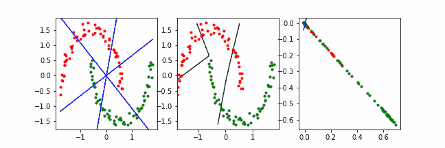
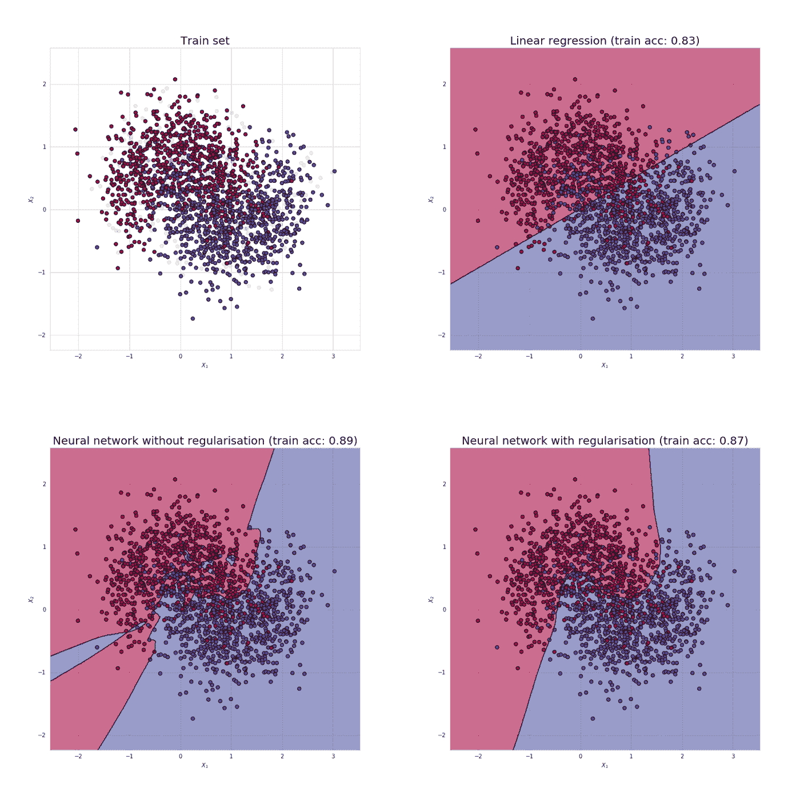
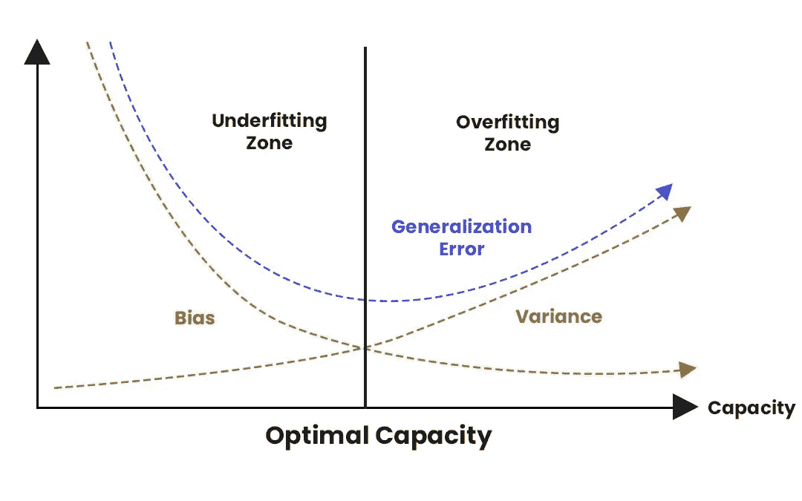
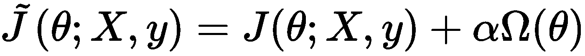
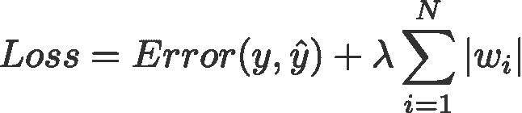
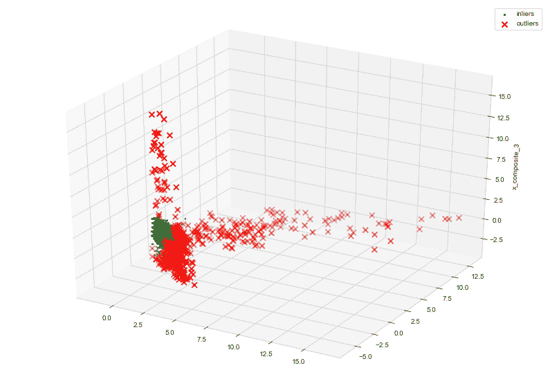
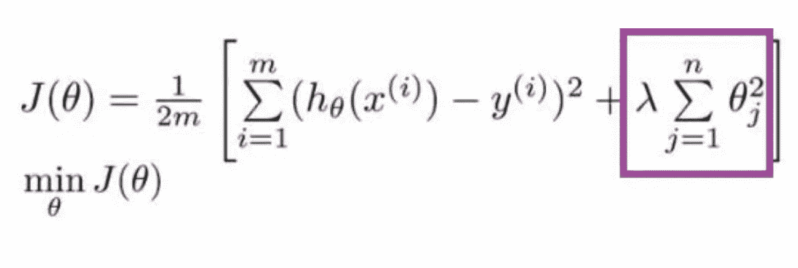
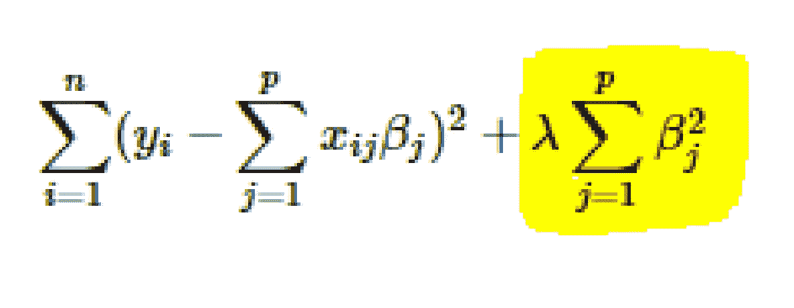
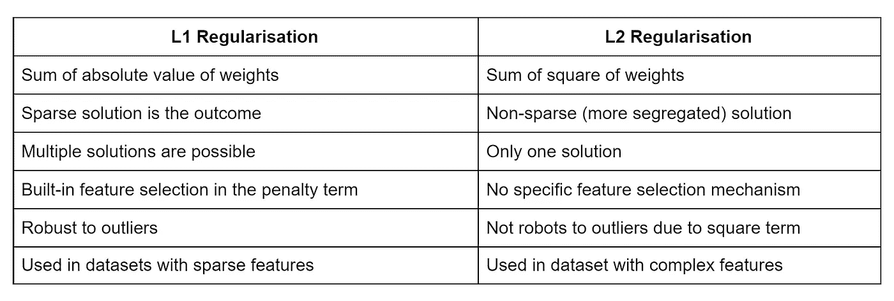

# 正则化—理解深度学习的 L1 和 L2 正则化

> 原文：<https://medium.com/analytics-vidhya/regularization-understanding-l1-and-l2-regularization-for-deep-learning-a7b9e4a409bf?source=collection_archive---------0----------------------->

[正则化给 OG ML 优化带来曙光](https://www.google.com/url?sa=i&url=https%3A%2F%2Fwww.reddit.com%2Fr%2Fwallpapers%2Fcomments%2Fedn0ju%2F4k_desktop_wallpaper%2F&psig=AOvVaw2dg0owTesEg6riir4gkHCO&ust=1636567853670000&source=images&cd=vfe&ved=0CAsQjRxqFwoTCIin_77wi_QCFQAAAAAdAAAAABAQ)

理解什么是正则化，为什么机器学习需要正则化，并深入研究，以阐明 L1 和 L2 正则化在深度学习中的重要性。

# 目录:

1.  **简介**
2.  **什么是正规化？**
3.  **深度学习中的正则化**
4.  **参数定额罚分**
5.  **L1 正规化**
6.  **L2 正规化**
7.  **区别、用途和重要性**
8.  **汇总表**

# 简介:

机器学习中的一个普遍问题是制定一个在训练数据和任何新样本或测试数据集上表现同样好的算法。机器学习中使用的专门设计用于减少测试误差的技术，主要以增加训练误差为代价，在全球范围内被称为正则化。

为我们的数据拟合一个函数难道不是我们的最终目标吗？

# 什么是正规化？

正则化可以被定义为学习算法中的任何修改或改变，其有助于减少其在测试数据集上的误差，通常被称为泛化误差，但不是在提供的或训练的数据集上。

在学习算法中，有许多正则化技术的变体，每一种都试图迎合不同的挑战。根据该技术试图应对的挑战类型，可以直接列出这些挑战:

1.  一些人试图对 ML 模型的学习施加额外的约束，比如对参数值的范围/类型增加限制。
2.  有些在目标或成本函数中增加了更多的项，比如对参数值的软约束。通常情况下，在成本函数中仔细选择正确的约束和惩罚有助于模型性能的大幅提升，特别是在测试数据集上。
3.  这些额外的术语也可以基于一些与数据集或问题陈述密切相关的先验信息进行编码。
4.  最常用的正则化技术之一是创建集合模型，该模型考虑了多个模型的集体决策，每个模型都用不同的数据样本进行训练。

正则化的主要目的是降低机器学习模型的过度复杂性，并帮助模型学习更简单的函数以促进泛化。

[**正则化对机器学习的影响**](https://www.google.com/url?sa=i&url=https%3A%2F%2Ftowardsdatascience.com%2Fpreventing-deep-neural-network-from-overfitting-953458db800a&psig=AOvVaw2NPawi7aFnKvycg0rIBG78&ust=1635919316263000&source=images&cd=vfe&ved=0CAsQjRxqFwoTCJCe98SA-fMCFQAAAAAdAAAAABAD) g

# 深度学习中的正则化:

在深度学习模型的背景下，大多数正则化策略都围绕正则化估计器。所以现在问题来了，正则化一个估计量意味着什么？

此处的偏差与方差权衡图更好地揭示了这一主题和界限的细微差别:

[**偏差与方差权衡图**](https://www.google.com/url?sa=i&url=https%3A%2F%2Fwww.analyticssteps.com%2Fblogs%2Fl2-and-l1-regularization-machine-learning&psig=AOvVaw1QZa5Vte1fC102gpvoKCH6&ust=1635919746405000&source=images&cd=vfe&ved=0CAsQjRxqFwoTCKi3_46C-fMCFQAAAAAdAAAAABAW)

估计量的正则化是通过用增加的偏差换取减少的方差来实现的。 ***有效的规则化将是在偏差和方差之间进行最佳权衡的规则化，权衡的最终结果应该是以偏差最小的代价显著减少方差。*** 用更简单的话来说，这意味着低方差而不会大幅增加偏差值。

我们考虑两种情况:

1.  真正的数据生成过程/功能:F1，它创建了数据集
2.  创建一个生成过程/函数:F2 模拟 F1，但也探索其他可能的生成场景/函数

正则化技术的工作是帮助我们的模型从 F2 到 F1，而不会使 F2 过于复杂。深度学习算法主要用于更复杂的领域，如图像、音频、文本序列或模拟复杂的决策任务。**真实的数据生成过程:F1 几乎不可能被正确映射，因此通过正则化，我们的目标是使我们的模型与 F2 函数尽可能接近原始 F1 函数。**下面的类比有助于更清楚地理解它:

> 将 F2(我们的 ML 模型)拟合到 F1 上，我们真正的数据生成过程几乎就像通过封闭逼近将一个方形玩具拟合到一个圆孔中。

在实际的深度学习训练和场景中，我们大多发现最佳拟合模型(在泛化误差最小的意义上)往往是经过适当正则化的大型模型。

我们现在将深入研究一种类型的正则化技术，这种技术有助于使用基于参数的惩罚来创建大型但深度正则化的模型。

# 参数范数惩罚:

在这种正则化技术下，通过向目标函数 j 添加参数范数惩罚ω(θ)来限制神经网络、线性或逻辑回归等模型的能力。

[参数定额罚分](https://www.google.com/url?sa=i&url=https%3A%2F%2Fsubscription.packtpub.com%2Fbook%2Fprogramming%2F9781838647292%2F10%2Fch10lvl1sec45%2Fnorm-penalties&psig=AOvVaw0wpsXPrUa8JA9H9d5Yc344&ust=1623088901621000&source=images&cd=vfe&ved=0CAIQjRxqFwoTCPjl-r7Lg_ECFQAAAAAdAAAAABAD)

*其中α位于[0，∞)是一个超参数，它对与标准目标函数 j 相关的范数惩罚项ω的相对贡献进行加权。*

> ***将α设置为 0 不会导致正则化，而较大的值对应于较大的正则化。***

这种类型的正则化仅惩罚网络每一层的仿射变换的权重，这使得偏差未被正则化。这样做是基于这样一个概念，即它通常需要比权重更少的数据来拟合偏差。

对于深度学习，有时使用单独的参数来诱导相同的影响是令人满意的。

# L1 参数正则化；

L1 正则化是一种进行正则化的方法。它往往比梯度下降更具体，但它仍然是一个梯度下降优化问题。

这里的公式和高级含义是:

[L1 正则项公式](https://www.google.com/url?sa=i&url=http%3A%2F%2Fwww.chioka.in%2Fdifferences-between-the-l1-norm-and-the-l2-norm-least-absolute-deviations-and-least-squares%2F&psig=AOvVaw2bHmwn7PcSxidx3lLANW8y&ust=1635918287742000&source=images&cd=vfe&ved=0CAsQjRxqFwoTCJi_3YP9-PMCFQAAAAAdAAAAABAd)

Lasso 回归(**最小绝对收缩和选择算子**)将系数的**“绝对值”**作为惩罚项添加到损失函数中。

Lasso 将不太重要的特征的系数缩小到零；因此，完全去除了一些特征。因此，如果我们有大量的特征，这对于特征选择很有用。

L1 正则化基本上寻找最小化参数向量的范数(向量的长度)的参数向量。这实质上是如何优化单个神经元，一般是单层神经网络，特别是单层前馈神经网络的参数的问题。

构建一个 ML 模型，同时考虑要纳入成本惩罚的异常值，这并不是一项简单的任务。图像显示了一个虚拟数据集的可视化，其中 L1 帮助识别远处的异常值

概念化它的一个好方法是，它是一种最大化参数超空间面积的方法，真实的参数向量在该超空间内。为此，它会找到“最尖锐”的边缘，即尽可能接近参数向量的边缘。L1 正则化应注意的要点:

1.  **L1 正则化易于实现，并且可以一次性训练，**意味着一旦训练完成，就可以使用参数向量和权重。
2.  **L1 正则化在处理异常值方面是稳健的。**它在解中产生稀疏性(解的大部分系数为零)，这意味着不太重要的特征或噪声项将为零。它使 L1 正则化对异常值具有鲁棒性。

为了理解上面提到的这一点，让我们看一下下面的例子，试着理解当一个算法对异常值敏感时意味着什么

1.  例如，我们正在尝试对不同物种的各种鸟类图像进行分类，并拥有一个包含数百个参数的神经网络。
2.  我们发现了一个物种的鸟类样本，我们没有理由相信它与所有其他物种有任何不同。
3.  *我们将此图像添加到训练集中，并尝试训练神经网络。这就像把一个离群值扔进所有其他值的混合体中。通过查看超平面最接近的超空间的边缘，我们获得了这个离群值，但是当我们到达超平面时，它离平面很远，因此是一个离群值。*
4.  *这种情况下的解决方案是执行迭代丢弃。L1 正则化是一次性的解决方案，但最终我们将不得不做出某种艰难的决定，即在哪里切断超空间的边缘。*
5.  *迭代剔除是一种准确决定从哪里剔除的方法。就训练时间而言，这稍微贵了一点，但最终它可能会让我们更容易决定超空间边缘有多远。*

除了收缩系数，套索还执行**特征选择**。(*还记得套索全形中的‘选择’吗？*)因为有些系数恰好变为零，这相当于特定特征被排除在模型之外。

# L2 参数正则化；

使用 L2 正则化的回归模型称为岭回归。

[**岭回归公式**](https://github.com/iNeuronai/interview-question-data-science-)

随着模型复杂性的增加，正则化增加了惩罚。正则化参数(lambda)对除截距之外的所有参数进行惩罚，以便模型对数据进行概化且不会过度拟合。岭回归将**“系数的平方值”**作为惩罚项添加到损失函数中。这里，上图中的方框部分代表 L2 正则化元素/项。

*λ是一个超参数。*

如果λ是零，那么它相当于 OLS。

> **普通最小二乘法或 OLS，是一种统计模型，它还帮助我们识别对输出有重大影响的更重要的特征。**

但是如果 lambda 非常大，那么它会增加太多的重量，并且会导致欠拟合。关于 L2，需要考虑的要点如下:

1.  **脊正则化迫使权重变小，但不会使其为零，也不会给出稀疏解**。
2.  **山脊对异常值不稳健**因为平方项放大了异常值的误差差，正则化项试图通过惩罚权重来修复异常值。
3.  当所有输入要素都影响输出，并且所有具有**权重的要素大小大致相等**时，岭回归的性能更好。
4.  **L2 正则化可以学习复杂的数据模式**

# 区别、用法和重要性:

理解这两种方法之间的界限是很重要的。与 L2 正则化相比，L1 正则化产生更稀疏的解。

> 在这个上下文中，S parsity 指的是一些参数具有零的最佳值的事实。L1 正则化的稀疏性在性质上不同于 L2 正则化

L1 正则化中使用的稀疏特征已经被广泛地用作机器学习中的特征选择机制。特征选择是一种机制，通过有效地选择应该在模型中使用的可用特征的子集，本质上简化了机器学习问题。

> L asso 将 L1 惩罚与线性模型和最小二乘成本函数相结合。L1 惩罚导致权重的子集变为零，这可以安全地表明与相应权重相关联的对应特征可以被容易地丢弃。

## 作为贝叶斯推理的正则化？

许多正则化技术可以解释为地图贝叶斯推理。

1.  特别地，L2 几乎等同于在权重上具有高斯先验的映射贝叶斯推断。
2.  在 L1 正则化中，当先验是实数数据集上的各向同性拉普拉斯分布时，用于惩罚成本函数的惩罚项可以与通过映射贝叶斯推理最大化的对数先验项进行比较

# 一览表

整篇文章也可以总结成小要点，这在面试准备或浏览内容并找到正确部分时可能会有用。希望这有所帮助:

两种正则化技术的区别

[**欣赏文章**](https://www.google.com/url?sa=i&url=https%3A%2F%2Ftenor.com%2Fview%2Fthe-end-hi-senegal-gif-12029785&psig=AOvVaw0ldPUTc95AK6l7_197q1vT&ust=1635926361999000&source=images&cd=vfe&ved=0CAsQjRxqFwoTCLj12t-a-fMCFQAAAAAdAAAAABAJ)