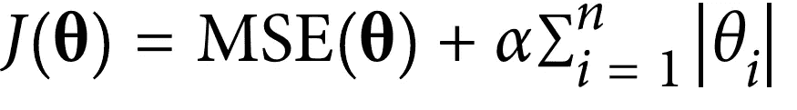

# 正则化线性模型

> 原文：<https://medium.com/analytics-vidhya/regularized-linear-models-d0d8964bf23f?source=collection_archive---------15----------------------->

> “也许故事只是有灵魂的数据。”
> —布琳·布朗


来源:[https://elearningindustry . com/how-design-thinking-transforming-learning-experience-free-ebook](https://elearningindustry.com/how-design-thinking-transforming-learning-experience-free-ebook)

你好学习者，在这篇文章中我将向你介绍三种正则化线性模型:

1.  里脊回归
2.  套索
3.  弹性网

**首先，你所说的正则化术语是什么意思？**这意味着模型在对数据进行训练时存在一些约束。这些约束被称为正则化。它们有助于避免模型过度拟合训练数据。

# 里脊回归

> 岭回归也称为吉洪诺夫正则化

岭回归是线性回归的正则化版本:正则化项(等式 1)被添加到成本函数中。这迫使学习算法适应数据，并使模型权重尽可能小。


等式 1

**请注意，在评估模型时，我们没有在成本函数中使用正则项。**

超参数α控制您想要正则化模型的程度。如果α = 0，那么岭回归就是线性回归。如果α非常大，那么所有权重最终都非常接近于零，结果是一条穿过数据平均值的平线。

我们来看岭回归的损失函数。


损失函数

因此，精确训练模型的一个非常简单的等式，我们可以说是校正模型。

接下来，让我们看看如何使用 sklearn 实现它。是的，使用 sklearn 实现模型没什么大不了的，你只需要 3 行代码来为预测准备模型，但重要的是超参数调整，这是数据科学家或机器学习工程师需要发展的技能。

我们来看看实现。请注意，我们的目标是理解模型，而不是超参数调整。

首先，我们将使用 numpy 生成一些虚拟数据。

```
import numpy as np
m= 100 # number of data points
X = 6* np.random.rand(m,1)-3 # our feature vector
y = 0.5 * X**2 + X +2+np.random.randn(m,1) # our target value
```

导入岭回归

```
from sklearn.linear_model import Ridgeridge_reg = Ridge(alpha=1,solver='cholesky')
ridge_reg.fit(X,y)
ridge_reg.predict([[1.5]])
```

下图显示了使用不同α值对一些线性数据进行训练的几种岭模型。在左边，使用简单的山脊模型，导致线性预测。在右侧，首先使用多项式要素(阶数=10)扩展数据，然后使用标准缩放器缩放数据，最后将岭模型应用于生成的要素:这是使用岭正则化的多项式回归。


具有不同 alpha 值的岭模型。

# 套索回归

> 最小绝对收缩和选择算子回归

Lasso 回归是线性回归的另一个正则化版本:就像岭回归一样，它在成本函数中添加了一个正则化项，但它使用权重向量的 l1 范数，而不是 l2 范数的一半平方。

> ***L1 范数计算为矢量的绝对值之和。L2 范数计算为矢量值平方之和的平方根。***

以下是 Lasso 回归的成本函数:



套索成本函数。

Lasso 回归的一个重要特征是，它倾向于消除最不重要的要素的权重。换句话说，Lasso 回归自动执行特征选择并输出稀疏模型。

让我们用 sklearn 实现套索回归。

```
from sklearn.linear_model import Lassolasso_reg = Lasso(alpha=0.1)
lasso_reg.fit(X, y)
lasso_reg.predict([[1.5]])
```

下图显示了不同 alpha 值的套索回归。左侧图是简单数据的结果，右侧图是添加多项式要素和在数据中执行标准缩放的结果。


不同α值的套索回归。

# 弹性网

弹性网是岭回归和套索回归的中间地带。正则项是岭和 Lasso 正则项的简单混合，你可以控制混合比 r，当 r = 0 时，弹性网相当于岭回归，当 r = 1 时，相当于 Lasso 回归


下面是一个使用 Scikit-Learn 的 ElasticNet 的简短示例:

```
from sklearn.linear_model import ElasticNetelastic_net = ElasticNet(alpha=0.1, l1_ratio=0.5)
elastic_net.fit(X, y)
elastic_net.predict([[1.5]])
```

## 那么什么时候应该使用简单线性回归(即，没有任何正则化)，岭，套索，或弹性网？

至少有一点点
正则化几乎总是更可取的，所以一般来说，你应该避免简单的线性回归。山脊是一个很好的默认值，但如果您怀疑只有少数要素实际上是有用的，您应该更喜欢套索或弹性网，因为它们往往会将无用要素的权重降低到零。通常，弹性网优于套索，因为当要素数量大于训练实例数量或多个要素高度相关时，套索可能会表现不稳定。

这是对**正则化线性模型**的简单介绍，你可以在互联网上探索更多关于它们的信息，因为学习永无止境，你一定会发现一些新的东西，如果你发现了除此之外的东西或你事先知道的东西，请在评论中与我分享。

谢谢你

[创始人基金](https://medium.com/u/1a16144ee274?source=post_page-----d0d8964bf23f--------------------------------) [莫拉莱斯](https://medium.com/u/78cbadd3304e?source=post_page-----d0d8964bf23f--------------------------------) [黄一福](https://medium.com/u/449acda51a61?source=post_page-----d0d8964bf23f--------------------------------) [雷切尔·托马斯](https://medium.com/u/ee56d0bac1b7?source=post_page-----d0d8964bf23f--------------------------------) [欧亨尼奥·库鲁尔切洛](https://medium.com/u/e53b1a2a902f?source=post_page-----d0d8964bf23f--------------------------------) [劳拉·范德卡姆](https://medium.com/u/7ff56d802184?source=post_page-----d0d8964bf23f--------------------------------) [佩曼·塔伊](https://medium.com/u/d382998cf5b3?source=post_page-----d0d8964bf23f--------------------------------) [欧亨尼奥·库鲁尔切洛](https://medium.com/u/e53b1a2a902f?source=post_page-----d0d8964bf23f--------------------------------) [佩曼·塔伊](https://medium.com/u/d382998cf5b3?source=post_page-----d0d8964bf23f--------------------------------) [亚历山大·巴甫洛夫·洪查尔](https://medium.com/u/1b1fb9c5ea70?source=post_page-----d0d8964bf23f--------------------------------) [马塞尔·穆斯伯格](https://medium.com/u/84b9db1628b3?source=post_page-----d0d8964bf23f--------------------------------) [IOS 基金会](https://medium.com/u/99b221f5f824?source=post_page-----d0d8964bf23f--------------------------------) [马修](https://medium.com/u/97d04284d471?source=post_page-----d0d8964bf23f--------------------------------)