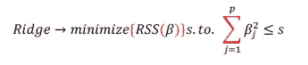

# 正则化回归:当你的线性回归模型过度拟合时。

> 原文：<https://medium.com/analytics-vidhya/regularized-regression-when-your-linear-regression-model-overfits-e717e23549d5?source=collection_archive---------15----------------------->

在我们深入研究什么是正则化回归之前，让我们理解一下高偏差和过度拟合意味着什么。

让我们举一个简单的例子:如果我们请 Sachin Tendulkar(印度板球运动员)解决一个数据科学问题，会发生什么？他将无法做好这件事？这是因为他太了解板球了，因此无法理解或解决不属于他的领域的问题。


现在让我们用这个例子来简单地理解过度拟合。

***过度拟合是指当模型对数据理解得如此之好、如此之近，以至于在向其提供另一个数据集时，它也拾取了噪声，因此无法拟合，或者预测未来的效率低下。***


左边的图展示了一个完美拟合的模型，右边的图展示了该模型如何通过穿过数据集中的每一点来很好地拾取数据

现在让我们来理解高偏差:当有太多过于复杂的模型参数，并且一些参数比其他参数更重要时，就会出现高偏差。

***高偏差导致过度拟合，从而降低精度。***

现在我们知道了什么是过度拟合:让我们来看看用于改善它的回归分析方法。

# 什么是正规化？

这是一种对回归系数/参数应用约束的方法，方法是通过减小回归系数/参数的大小并使其向零收缩，以防止过度拟合。

回归有两种类型:

1.  ***拉索回归***
2.  ***脊回归***

为了解释这些，我将使用数据集:CarPrice

# 1.套索回归:

这也被称为 L1 范数。套索回归的一大优势不仅仅是一种对参数进行惩罚的回归技术，还可以将参数缩小到零，从而有助于理解重要的特征。套索回归会通过移除过多的要素使模型变得过于简单。

从数学上来说，这可以最小化:


*对于 lasso，这个区域是一个菱形，因为它约束了系数的绝对值。因为约束在每个轴上都有角，所以椭圆通常会在某个轴上与约束区域相交。*

让我们看看如何做到这一点:

```
#import libray
from sklearn.linear_model import Lasso#Make the instance
lasso  = Lasso(alpha=0.1 , max_iter= 3000)#Fit the model
lasso.fit(X_train, y_train)
```

请注意，我假设超参数α为 0.1，这可以通过强力网格搜索交叉验证或贝叶斯模型来选择。

```
#Taking the predicted dependent variable
y_pred_l = lasso.predict(X_test)#Plotting against the actual value
plt.plot(10**(y_pred_l))
plt.plot(np.array(10**(y_test)))
plt.legend(["Predicted","Actual"])
plt.show()
```


实际和预测之间有很大的差异。

查看系数将使我们更好地理解特征选择。

```
lasso.coef_
```


看看大多数系数是如何变成 0 的，除了少数几个。这给了我们一个好主意，哪些是最重要的参数，从而最直接地与结果预测相关。

# 2.岭回归:

这被称为 L2 规范。这种回归缩小了系数，并使它们恶化，但不是恶化到 0。当存在共线特征时，它给出比 L1 范数更稳定的性能。因此，它给出了优于 L1 范数的性能。

从数学上讲，RSS 术语可以写成:



对于山脊，这个区域是一个圆，因为它限制了系数的平方。因此，相交一般不会出现在轴上，因此系数估计通常是非零的。

```
#import library
from sklearn.linear_model import Ridge#Create instance
ridge = Ridge(alpha=0.1 , max_iter= 3000)#Fit the model
ridge.fit(X_train, y_train)
```

现在让我们绘制实际值与预测值的对比图:

```
#Predict the y value 
y_pred_r= ridge.predict(X_test)#Plot it against actual
plt.plot(10**(y_pred_r))
plt.plot(np.array(10**(y_test)))
plt.legend(["Predicted","Actual"])
plt.show()
```


看看除了两点之外，大多数预测值都非常接近实际值。我们可能需要研究这些数据，以了解为什么这些数据点在预测和实际中存在差异。

让我们看看系数，以便更好地理解


看看系数是如何如此接近于 0，而不是 0。这就是惩罚的方式

那么如何知道什么时候用什么呢？

1.  当我们想删除一堆我们认为不重要的特征时，使用套索。
2.  当我们只关注性能时，Ridge 要稳定得多。
3.  当相关系数具有相似值时，Ridge 性能更好，而当相关系数具有一个大值而其他值很小时，Lasso 性能更好。
4.  我们也可以使用弹性网回归，它是套索和脊的结合。现在让我们来看看

# 3.弹性净回归；

弹性网是套索和脊的结合，我们结合了两者的缺点，以达到两全其美。