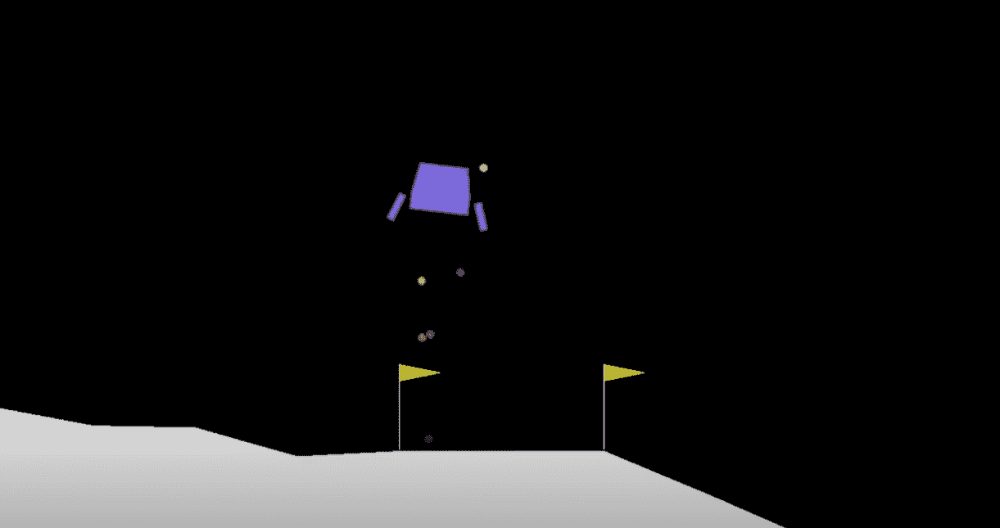

# 连续动作空间中的强化学习:DDPG

> 原文：<https://medium.com/analytics-vidhya/reinforcement-learning-in-continuous-action-spaces-ddpg-bbd64aa5434?source=collection_archive---------16----------------------->

*深入强化学习*


*作者安东尼奥·李斯*

# 介绍

大家好，这是关于强化学习的第三篇文章，也是关注持续行动环境的新系列的开始。

在本帖中，我们将从零开始实现 DDPG，我们将尝试解决[摆](https://gym.openai.com/envs/Pendulum-v0/)和[月球着陆器](https://gym.openai.com/envs/LunarLanderContinuous-v2/)。

# 为什么是连续的行动空间？

在继续下一步之前，我们需要激励我们为什么要解决连续的空间环境。到目前为止，我们总是解决 pong，但你可以使用算法、方法，甚至所有代码来解决任何其他 Atari 游戏。

但是强化学习的许多现实应用需要代理从连续空间中选择动作。例如，自主机器人需要一个代理在连续的空间中采取行动。自动驾驶也是如此，顺便说一下，这是汽车行业最热门的话题之一。

# 要解决的环境

如介绍部分所述，我们将解决 OpeanAI 体育馆库中的两个环境。

# 钟摆

我们从钟摆开始，这是一个经典的环境。


目标是试图保持一个无摩擦的钟摆直立。我们可以通过下面的代码看到输入和动作特征:


输入由三个观察值组成。看[文档](https://github.com/openai/gym/wiki/Pendulum-v0)，可以看到它们分别代表了摆的角度(θ的余弦和正弦)和它的角速度(θ点)。另一方面，我们知道作用量是-2.0 到 2.0 之间的单值，它代表了摆所受的向左或向右的力的大小。奖励的精确公式是:

-(θ2+0.1 *θ2 dt+0.001 * action 2)

# 月球着陆器

另一个要解决的经典环境是月球着陆器(在其连续版本中)。



这个游戏的主要目标是尽可能轻柔和省油地引导代理到达着陆平台。从[文档](https://github.com/openai/gym/wiki/Leaderboard#lunarlander-v2)中，我们知道着陆垫总是在坐标(0，0)处。和前面一样，我们可以看到使用相同代码的输入和动作特征:


输入由 8 个值组成，它们是:

1.  着陆器的 x 坐标
2.  着陆器的 y 坐标
3.  vx，水平速度
4.  vy，垂直速度
5.  θ，空间中的方向
6.  vθ，角速度
7.  左腿着地(布尔型)
8.  右腿着地(布尔型)

对于两个维度，该操作是一个从-1 到+1 的双值数组。第一个控制主发动机，-1.0 关，从 0 到 1.0，发动机的功率从 50%到 100%功率。发动机不能在低于 50%的功率下工作。第二个值控制左右发动机。从-1.0 到-0.5，它点燃左引擎；从 0.5 到 1.0，它点燃右边的引擎；从-0.5 到 0.5，发动机关闭。

从屏幕顶部移动到着陆垫和零速度的奖励是从 100 到 140 分。如果着陆器离开着陆垫，它就失去奖励。如果着陆器崩溃或停止，这一集结束，获得额外的-100 或+100 点。每个支腿接地触点为+10。点燃主引擎每帧-0.3 分。

# 深度确定性政策梯度

DDPG 算法(深度确定性策略梯度)是由 Timothy P. Lillicrap 等人于 2015 年在名为[具有深度强化学习的连续控制](https://arxiv.org/pdf/1509.02971.pdf)的论文中引入的。它属于演员-评论家家族，但同时，政策是确定性的(相同的输入，相同的输出/要采取的行动)。DDPG 也和 DQN 有一些相同的想法。具体而言，使用来自重放缓冲器的样本(以避免相关性)和目标 Q 网络来偏离策略地训练网络。

总之，DDPG 与 DQN 有共同之处，即确定性政策，这是政策外的训练，但同时也有行动者-批评家的方法。所有这些现在看起来可能有点复杂，但是当我们看到代码时，在下一节中会变得更容易。

# 重放缓冲器

让我们从最简单的部分开始，重放缓冲区:

```
*class* ReplayBuffer():
    *def* __init__(self, env, buffer_capacity=BUFFER_CAPACITY, batch_size=BATCH_SIZE, min_size_buffer=MIN_SIZE_BUFFER):
        self.buffer_capacity = buffer_capacity
        self.batch_size = batch_size
        self.min_size_buffer = min_size_buffer
        self.buffer_counter = 0
        self.n_games = 0

        self.states = np.zeros((self.buffer_capacity, env.observation_space.shape[0]))
        self.actions = np.zeros((self.buffer_capacity, env.action_space.shape[0]))
        self.rewards = np.zeros((self.buffer_capacity))
        self.next_states = np.zeros((self.buffer_capacity, env.observation_space.shape[0]))
        self.dones = np.zeros((self.buffer_capacity), dtype=*bool*)

    *def* __len__(self):
        return self.buffer_counter *def* add_record(self, state, action, reward, next_state, done):
        # Set index to zero if counter = buffer_capacity and start again (1 % 100 = 1 and 101 % 100 = 1) so we substitute the older entries
        index = self.buffer_counter % self.buffer_capacity self.states[index] = state
        self.actions[index] = action
        self.rewards[index] = reward
        self.next_states[index] = next_state
        self.dones[index] = done

        # Update the counter when record something
        self.buffer_counter += 1

    *def* check_buffer_size(self):
        return self.buffer_counter >= self.batch_size and self.buffer_counter >= self.min_size_buffer

    *def* update_n_games(self):
        self.n_games += 1

    *def* get_minibatch(self):
        # If the counter is less than the capacity we don't want to take zeros records, 
        # if the cunter is higher we don't access the record using the counter 
        # because older records are deleted to make space for new one
        buffer_range = *min*(self.buffer_counter, self.buffer_capacity)

        batch_index = np.random.choice(buffer_range, self.batch_size, replace=False) # Take indices
        state = self.states[batch_index]
        action = self.actions[batch_index]
        reward = self.rewards[batch_index]
        next_state = self.next_states[batch_index]
        done = self.dones[batch_index]

        return state, action, reward, next_state, done

    *def* save(self, folder_name):
        """
        Save the replay buffer
        """
        if not os.path.isdir(folder_name):
            os.mkdir(folder_name) np.save(folder_name + '/states.npy', self.states)
        np.save(folder_name + '/actions.npy', self.actions)
        np.save(folder_name + '/rewards.npy', self.rewards)
        np.save(folder_name + '/next_states.npy', self.next_states)
        np.save(folder_name + '/dones.npy', self.dones)

        dict_info = {"buffer_counter": self.buffer_counter, "n_games": self.n_games}

        with *open*(folder_name + '/dict_info.json', 'w') as f:
            json.dump(dict_info, f) *def* load(self, folder_name):
        """
        Load the replay buffer
        """
        self.states = np.load(folder_name + '/states.npy')
        self.actions = np.load(folder_name + '/actions.npy')
        self.rewards = np.load(folder_name + '/rewards.npy')
        self.next_states = np.load(folder_name + '/next_states.npy')
        self.dones = np.load(folder_name + '/dones.npy')

        with *open*(folder_name + '/dict_info.json', 'r') as f:
            dict_info = json.load(f)
        self.buffer_counter = dict_info["buffer_counter"]
        self.n_games = dict_info["n_games"]
```

这个概念与 [DDDQN 文章](https://antonai.blog/?p=137#more-137)中使用的相同。我们正在存储所有的状态、动作、奖励、next_states 以及从调用函数 add_record 的环境的交互中得到的终端标志。然后我们有一个 get_minibatch 方法，它返回这些观察值的随机子集。

请注意，我们有一个 check_buffer_size 方法，它确保缓冲区大小大于批处理大小和我们在配置文件中定义的最小值。

最后，我们有保存和加载缓冲区的保存和加载方法。这在你需要停止和重新开始训练的时候特别有用(如果你用的是 Google Colab，这会救你一命)。

# 网络

正如通过介绍 DDPG 算法所说的，我们有标准的演员和评论家的训练和目标版本。所以我们实际上有四个神经网络，两个演员和两个评论家。

让我们从定义参与者的代码开始。

# 行动者

```
*class* Actor(tf.keras.Model):
    *def* __init__(self, name, actions_dim, upper_bound, hidden_0=CRITIC_HIDDEN_0, hidden_1=CRITIC_HIDDEN_1, init_minval=INIT_MINVAL, init_maxval=INIT_MAXVAL):
        *super*(Actor, self).__init__()
        self.hidden_0 = hidden_0
        self.hidden_1 = hidden_1
        self.actions_dim = actions_dim
        self.init_minval = init_minval
        self.init_maxval = init_maxval
        self.upper_bound = upper_bound

        self.net_name = name self.dense_0 = Dense(self.hidden_0, activation='relu')
        self.dense_1 = Dense(self.hidden_1, activation='relu')
        self.policy = Dense(self.actions_dim, kernel_initializer=random_uniform(minval=self.init_minval, maxval=self.init_maxval), activation='tanh') *def* call(self, state):
        x = self.dense_0(state)
        policy = self.dense_1(x)
        policy = self.policy(policy) return policy * self.upper_bound
```

正如你所看到的，这是一个非常简单的网络，有两个隐藏层和最后一个激活层。提醒一下，双曲正切函数定义为:


你可以在这里找到所有激活功能[的定义。](https://www.wikiwand.com/en/Activation_function)

它的输出范围从-1 到 1，所以我们需要乘以动作的上限。例如，对于钟摆环境，我们需要将 tanh 函数的输出乘以 2，以根据环境的要求获得-2 和 2 之间的动作。对于登月，我们实际上并不需要它，因为在两个维度上的行动空间都被限制在-1 到 1 之间。

正如您所看到的，Actor 输出是确定的。给定相同的输入(状态)，将会有相同的输出向量(动作)。

我们可以看到最后一层的权重初始化有所不同。我们用最小值和最大值(在我们的例子中是+/-0.005)从均匀分布中初始化它们。这对于防止在训练的初始阶段出现零梯度是必要的，因为我们使用了双曲正切激活函数。

# 批评家

我们现在可以看到批评家网络的代码:

```
*class* Critic(tf.keras.Model):
    *def* __init__(self, name, hidden_0=CRITIC_HIDDEN_0, hidden_1=CRITIC_HIDDEN_1):
        *super*(Critic, self).__init__()

        self.hidden_0 = hidden_0
        self.hidden_1 = hidden_1 self.net_name = name self.dense_0 = Dense(self.hidden_0, activation='relu')
        self.dense_1 = Dense(self.hidden_1, activation='relu')
        self.q_value = Dense(1, activation=None) *def* call(self, state, action):
        state_action_value = self.dense_0(tf.concat([state, action], axis=1))
        state_action_value = self.dense_1(state_action_value) q_value = self.q_value(state_action_value) return q_value
```

像往常一样，批评家估计 Q 值，即在某个州采取行动的贴现回报。但是我们的动作是一个数组，所以我们需要接受状态和动作作为输入。如您所见，在 call 方法中，使用 TensorFlow 中的 concat 函数将状态和动作堆叠在一起。像往常一样，输出将是一个单一的数字。

行动是由行动者给出的，因此评论家将把行动者网络的输出作为输入。

# 代理人

我们可以看到代理逻辑的实现。

```
*class* Agent:
    *def* __init__(self, env, actor_lr=ACTOR_LR, critic_lr=CRITIC_LR, gamma=GAMMA, max_size=BUFFER_CAPACITY, tau=TAU, path_save=PATH_SAVE, path_load=PATH_LOAD):

        self.gamma = gamma
        self.tau = tau
        self.replay_buffer = ReplayBuffer(env, max_size)
        self.actions_dim = env.action_space.shape[0]
        self.upper_bound = env.action_space.high[0]
        self.lower_bound = env.action_space.low[0]
        self.actor_lr = actor_lr
        self.critic_lr = critic_lr
        self.path_save = path_save
        self.path_load = path_load

        self.actor = Actor(name='actor', actions_dim=self.actions_dim, upper_bound=self.upper_bound)
        self.critic = Critic(name='critic')
        self.target_actor = Actor(name='target_actor', actions_dim=self.actions_dim, upper_bound=self.upper_bound)
        self.target_critic = Critic(name='target_critic') self.actor.*compile*(optimizer=opt.Adam(learning_rate=actor_lr))
        self.critic.*compile*(optimizer=opt.Adam(learning_rate=critic_lr))
        self.target_actor.*compile*(optimizer=opt.Adam(learning_rate=actor_lr))
        self.target_critic.*compile*(optimizer=opt.Adam(learning_rate=critic_lr)) actor_weights = self.actor.get_weights()
        critic_weights = self.critic.get_weights()

        self.target_actor.set_weights(actor_weights)
        self.target_critic.set_weights(critic_weights)

        self.noise = np.zeros(self.actions_dim)
```

查看类输入，您可以看到它是如何利用已定义的环境来定义动作的维度、上限和下限，以及定义重放缓冲区的。

然后，我们使用这些维度来定义四个网络:行动者、目标行动者、评论家和目标评论家。一开始，我们只是将演员和评论家的权重复制到目标网络中。

# 目标网络

目标网络是其原始网络的延时副本，缓慢更新其权重。至于 DDDQN，我们正在使用这些目标网络来提高学习稳定性。我们会看到它们是如何在损失函数中使用的。现在，让我们看看如何更新这些网络:

```
*def* update_target_networks(self, tau):
        actor_weights = self.actor.weights
        target_actor_weights = self.target_actor.weights
        for index in *range*(*len*(actor_weights)):
            target_actor_weights[index] = tau * actor_weights[index] + (1 - tau) * target_actor_weights[index] self.target_actor.set_weights(target_actor_weights)

        critic_weights = self.critic.weights
        target_critic_weights = self.target_critic.weights

        for index in *range*(*len*(critic_weights)):
            target_critic_weights[index] = tau * critic_weights[index] + (1 - tau) * target_critic_weights[index] self.target_critic.set_weights(target_critic_weights)
```

如您所见，我们将网络的权重更新为目标权重和训练好的网络权重之间的加权平均值。在我们的例子中，Tau 等于配置文件中定义的 0.05。我们用τ作为训练好的网络的权重。鉴于 tau 值较低，我们正在进行“软”更新，但我们每次更新训练好的网络的权重时都会更新它们，正如我们将在训练循环中看到的那样。

# 保存并加载

像往常一样，我们希望有一些方法来保存和加载网络的权重和重放缓冲区:

```
*def* save(self):
        date_now = time.strftime("%Y%m%d%H%M")
        if not os.path.isdir(f"{self.path_save}/save_agent_{date_now}"):
            os.makedirs(f"{self.path_save}/save_agent_{date_now}")
        self.actor.save_weights(f"{self.path_save}/save_agent_{date_now}/{self.actor.net_name}.h5")
        self.target_actor.save_weights(f"{self.path_save}/save_agent_{date_now}/{self.target_actor.net_name}.h5")
        self.critic.save_weights(f"{self.path_save}/save_agent_{date_now}/{self.critic.net_name}.h5")
        self.target_critic.save_weights(f"{self.path_save}/save_agent_{date_now}/{self.target_critic.net_name}.h5")

        np.save(f"{self.path_save}/save_agent_{date_now}/noise.npy", self.noise)

        self.replay_buffer.save(f"{self.path_save}/save_agent_{date_now}") *def* load(self):
        self.actor.load_weights(f"{self.path_load}/{self.actor.net_name}.h5")
        self.target_actor.load_weights(f"{self.path_load}/{self.target_actor.net_name}.h5")
        self.critic.load_weights(f"{self.path_load}/{self.critic.net_name}.h5")
        self.target_critic.load_weights(f"{self.path_load}/{self.target_critic.net_name}.h5")

        self.noise = np.load(f"{self.path_load}/noise.npy")

        self.replay_buffer.load(f"{self.path_load}")
```

这里没什么特别的，但是你可以注意到，我们也保存了我们现在要讨论的噪声变量。

# 探索与开发

我们需要为确定性政策付出的代价是，我们需要一些探索环境的策略。最简单的方法是给演员返回的动作添加一些噪声。例如，我们可以从正态分布中随机抽取噪声。但在最初的论文中，他们使用了奥恩斯坦-乌伦贝克过程，所以我们将以同样的方式实现它:

```
*def* _ornstein_uhlenbeck_process(self, x, theta=THETA, mu=0, dt=DT, std=0.2):
        """
        Ornstein–Uhlenbeck process
        """
        return x + theta * (mu-x) * dt + std * np.sqrt(dt) * np.random.normal(size=self.actions_dim) *def* get_action(self, observation, noise, evaluation=False):
        state = tf.convert_to_tensor([observation], dtype=tf.float32)
        actions = self.actor(state)
        if not evaluation:
            self.noise = self._ornstein_uhlenbeck_process(noise)
            actions += self.noise actions = tf.clip_by_value(actions, self.lower_bound, self.upper_bound) return actions[0]
```

对于奥恩斯坦-乌伦贝克过程，我只是用了一个公式，你可以很容易地通过谷歌搜索找到它。接下来，在 get_action 方法中，我们使用噪声在动作值中创建随机性。最后，我们使用下限和上限来裁剪动作的值。

# 损失函数和梯度

最后，我们只需要使用从损失函数计算的梯度来更新演员和评论家的权重。

批评家损失是目标网络看到的预期回报和批评家网络预测的 Q 值之间的均方误差。

给定演员网络所采取的行动，演员损失是评论家网络价值的平均值。我们想要最大化这个值(我们想要更高的 Q 值)，所以我们使用负号将其转换为损失函数。

查看代码:

```
*def* learn(self):
        if self.replay_buffer.check_buffer_size() == False:
            return state, action, reward, new_state, done = self.replay_buffer.get_minibatch() states = tf.convert_to_tensor(state, dtype=tf.float32)
        new_states = tf.convert_to_tensor(new_state, dtype=tf.float32)
        rewards = tf.convert_to_tensor(reward, dtype=tf.float32)
        actions = tf.convert_to_tensor(action, dtype=tf.float32) with tf.GradientTape() as tape:
            target_actions = self.target_actor(new_states)
            target_critic_values = tf.squeeze(self.target_critic(
                                new_states, target_actions), 1)
            critic_value = tf.squeeze(self.critic(states, actions), 1)
            target = reward + self.gamma * target_critic_values * (1-done)
            critic_loss = tf.keras.losses.MSE(target, critic_value) critic_gradient = tape.gradient(critic_loss,
                                            self.critic.trainable_variables)
        self.critic.optimizer.apply_gradients(*zip*(
            critic_gradient, self.critic.trainable_variables)) with tf.GradientTape() as tape:
            policy_actions = self.actor(states)
            actor_loss = -self.critic(states, policy_actions)
            actor_loss = tf.math.reduce_mean(actor_loss) actor_gradient = tape.gradient(actor_loss, 
                                    self.actor.trainable_variables)
        self.actor.optimizer.apply_gradients(*zip*(
            actor_gradient, self.actor.trainable_variables)) self.update_target_networks(self.tau)
```

首先，我们使用 ReplayBuffer 类的 check_buffer_size()方法检查缓冲区大小是否大于批处理大小和配置脚本中定义的最小大小。然后，我们从重播缓冲器中取出一个小批次，并开始如上所述计算两个损失，即我们应用于演员和评论家网络以更新权重的梯度。最后，我们使用方法 update_target_networks“软”更新目标网络的权重。

# 培训和结果

我们现在可以转到训练循环和两种环境的结果。

```
config = *dict*(
  learning_rate_actor = ACTOR_LR,
  learning_rate_critic = ACTOR_LR,
  batch_size = BATCH_SIZE,
  architecture = "DDPG",
  infra = "Ubuntu",
  env = ENV_NAME
)wandb.init(
  project=f"tensorflow2_ddpg_{ENV_NAME.lower()}",
  tags=["DDPG", "FCL", "RL"],
  config=config,
)env = gym.make(ENV_NAME)
agent = Agent(env)scores = []
evaluation = Trueif PATH_LOAD is not None:
    print("loading weights")
    observation = env.reset()
    action = agent.actor(observation[None, :])
    agent.target_actor(observation[None, :])
    agent.critic(observation[None, :], action)
    agent.target_critic(observation[None, :], action)
    agent.load()
    print(agent.replay_buffer.buffer_counter)
    print(agent.replay_buffer.n_games)
    print(agent.noise)
```

像往常一样，我们开始为日志配置 wandb，如果我们正在加载一个以前训练过的代理，我们将加载代理和重放缓冲区。在加载所有内容之前，我们需要调用四个网络来构建它们，因此我们将使用一个随机的初始观察来初始化它们。

然后我们有了训练循环:

```
for _ in tqdm(*range*(MAX_GAMES)):
    start_time = time.time()
    states = env.reset()
    done = False
    score = 0
    while not done:
        action = agent.get_action(states, evaluation)
        new_states, reward, done, info = env.step(action)
        score += reward
        agent.add_to_replay_buffer(states, action, reward, new_states, done)
        agent.learn()
        states = new_states

    agent.replay_buffer.update_n_games()

    scores.append(score)
        wandb.log({'Game number': agent.replay_buffer.n_games, '# Episodes': agent.replay_buffer.buffer_counter, 
               "Average reward": *round*(np.mean(scores[-10:]), 2), \
                      "Time taken": *round*(time.time() - start_time, 2)}) if (_ + 1) % EVALUATION_FREQUENCY == 0:
        evaluation = True
        states = env.reset()
        done = False
        score = 0
        while not done:
            action = agent.get_action(states, evaluation)
            new_states, reward, done, info = env.step(action)
            score += reward
            states = new_states
        wandb.log({'Game number': agent.replay_buffer.n_games, 
                   '# Episodes': agent.replay_buffer.buffer_counter, 
                   'Evaluation score': score})
        evaluation = False

    if (_ + 1) % SAVE_FREQUENCY == 0:
        print("saving...")
        agent.save()
        print("saved")
```

在训练循环中，我们与环境进行交互，我们将状态、动作、奖励和终端标志保存在重放缓冲区中，并使用之前看到的 learn()方法训练代理。当这一集结束时，我们评估结果，记录最后十场比赛的平均值。我们还记录每 100 场游戏的评估分数，其中我们简单地不将噪声添加到动作中，并且每 200 场游戏，我们保存网络的权重、噪声和重放缓冲。

我们可以开始看钟摆结果，记住 [OpenAI 文档](https://gym.openai.com/evaluations/eval_GH4gO123SvukqlMmqhIyeQ/)说“最好的 100 集平均奖励是-138.98±9.06。(钟摆-v0 没有一个特定的奖励阈值，在这个阈值上它被认为是解决了。)".


如你所见，算法收敛非常快。在仅仅 300 场比赛之后，我们有相似的表现，如果不比文档中的那些更好的话。

我们看完了月球着陆器的结果；在这种情况下，[文档](https://github.com/openai/gym/wiki/Leaderboard#lunarlander-v2)说“LunarLander-v2 将“解决”定义为在 100 次连续试验中获得平均 200 英镑的奖励。”。


这里我们花了更多的时间来获得好的结果。在将近 150，000 集之后，我们得到了平均 200 分。但是这集真的很短，所以训练时间不多，大约一个小时我们就解决了环境问题。

你可以在我的[博客](https://antonai.blog/reinforcement-learning-in-continuous-action-spaces-part-1-ddpg/)上找到原文，在我的 [Github](https://github.com/antonai91/reinforcement_learning/tree/master/ddpg) 上找到所有代码。有任何问题，可以通过 [Linkedin](https://www.linkedin.com/in/lisiantonio/) 联系我。

如果你喜欢这篇文章，分享给你的朋友和同事吧！我会在下一篇文章中看到你。与此同时，要小心，保持安全，记住*不要成为另一块墙砖*。

Anton.ai