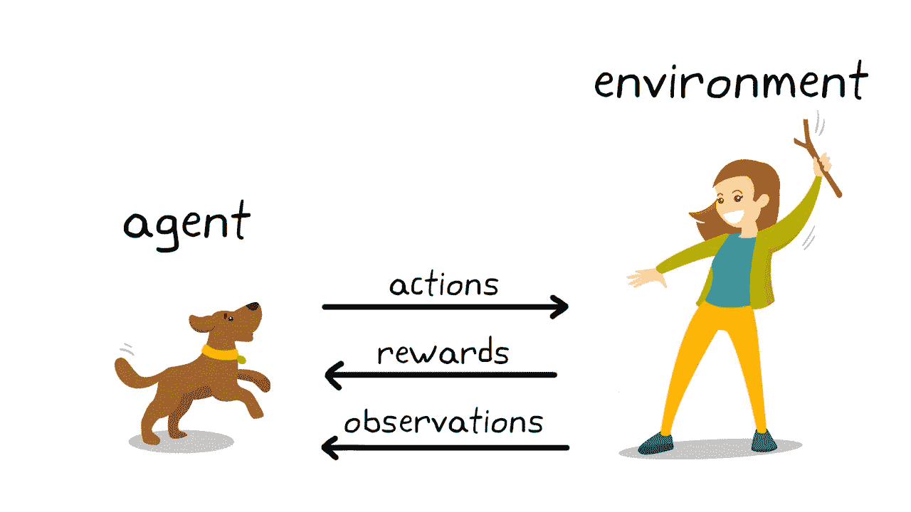
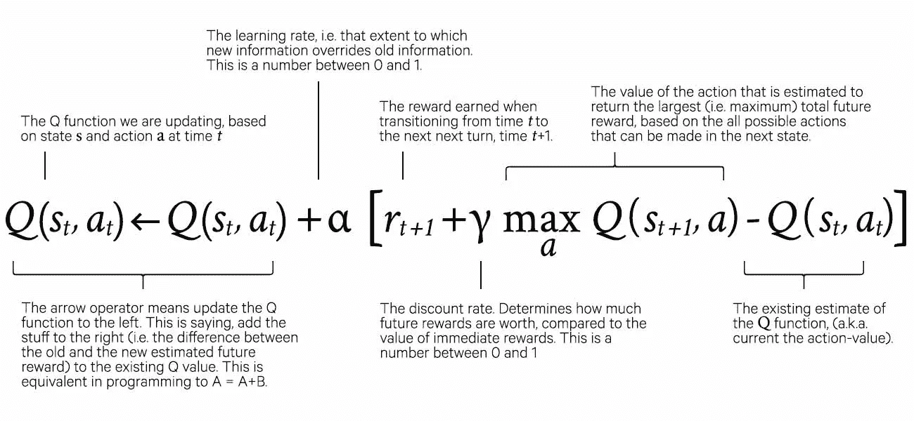
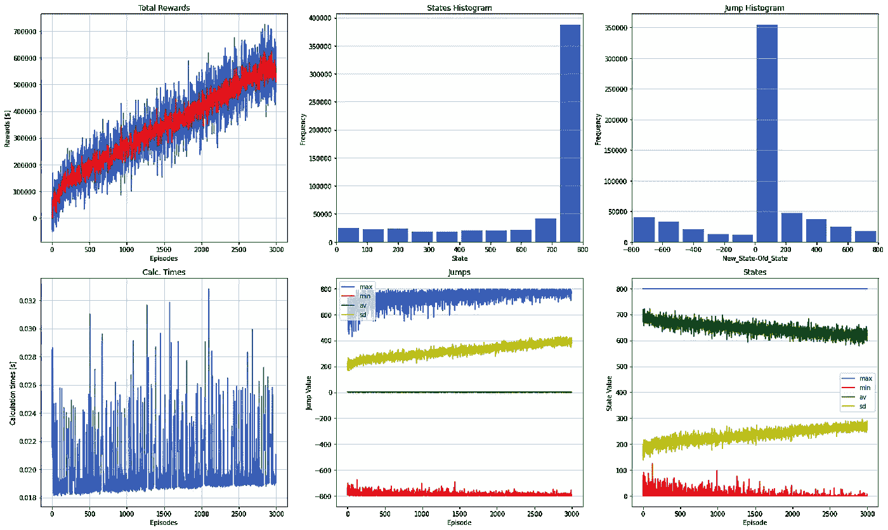
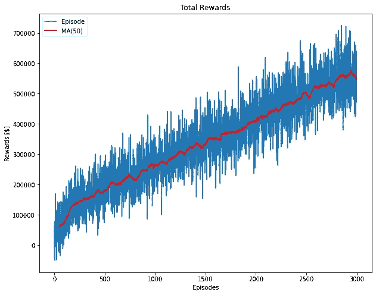

# 强化学习在医疗供应链中的应用

> 原文：<https://medium.com/analytics-vidhya/reinforcement-learning-use-in-supply-chains-d6d7a337e926?source=collection_archive---------14----------------------->

*强化学习(RL)是机器学习的一个领域，它将复杂问题的解决方案建模为环境中发生的代理行为，并试图最大化他们随着时间的推移积累的回报。因此，RL 感兴趣的是在潜在的复杂环境中优化这些智能体的顺序决策。本文以医院仓库为例，开发了一个使用 RL 的模型。*

# 什么是强化学习？

A 长期以来，强化学习(reinforcement learning)伴随着监督学习和非监督学习，是三种基本的机器学习范式之一。我[在最近的这篇论文](https://www.sciencedirect.com/science/article/pii/S0004370221000862) (2021 年)中，Deepmind 的科学家甚至提出**奖励最大化和试错经验足以发展出展现与智力相关的那种能力的行为**。由此，他们得出结论，强化学习(基于回报最大化的人工智能的一个分支)可以导致人工智能的发展。

代理人使用试错法来发现一个解决问题的方法，该方法根据它所做的决定来最大化奖励和最小化它所获得的惩罚。

测试环境和代理的设计者定义了奖励政策，这是游戏规则，但是在模型中没有给出关于如何解决问题的提示或暗示。代理人将最大化报酬，首先通过执行随机试验，逐渐发展到使用复杂的策略。

# 强化学习模型由哪些部分组成？

强化学习模型由与环境交互并从环境中学习的代理形成。交互是通过动作进行的，而学习是通过代理从环境中接收的状态和奖励进行的。下图显示了这种关系。

# 模型描述

为了探索强化学习在医疗供应链中的应用，我用 Python 实现了一个模型，并在这里一步一步地开发。

# 代理人

该模型由单个医院仓库组成，服从随机客户需求，例如，值 a 和 b，U[a，b]之间的均匀分布。

***仓库是该模型中的决策代理，决定是否订购额外的供应品或是否将供应品交付给客户。***

# 报酬

这个仓库的目标是最大化回报，对于医院来说，这是它从一次分娩中获得的内部收入，也就是收入减去费用。

该仓库获得的回报是总收入，包括

a.-所售商品的销售价格

b.-减去存货的持有成本

c.-减去未满足客户需求的罚金

# 行动

仓库持有库存(无最大数量，持有全部数量)，可以采取两种措施:

a.-向客户出售库存，或

b.-从供应商处接收库存

*仓库一次只能做其中一个动作。*

# 状态

模型的状态是仓库库存水平

# 必需的库

我们用 python 实现了这一点。首先，我们确定需要的库。

# 模型参数

该模型具有成本和价格参数，这些参数可以在模型开始时定义，并且在模型执行时不会发生实质性的变化。

*仓库有多少个状态，就有多少个库存单位*。仓库能够容纳的单位数量介于 0 和 max_state(仓库大小)之间。另外，初始状态(初始仓库库存)将是一个介于 0 和 max_state 之间的随机数。

r 矩阵，“奖励结构矩阵”定义为大小为(max_state x max_state)的方阵。它包含奖励，因此也定义了可能采取的行动。首先我们初始化 R 矩阵，然后用奖励值填充它——矩阵的 X 和 Y 坐标对应于决策的初始值和最终值。

例如，[20，45]处的 R 矩阵值表示状态从 20 移动到 45，这意味着有 25 个库存项目被添加到仓库中。因此，报酬是负的，相当于期初购买 25 种新存货的成本加上维护存货的成本。

Q 矩阵描述了一个代理人在某一行为后从给定状态得到的总的未来报酬，它与 R 矩阵具有相同的维数。它在创建时用随机数初始化。此外，学习和折扣过程也需要参数。

我们现在开始定义所使用的函数。首先是一个函数，用于确定可以从中选择下一个动作的可用动作。

接下来，我们定义一个函数，它在可用的动作范围内随机选择要执行的动作。该功能定义了未来的操作。有一系列选项，基本上是:

1.  总是选择具有当前状态(利用)的最大 Q 值的动作
2.  始终从当前状态的可用操作中选择一个随机操作(浏览)
3.  以一定的概率(可能随时间而变化)在利用和探索之间交替

一般建议是***大部分时间开始勘探，逐渐减少勘探，以最大化开采*。**

为此，我们使用衰减ε贪婪方法，其中ε是选择随机行为的概率。

以下函数使用需要以下参数的公式更新 Q 表:

*   q[当前状态，动作] =要更新的值。在这个模型中，动作是代理决定采取的未来状态值。
*   learning_rate =介于 0 和 1 之间的值，表示新信息覆盖旧信息的程度。
*   r[当前状态，动作] =从当前状态转换到未来状态时获得的奖励=动作
*   Q 的最大值 a[未来状态，a] =未来状态中可能动作 a 的最大 Q 值

# 模拟训练

# 标绘结果

