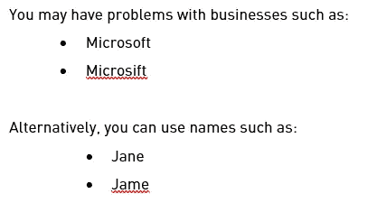

# 谷歌工作表删除模糊匹配的重复

> 原文：<https://medium.com/analytics-vidhya/remove-duplicates-with-fuzzy-matching-57fea355fd85?source=collection_archive---------0----------------------->

## [深入分析。](/@benabrin/excel-approximate-match-fuzzy-match-up-7cf5abda2764?source=friends_link&sk=d111cd27d29168f4ec9844d979556641)

## 模糊重复:10 种识别和删除 google sheets 客户主数据的高级方法

## [***下载基于文本相似度的 google sheets 去重工具***](https://workspace.google.com/marketplace/app/remove_duplicates_for_sheets/939637555230)

如果您负责客户端数据管理，那么您几乎肯定已经处理过重复数据可能导致的问题。无论重复数据是由于客户填写表单、您的团队手动输入数据还是从其他平台导入而进入您的系统，其含义都是一样的，而且它们都很昂贵。

事实上，复制数据的成本比你想象的要大得多。每年，数据完整性问题都会让美国公司损失超过 6000 亿美元。CRM 中重复的联系人、公司和交易可能是与这些数据质量成本最直接相关的数据问题。它们不利于客户关系。它们存在于几乎每一个 CRM 数据库中，它们对您的营销、销售和支持工作的影响通常是显而易见的。

重复对销售团队有重大影响。销售代表不得不改变他们通常的销售流程，包括检查高重复率数据库中的重复项，或者冒着在没有关键背景的情况下吸引潜在客户和客户的风险，导致客户关系受损。

它们通过产生尴尬的失态来破坏你的营销自动化，损害你的品牌形象，浪费你的营销预算。

在 [40%](https://contabo.com/en/vps/vps-l-ssd/?image=cpanel.202.1273&qty=1&contract=1&storage-type=vps-l-800-gb-ssd) 的销售线索中发现不良数据。修复这些缺陷为发展创造了重要的机会，因为 33%的组织在其 CRM 中拥有超过 100，000 条客户记录。

重复的联系记录也可能使提供令人满意的客户支持体验变得困难。当客户通过电话、电子邮件或实时聊天联系您时，如果他们必须查看许多客户记录才能找到正确的资料，您的服务将会变慢，效率也会降低。快速访问客户数据对他们的就业至关重要。

任何做过大量重复[数据清理](https://blog.insycle.com/data-cleaning)的人都知道，使用基本的精确匹配值来查找重复数据会留下很多麻烦。有可能您在数据库中留下了大多数副本。

您必须更深入地研究 CRM 中的重复数据删除，才能正确掌握它。

当您检查 CRM 数据库中明显完全匹配的重复项之外的内容时，您会注意到还有许多明显完全匹配的重复项之外的内容，其中的水更加浑浊。

这些较少的常见重复场景比大多数人意识到的要常见得多，如果您想从数据库中消除重复，就必须考虑它们。

在本文中，我们将讨论一些更高级形式的重复记录，您可能会在 CRM 数据库中找到它们。

# 客户数据目录的重复数据删除

# 1.常见术语的各种表达

以不同方式呈现的流行短语是重复客户端数据在数据库中未被检测到的最常见方式之一。

我们来看几个例子。让我们假设您正在 HubSpot 中运行联系人数据[重复数据删除流程，匹配数据库中重复条目的一个关键途径是利用公司名称。](http://www.insycle.com/hubspot/deduplication)

在真正重复的独立客户记录中，公司名称可能以不同方式表示。

考虑下面的例子:

尽管公司名称的拼写不同，但您更容易忽略重复记录，即使它们是冗余数据这一事实很明显。

让我们看另一个例子:职位

这就是为什么[数据标准化](https://blog.insycle.com/data-standardization)如此重要的原因。否则，很难找到重复的客户数据。如果您没有适当的标准化流程，您的 CRM 中几乎肯定会有重复的记录。

# 2.昵称和简称

人们经常用许多名字来称呼。他们可能会用昵称或首字母，或者他们可能会使用一个更短，更随意的版本的名字。

例如，如果一个人的名字是乔纳森·保罗·约翰逊，您可能会看到他的名字以不同的方式出现在几个重复的 CRM 联系人记录中:

他也可能用一个昵称，比如“巴德”、“朱尼尔”，或者其他完全不同的名字。在使用标准重复检测算法的任何情况下，都很容易遗漏重复记录。

# 3.打字稿

当人类监督数据输入时，总会有错别字。如果您有面向客户或员工的表单(即，您没有通过自动方式收集所有数据)，您可以打赌您的数据库中有重复的数据，由于打字错误而错过了检查。

人类数据输入错误率平均为 1%。这意味着每一百次击键中就有一次是不正确的。

任何依赖人工输入的领域都会遇到问题，尤其是在较大的客户数据集中。由于这些问题，定位重复的客户数据具有挑战性。

# 4.后缀和头衔

带有后缀标题的联系人数据可能会导致您遗漏客户数据库中的重复记录，否则这些记录会很清楚。

您可能有类似以下的重复记录:以 Jonathan Johnson 为例，您可能有类似以下的重复记录:

乔纳森·约翰逊博士
·乔恩·约翰逊医学博士
·乔纳森·约翰逊先生是一名律师。
小乔纳森·约翰逊是一个有很多
的年轻人乔纳森·约翰逊三世(乔纳森·约翰逊三世)
乔纳森·约翰逊，律师

无论数据来自哪里——是由个人自己输入还是从第三方列表中获得——标题和后缀都是重要的因素。

# 5.网站 URL 的注意事项

对于 CRM 中的组织来说，使用网站 URL 来发现重复记录是很常见的。两个客户条目之间的字段可能包含也可能不包含“www”或者 URL 中的“http://”，导致重复记录被遗漏。

或者，不同的顶级域名可用于不同的客户记录。例如，比较 microsoft.com 和 microsoft.co.uk。子域是重复数据丢失的另一个常见原因。例如，一所大学可能有几个系，每个系通向一个不同的域路径—math.school.edu、english.school.edu、physics.school.edu 等等。

为了保证您的数据库没有潜在的问题，请评估所有这些网站 URL 因素。

# 6.基于相似性的匹配(模糊匹配或模糊查找)

仅使用“完全匹配”标识几乎总是会在您的 CRM 中导致许多重复。在许多领域中有太多可能的变量，这是没有用的。

用于检查数据和识别相似但不完全匹配的客户记录的编程技术称为“模糊匹配”它通过观察两个不同的数据点有多接近来工作。匹配两个数据点所需的调整次数用于衡量接近程度。使两个不同的数据完全匹配所需的插入、删除和替换差异的数量称为“编辑距离”

*   插入:*条*→b*a****r****n*
*   删除:*巴****r****n*→*杠*
*   换人:*杠* ***n*** → *杠* ***k***

如果没有相似和模糊匹配的方法，您永远也不会在大型数据库中找到所有的副本。

这可能会导致您的团队错过与客户中的关键人物接触的机会，从而错过在[基于客户的营销](https://blog.insycle.com/improperly-associated-contacts-companies-in-your-crm)和销售中的销售。

CRM 中的几乎所有字段都可以受益于模糊匹配重复的客户数据。您会注意到数据库中各种微小的修改，其中大部分只有在实际操作中才能注意到。

当你意识到这个问题有多普遍时，你自然会想在你的 CRM 中有多少这样的缺陷，它们对你的底线有什么影响。

# 7.外部系统 id

集成和同步两个独立的平台需要外部 id，以便在它们之间关联客户记录。

为了确保联系人数据同步不被破坏，重复数据删除过程通常必须考虑这些外部系统 id。

例如，您可能希望使用营销自动化向您的潜在客户和客户发送电子邮件。您希望这一点也能反映在您的销售 CRM 中，这样销售代表就能全面了解他们的互动情况。

连接 HubSpot 和 Salesforce 会导致两个平台之间的大量数据问题。任何两个收集不同类型数据或使用不同字段名描述相同数据的 CRM 或平台之间的集成都是相同的。

任何流行的 CRM 中的一个字段是用于识别记录的 ID 号。该字段非常适合检测重复记录，但在数据清理过程中经常被忽略。

例如，Salesforce 联系人 ID 可用于识别 HubSpot 中的重复联系人条目。由于 HubSpot 数据的更改，同步可能创建了两个单独的条目，而它应该在原始记录中追加或更新数据。

# 8.重复检测字段或列

一个主要问题是，许多重复的客户记录会被遗漏，因为组织只关注使用指定字段来识别重复项，而没有进行二次检查来验证没有遗漏任何重复项。

例如，您可以使用名字、姓氏和电话号码来查找重复项。检查该字段组合可以捕获大部分重复记录。

当第一次检查未能发现重复时，添加第二次检查，如名字、姓氏、地址，可以帮助您找到并纠正自由浮动的重复项，否则会被忽略。

# 9.电话号码的不同格式

在客户关系管理系统中，电话号码经常被用来识别重复的联系人和账户。

这是合乎逻辑的。有可能一个有两个重复记录的联系人使用了相同的电话号码。此外，因为主线编号不太可能频繁改变，所以它们可以用作重复检测的可靠字段。

但是，使用电话号码作为主要字段有一定的缺点。

首先，电话号码可以在数据库中以多种方式格式化。

例如:

*   1234567890
*   123–456–7890
*   (123)-456–7890
*   123.456.7890
*   1–123–456–7890
*   123 456 7890
*   等等。

使用电话号码字段几乎总是会导致数据库中出现许多无法识别的重复项。这是一个很可能有很多错别字和其他问题的领域。这意味着它们可能有错误的空格或数字。它们可能包含分机号码，导致“#”出现在您的某些电话字段中。

# 10.交叉检查相似字段

您的 CRM 可能会在彼此相同的字段中收集数据，从而增加数据在系统中放错位置或冗余的可能性。

例如，对于一个联系人，您可能会收集许多不同类型的电话号码:

电话号码

手机号码

公司电话号码

传真

有可能某个联系人的手机号码被意外地插入到重复条目的公司电话号码列中。像这样的重复记录很难识别，除非您查看许多具有可比性的字段中的重复数据。

# 11.部分匹配

这是一个像 VLOOKUP 这样的 Excel 函数很难检测到的重复数据的例子。

考虑下面的场景。假设您的 CRM 中有一个来自大企业(如大学)的联系人。因为决策是每个部门单独做出的，所以各个部门的联系人应该区别对待。

部分匹配可用于查找彼此相似的副本。例如，部分匹配可用于查找潜在客户的重复记录，该潜在客户的雇主列在不同的地方:

华盛顿大学

华盛顿大学商学院

华盛顿大学商学院

你要确保当你与这个人打交道时，你对他们是谁以及如何接近他们有一个透彻的了解。这可能会对他们的销售线索得分和潜在客户优先级产生影响，并为销售团队提供重要的背景信息，决定他们获得的营销活动。

# 12.具有模糊重复数据删除的高级重复检测

对于 HubSpot、Salesforce、Intercom 和 Pipedrive 等流行的 CRM，模糊重复数据删除提供了强大的重复检测和智能合并功能。

您可以利用模糊重复数据删除的预建模板，通过各种字段组合来查找重复项，例如:

相同的名字

相同的名字不同的 id

相同的域名，相同的名字

同名的相同公司

域名和姓氏相同。

同样的电话号码，同样的名字

还有很多，包括你自己独特的属性。

事实上，当您注册模糊重复数据删除时，客户数据健康评估会检查您的数据是否存在典型的数据错误，并自动跟踪各种重复数据。

模糊重复数据删除还附带了用于“相似”或“模糊匹配”的模板，这些模板旨在帮助您捕捉数据库中更多潜在的重复记录。许多客户记录是真正的重复记录，但典型的匹配算法永远不会检测到它们。

在大多数重复数据消除操作开始之前，必须对数据进行规范化。这使得在使用查找完全匹配的重复项的方法时更容易发现可能的重复项。

另一方面，模糊重复数据删除可以检测到可能被忽略的重复数据。例如，当我们谈到“以不同方式陈述的常见概念”时，我们向您提供了以下示例:

*   微软公司。
*   微软公司

这些数据表明是同一家公司，但完全匹配的重复数据消除程序会遗漏它们。

通过省略值中的常用短语，模糊重复数据删除可以发现和匹配重复项。在这种情况下，常见的短语是“Inc .”和“Incorporated”，尽管公司命名惯例不规范，但模糊重复数据删除可以匹配“Microsoft Inc .”和“Microsoft Incorporated”

这一功能不仅限于公司名称。它可以对电话号码做同样的事情，忽略空格、符号，格式化并比较字段中的数字。

将数据标准化至关重要。这对数据管理和客户满意度至关重要。然而，即使底层数据不整洁或不一致，没有完全数据标准化的公司仍然可以使用模糊重复数据删除进行重复数据删除。

您也不局限于预先构建的模板。在模糊重复数据删除中，您可以利用字段的任意组合以及精确匹配和相似匹配来构建自己的重复检测模板。