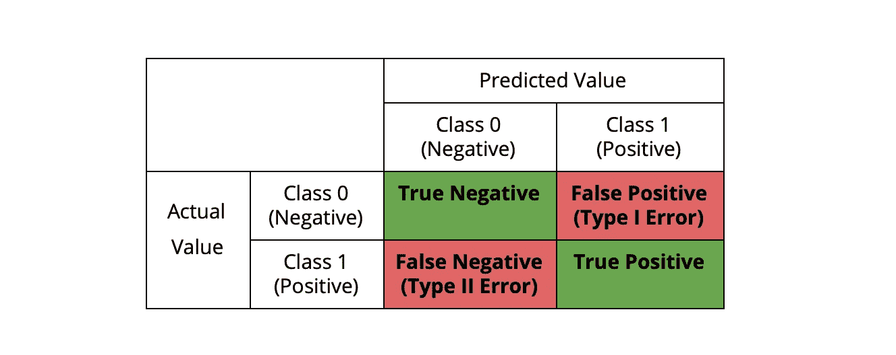
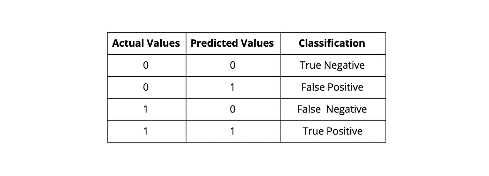
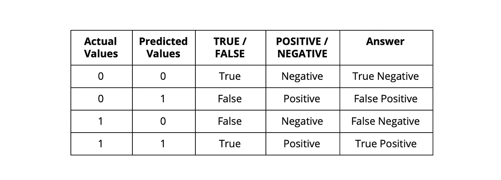
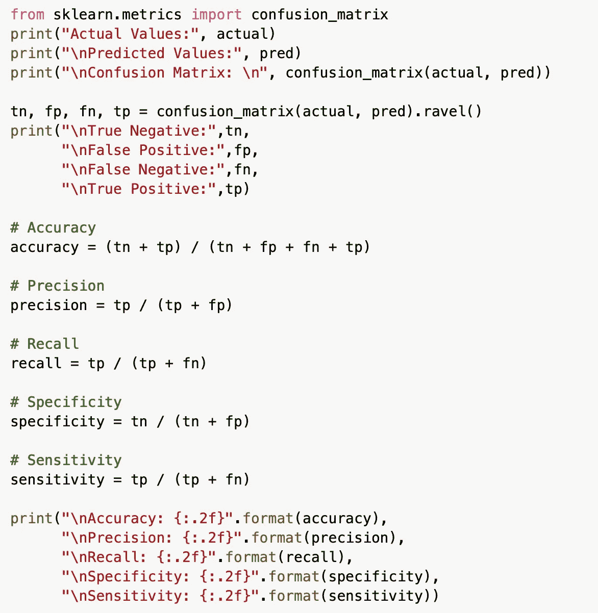
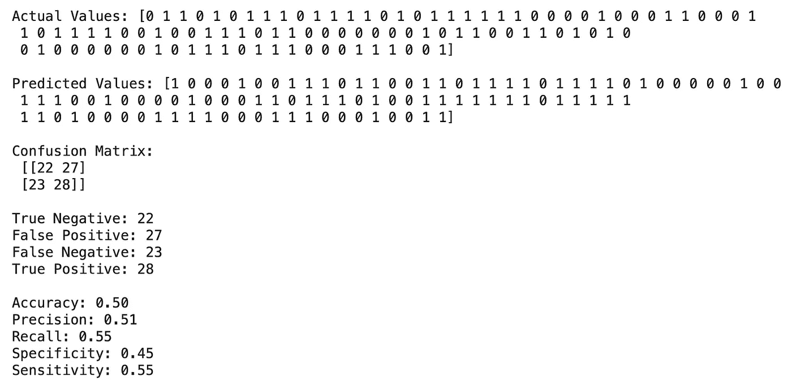

# 从混淆矩阵中消除混淆

> 原文：<https://medium.com/analytics-vidhya/removing-confusion-from-confusion-matrix-bec7d3da8cd9?source=collection_archive---------26----------------------->

# 介绍

顾名思义，混淆矩阵真的很令人困惑(也许这就是它如此命名的原因)。所以在这篇文章中，我将尝试用一些基本的术语和例子来消除你的困惑。所以我们开始吧！

在我们开始理解混淆矩阵之前，让我们先理解混淆矩阵的原因和作用。

## 为什么是混淆矩阵？

混淆矩阵用于分析分类问题的性能(分类问题是目标变量属于分类类别的问题)。它让你对每一个类的表现有一个概念。

## 混淆矩阵是什么？

混淆矩阵是用实际结果和预测结果创建的，以某种方式结合起来，这样我们就知道我们能做好什么，以及预测中哪里出错了。

在行中我们有实际值类，在列中我们有预测值类。通常，混淆矩阵是方阵，即列数总是等于行数。如果没有，您的预测要么是缺少一个现有的类，要么是添加了一些新的类。

让我们举一个简单的例子，一个预测变量有两类，类 0(负类)和类 1(正类)。请注意，有时您的类 0 可能是正类，而类 1 可能是负类。

# **如何解读价值观？**

对于 2×2 矩阵，混淆矩阵有四个可能的值。

*   真阴性(TN)
*   假阳性
*   假阴性(FN)
*   真阳性(TP)

这些我们都会一一了解。但是现在，只需根据位置将每个术语拆分成单独的单词。所以在第一个位置上，我们有单词 TRUE 或 FALSE，在第二个位置上，有正的或负的。我们将分别分析这些术语:

*   **对/错:**我们这里有两个值，预测值和实际值。如果两个值相同，则在第一个位置放置 TRUE，否则放置 false。简单来说，如果实际值和预测值相同，则为真，否则为假→( *实际值=预测值，则为真，否则为假*
*   **正/负:**如果预测类别为 0，则为负，如果预测类别为 1，则为正。因此，如果预测值为 0，则为负，否则为正(注意，如果我们之前假设您只有两个类 0 和 1，并且根据假设，您的类 0 为负，而类 1 为正，则上述情况才成立)→ ( *预测值= 0，则为负，否则为正*)

现在，通过从上述示例中提取不同的行，我们将分别查看每种情况:

## 真阴性(TN)

*   实际值:0
*   预测值:0
*   实际和预测是一样的，所以是真的
*   预测是 0 类，所以为负
*   最终答案:真的没有

## 假阳性

*   实际值:0
*   预测值:1
*   实际和预测不一样，所以是假的
*   预测的是 1 类，所以正
*   最终答案:假阳性

## 假阴性(FN)

*   实际值:1
*   预测值:0
*   实际和预测不一样，所以是假的
*   预测是 0 类，所以为负
*   最终答案:假阴性

## 真阳性(TP)

*   实际值:1
*   预测值:1
*   实际和预测是一样的，所以是真的
*   预测的是 1 类，所以正
*   最终答案:真的肯定

# 要记住不同的比率

## 准确(性)

*   精确度让你知道你能从全部观察值中正确预测出多少个观察值。
*   *公式* →精度= (TP + TN) / (TP + FP + FN + TN)
*   当类别不平衡时很有用

## 精确

*   精度提供了这样一个概念，即您预测为第 1 类或正类的总观察值被正确地预测为第 1 类或正类。
*   *公式* →精度= TP / (TP + FP)

## 回忆

*   回忆提供了这样的思想，即在所有实际上是第 1 类或正类的观察值中，被正确地预测为第 1 类或正类。
*   *公式* →回忆= TP / (TP + FN)

## 特征

*   特异性提供了这样一种思想，即实际上为 0 类或负类的全部观察值被正确地预测为 0 类或负类..
*   *公式* →特异性= TN / (TN + FP)

## 灵敏度

*   敏感和回忆是一样的。它提供了这样的思想，即在所有实际上是第 1 类或正类的观察值中，被正确地预测为第 1 类或正类。
*   *公式* →灵敏度= TP / (TP + FN)

# 示例代码

样本分类矩阵代码

代码输出

# 结论

第一次尝试时看起来很混乱的混乱矩阵其实一点也不混乱。类似的逻辑也可以扩展到更高维度的混淆矩阵。希望这篇文章能帮助你避免将来的困惑。