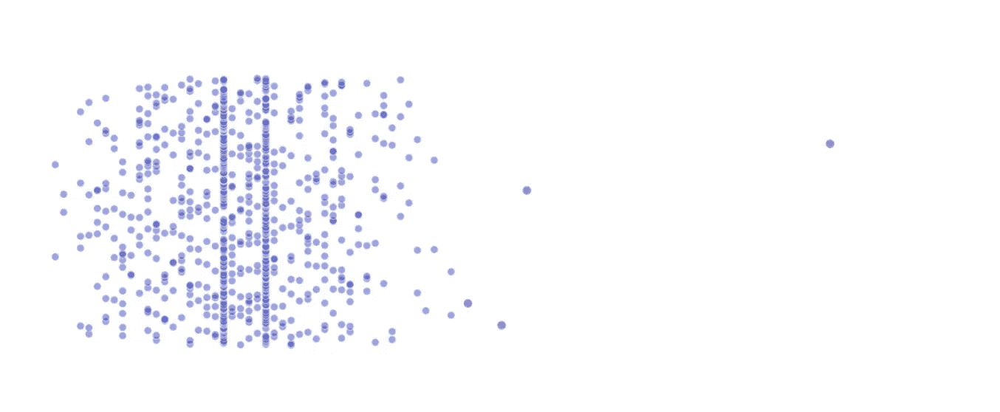
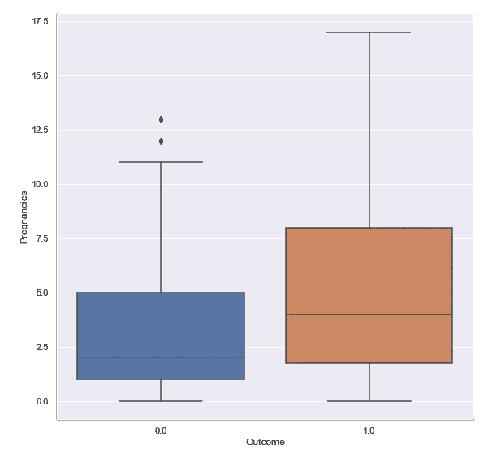
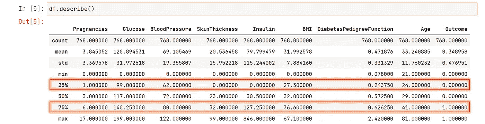
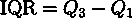
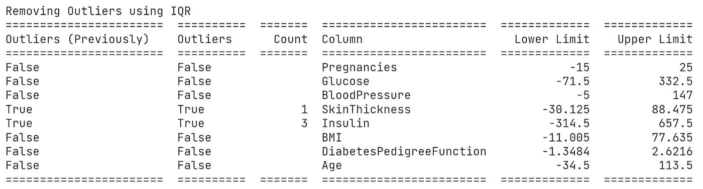
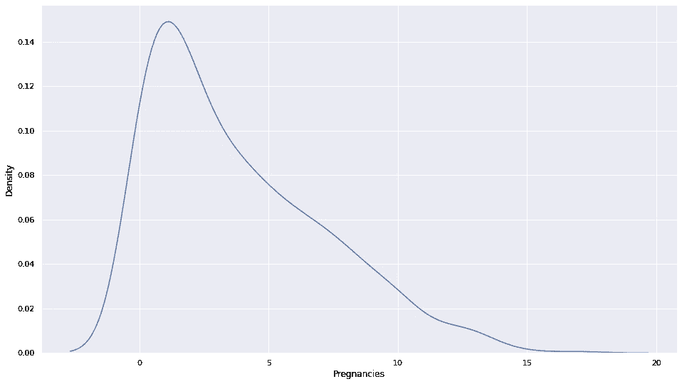
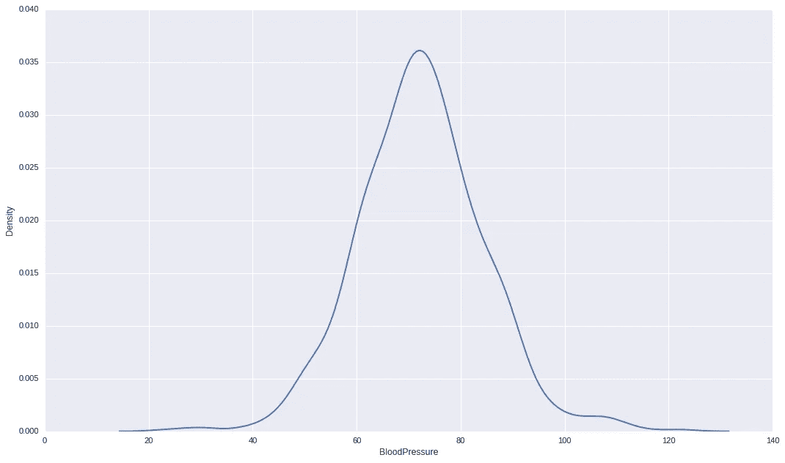
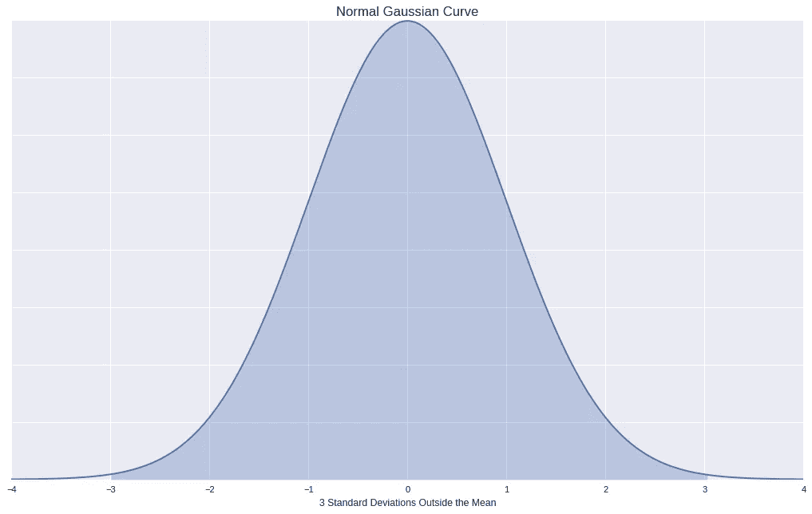
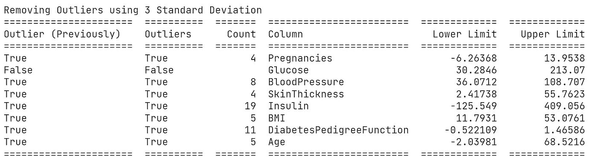
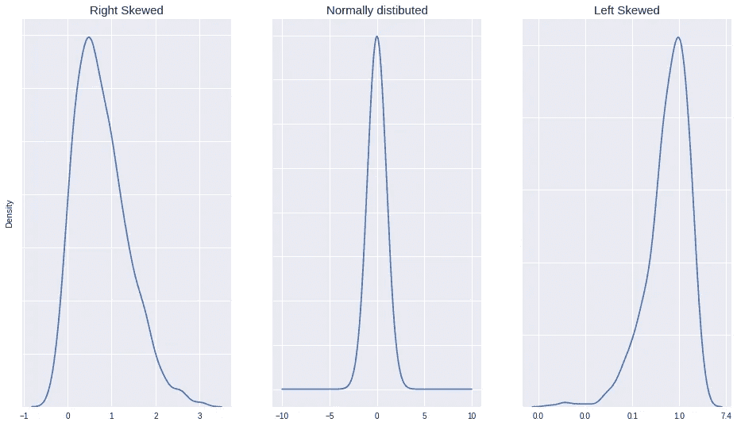

# 移除异常值。理解魔法背后的方式和内容。

> 原文：<https://medium.com/analytics-vidhya/removing-outliers-understanding-how-and-what-behind-the-magic-18a78ab480ff?source=collection_archive---------0----------------------->

## 离群值是数据科学家不想在他们的数据集中看到的最奇怪的东西之一。统计学有答案。

散点图中显示的数据集中的异常值。

## 首先，什么是异常值？

异常值是指与数据集中其他点的距离异常的任何数据。对我们人类来说，看着*的几个值，猜测*异常值是很容易的。

看看这个，你能猜出哪些是异常值吗？

[25, 26, 38, 34, 3, 33, 23, 85, 70, 28, 27]

我的朋友，这里，3，70，85 是异常值。

但是考虑到这一点，作为一名数据科学家，我们可能必须分析包含数千甚至数百万个值的数百个列。而且你会马上得出结论，这种*猜测*的方法就是不可行。

像这样的方框图可能会很方便，但还不够。

一个方框图，用于快速概述一列中的异常值，根据结果标签命名怀孕。

# 接下来有统计数据可以拯救我们

我将讨论两种方法:

1.  一个使用四分位范围。
2.  其次使用标准差。稍后会详细介绍。

# 1.使用四分位距或 IQR 移除异常值

所以，在我们理解这种剔除异常值的方法之前，我的朋友，我们首先需要理解百分位数。

## 什么是百分位数？

> 百分位数表示一组观察值中给定百分比的观察值低于该值。

考虑对包含 100 个值的数据集进行排序，并将其分成 100 等份，现在任何位置的值，比如第 10 个位置的值就是我们的第 10 个百分位，即索引 10 处的值表示 10%的值低于该值。

你可能已经看过这些值了。在哪里？在数据帧的描述方法中。

熊猫数据框架描述方法列出了第 25、50 和 75 百分位。

一旦你理解了百分位数，就很容易理解 IQR 和确定阈值。怎么会？让我们先来看看 IQR。

## 什么是 IQR 的四分位距？

> 当从最低到最高排序时，IQR 描述了值的中间 50%。
> 
> IQR 是第三个四分位数和第一个四分位数之间的差值。

计算四分位距的通用方程

或者换句话说，大部分的价值。为了确定 IQR **，我们需要得到第三个四分位数**和第一个四分位数**。**

## 什么是四分位数？

> 同样，百分位数将数据分成 4 等份。因此，第 25 个百分位数是我们的**第一个四分位数，**第 50 个百分位数是第二个四分位数，第 75 个百分位数是我们的第三个四分位数。

好消息是，计算四分位数并不困难。

在这里，我计算了下限和上限来计算阈值。通常你会看到`th1`和`th3`被替换为`0.05`和`0.95`，以减少被视为离群值的数据量。

现在回到检测异常值，我们现在有下限，上限，以及理解 IQR 和四分位数。

到目前为止，我们遵循了以下步骤:

1.  计算第一和第三个四分位数。
2.  用这些四分位数计算出 IQR。
3.  然后用 IQR 计算出介于两者之间的极限值。

接下来，我们将检查每一列的异常值，并用`replace_with_thresholds_iqr()`中的 limit 替换它们。

通常，下限可能是负值，我们不希望在某些时候用负值替换，如“年龄”或“速度”。我编写这个函数的目的远不止于此，比如首先检查异常值并报告计数，一旦通过`replace = True`就替换，并打印一个漂亮的表格。

使用四分位范围检查异常值。

执行检查，一旦您满意，然后通过`replace=True.`，我们就完成了！

这种方法最适合当你的数据是偏斜的(右偏或左偏)时，比如在我用来演示的这个数据集中，有一列是右偏的。

数据集中“怀孕”的核密度估计图。

# 2.使用标准差去除异常值。

我们可以移除异常值的另一种方式是通过从值的平均值取 3 个标准偏差来计算上边界和下边界(假设数据是正态/高斯分布)。

就像这个例子一样，

数据集中“血压”的核密度估计图。

我们将利用正态分布的一个特殊性质。

正态分布具有这样的性质，

*   数据的 68% 落在[平均值](https://en.wikipedia.org/wiki/Mean)的一个[标准差](https://en.wikipedia.org/wiki/Standard_deviation)内。
*   **95%** 的数据落在平均值的两个标准差内。
*   **99.7%** 的数据落在平均值的三个标准差内。

覆盖平均值第三个标准差的正态分布。

使用此属性，如果采用第三个标准差(或者您可以使用第二个标准差增加预期的异常值),我们可以预期有 99.7%的值是正常的。).

在这里，我只是通过在平均值上加上和减去 3 个标准差来创建上下边界。

使用这个，我们现在可以像以前一样删除异常值。但是现在记住调用这个新函数。

使用标准差检查异常值。

就像以前一样，一旦我们满意地通过`replace=True`，离群值就会消失。

> **注意**:在两个例子中，我都传递了所有的列**，这并不总是必需的/合适的。**

# 我应该选择哪一个？

理想情况下， **IQR 方法是** **最适合于****(左侧或右侧)倾斜的数据集(您可以通过绘制直方图或内核密度估计图来检查它们是否倾斜)。**但是您需要通过检查下限和上限来检查极限值**。**

**否则，如前所述，当数据呈正态分布(这种情况很常见)时，使用标准差来检测异常值。**

****

**右偏、正态/对称、左偏分布**

# **我是谁？**

**我是阿努拉格·达泽·✌.终身学习者，对机器学习充满热情。每天都在成长。**

**如果你喜欢这个帖子，请点击“鼓掌”按钮！关注我，分享我的旅程，你也可以在 Twitter**|**[**LinkedIn**|](https://www.linkedin.com/in/anuragdhadse/)[|**Github**](https://github.com/adhadse)**上联系我。****