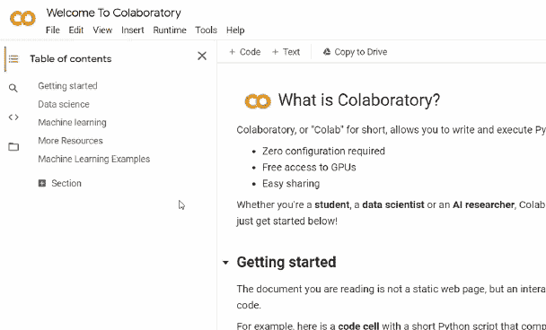
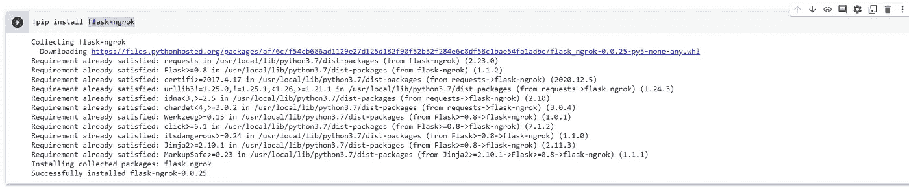
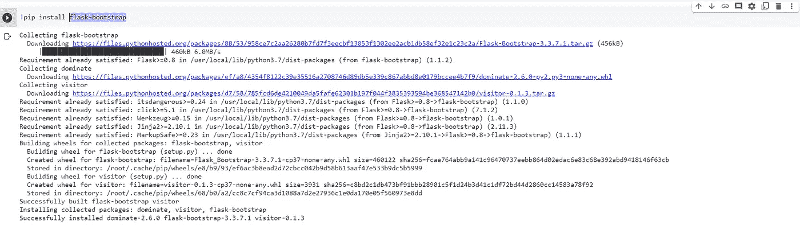
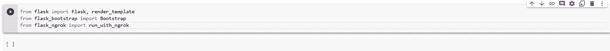
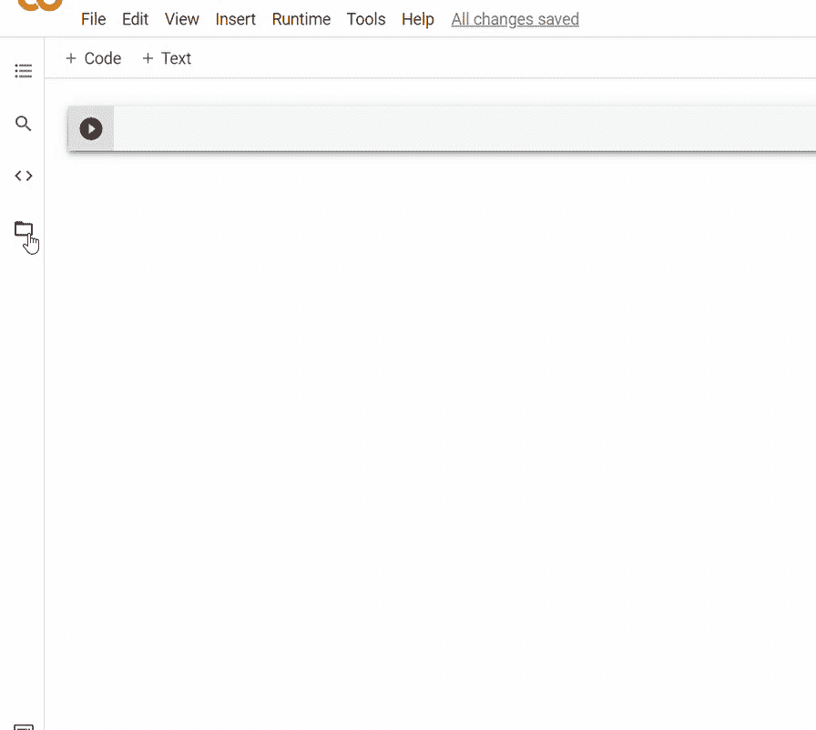
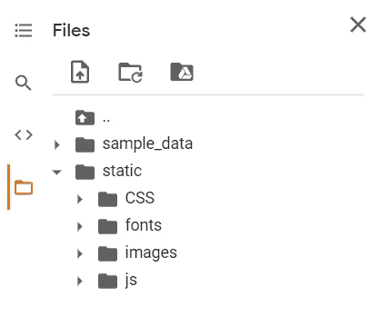
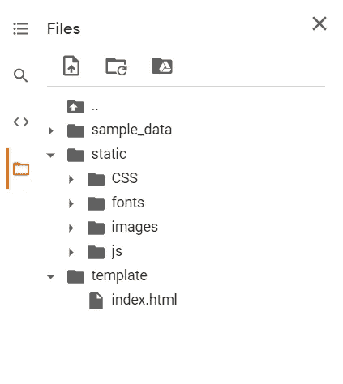
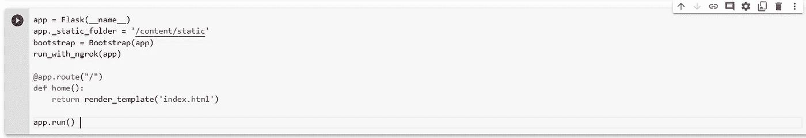

# 在 Google Colab 上呈现 HTML 模板

> 原文：<https://medium.com/analytics-vidhya/render-html-template-on-google-colab-1532763234e3?source=collection_archive---------3----------------------->

HTML(超文本标记语言)是定义网页及其内容如何组织的代码。例如，可以使用段落序列、项目符号列表或照片和数据表来安排内容。

Python 的 **Flask** API 帮助我们创建 web 应用程序。Web 应用程序框架是模块和库的集合，允许程序员构建应用程序，而不必编写包括协议和线程管理在内的低级代码。

下面我们将看看如何使用 flask 来呈现一个 HTML 模板。

1.  打开 Google Colab，在里面新建一个笔记本。

2.然后，安装 flask-ngrok。因为 google colab 提供了虚拟机，所以我们不能访问本地主机。因此，我们将使用 flask web 应用程序通过 **ngrok 访问一个公共 URL。**

3.安装 flask-bootstrap(可选)

4.从 flask 中导入所有需要的文件，如下所示。

5.在 Google Colab 的 Files 目录下创建一个名为“static”的文件夹。将所有必要的 CSS、JS、字体和图像文件夹上传到该文件夹。

6.在 Files 目录下创建另一个名为“template”的文件夹。然后，上传所需的。html 文件来呈现。

7.运行以下代码来呈现 html 模板。

8.单击 ngrok 的安全 URL，在另一个选项卡中查看您的 web 应用程序。

***注意:-*** *在运行代码之前，请确保所有的 CSS、js、字体和图片文件的源文件路径在。html 文件。*