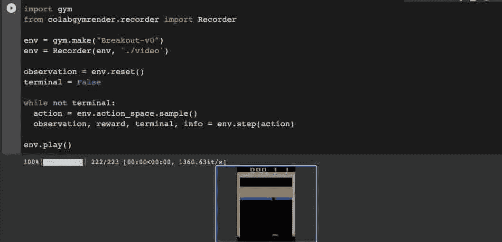

# 在 Google Colab 中渲染开放的人工智能健身房环境

> 原文：<https://medium.com/analytics-vidhya/rendering-openai-gym-environments-in-google-colab-9df4e7d6f99f?source=collection_archive---------1----------------------->



使用 colabgymrender 在 Google Colab 中呈现 Breakout-v0

我已经在 [Google Colab](https://colab.research.google.com/) 中发布了一个用于渲染你的`[gym](https://gym.openai.com/envs/#classic_control)`环境的模块。因为 Colab 运行在 VM 实例上，而 VM 实例不包含任何类型的显示器，所以在笔记本中进行渲染是很困难的。在浏览了各种方法之后，我发现使用`[moviepy](https://pypi.org/project/moviepy/)`库最适合在 Colab 中呈现视频。因此，我为此构建了一个包装类，名为`[colabgymrender](https://github.com/Ryan-Rudes/colabgymrender)`。

# 装置

```
apt-get install -y xvfb python-opengl ffmpeg > /dev/null 2>&1
pip install -U colabgymrender
```

# 例子

# 输出

Qbert-v0

# 使用

在`Recorder`对象中包装一个健身房环境。

```
env = gym.make("CartPole-v0")
env = Recorder(env, <directory>, <fps>)
```

如果您通过<fps>指定帧速率，发布到<directory>的视频将采用该帧速率。否则，环境将检查由环境本身在`env.metadata['video.frames_per_second']`中指定的默认帧速率。如果都没有找到，帧速率将默认为 30。</directory></fps>

您可以使用`env.pause()`和`env.resume()`暂停或恢复录制，但请确保在调用`env.play()`之前`env.resume()`至少录制一帧。否则，当你试图播放一个没有记录任何帧的视频时，你会得到一个错误。

录制时，每次环境达到终端状态，视频会自动发布到<directory>。不需要手动释放录像。这提供了易用性，而不必手动控制记录器的操作。只需录制一集(或一集的一部分)，然后播放内容。</directory>

# 更多示例

Pong-v0

钢管-v0

突破-v0

链接:

*   [GitHub](https://github.com/Ryan-Rudes/colabgymrender/tree/v1.0.3)
*   [PyPi](https://pypi.org/project/colabgymrender/)