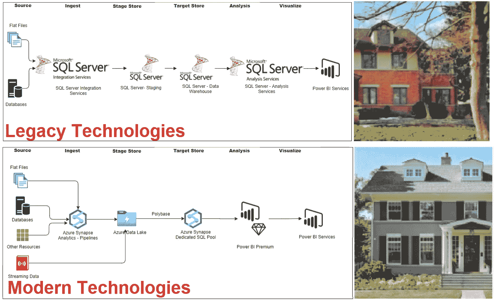
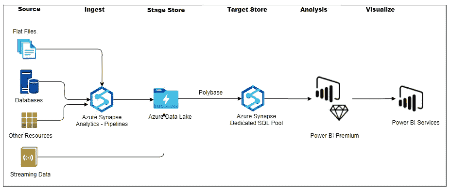
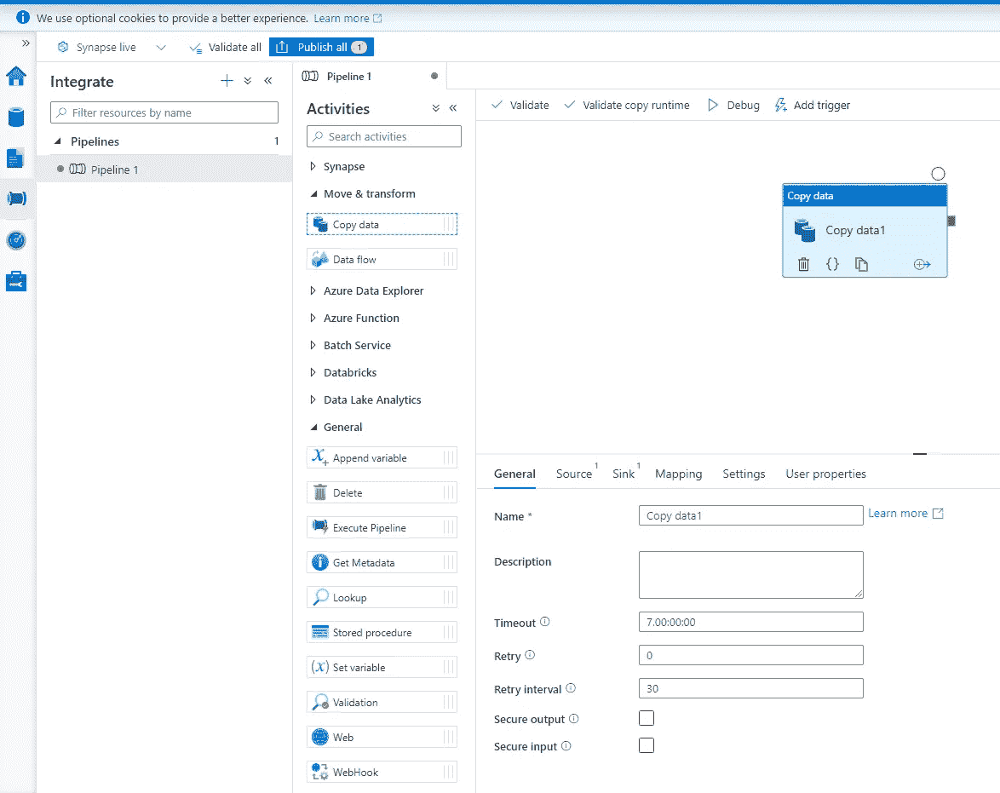
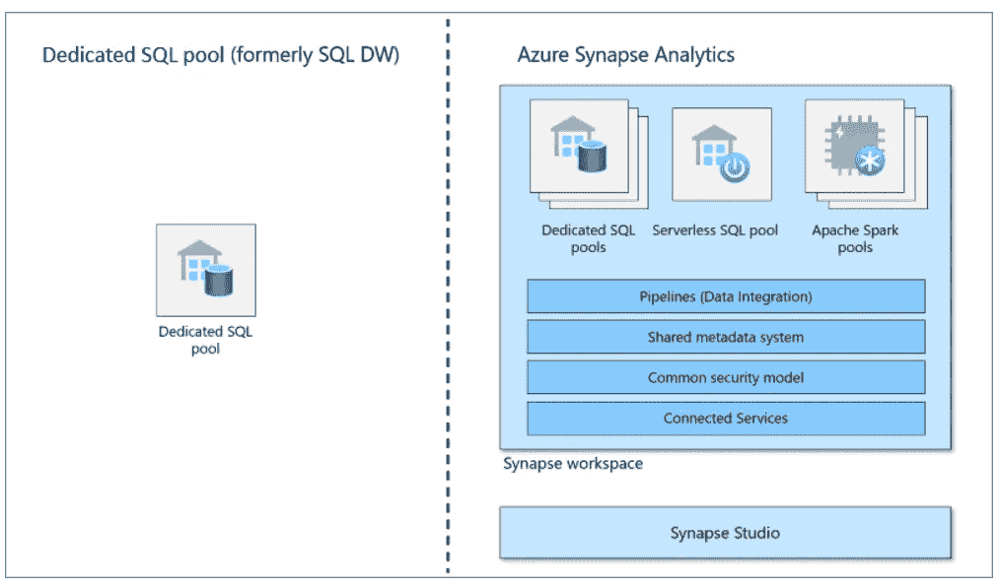
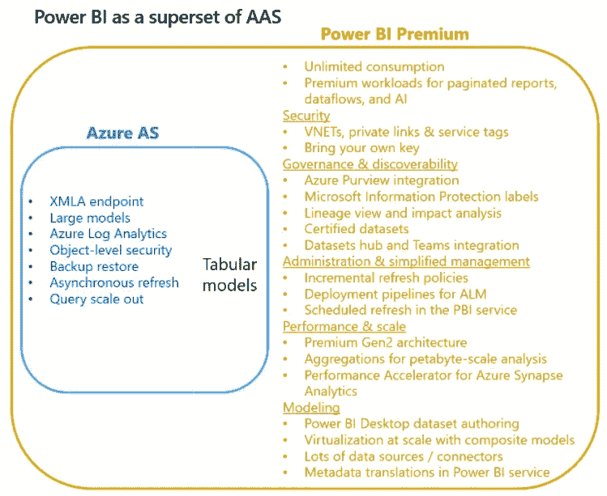
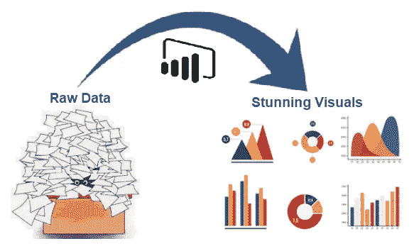

# 借助 Azure Synapse Analytics 和 Power BI Premium 革新您的商业智能(BI)平台

> 原文：<https://medium.com/analytics-vidhya/renovate-your-business-intelligence-bi-platform-with-azure-synapse-analytics-and-power-bi-premium-8f9e4702016f?source=collection_archive---------6----------------------->

在我之前的博客中，我讨论了现代商业智能(BI)架构的概念。现在让我们讨论一下如何使用 Azure Synapse 和 Power BI premium 来改造您的企业 BI 平台。

在这个竞争激烈的数字世界中，技术发展非常迅速，因此公司必须时刻了解这些技术进步，并对其 it 平台进行现代化改造，以便在市场中长期立足。(我们有许多公司未能创新并导致失败的例子..像柯达，诺基亚..等等)

那么，您准备好改造您的数据平台了吗？？？？？？？？？？？？？？？？

让我们看看 Azure Synapse 和 Power BI 为改造传统商业智能(BI)平台提供了什么

众所周知，Azure Synapse Analytics 是一个统一的平台，它将数据集成、企业数据仓库和大数据分析结合在一起，提供统一的体验来摄取、探索、准备、管理和提供数据，以满足即时的 BI 和机器学习需求。

另一方面，Power BI Premium 为自助服务和企业 BI 解决方案提供了最丰富的功能。

上面的架构图显示了企业 bi 解决方案现代化过程中涉及的各个阶段和相应的 azure synapse ad power bi 服务。让我们分别来看看它们

**来源**:在撰写本文时，Azure Synapse 支持 90 多个数据源，并且这个列表还在继续增长。

**摄取** : Azure Synapse 能够处理海量的关系型(结构化)和非关系型(半结构化和非结构化)数据。它集成了与 Azure Data Factory 相同的数据集成引擎，允许我们在不离开 Azure Synapse 工作区的情况下创建丰富的大规模提取-转换-加载(ETL)管道。编排笔记本、spark 作业、存储过程以及 SQL 脚本。创建数据驱动的工作流，以协调和自动化数据移动和转换

数据集成管道

**Stage Store:**Azure Data Lake 用于暂存源数据，它从一开始就旨在为数 Pb 的信息提供服务，同时保持数百 GB 的吞吐量，Data Lake Storage 允许您轻松管理大量数据，接收它们，使用 SQL 执行分析，并创建可视化表示。

此外，使用与构建数据仓库解决方案相同的服务，轻松查询数据湖中的文件。

**Polybase** 是一种使用 Transact-SQL 语言访问存储在 **Azure** Data Lake Store 中的外部数据的技术。这是将数据加载到一个 **Azure Synapse** SQL 池中最具扩展性和最快的方式。不需要将数据复制到 SQL 池中就可以访问它

**目标存储:**专用 SQL 池(SQL DWH)是目标存储库，数据存储在具有列存储的关系表中。众所周知，列存储是一种非常有效的数据存储方式，可以降低数据存储成本，提高查询性能。一旦存储了数据，您就可以进行大规模的分析。与传统的数据库系统相比，分析查询可以在几秒钟内完成，而不是几分钟或几小时，而不是几天。

专用 SQL 池

**分析** : Power BI Premium 为自助服务和企业 BI 解决方案提供了最丰富的功能。( *Azure Analysis Services 也是企业 BI 解决方案的一个选项*)

Power BI Premium 是企业 BI 的焦点，与 Azure Analysis Services 相比，它将提供功能的超集。因此，请考虑为您的企业模型使用 Power BI Premium

Ref: [电力 BI 博客](https://powerbi.microsoft.com/en-us/blog/power-bi-as-a-superset-of-azure-analysis-services/)

**可视化:** Power BI 将数据转化为丰富的视觉效果，让您可以专注于对自己重要的事情。了解最新动态，及时发现趋势，推动您的业务进一步发展。

我希望你喜欢读这篇文章，在我的下一篇文章中再见，直到那时保持安全和健康。

