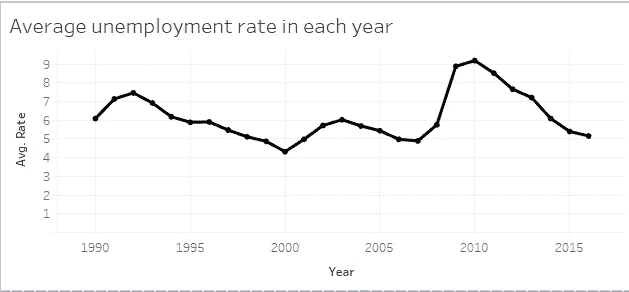
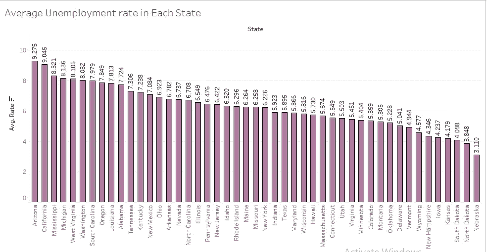
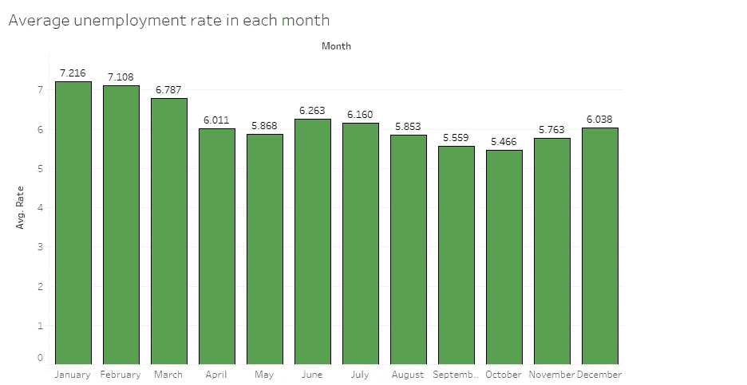
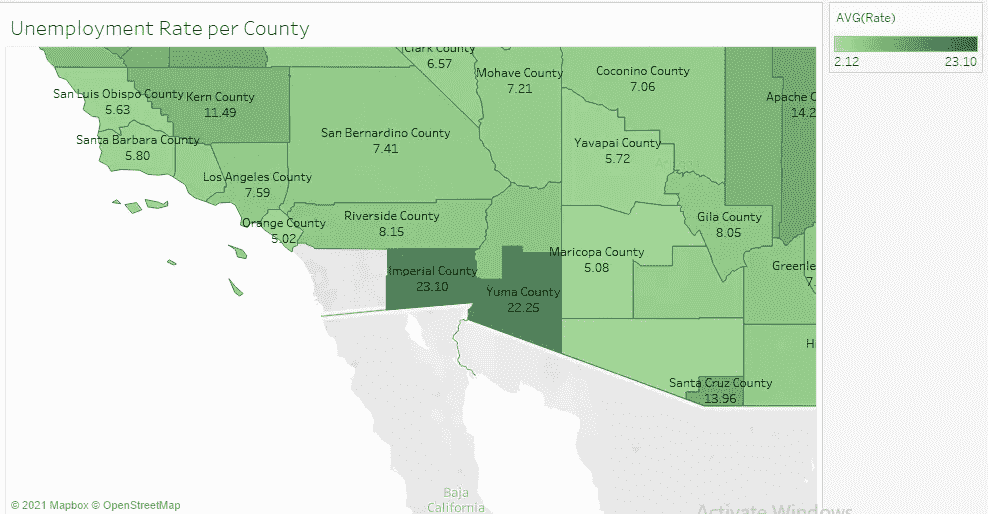

# 1990 年至 2016 年美国各县失业报告分析

> 原文：<https://medium.com/analytics-vidhya/report-analysis-on-the-us-unemployment-by-county-from-1990-to-2016-22827db92b0c?source=collection_archive---------14----------------------->

照片由[西格蒙德](https://unsplash.com/@sigmund?utm_source=unsplash&utm_medium=referral&utm_content=creditCopyText)在 [Unsplash](https://unsplash.com/s/photos/data-analysis?utm_source=unsplash&utm_medium=referral&utm_content=creditCopyText) 上拍摄

美国的失业者是指没有工作的劳动力。本文对美国 1990 年至 2016 年的失业率进行了报告分析。用于该分析的数据集在这里获得[。该数据集包含从 1990 年到 2016 年不同月份美国 47 个州不同县的失业率(百分比)。](https://www.kaggle.com/jayrav13/unemployment-by-county-us)

这一分析解决了四个关键问题

1.  从 1990 年到 2016 年，美国失业率的趋势是什么？
2.  哪个州的失业率最高，为什么？
3.  人们在一年中的哪几个月最容易失业？
4.  哪些县的失业率最高，为什么？

【1990 年至 2016 年美国失业率趋势

1990 年至 2016 年美国失业率

该统计数据显示了美国从 1990 年到 2016 年的平均失业率。1990 年，这一比率为 6.0%。1990 年美国有 700 多万人失业。2016 年，平均失业率为 5.1%，仍有 700 多万人失业。1990 年至 2016 年间，失业率没有太大改善。[来源](https://www.statista.com/statistics/193254/unemployment-level-in-the-us-since-1990/)

原因是美国的失业率随着经济进入和走出衰退而上下波动。2007 年 12 月，美国开始大衰退，并持续到 2009 年。失业率最显著的增长出现在 2008 年至 2009 年，并在 2010 年达到顶峰。2009 年，由于经济衰退，许多公司解雇了大量工人。在这里阅读更多。

**各州失业率**

下图显示了数据集中记录的 47 个州的失业率

图:各州平均失业率

失业率最高的州是亚利桑那州，平均为 9.3%，最低的是内布拉斯加州，平均为 3.1%。

亚利桑那州失业率最高是由于该州劳动力不断增长，因为过去几年越来越多的人不断涌入该州，自 2013 年以来，创纪录的 49 万人(约为南达科他州人口的一半)涌入亚利桑那州，而该州没有创造足够的就业机会来跟上这一步伐。点击此处阅读更多信息[https://www . az mirror . com/2019/07/18/Arizona-has-high-of-loss-than-us-but-good-reasons/](https://www.azmirror.com/2019/07/18/arizona-has-higher-unemployment-than-us-but-for-good-reasons/)。

**建议**:我认为解决这个问题的众多方法之一是通过州政府的财政援助鼓励居民为自己创造就业机会。

**各月失业率**

每月平均失业率

这项统计显示了从一月到十二月的平均失业率。1 月份的失业率为 7.2%，2 月份为 7.1%，3 月份为 6.7%，12 月份为 6.0%。

这表明人们在这几个月大多失业。这是由于公司在生产年度结束时解雇工人。

**建议:**通过促进对雇员的短期补偿，可以为人们提供工作保障。这将有助于保住人们的工作。

**各县失业率**

显示各县失业率的地图

失业率最高的县是加利福尼亚州的帝国县，失业率为 23.10%。其次是亚利桑那州的尤马县，患病率为 22.25%。

帝国县和尤马县都因其农业遗产(农业、养牛和饲料工业)而闻名。见[此处](https://imperialcounty.org/)和[此处](https://www.yumacountyaz.gov/visitors/about-the-county#:~:text=Farming%2C%20cattle%20raising%2C%20tourism%2C,the%20Yuma%20Crossing%20Historic%20Park.)。这表明两个县的就业率受到季节变化的影响，因为夏季气温上升导致干旱，农业生产放缓。这最终导致该州依赖农业的公司(如食品行业和零售商)失去业务，而工人则被解雇。

这两个县在地图上被一条州界线分开，否则尤马县也会位于加利福尼亚，因此它们有共同的相似之处。

**建议:**我认为解决这个问题的许多方法之一是在两个县建立更多的非农业联合产业。

**结论**

经济衰退仍然是美国失业的主要原因。失业的其他原因包括自动化技术的实施取代了劳动力中的人，移民政策影响了进入美国的工人的性质和数量等。

感谢您的阅读。