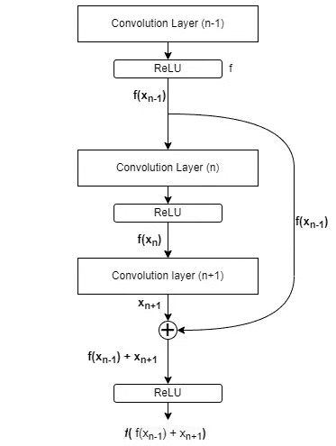
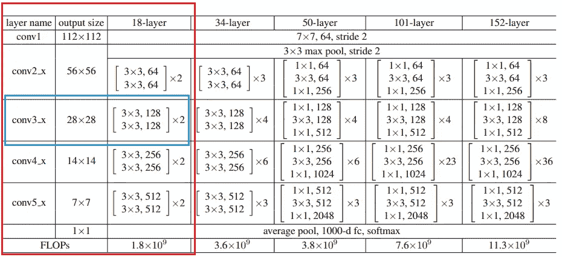
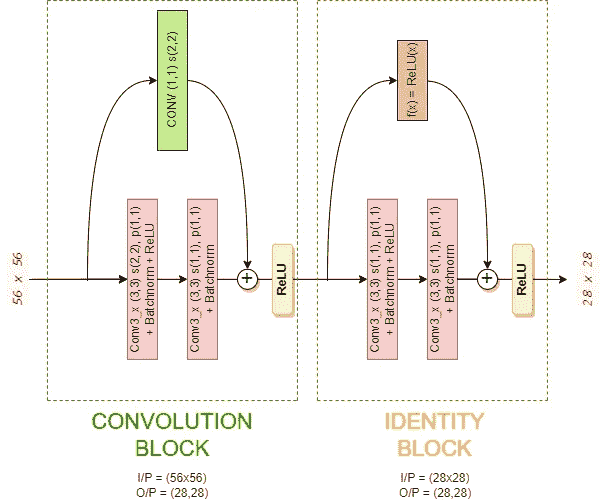

# ResNet —了解并从头开始实施

> 原文：<https://medium.com/analytics-vidhya/resnet-understand-and-implement-from-scratch-d0eb9725e0db?source=collection_archive---------0----------------------->

人们在使用 CNN 时一定遇到过 ResNets，或者至少听说过它，我们确实知道 ResNets 在大多数计算机视觉任务中表现很好，但是当我们已经有其他性能良好的架构时，为什么还需要这样的架构呢？为了回答这个问题，让我们了解 Resnets 之前使用的其他深度神经网络架构的缺点。

我们认为神经网络越深，性能越好，但当研究人员用更深的神经网络进行实验时，发现向深度网络添加更多层并不总是增加其性能，而是降低其性能，这是由于非常深的神经网络中的消失梯度。因此，有人提出，向深度神经网络添加更多层应该提高其性能或保持不变，但绝不应该降低性能。为了实现这一点，他们提出了跳过连接/剩余连接的概念，通过使用这一概念，我们可以避免信息流的丢失。让我们了解一下什么是跳过连接。

# **跳过连接/剩余连接**

跳过/剩余连接从 *(n-1)ᵗʰ* 卷积层获取激活，并将其添加到 *(n+1)ᵗʰ* 层的卷积输出，然后对该和应用 ReLU，从而跳过 *nᵗʰ* 层。

下图解释了跳过连接的工作原理。(这里我用 f(x)来表示应用在 x 上的 Relu，其中 x 是应用卷积运算后的输出)。

但这有什么帮助呢，简而言之，如果 *nᵗʰ* 层没有学到任何东西，那么我们不会丢失任何信息，因为在 *(n+1)ᵗʰ* )我们在向前移动时也在使用 *(n-1)ᵗʰ* 层的输出，然后对这个总和应用激活。

因此，如果网络不提供任何有用的信息或者根本不提供任何信息(即 0 ),我们使网络能够跳过其间的一次 ReLU 激活，并且网络将使用先前的信息，从而保持一致的性能。无论如何，如果两层都提供了重要的信息，那么拥有先前的信息无论如何都会提高性能。

# **ResNet-18 实施**

为了简单起见，我们将实现 Resent-18，因为它有较少的层，我们将在 PyTorch 中实现它，并将使用 Batchnormalization、Maxpool 和 Dropout 层。

下面是取自研究论文——图像识别的深度残差学习【链接到论文[】的 Resnet-18 的架构和层配置。](https://arxiv.org/abs/1512.03385)

直接摘自《图像识别的深度残差学习》一文的 ResNets 架构

让我们选择 Conv3_x 模块，并尝试了解其内部的情况。让我们用卷积和单位块来理解这一点。

**Conv3_x 使用卷积和标识块实现数据流**

上图详细说明了 56x56 图像如何在 Conv3_x 模块中传播，现在我们来看看图像如何在这些模块中的每一步进行变换。

# 卷积块

Conv3_x 模块的输入是具有 64 个通道的 shape (56x56)图像，第一个卷积层使用 3x3 内核和具有 1x1 填充的 2x2 跨距将图像转换为具有 128 个通道的(28x28)图像，并对其应用 ReLU。第二卷积层以此图像为输入，输出相同形状的图像(28x28x128)。现在，为了应用残差/跳过连接，我们必须将 Conv2_x 模块的输出(56x56x64)与第二个卷积的输出(28x28x128)相加，为此，我们需要将 Conv2_x 输出转换为(28x28x128)，这是通过应用另一个具有 1x1 滤波器和 2x2 跨距的卷积来实现的，输入通道为 64，输出通道为 128。

简而言之，卷积模块负责使用卷积运算转换一个模块的输出，以便可以有效地将其与另一个卷积模块的输出相加。

添加完成后，激活(ReLU)被应用于其输出，并被发送到标识块。

# 身份块

单位块的输入和输出是相同的，因此为了应用剩余/跳过连接，我们不需要对卷积块的输出应用任何变换。因此，要应用 Skip/Residual 连接，我们只需将卷积模块的输出与 Conv3_x 模块中第四个卷积层的输出相加，然后对其应用 ReLU。

我们现在知道，每当需要调整输出以使应用残差连接成为可能时，我们就需要卷积模块，每当输入和输出相同时，我们就需要恒等模块。

# 使用 Pytorch 实现 ResNet-18

让我们定义一个实现 ResNet18 模型的类，模型配置和流将在 __init__()函数中定义，前向传播将在 forward()函数中定义。

ResNet-18 Pytorch 实现

现在让我们了解一下上面代码中的#BLOCK3 (Conv3_x)发生了什么。

1.  块 3 从块 2 的输出“op2”获得输入，该输入将是形状为(56×56×64)的图像，对其应用卷积运算，其核大小为 3×3，跨距为(2，2)，填充为(1，1)，并输出形状为(28×28×128)的图像，注意，这里跨距为 2 负责减小图像大小，现在对该输出应用 Batchnormaliztion 和 ReLU。
2.  下一层也是卷积层，但这次它有参数(内核大小(3x3)，填充(1，1)和步幅(1，1))，这些参数不会减小图像大小并保持不变，因此输出(28x28x128)图像，然后对其应用 Batchnorm，让我们将此输出表示为“x”，现在如果查看 forward()函数中的 Block-3，可以看到在对“x”应用 ReLU 操作之前， 我们对“op2”应用卷积运算，这是块 2 的输出(调整 op2 的大小以匹配当前输出)，将其添加到“x ”,然后应用 ReLU。 至此，我们已经使用卷积模块成功实现了跳过连接。让我们将该输出表示为 op3_1。
3.  既然我们已经使用了卷积块，并且基于块-3 的模型架构和输出，图像形状和大小在块-3 中将不再改变，因此我们现在将使用标识块作为块-3 的剩余一半。
4.  我们可以看到，在正向函数中，我们应用了 Conv → Batchnorm → ReLU，然后是 Conv → Batchnorm，我们得到了输出 x，然后我们只需将卷积模块的输出“op3_1”与 x 相加，然后对其应用 ReLU。注意，在整个标识块中，图像大小保持不变。
5.  类似地，我们也可以创建所有其他块，唯一的例外是块 2，其中图像大小在卷积块中甚至没有减小。这可以直接实现，或者我们甚至可以使用与 stride (1，1)的卷积运算。
6.  对于输入层，我们使用 Conv → Batchnorm → Maxpool，其中卷积内核大小为 7x7，步长为 2，填充为 3，这将输入图像大小从(224x224x3)更改为(112x112x64)，然后 Maxpool 将其大小更改为(56x56x64)。
7.  对于输出/分类层，我们使用完全连接的层，但在此之前，我们对 Block5 的输出应用平均池化操作，它将处于形状(7x7x512)，使用 7x7 过滤器大小和跨距 1，将图像大小减小到(1x1x512)，然后我们对该输出进行整形/展平，以便它可以由完全连接的层使用。

很好，现在你知道了我们如何实现 ResNet， ***注意，我们可以为卷积和单位块创建函数，并多次调用它们，从而非常容易地创建更深层次的 ResNet 架构，而不是单独创建每个块。***

实现后，我们可以直接创建这个类的对象，传递数据集的输出类的数量，并使用它在任何图像数据上训练我们的网络。

请访问以下链接，查看使用上述类构建 ResNet-18 模型的完整代码，并使用 PyTorch 对胸部 X 射线图像数据集进行训练，以对一个人是否患有肺炎进行分类。

 [## ResNet18 从零开始- Pytorch

### 使用 Kaggle 笔记本电脑探索和运行机器学习代码|使用来自胸部 x 光图像的数据

www.kaggle.com](https://www.kaggle.com/modojj/resnet18-from-scratch-pytorch)