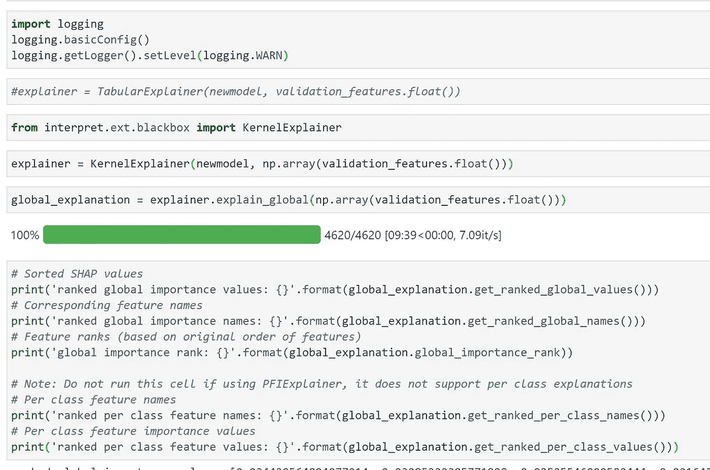
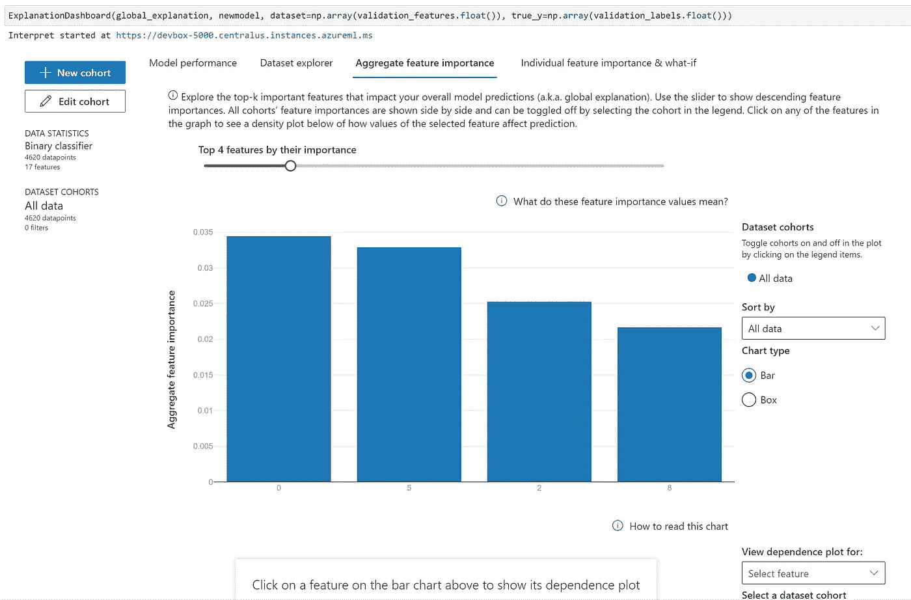
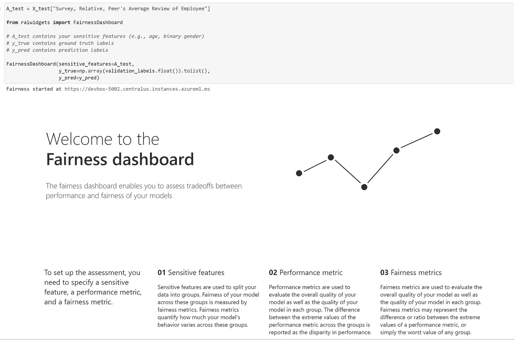
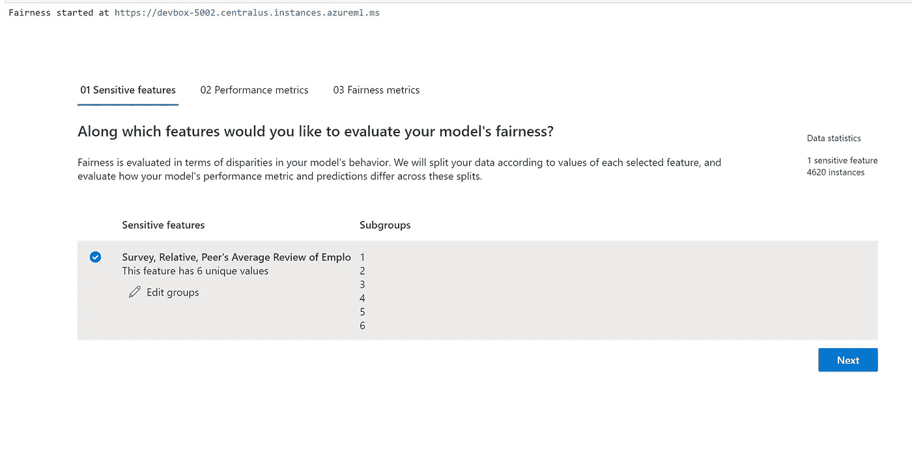
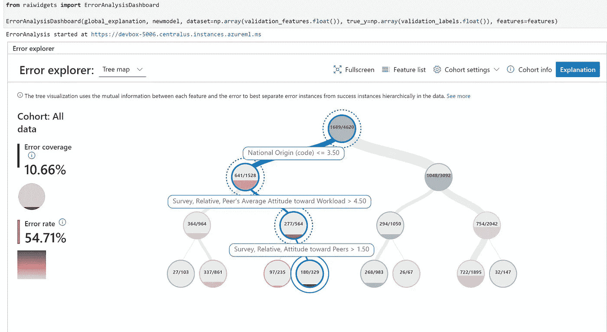

# pytorch 模型的负责任的人工智能工具包

> 原文：<https://medium.com/analytics-vidhya/responsible-ai-toolkit-for-pytorch-models-c1b827c6cfed?source=collection_archive---------5----------------------->

# 使用 pytorch 的数据工程和建模

# 数据工程过程

注意:这只是一个样本演示数据(根本不是真实的)。这里的目的是展示示例代码和逻辑

# 密码

*   为表格数据集编写 pytorch 代码
*   导入库

```
import torch
from torch.utils.data import Dataset
from torchvision import datasets
from torchvision.transforms import ToTensor
import matplotlib.pyplot as pltimport os
import torch
from torch import nn
from torch.utils.data import DataLoader
from torchvision import datasets, transformsprint(torch.__version__)import pandas as pd
import seaborn as snpd.set_option('display.max_columns', None)
pd.set_option('display.max_rows', None)df = pd.read_csv('Sample_IssueDataset.csv')df.head()df1 = pd.get_dummies(df)df1.head()y = df1.iloc[:,1]
X = df1.iloc[:,:18]X = X.drop(columns=['EmployeeLeft'])from sklearn.model_selection import train_test_splitX_train, X_test, y_train, y_test = train_test_split(X, y, test_size=0.33, random_state=42)X_train_torch = torch.tensor(X_train.values)
X_test_torch = torch.tensor(X_test.values)
y_train_torch = torch.tensor(y_train.values)
y_test_torch = torch.tensor(y_test.values)device = 'cuda' if torch.cuda.is_available() else 'cpu'
print('Using {} device'.format(device))class NeuralNetwork(nn.Module):
    def __init__(self):
        super(NeuralNetwork, self).__init__()
        self.flatten = nn.Flatten()
        self.linear_relu_stack = nn.Sequential(
            nn.Linear(9380*17, 10),
            nn.ReLU(),
            #nn.Linear(9380*17, 10),
            #nn.ReLU(),
            nn.Linear(9380*17, 10),
        ) def forward(self, x):
        x = self.flatten(x)
        logits = self.linear_relu_stack(x)
        return logitsmodel = NeuralNetwork().to(device)
print(model)print("Model structure: ", model, "\n\n")for name, param in model.named_parameters():
    print(f"Layer: {name} | Size: {param.size()} | Values : {param[:2]} \n")import torch

train_features = torch.tensor(X_train.to_numpy())
train_labels = torch.tensor(y_train.to_numpy())

validation_features = torch.tensor(X_test.to_numpy())
validation_labels = torch.tensor(y_test.to_numpy())n_features = X_train.shape[1]
# 31
model = torch.nn.Sequential(torch.nn.Linear(n_features, 18),
                            torch.nn.ReLU(),
                            torch.nn.Linear(18, 1),
                            torch.nn.Sigmoid())criterion = torch.nn.BCELoss()

optimizer = torch.optim.Adam(model.parameters(), lr=0.0001, weight_decay=0.001)X_train_torch.shape
y_train_torch.shapen_batches = 2
train_features_batched = train_features.reshape(n_batches,
                                               int(train_features.shape[0]/n_batches),
                                               train_features.shape[1])
train_labels_batched = train_labels.reshape(n_batches,
                                            int(train_labels.shape[0]/n_batches))n_epochs = 100
loss_list = []
validate_loss_list = []

for epoch in range(n_epochs):
    for batch_idx in range(n_batches):
        optimizer.zero_grad()

        outputs = model(train_features_batched[batch_idx].float())

        loss = criterion(outputs.flatten().float(),
                         train_labels_batched[batch_idx].float())

        loss.backward()

        optimizer.step()

    outputs = model(train_features.float())

    validation_outputs = model(validation_features.float())

    loss = criterion(outputs.flatten().float(),
                     train_labels.float())

    validate_loss = criterion(validation_outputs.flatten().float(),
                              validation_labels.float())

    loss_list.append(loss.item())

    validate_loss_list.append(validate_loss)

print('Finished Training')

import matplotlib.pyplot as plt
plt.plot(loss_list, linewidth=3)
plt.plot(validate_loss_list, linewidth=3)
plt.legend(("Training Loss", "Validation Loss"))
plt.xlabel("Epoch")
plt.ylabel("BCE Loss")y_pred = model(validation_features[1].flatten().float())
print(y_pred)import matplotlib.pyplot as plt
import numpy as nptype(validation_features.flatten().float())model.eval()y_pred = model(validation_features[0].flatten().float())len(y_pred)len(validation_features[0].flatten().float())model.train()
epochs = 5
errors = []
for epoch in range(epochs):
    optimizer.zero_grad()
    # Forward pass
    y_pred = model(train_features.float())
    # Compute Loss
    loss = criterion(y_pred.squeeze(), train_labels.float())
    errors.append(loss.item())
    print('Epoch {}: train loss: {}'.format(epoch, loss.item()))
    # Backward pass
    loss.backward()
    optimizer.step()model.train()
epochs = 500
errors = []
for epoch in range(epochs):
    optimizer.zero_grad()
    # Forward pass
    y_pred = model(validation_features.float())
    # Compute Loss
    loss = criterion(y_pred.squeeze(), validation_labels.float())
    errors.append(loss.item())
    print('Epoch {}: train loss: {}'.format(epoch, loss.item()))
    # Backward pass
    loss.backward()
    optimizer.step()import matplotlib.pyplot as plt
import numpy as np
def plotcharts(errors):
    errors = np.array(errors)
    plt.figure(figsize=(12, 5))
    graf02 = plt.subplot(1, 2, 1) # nrows, ncols, index
    graf02.set_title('Errors')
    plt.plot(errors, '-')
    plt.xlabel('Epochs')
    graf03 = plt.subplot(1, 2, 2)
    graf03.set_title('Tests')
    a = plt.plot(train_labels.numpy(), 'yo', label='Real')
    plt.setp(a, markersize=10)
    a = plt.plot(y_pred.detach().numpy(), 'b+', label='Predicted')
    plt.setp(a, markersize=10)
    plt.legend(loc=7)
    plt.show()
plotcharts(errors)model.eval()
y_pred = model(validation_features.float())
after_train = criterion(y_pred.squeeze(), validation_labels.float())
print('Test loss after Training' , after_train.item())import matplotlib.pyplot as plt
import numpy as np
def plotcharts(errors):
    errors = np.array(errors)
    plt.figure(figsize=(12, 5))
    graf02 = plt.subplot(1, 2, 1) # nrows, ncols, index
    graf02.set_title('Errors')
    plt.plot(errors, '-')
    plt.xlabel('Epochs')
    graf03 = plt.subplot(1, 2, 2)
    graf03.set_title('Tests')
    a = plt.plot(train_labels.numpy(), 'yo', label='Real')
    plt.setp(a, markersize=10)
    a = plt.plot(y_pred.detach().numpy(), 'b+', label='Predicted')
    plt.setp(a, markersize=10)
    plt.legend(loc=7)
    plt.show()
plotcharts(errors)probs = torch.sigmoid(y_pred)
print(probs)
```

*   现在 RAI tooklit 实现了

```
class WrappedPytorchModel(object):
    """A class for wrapping a PyTorch model in the scikit-learn specification.""" def __init__(self, model):
        """Initialize the PytorchModelWrapper with the model and evaluation function."""
        self._model = model
        # Set eval automatically for user for batchnorm and dropout layers
        self._model.eval() def predict(self, dataset):
        """Predict the output using the wrapped PyTorch model.
        :param dataset: The dataset to predict on.
        :type dataset: interpret_community.dataset.dataset_wrapper.DatasetWrapper
        """
        # Convert the data to pytorch Variable
        if isinstance(dataset, pd.DataFrame):
            dataset = dataset.values
        wrapped_dataset = torch.Tensor(dataset)
        with torch.no_grad():
            result = self._model(wrapped_dataset).numpy()
        # Reshape to 2D if output is 1D and input has one row
        if len(dataset.shape) == 1:
            result = result.reshape(1, -1)
        return result def predict_classes(self, dataset):
        """Predict the class using the wrapped PyTorch model.
        :param dataset: The dataset to predict on.
        :type dataset: interpret_community.dataset.dataset_wrapper.DatasetWrapper
        """
        # Convert the data to pytorch Variable
        if isinstance(dataset, pd.DataFrame):
            dataset = dataset.values
        wrapped_dataset = torch.Tensor(dataset)
        with torch.no_grad():
            result = torch.max(self._model(wrapped_dataset), 1)[0].numpy()
        # Reshape to 2D if output is 1D and input has one row
        if len(dataset.shape) == 1:
            result = result.reshape(1, -1)
        return result def predict_proba(self, dataset):
        """Predict the output probability using the wrapped PyTorch model.
        :param dataset: The dataset to predict_proba on.
        :type dataset: interpret_community.dataset.dataset_wrapper.DatasetWrapper
        """
        return self.predict(dataset)class WrappedClassificationModel(object):
    """A class for wrapping a classification model.""" def __init__(self, model, eval_function):
        """Initialize the WrappedClassificationModel with the model and evaluation function."""
        self._eval_function = eval_function
        self._model = model def predict(self, dataset):
        probabilities = self._model.predict_classes(dataset).flatten()
        return [1 if proba > 0.5 else 0 for proba in probabilities]
#        return self._model.predict_classes(dataset).flatten() def predict_proba(self, dataset):
        """Predict the output probability using the wrapped model.
        :param dataset: The dataset to predict_proba on.
        :type dataset: interpret_community.dataset.dataset_wrapper.DatasetWrapper
        """
        proba_preds = self._eval_function(dataset)
        if isinstance(proba_preds, pd.DataFrame):
            proba_preds = proba_preds.values return proba_predsfrom interpret_community.common.model_wrapper import _eval_model
from interpret_community.common.model_wrapper import wrap_model
from interpret_community.dataset.dataset_wrapper import DatasetWrapper
eval_function, eval_ml_domain = _eval_model(WrappedPytorchModel(model), DatasetWrapper(validation_features.float()), "classification")newmodel = WrappedClassificationModel(WrappedPytorchModel(model), eval_function)
```

*   预言；预测；预告

```
newmodel.predict(validation_features.float())
y_pred = newmodel.predict(validation_features.float())
```

*   预测概率

```
newmodel.predict_proba(validation_features.float())
```

*   测试类

```
WrappedPytorchModel(model).predict_classes(validation_features.float()).flatten()
```

*   禁用骰子日志

```
import logging
logging.basicConfig()
logging.getLogger().setLevel(logging.WARN)
```

*   解释器配置和运行

```
from interpret.ext.blackbox import KernelExplainerexplainer = KernelExplainer(newmodel, np.array(validation_features.float()))global_explanation = explainer.explain_global(np.array(validation_features.float()))
```



```
# Sorted SHAP values
print('ranked global importance values: {}'.format(global_explanation.get_ranked_global_values()))
# Corresponding feature names
print('ranked global importance names: {}'.format(global_explanation.get_ranked_global_names()))
# Feature ranks (based on original order of features)
print('global importance rank: {}'.format(global_explanation.global_importance_rank))# Note: Do not run this cell if using PFIExplainer, it does not support per class explanations
# Per class feature names
print('ranked per class feature names: {}'.format(global_explanation.get_ranked_per_class_names()))
# Per class feature importance values
print('ranked per class feature values: {}'.format(global_explanation.get_ranked_per_class_values()))# Print out a dictionary that holds the sorted feature importance names and values
print('global importance rank: {}'.format(global_explanation.get_feature_importance_dict()))
```

*   解释仪表板

```
ExplanationDashboard(global_explanation, newmodel, dataset=np.array(validation_features.float()), true_y=np.array(validation_labels.float()))
```



*   面粉分析

```
A_test = X_test["Survey, Relative, Peer's Average Review of Employee"]from raiwidgets import FairnessDashboard# A_test contains your sensitive features (e.g., age, binary gender)
# y_true contains ground truth labels
# y_pred contains prediction labelsFairnessDashboard(sensitive_features=A_test,
                  y_true=np.array(validation_labels.float()).tolist(),
                  y_pred=y_pred)
```



```
features = ['Activity on Company Forums', 'Hired through SMTP','National Origin (code)', 'Negative Review in Past 5 Years', 'Survey, Relative, Attitude toward Peers', "Survey, Relative, Peer's Average Attitude toward Environment","Survey, Relative, Peer's Average Attitude toward Resources", "Survey, Relative, Peer's Average Attitude toward WorkType", "Survey, Relative, Peer's Average Attitude toward Workload", "Survey, Relative, Peer's Average Review of Employee", "University_Americanos College", 'University_Kyrgyz National University', 'University_Rice University', 'University_Smolensk Humanitarian University', 'University_Universitas Negeri Jakarta', 'University_Universitas Pasundan', 'University_University of Commerce Luigi Bocconi']
```

*   误差分析

```
from raiwidgets import ErrorAnalysisDashboardErrorAnalysisDashboard(global_explanation, newmodel, dataset=np.array(validation_features.float()), true_y=np.array(validation_labels.float()), features=features)
```



*   完成的

*最初发表于*[*【https://github.com】*](https://github.com/balakreshnan/EDSPBootCamp/blob/main/pytorchrai.md)*。*