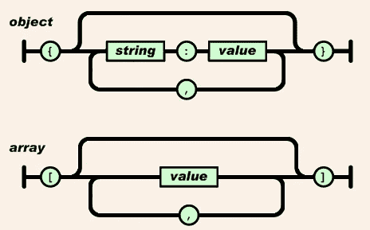
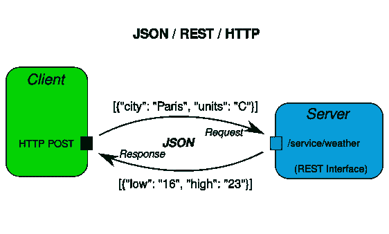

# 带有 JSON 的 REST API

> 原文：<https://medium.com/analytics-vidhya/rest-api-with-json-331ec26a1e40?source=collection_archive---------12----------------------->

*表象状态转移*

由[费伦茨·阿尔马西](https://unsplash.com/@flowforfrank?utm_source=medium&utm_medium=referral)在 [Unsplash](https://unsplash.com?utm_source=medium&utm_medium=referral) 上拍摄的照片

你好，在这篇文章中，有一个我们在项目中经常遇到的 API 系统。首先，我们从 JSON 对象是什么意思开始？JSON 就是 **JavaScript 对象符号**。听起来很有趣，对吧？

参考文献[1]中的图像

🔺JSON，JavaScript 数据转换，是一种数据交换格式。目的是确保在这些数据传输中，数据占用的空间比 XML 少。因此，它比 XML 工作得更快。

📌顾名思义，JSON data 最初是为 JavaScript 设计的，但后来它被用于许多编程语言和服务中。

多亏了 JSON，许多数据，无论是桌面软件还是移动应用，都可以在软件之间传输。我想提一下 REST 架构，这是 JSON 的使用领域之一。

# REST 架构(表述性状态转移)

照片由 [Yassine Khalfalli](https://unsplash.com/@yassine_khalfalli?utm_source=medium&utm_medium=referral) 在 [Unsplash](https://unsplash.com?utm_source=medium&utm_medium=referral) 上拍摄

🔺REST 是对使用 HTTP 协议的 **HTTP** 方法(get、post、put、delete)在客户机-服务器(客户机-服务器)之间提供通信的架构的命名。

🔺使用 REST 架构而不是复杂的架构如 SOAP 和 RPC 为开发人员提供了很大的优势。与其他复杂的架构相比，它们更加简单和轻量级，并且在 WWW(万维网)的屋顶下提出它们的请求。

参考文献[5]中的图像

📌例如，让我们检查上面的图表。我之前提到过，REST 架构在客户端和服务器之间进行通信。此示例假设天气信息发布在网站上。当然，我们有一个服务器也向我们提供这些信息。

🔺客户机以 HTTP 请求的形式向服务器发送一个请求，请求 JSON 格式的城市天气信息。将这种 JSON 格式的数据发送给服务器，将 JSON 格式的天气信息发送给客户端。这样，就可以实现顺畅的沟通。

## 参考

1.  特威奇，[https://twiki.org/cgi-bin/view/Blog/BlogEntry201503x1](https://twiki.org/cgi-bin/view/Blog/BlogEntry201503x1)
2.  REST API 教程，[https://www.restapitutorial.com](https://www.restapitutorial.com)
3.  来自维基百科，免费百科，[https://en . Wikipedia . org/wiki/representative _ state _ transfer](https://en.wikipedia.org/wiki/Representational_state_transfer)
4.  费雷拉，奥塔维奥(2009 年 11 月)， [*语义 Web 服务:RESTful 方法*](https://otaviofff.github.io/restful-grounding/) ，IADIS，[ISBN](https://en.wikipedia.org/wiki/ISBN_(identifier))[978–972–8924–93–5](https://en.wikipedia.org/wiki/Special:BookSources/978-972-8924-93-5)
5.  [https://safehammad.com/post/2009/10/16/hessian-rpc/](https://safehammad.com/post/2009/10/16/hessian-rpc/)