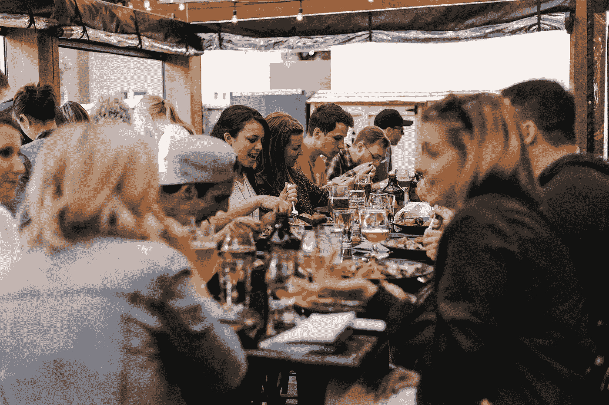
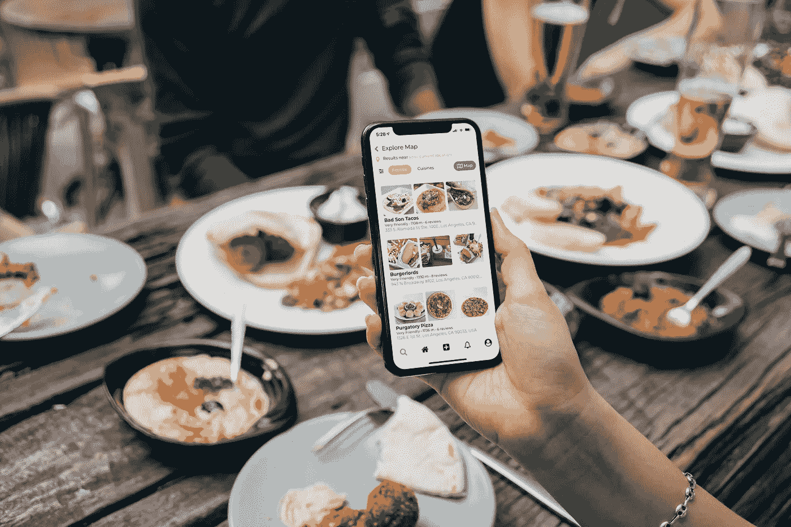
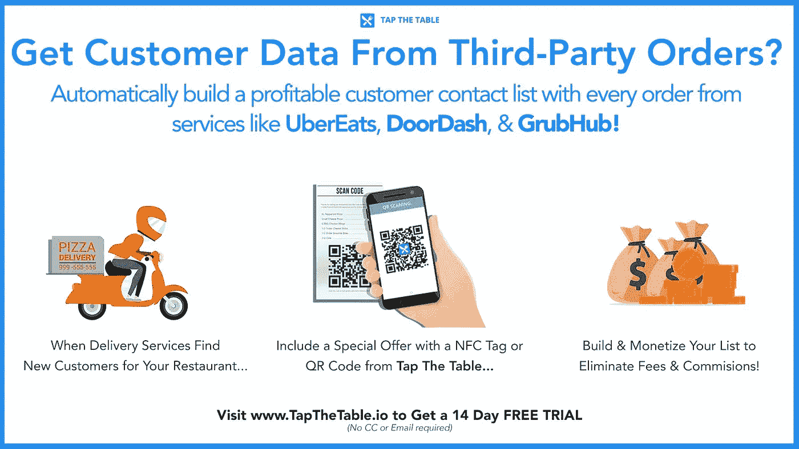

# 餐馆:我们需要聊天

> 原文：<https://medium.com/analytics-vidhya/restaurants-we-need-to-chat-a95e60b69bcd?source=collection_archive---------24----------------------->

帽子机器人正在成为餐饮业的热门话题。聊天机器人负责通过餐厅的聊天和信息渠道接收信息。聊天机器人可以用来接受订单和管理多个信息列表。然而，聊天机器人做的最重要的事情是提供客户服务。

聊天机器人可以在许多平台上使用，如 Instagram、Facebook Messenger、Google My Business，甚至你的网站。企业必须采用目前流行的任何技术。不幸的是，看到餐馆仍然在过时的方式中摸索前进，失去了生意，错过了增长和利润的机会。

使用聊天机器人可以让餐馆利用日益流行的消息应用。更不用说，越来越多的顾客希望通过聊天而不是打电话来与餐厅沟通。事实上，56%的客户更喜欢发信息而不是打电话给客服，聊天机器人可以回答多达 80%的标准问题，这使得它很容易适应任何业务。(来源:【outgrow.co)聊天机器人是你所需要的一切，来处理你社交媒体页面上的新消息，并提供客户服务，比如根据客户行为自动发送消息，或者推荐受欢迎的菜单项。

> 56 %的客户更喜欢发信息而不是打电话给客服，聊天机器人可以回答 80%的标准问题，这使得它很容易适应任何业务。(来源:[outgrow.co](https://outgrow.co/blog/vital-chatbot-statistics))

聊天机器人允许餐厅通过跨多个平台全天候可用来吸引客户——即使在关门的时候！聊天机器人也可以用来发送促销优惠，折扣代码等。随着顾客越来越多地花时间通过 Facebook Messenger 和其他通讯应用程序与品牌互动，聊天机器人的开发者表示，聊天机器人今年将成为餐厅数字化战略的重要组成部分。

# 以下是聊天机器人帮助餐馆的八种方式:

## 在线聊天

如果你在你的网站上提供实时聊天服务，机器人允许用户为了不同的目的与人类和机器互动。如果它检测到用户输入不清楚或在回应前要求澄清，它可以自动引导对话，从而确保所有访问者在任何时候都能分享正确的信息。30%的实时聊天交流可以由聊天机器人负责。但是，即使聊天机器人不能处理询问，把顾客交给人类也是一个简单的过程。

## 保留

如果你经营一家在不同地点有多家分店的餐馆，你可以在所有地点进行预订。此外，该机器人将允许用户预订桌子，并获得桌子可用性的更新。

## 外卖和配送的在线订购

有了聊天机器人，网上订购变得容易多了。用户可以使用文本或语音消息以自然语言发送订单消息，而不是强迫用户经历几个步骤并重复输入信息。例如，餐厅机器人会将订单标记为已收到，并直接与厨房工作人员沟通，进行准备和交付。

> 30%的实时聊天交流可以由聊天机器人负责。

## 菜单建议

基于用户的偏好和历史订单，人工智能聊天机器人可以向用户建议他们喜欢的菜单项。餐馆机器人的推荐并不偏向于最受欢迎的项目，而是根据特定项目从客户那里获得的交互量来推荐项目。

## 获得评论和反馈

机器人可以充当 24/7 的客户服务，帮助客户在你的菜单上找到信息，订购，并接收状态更新。该机器人还可以为用户提供一种简单的方法，在访问餐馆后留下评论或反馈。

## 营销并让顾客回到餐厅

聊天机器人可以帮助获得客户的联系信息，如电子邮件和电话，以跟踪客人并让他们回来。您甚至可以为订阅的客户提供奖励计划和特殊折扣。

## 忠诚度计划

该机器人可以让客户更容易地加入忠诚度计划，并确保他们及时了解所有可用的优惠。当他们从你的餐馆买东西时，机器人也会确保他们得到积分。

## 与餐馆的 POS 整合

餐馆机器人可以与您的销售点(POS)系统或在线订购平台集成，以执行发送订单和确认订单状态等任务。

> Feebi 将帮助回复和管理高达 80%的餐厅在 Facebook Messenger、Instagram、谷歌，甚至是 Feebi 提供的餐厅基于网站的聊天机器人上的传入信息。

今天市场上有许多平台可以帮助餐馆利用这些新技术。

[Feebi](https://getfeebi.com/?via=kelly) 是一款为餐馆打造的人工智能消息管理软件。Feebi 将帮助回复和管理高达 80%的餐厅在 Facebook Messenger、Instagram、谷歌，甚至是 Feebi 提供的餐厅基于网站的聊天机器人上的传入信息。通过人工智能，feebi 可以为餐厅节省大量回答常见问题的时间，甚至可以在需要时交给人类。

另一个专为餐馆打造的奇妙平台叫做[轻触桌子](https://app.tapthetable.io/)。Tap the Table 是一个一体化的营销和自动化平台，旨在帮助餐厅与其客户群建立更有利可图的关系。顺便说一句，如果你想整合上面列表中提到的所有酷功能，让聊天机器人可以帮助你的餐厅，Tap The Table 是实现这一目标的平台。它提供所有列出的额外津贴。

点击桌子不仅可以帮助你在工作场所实现无接触，还可以帮助管理你在脸书、Instagram、谷歌、WhatsApp、Telegram 甚至你的网站聊天工具上的信息。您和您的员工甚至不必总是“在线”回答询问。

此外，它可以带来新的客户，并建立您的回头客基础。点击桌子甚至可以帮助你收回通过 GrubHub 和 Postmates 等应用程序获得的业务。这些应用程序喜欢让客户信息远离你，从而无法控制你的重复商业营销。

点击餐桌还可以帮助餐馆在 Yelp 和 Tripadvisor 等网站上获得更多正面评价。点评对餐厅至关重要！一名[哈佛商学院](https://www.hbs.edu/faculty/Pages/item.aspx?num=41233)的研究人员发现，一家餐厅的 Yelp 评分增加一星，与收入增加 5-9%相关。

帽子机器人通常不会取代在这些公司工作的人。相反，它有助于他们在所有平台上全天候提供一致的体验。因此，餐馆将不再需要担心错过机会。相反，聊天机器人帮助管理所有收到的消息，帮助处理在线订单，获取联系信息以进行必要的营销跟进和扩展。

> 哈佛商学院的一名研究人员发现，一家餐厅的 Yelp 评分增加一星，与收入增加 5-9%相关。

像 feebi，Tap the Table 等聊天机器人的平台有很多。，所以餐厅可以选择哪一个最适合自己！

# 餐厅营销的未来是聊天机器人！

在 2021 年，近六分之一的全球客户服务互动由人工智能处理(来源:[outgrow.co](https://outgrow.co/blog/vital-chatbot-statistics))。聊天机器人将有助于自动化餐厅的工作，以便他们可以专注于提供出色的客户体验和用餐体验。因此，聊天机器人不仅能提供更好的服务，还能增加销售额！

聊天机器人不仅可以帮助餐馆与客户群建立更智能、更有利可图的关系，还可以连接你认为可能的一切，甚至是你不知道自己需要的东西。

现在市场上有很多聊天机器人平台。这篇文章列出了两个奇妙的聊天机器人平台，供餐馆根据我们的目标餐馆类型和我们的业务规模进行检查。

**在 https://stellar.tips/feebi[了解更多关于 Feebi](https://stellar.tips/feebi)** 的信息

**了解更多关于在[https://app.tapthetable.io/](https://app.tapthetable.io/)拍桌子**

**使用促销代码“Kelly”在前 12 个月享受 50%的折扣。优惠将于 2021 年 7 月 30 日午夜结束。**

***好玩的事实:*** *这篇博文 90%是艾写的！你能相信吗？我用了一个叫做*[*conversion . ai*](https://stellar.tips/ai)*的工具，利用 Jarvis 和机器学习的力量来帮助写这篇文章，节省了一吨的时间。当然，我需要调整它一点，但这是一个巨大的时间节省。如果你想亲自尝试 Convesion.ai，免费试用 7 天，如果你注册，你可以从我这里获得 10，000 积分！【https://stellar.tips/ai】*