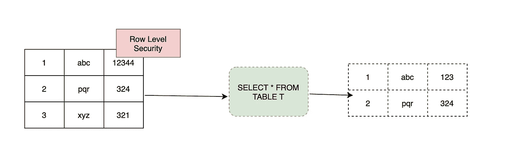

# 在 BigQuery 中使用行级安全性限制查询结果

> 原文：<https://medium.com/analytics-vidhya/restrict-query-results-with-row-level-security-in-bigquery-37e9db75f132?source=collection_archive---------4----------------------->

## 通过定义行级策略和返回数据子集来限制 SQL 查询结果🚀

> 最初发表于[https://asyncq.com](https://asyncq.com/restrict-query-results-with-row-level-security-in-bigquery)

## 介绍

[BigQuery](/analytics-vidhya/bigquery-petabyte-scale-data-warehouse-in-gcp-980b930e8bd8) 发布[行级安全](https://cloud.google.com/blog/products/data-analytics/bigquery-provides-tighter-controls-over-data-access?utm_source=twitter&utm_medium=unpaidsoc&utm_campaign=FY21-Q2-Google-Cloud-Tech-Blog&utm_content=bigquery&utm_term=-) 功能提供粒度访问控制。在这篇博客中，我们将使用…