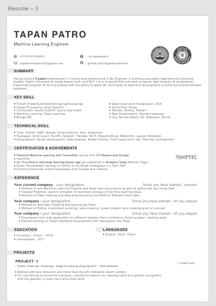

# 数据科学/机器学习工程师简历

> 原文：<https://medium.com/analytics-vidhya/resume-for-data-science-machine-learning-engineer-edc6c57722b0?source=collection_archive---------3----------------------->

写简历时要记住的关键事情。

在 [Unsplash](https://unsplash.com?utm_source=medium&utm_medium=referral) 上[猎人赛跑](https://unsplash.com/@huntersrace?utm_source=medium&utm_medium=referral)的照片

嘿伙计们，现在我看到人们经常开始他们的数据科学/机器学习之旅。他们努力学习，参加各种项目黑客马拉松、竞赛等等。

但是说到工作，我看到很少有人被公司雇佣。不能自己写专业简历的一个关键问题是。在这个博客中，我们将会看到写简历的一些关键方面，以及我在求职中使用过的简历。

## 1.不要一遍又一遍地做这件事

因为你已经在所有的求职门户网站上更新了你的简历，如果你没有像预期的那样接到电话，那么你就有了更新你简历的第一个信号，或者在某个地方遗漏了什么。

因此，不要用同样的简历更新你的个人资料，试着用一份新的看起来相似的简历来更新。你做得越快，接到电话的速度就越快。我也面临过同样的情况，我经历了艰难的过程。

## 2.一份简历的付费模板？

是的，你找到了一个解决方案，但是它会让你付出很高的代价。一个简单的解决办法就是自己做。任何像 photoshop 这样的设计应用都需要至少几个月的时间来学习，而且也不是免费的。

因此，对于这一点，最好的解决方案是像 Adobe Xd 这样的小而强大的设计应用程序，它对像我们这样的个人是免费的。需要 1 到 2 个小时来理解这是如何工作的。这只是点击和输入画布的方法。

你可以设计一份你想要的现代或者有吸引力的简历。搜索最近更新的简历，在那里你可以展示你的经历。试着做出你的版本。

## 3.简历应该有哪些内容？

不管简历有多好，招聘人员在筛选的时候最多给 30 到 45 秒。所以，让你的简历内容丰富，与众不同。

**简历概要:**一份清晰的 2 到 3 行的简历概要将有助于招聘人员对简历有所期待。

技能:提及你的技能，你所精通的和你有信心的。

我见到的大多数同事和朋友都没有看到他们写下自己的成就，直到他们获得了第一名或其他什么。如果有人添加了这些亮点，它真的会为你的简历增值。

**联系信息:**使用 LinkedIn 和 Github 的个人资料添加您的所有联系信息。这将有助于技术招聘人员从 GitHub 和其他地方获得你的编程能力。

## 4.怎么检查好不好？

你的朋友和同事可以在这里帮助你。让他们花 1-2 分钟检查新简历，问他们注意到了什么，这样你就可以知道为了向招聘人员展示你想展示的东西，你需要做哪些调整。

## 5.这是我的简历片段

屏幕上显示程序运行的图片

嘿，伙计们，当你开始写你的第一份简历时，这里有一些建议要记住。

谢谢你们阅读这篇文章。如有任何疑问，请发表评论。

# 现在怎么办？

这边请..下次会分享更多关于 DS / ML 面试准备的细节。

感谢阅读。

如果你喜欢这篇文章，请一定要鼓掌。请关注我的 Github 和我的 medium 个人资料上的更多项目和文章。

 [## tapanKumarPatro -概述

### 从 greensdata/成为数据科学家的 10 个步骤中获得的块或报告📢准备好学习或复习你的知识了吗…

github.com](https://github.com/tapanKumarPatro)  [## Tapan Kumar Patro -中等

### 随机砍伐森林的代码，你应该注意什么。这是我之前故事的延续，我必须…

tapanpatro.medium.com](https://tapanpatro.medium.com/) 

不要忘了使用 Android 应用程序开发来检查深度学习项目的端到端部署。

 [## 基于深度学习的端到端 app。

### 聪明烹饪

medium.com](/analytics-vidhya/end-to-end-deep-learning-based-app-af67d4008550) 

谢了。如有任何疑问，请留言。