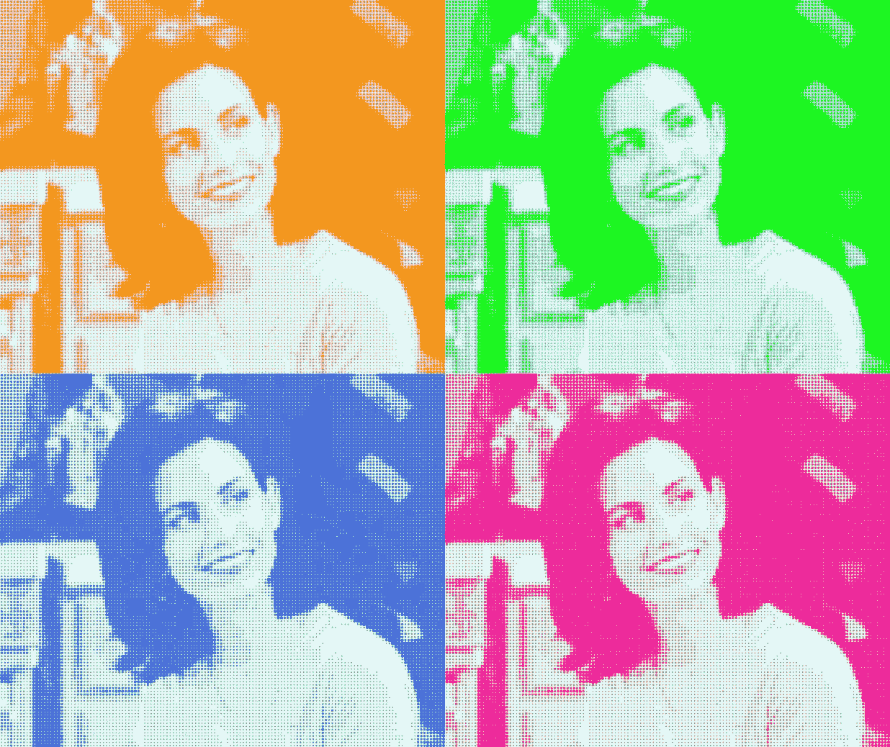

# 使用枕头和蟒蛇皮的复古艺术

> 原文：<https://medium.com/analytics-vidhya/retro-art-using-pillow-and-python-b8b91e8aebc7?source=collection_archive---------22----------------------->


🙂莫妮卡-朋友电视节目

创造美丽的*复古艺术或点缀艺术*🎨*使用 python 图像库(pillow)。*

## 要求:

*   python 3.5 以上版本
*   枕头
*   numpy

将输入图像转换为灰色模式。并提取原始图像的维度。

```
from PIL import Image, ImageDraw
import numpy as np# read as gray image
im = Image.open("monica.jpg").convert("L")
width, height = im.size
```


灰度图像

提及最终图片中的点数。并且还以 RGB 模式输入背景和点颜色。

```
max_dots = 140
background_colour = [224, 255, 255] #rgb
dots_colour = (0,0,139) #rgb
```

根据点数缩小图像，并提取其宽度和高度。

```
if height == max(height, width):
    downsized_image = im.resize((int(height * (max_dots / width)), max_dots))else:
    downsized_image = im.resize((max_dots, int(height * (max_dots / width))))# image size
downsized_image_width, downsized_image_height = downsized_image.size
```


缩小图像

在下面的代码中，改变*乘数值*来增加或减少最终图像的尺寸。增加得越多，分辨率就越高。创建一个空白图像，用于在上面绘制圆圈。

```
# increase target image size
multiplier = 50# set size for target image
blank_img_height = downsized_image_height * multiplier
blank_img_width = downsized_image_width * multiplier# set the padding value so the dots start in frame (rather than being off the edge
padding = int(multiplier / 2)# create canvas containing just the background colour
blank_image = np.full(
    ((blank_img_height), (blank_img_width), 3), background_colour, dtype=np.uint8
)
```


空白图像

遍历空白图像中的每个像素，并使用 *pillow ImageDraw* 函数绘制圆环。

```
# prepare for drawing dot-circles on our traget imagepil_image = Image.fromarray(blank_image)
draw = ImageDraw.Draw(pil_image)
downsized_image = np.array(downsized_image) # run through each pixel and draw the circle on our blank canvasfor y in range(0, downsized_image_height):
    for x in range(0, downsized_image_width): k = (x * multiplier) + padding
        m = (y * multiplier) + padding r = int((0.6 * multiplier) * ((255 - downsized_image[y][x]) / 255)) leftUpPoint = (k - r, m - r)
        rightDownPoint = (k + r, m + r) twoPointList = [leftUpPoint, rightDownPoint]
        draw.ellipse(twoPointList, fill=dots_colour)pil_image.show() #show the final image
```

我们可以玩不同的颜色，创造美丽的 2x2 网格。我用的是 numpy 库的 hstack 和 vstack。

```
# make a 2x2 gridimg1 = Image.open('retro_art/retro_art1.png') #color 1
img2 = Image.open('retro_art/retro_art2.png') #color 2
img3 = Image.open('retro_art/retro_art3.png') #color 3
img4 = Image.open('retro_art/retro_art4.png') #color 4#joining two images horizontally
col_1 = np.hstack([np.array(img1), np.array(img2)]) 
col_2 = np.hstack([np.array(img3), np.array(img4)])#join above created images vertically
col = np.vstack([col_1, col_2])grid_image = Image.fromarray(col)
grid_image.show()
```



2x2 网格

*直接代码链接*:[https://github . com/ash 11 sh/hakuna-matata/blob/main/retro _ art/retro _ art . py](https://github.com/ash11sh/hakuna-matata/blob/main/retro_art/retro_art.py)

> 参考:[安德鲁·琼斯](https://www.analytics-link.com/post/2019/07/11/creating-pop-art-using-opencv-and-python)。