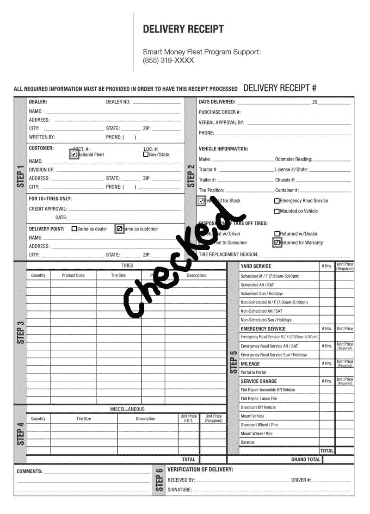

# 来自交付收据的收入增加

> 原文：<https://medium.com/analytics-vidhya/revenue-enhancement-from-delivery-receipt-6221c0c49667?source=collection_archive---------0----------------------->

在运输和物流行业中，除了为交付产品支付的成本之外，由于实际地点的不同困难，交付代理人还必须付出额外的努力。例如，很多时候，送货地点是一个 10 层以上的公寓，送货代理人不得不在 7 楼用他所有的手工努力来运送一个沉重的产品，而公司从来没有为此得到报酬。取回该成本的一种方法是要求代理在收据上写下额外工作或勾选选项框，然后公司可以手动检查所有这些收据，并从已经为其付出额外工作的客户处取回额外成本。但这里的问题是，大公司每天需要处理超过 100，000 份交货收据，人工成本将非常高，这可能会使整个过程变得毫无价值。

让我们深入研究这篇文章，了解如何通过使用人工智能来解决这个问题，并在不需要任何人工努力的情况下自动化整个过程。



样品交付收据

**内容:**

*   商机
*   数据预处理
*   模型开发
*   云部署
*   结论
*   参考

**商机**

如果代理可以简单地扫描收据，然后机器将处理整个文档，并实时返回关键见解作为输出，而不需要人工检查和验证，会怎么样？这将有助于公司填补收入漏洞，产生额外收入，并帮助客户以更好的方式估计产品成本。

> 问题陈述到此为止。现在让我们关注方法部分。

本文将关注两个主要方面。第一，检测选中的复选框并对工作进行分类。第二，检测手写内容，通过使用 OCR 来理解文本，并最终基于书面文本来对工作进行分类。

**数据预处理**

在我们深入研究模型开发部分之前，将数据准备成正确的格式与调整模型的超参数一样重要。数据的复杂性可能是巨大的。例如，扫描的文档可以具有不同的形状、大小和方向。图像可能有噪声且不清晰。它可能有不同的格式，甚至可能不是正确的数据

让我们尝试使用 OpenCV 模块逐一解决每个与数据相关的问题。每个扫描的数据可以是不同的类型，因此不同的方法最适合不同类型的数据。检查以下列表:

*   保持标准形状、大小和方向: [**cv.resize**](https://docs.opencv.org/3.4.15/da/d54/group__imgproc__transform.html#ga47a974309e9102f5f08231edc7e7529d) ， [**cv.warpAffine**](https://docs.opencv.org/3.4.15/da/d54/group__imgproc__transform.html#ga0203d9ee5fcd28d40dbc4a1ea4451983) ，[**cv . getaffinetransform**](https://docs.opencv.org/3.4.15/da/d54/group__imgproc__transform.html#ga8f6d378f9f8eebb5cb55cd3ae295a999)，[**cv . warp perspective**](https://docs.opencv.org/3.4.15/da/d54/group__imgproc__transform.html#gaf73673a7e8e18ec6963e3774e6a94b87)
*   图像去噪:[**cv . expand&cv . erode**](https://docs.opencv.org/3.4.15/db/df6/tutorial_erosion_dilatation.html)， [**cv。高斯布鲁&**](https://docs.opencv.org/4.5.3/d4/d86/group__imgproc__filter.html#gaabe8c836e97159a9193fb0b11ac52cf1) [**简历。精明的**](https://docs.opencv.org/3.4.15/dd/d1a/group__imgproc__feature.html#ga04723e007ed888ddf11d9ba04e2232de)

```
import numpy as np
import cv

# read image 
img = cv.imread(IMAGE_PATH)
gray_img = cv.cvtColor(img, cv.COLOR_RGB2GRAY)# GaussianBlur to smooth image
blur_img = cv.GaussianBlur(gray_img,(5,3), 1)denoised_img = cv.Canny(blur_img, 50, 100, 3);
```

*   图像分类: [**OpenCV 模板匹配**](https://docs.opencv.org/3.4.13/de/da9/tutorial_template_matching.html) **，基于 CNN 的图像分类(VGG-16，盗梦空间系列，ResNet 系列)**

**模型开发**

现在，由于数据是在使用上述方法解决所有提到的问题之后准备的，所以让我们讨论所有模型需要开发什么。

*   **复选框检测&识别:**为了检测这些复选框，使用对象检测模型。超过 1000 个数据样本被标注并准备用于训练。目前存在具有不同运行时间和精度的单阶段和两阶段方法的多个对象检测模型。其中一些是掩模 RCNN、YOLO (v1、v2、v3、v4)、YOLOR、快速 RCNN 等。
*   **手写检测&识别:**在手写部分，首先需要使用对象检测方法检测手写文本。然后这些手写文本图像通过 OCR 识别这些文本，最后文本通过文本分类器分类到其中一个类别。对于 OCR，市场上有多种 API。例如，AWS Textract、Azure Read API、Pytesseract 等。对于文本分类，可以使用 fastai ULMFiT 模型、基于变压器的蒸馏模型、甚至 SVM 模型。要了解这些模型的更多信息，请查看参考资料部分提供的链接

**云部署**

一旦模型经过训练，并且完整的解决方案包可供使用，就需要将它部署到云上，供团队中的每个人使用。

在 AWS 云上部署解决方案并通过 API 调用推断模型的步骤如下:

*   登录 AWS 控制台，选择需要部署解决方案的地区
*   创建一个 S3 存储桶来存储数据、模型和 python 包
*   为每个求解步骤(数据预处理、复选框检测和分类、手写检测、手写识别和文本分类)创建 Lambda 函数
*   在 Lambda 函数中创建附加层来安装所有的库
*   创建一个阶跃函数，以便在数据流入指定的 S3 存储桶时触发这些 Lambda 函数
*   将 step 函数与 API Gateway 集成，为解决方案创建 API
*   一旦创建了 REST API，就可以使用 API 将输入图像传递给 S3 桶，这又会触发 Lambda 函数按照 Step 函数的流程开始处理输入。最后，Step 函数会将 JSON 输出返回给用户。

**结论**

在本文中，我们试图解释在运输和物流行业创造收入的商业机会，总结数据准备和模型开发方法，并最终通过 AWS cloud 帮助创建一个用于解决方案部署和消费的 API。

有关云服务和人工智能模型的更多详细信息，请查看参考资料部分。

敬请关注，了解我们在日常工作中使用的不同方法。在 Linkedin 上关注我来互动和分享想法:[https://www.linkedin.com/in/mdsharique0107/](https://www.linkedin.com/in/mdsharique0107/)

**参考**

[](https://github.com/matterport/Mask_RCNN) [## GitHub-matter port/Mask _ RCNN:Mask R-CNN 用于 Keras 上的对象检测和实例分割…

### 这是 Mask R-CNN 在 Python 3、Keras 和 TensorFlow 上的实现。该模型生成边界框和…

github.com](https://github.com/matterport/Mask_RCNN) [](https://docs.microsoft.com/en-us/azure/cognitive-services/computer-vision/overview-ocr#read-api) [## 什么是光学字符识别？- Azure 认知服务

### 光学字符识别(OCR)允许您从图像中提取打印或手写文本，例如…

docs.microsoft.com](https://docs.microsoft.com/en-us/azure/cognitive-services/computer-vision/overview-ocr#read-api) [](https://aws.amazon.com/textract/) [## 使用 OCR-Amazon Textract-Amazon Web Services 智能提取文本和数据

### Amazon Textract 每月分析多达 1，000 页，免费 3 个月提取文本、表格、表单和密集的文本数据…

aws.amazon.com](https://aws.amazon.com/textract/) [](https://github.com/theAIGuysCode/YOLOv4-Cloud-Tutorial) [## GitHub-the aiguiyscode/yolov 4-Cloud-Tutorial:这个资源库将带您了解如何构建和…

### 这个存储库将带您了解如何在 Google 的云中使用 Darknet 构建和运行 YOLOv4 对象检测…

github.com](https://github.com/theAIGuysCode/YOLOv4-Cloud-Tutorial) [](https://github.com/opencv/opencv-python) [## GitHub - opencv/opencv-python:生成预编译 opencv-python 的自动化 CI 工具链…

### 为 Python 预先构建的 CPU 专用 OpenCV 包。如果您希望从…编译绑定，请检查手动构建部分

github.com](https://github.com/opencv/opencv-python) [](https://aws.amazon.com/s3/) [## 云对象存储|随处存储和检索数据|亚马逊简单存储服务(S3)

### 对象存储旨在从任何地方存储和检索任何数量的数据亚马逊简单存储服务(亚马逊 S3)…

aws.amazon.com](https://aws.amazon.com/s3/) [](https://aws.amazon.com/lambda/) [## 无服务器计算- AWS Lambda -亚马逊网络服务

### AWS Lambda 无需配置或管理基础设施即可运行代码。只需编写并上传代码作为一个. zip 文件或…

aws.amazon.com](https://aws.amazon.com/lambda/) [](https://aws.amazon.com/step-functions/?step-functions.sort-by=item.additionalFields.postDateTime&step-functions.sort-order=desc) [## AWS 步骤功能|无服务器微服务编排| Amazon Web Services

### 现代应用程序的可视化工作流 AWS 步骤功能是一个低代码的可视化工作流服务，用于编排…

aws.amazon.com](https://aws.amazon.com/step-functions/?step-functions.sort-by=item.additionalFields.postDateTime&step-functions.sort-order=desc) [](https://aws.amazon.com/api-gateway/) [## 亚马逊 API 网关| API 管理|亚马逊 Web 服务

### 创建、维护和保护任意规模的 API Amazon API Gateway 是一项完全托管的服务，它使您可以轻松地…

aws.amazon.com](https://aws.amazon.com/api-gateway/)