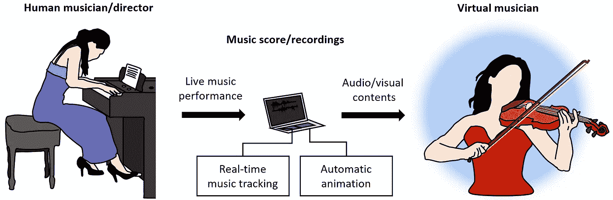
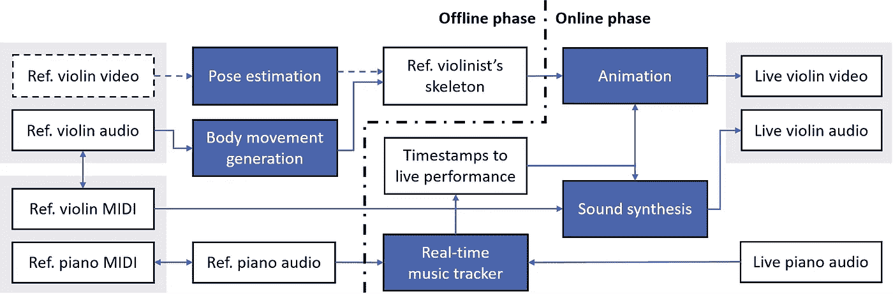
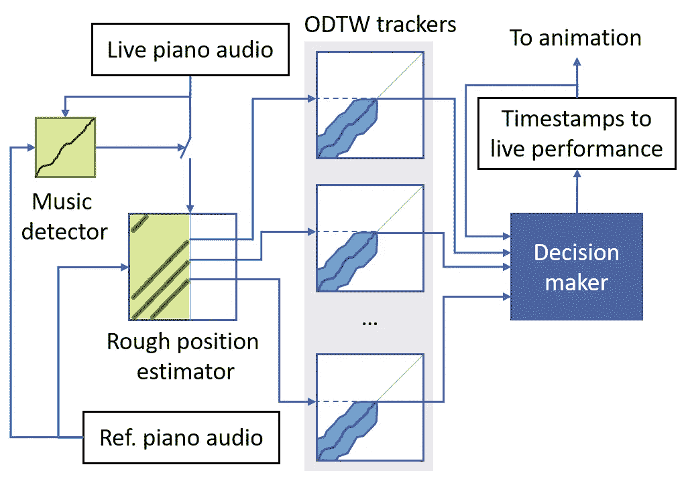
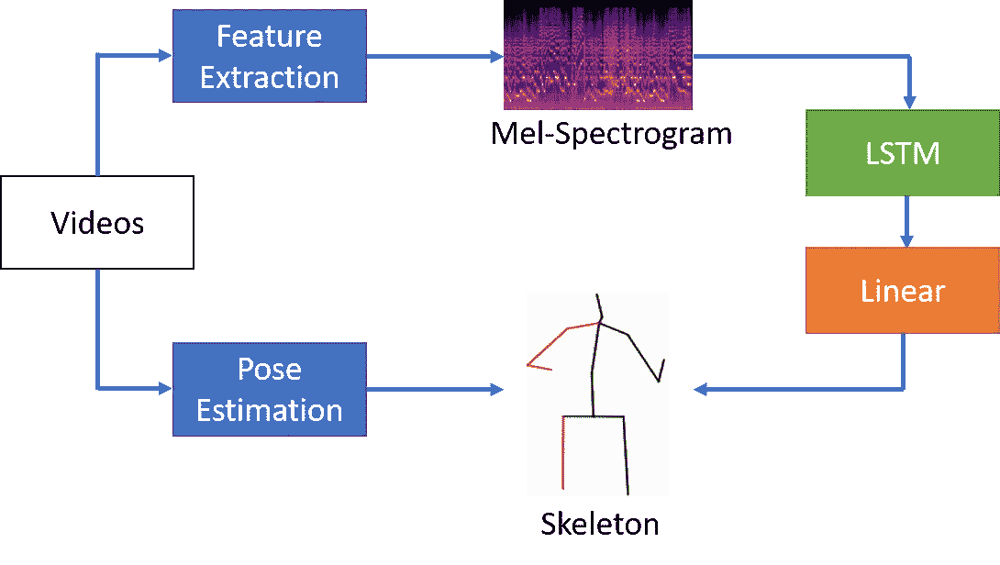
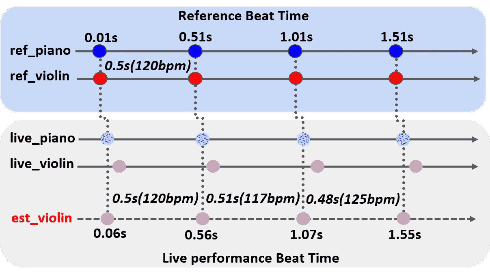

# 音乐表演人机对唱系统(自动伴奏)

> 原文：<https://medium.com/analytics-vidhya/review-a-human-computer-duet-system-for-music-performance-automatic-accompaniment-572ccbeb014e?source=collection_archive---------24----------------------->

## 与人合作演奏，自动产生小提琴音乐。

在这篇文章中，**介绍了一个由中央研究院开发的用于音乐表演的人机对唱系统**【1】。在本文中:

*   **一个虚拟小提琴家**被创造出来，他可以和人类钢琴家一起演奏室内乐**不需要任何干预**。
*   提议的系统**已经在一场公开音乐会**上表演过。
*   对系统的有效改进进行了讨论。

这项工作得到了该研究所的自动音乐音乐会动画(AMCA)项目的支持。

# 概述

自动音乐会动画系统插图。

1.  提议的虚拟音乐家系统
2.  实时音乐跟踪
3.  自动动画
4.  讨论

# 1.提议的虚拟音乐家系统

提议的虚拟音乐家动画和互动系统。

*   该系统具有同步参考、排练和现场内容的能力。
*   开始时，要和虚拟小提琴手一起演奏的人选择一首乐曲。
*   使用离线 DTW 算法对准参考和现场钢琴音频。
*   在现场演奏中，实时音乐跟踪器**在在线 DTW (ODTW)校准的帮助下跟踪现场钢琴音频**。
*   音乐跟踪器然后创建视觉动画和声音合成，以便生成虚拟小提琴手的身体运动和小提琴音乐。
*   自动动画使用两种生成运动的方法:姿态估计和音乐到运动的生成技术。
*   最后，用实时声音合成器和动画制作工具渲染虚拟小提琴手的声音和动作。

# 2.实时音乐跟踪

实时音乐跟踪系统。

*   Arzt 和 Widmer [2，3]重新实现了 T10“任何时间”音乐跟踪器 T11。
*   当演出开始时，音乐检测器开始跟踪。
*   粗略位置估计器返回符合排练钢琴的现场钢琴信号的可能位置的集合。
*   决策者选择一个 ODTW 线程作为最可信的线程，然后输出跟踪结果。

# 3.自动动画

*   通过使用[4]提取 violinistsâăź15 身体关节的 3d 位置来完成姿态估计。
*   毫不奇怪，身体运动生成需要一个包含音频以及小提琴演奏的姿势内容的数据集来建模音乐到身体运动的对应关系。
*   说到产生运动，他们将音频到身体(A2B)动力学的框架扩展到三维空间，如下所示。

身体运动生成综述。

# 4.讨论

## 实时音乐跟踪评估

*   直觉上是用以下程序测量在线音乐跟踪和现场录音的*离线校准之间的偏差:*

1.  使用多通道录音设备来录制现场钢琴和小提琴音频。
2.  如下所示，通过离线同步将录制的现场钢琴与参考钢琴 MIDI 的时间映射进行比较。
3.  也通过离线同步比较现场小提琴和估计小提琴的时间映射。

在 120 BPM 的样本上评估实时音乐跟踪系统的概念图。圆圈表示节拍位置，用垂直虚线连接的圆圈是同步的。注意，同步结果决定了小提琴声部应该如何演奏(即，估计的小提琴声部)。

*   他们使用以下四个标准进行评估:

1.正常速度(115–145 BPM)

2.低速(90–120 BPM)

3.快速(135–175 BPM)

4.加速从 80bpm 左右开始，到 160 bpm 结束

*   对于所有这四种情况，系统采取了大约四种措施来与现场钢琴同步。一旦它与人类钢琴家同步，偏差值为 0.25 拍。
*   此外，我们可以观察到速度的突然改变并不总是导致延迟的改变。

## 身体运动生成评估

*   该模型在包含 140 个小提琴独奏视频的数据集上进行训练和评估，视频总长度为 11 小时。
*   为了训练，他们从其中一个小提琴手那里选择视频，并进行 14 重交叉验证来训练 14 个模型。
*   每个模型都是在被遗漏的部分上进行评估的(对于该折叠分区)。
*   结果是由小提琴手的数量来平均的。
*   L1 距离和弓形攻击 F1 分数用于度量。
*   L1 距离由生成的节理和地面真实节理之间的距离定义。
*   在本文中，弓形攻击是指弓形方向改变的时刻。
*   在他们识别出弓形攻击的所有真阳性、假阳性和假阴性之后，他们计算 F1 分数。
*   我们可以观察到 F1 分数比基线好得多，这意味着该模型是有效的。
*   还有两个改进:右手位置的偏差和弓击的时机。

# 参考

[1][https://arxiv.org/abs/2009.07816](https://arxiv.org/abs/2009.07816)

[2]安德烈亚斯·阿尔兹特和格哈德·威德默。用于实时音乐跟踪的简单速度模型。在 2010 年声音和音乐计算会议(SMC)的会议录中

[3]安德烈亚斯·阿尔兹特和格哈德·威德默。实现有效的“随时”音乐跟踪。《第五届人工智能研究者研讨会论文集》，2010 年，第 24 页。

[4]达里奥·帕夫洛、克里斯托弗·费希滕霍费尔、戴维·格兰吉尔和迈克尔·奥利。基于时间卷积和半监督训练的视频三维人体姿态估计。IEEE 计算机视觉和模式识别会议(CVPR)论文集，第 7753-7762 页，2019 年。

[5] Eli Shlizerman、Lucio Dery、Hayden Schoen 和 Ira Kemelmacher-Shlizerman。音频到身体动力学。《IEEE 计算机视觉和模式识别会议论文集》(CVPR)，第 7574–7583 页，2018 年。

*原载于 2021 年 3 月 8 日*[*https://cuda-Chen . github . io*](https://cuda-chen.github.io/paper%20review/2021/03/08/review-a-human-computer-duet-system-for-music-performance.html)*。*

> *如果你有什么想法和问题要分享，请联系我*[***clh 960524【at】Gmail . com***](http://clh960524@gmail.com/)*。还有，其他作品可以查看我的* [*GitHub 资源库*](https://github.com/Cuda-Chen) *。如果你和我一样热衷于机器学习、图像处理和并行计算，欢迎在 LinkedIn 上* [*加我*](https://www.linkedin.com/in/lu-hsuan-chen-78071b171/) *。*