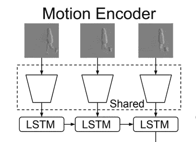
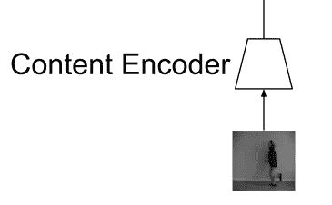
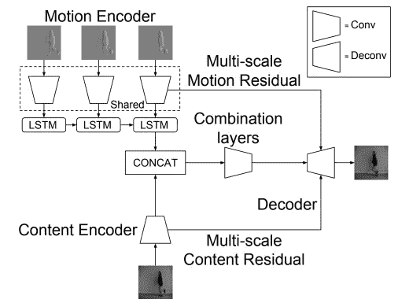
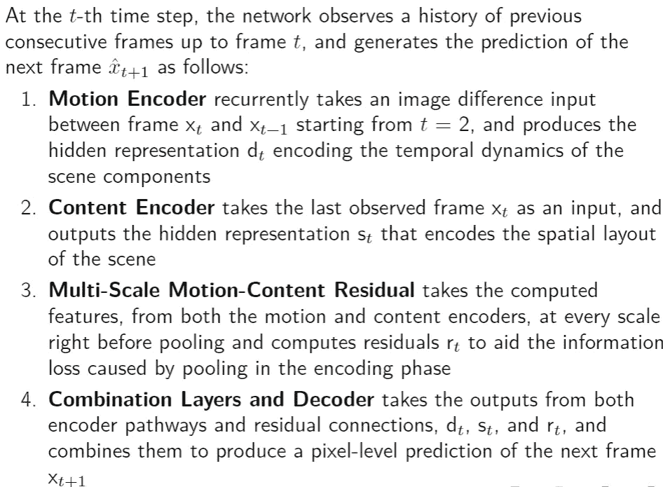
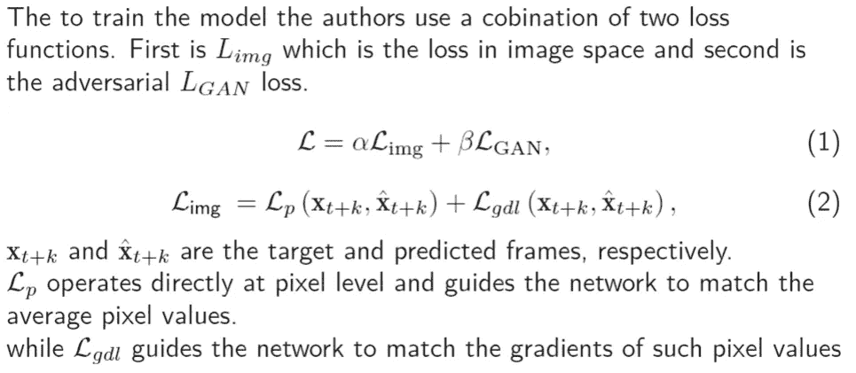
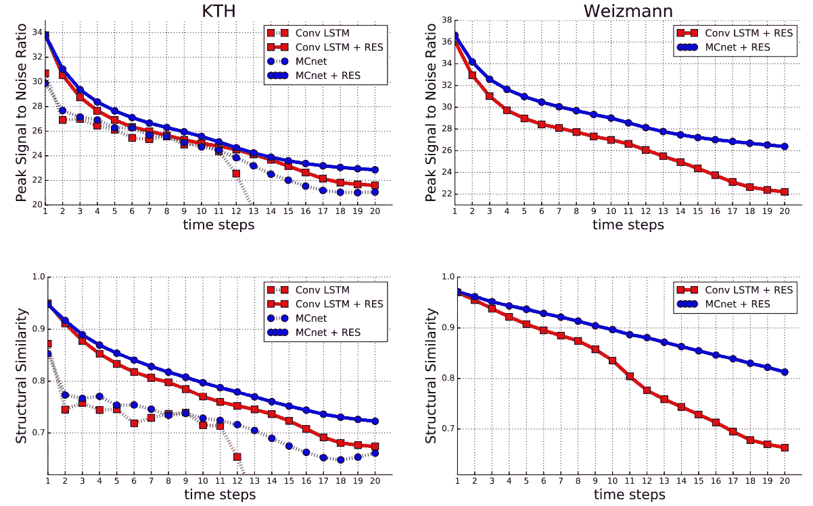
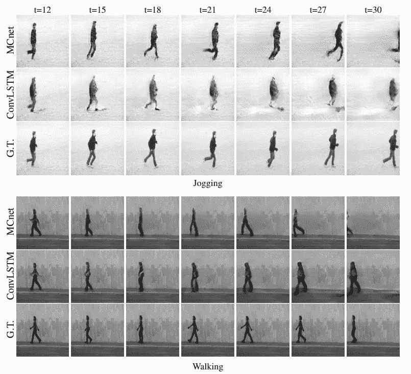

# 综述:MCnet 或运动内容网络用于视频预测

> 原文：<https://medium.com/analytics-vidhya/review-mcnet-or-motion-content-network-for-video-prediction-6cbd626e5747?source=collection_archive---------7----------------------->

## [自然视频序列预测的运动和内容分解，Villegas 等人](https://arxiv.org/abs/1706.08033v2)

在我之前的文章中，我描述了 **FutureGAN** ( [链接到文章](/@ad892/review-of-futuregan-predict-future-video-frames-using-generative-adversarial-networks-gans-3120d90d54e0))，这是一个基于 GAN 的未来帧预测框架。FutureGAN 的关键之处在于，它没有使用任何形式的 RNNs 来模拟视频的时间动态。相反，它使用*时空 3d 卷积*来模拟视频中的内容和运动。然而，我们确实注意到它无法胜过 **MCnet** 模型。因此，在本文中，我们将探讨用于视频预测的 MCnet 模型。

视频预测具有挑战性，因为与静态图像不同，视频在时域中包含复杂的变换和运动模式。为了解决这个问题，MCnet 使用了一种创造性的方法，将视频预测任务分成两半。

# MCnet 关键理念:

1.  MCnet 采用了一种复杂的方法来分解运动和内容，这是产生视频动态的两个关键组成部分。
2.  这是一个聪明的技巧，因为我们可以将视频预测视为两个独立的任务。首先，预测视频的内容或视频中图像帧的空间布局。第二，预测视频中的运动或时间动态。
3.  通过独立地对运动和内容建模，帧预测简化为组合内容和运动特征，这简化了下一帧预测的复杂任务。

# MCnet 架构:

1.  MCnet 生成器模型建立在编码器-解码器卷积神经网络和卷积 LSTM 的基础上。
2.  编码器-解码器卷积神经网络用于对内容建模。
3.  卷积 LSTM 用于模拟运动或时间动态。
4.  鉴别器被优化以执行二进制分类，即识别假的和真实的视频帧。

*为了模拟空间和时间动态，MCnet 生成器模型 c* 包括以下网络的*:*

1.  运动编码器
2.  内容编码器
3.  多尺度运动内容残差
4.  组合层和解码器

## 运动编码器:

1.  运动编码器捕捉场景组件的时间动态，并用于模拟视频中的运动。
2.  CNN 与 ConvLSTM 一起用于编码器

MCnet 运动编码器

## 内容编码器:

1.  内容编码器从单个帧中提取重要的空间特征，例如场景的空间布局和视频中的显著对象。
2.  它是由专门从单帧中提取特征的卷积神经网络(CNN)实现的。

MCnet 内容编码器

## 多尺度运动内容残差；

1.  为了防止在运动和内容编码器中的汇集操作之后信息丢失，使用了剩余连接。
2.  在去轮询操作之后，网络中的剩余连接将每个尺度的运动内容特征传送到解码器层中。

## 组合层和解码器:

1.  来自两个编码器路径的输出分别编码运动和内容的高级表示。给定这些表示，解码器的目标是生成下一帧的像素级预测。
2.  为此，它首先通过在深度维度上连接特征向量，将运动和内容组合成统一的表示。

MCnet 架构

# MCnet 算法概述:

# 模型培训:

# 结果:

MCnet 结果比较:给定 10 个输入帧，模型逐个递归预测 20 个帧。

在上图中，我们可以看到，对于 KTH 和魏茨曼数据集，MCnet + RES 模型(残差连接)在所有其他模型中表现最佳。值得注意的一件有趣的事情是，没有 RES 的 MCnet 在 KTH 数据集上的表现比 Conv LSTM + RES 模型更差。这证明了在 MCnet 模型中使用 RES 连接的必要性，因为它通过传递运动内容特征来避免消失梯度问题，从而防止信息丢失。

随着时间的推移，由于预测空间和时间动态的不确定性增加，SSIM 和 PSNR 值急剧下降。下图也对此进行了描述。

MCnet 结果

# 参考:

[自然视频序列预测的运动和内容分解，Villegas 等人](https://arxiv.org/abs/1706.08033)