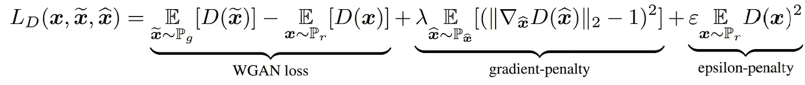
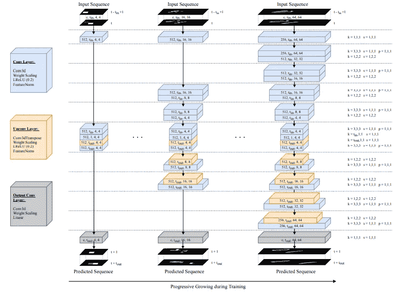
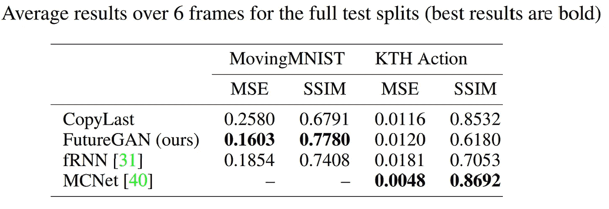
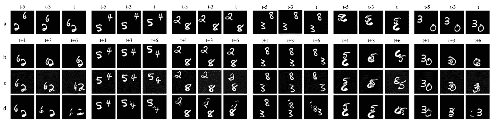
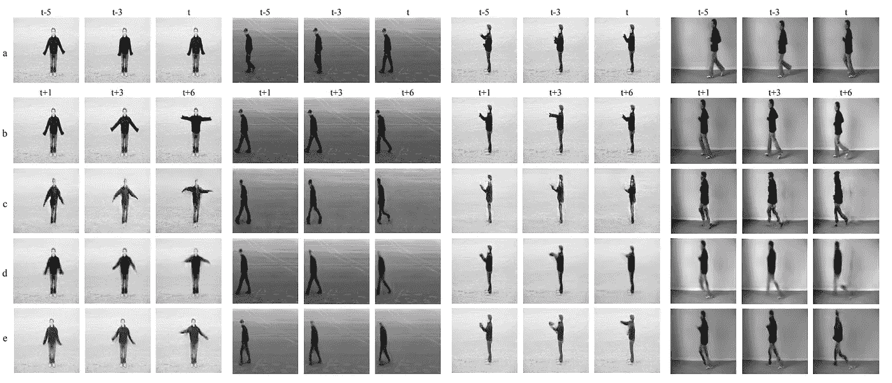
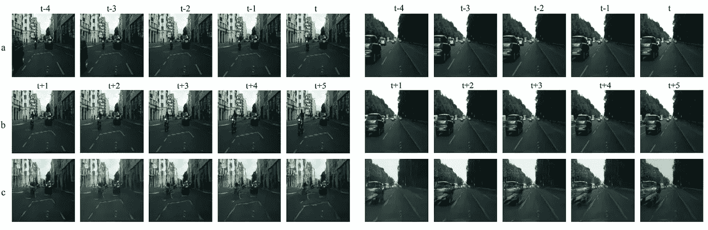

# 《未来:用生成对抗网络预测未来视频帧》综述

> 原文：<https://medium.com/analytics-vidhya/review-of-futuregan-predict-future-video-frames-using-generative-adversarial-networks-gans-3120d90d54e0?source=collection_archive---------2----------------------->

## 使用 GANs 的未来视频帧预测

由 Aigner 等人提出的 [**FutureGAN**](https://arxiv.org/abs/1810.01325) 是一个基于 GAN 的框架，用于预测未来的视频帧。视频预测是基于先前帧序列的上下文来预测未来视频帧的能力。与静态图像不同，视频在时间维度上提供了复杂的变换和运动模式。因此，为了准确预测未来的视频帧，该模型需要考虑时间和空间分量。典型地，递归神经网络用于模拟时间动态。然而，FutureGAN 的作者提出以渐进增长的方式使用**时空 3d 卷积**来预测未来的视频帧。

## FutureGAN 论文的主要观点:

1.  FutureGAN 使用编码器-解码器 GAN 模型来预测视频序列的未来帧，条件是过去帧的序列。
2.  为了捕获视频序列的空间和时间分量，在所有编码器和解码器模块中使用时空 3d 卷积。
3.  它使用了现有的渐进生长 GAN (ProGAN ),可在生成高分辨率单一图像时获得高质量的结果。
4.  FutureGAN 框架适用于各种不同的数据集，无需额外改动，性能稳定。

## 为什么是时空 3d 卷积？

问题是为什么使用时空 3d 卷积而不是 CNN + RNNs 来处理空间和时间域。

1.  我们知道，应用于图像的 2D 卷积会输出图像，应用于多个图像的 2D 卷积(将它们视为不同的通道)也会产生图像。因此，2D 卷积运算会在每次卷积运算后立即丢失输入信号的时间信息。
2.  然而，只有 3D 卷积保留了产生输出体积的输入信号的时间信息。同样的现象也适用于 2D 和 3D 投票。

# 未来模型

## 发电机网络:

1.  FutureGAN 发电机由编码器和解码器部分组成。作者在他们的编码器和解码器中使用了渐进增长(ProGAN)方法。
2.  编码器学习输入的潜在表示。解码器使用该潜在表示来生成预测。
3.  所有卷积层都使用 3d 卷积。这允许发生器适当地编码和解码输入序列的空间和时间分量。
4.  具有不对称核大小和跨度的 3d 卷积被用于下采样，而具有不对称核大小和跨度的转置 3d 卷积被用于上采样。

## 鉴别器网络:

1.  我们的 FutureGAN 模型的鉴别器被设计用来区分真实和虚假的序列。
2.  鉴别器网络从训练集中获取代表地面实况序列的帧和由生成器创建的帧作为输入。
3.  除了瓶颈层，FutureGAN 鉴别器密切模仿发电机网络的编码器组件。鉴别器中没有逐像素的特征向量归一化层，这是一个显著的区别。

## FutureGAN 培训:

作者首先对模型进行编程，以获取 4x4px 分辨率帧的集合，并输出相同分辨率的帧，类似于 ProGAN。经过一定数量的轮次后，逐渐增加图层以使分辨率加倍。输入帧的分辨率始终与网络当前条件下的分辨率相同。

稳定训练和防止模式崩溃的一些其他关键特征包括:

1.  重量比例。
2.  生成器中的特征规范化。
3.  使用 WGAN-GP 损失和ε损失。

带ε损失的 WGAN-GP 损失

损失函数由 Wasserstein GAN 梯度惩罚(WGAN-GP)损失组成，带有ε惩罚项，防止损失漂移。作者选择 WGAN-GP 损失来训练他们的模型，因为它提高了生成的帧的质量。

培训期间的 FutureGAN 发电机

## 结果:

为了评估他们的模型，作者在三个越来越复杂的数据集上进行了实验，其中包括 MovingMNIST，KTH 行动数据集和 Cityscapes 数据集。作者提供了地面真实和预测帧序列之间的均方误差(MSE)、峰值信噪比(PSNR)和结构相似性指数(SSIM)的值，以定量评估模型。结果如下所示:

未来结果

从表中可以看出，对于 MovingMNIST 数据集，FutureGAN 模型的性能优于 fRNN 模型。然而，MCNet 模型对 KTH 行动数据集表现更好。

MovingMNIST 数据集的未来结果。a:输入，b:地面实况，c: FutureGAN，d: fRNN

KTH 动作测试分割的 FutureGAN 结果。a:输入，b:地面实况，c: FutureGAN，d: fRNN，e: MCNet

Cityscapes 数据集的 FutureGAN 结果。a:输入，b:地面实况，c:未来感

## 结论:

通过 FutureGAN 论文，作者展示了在不使用 RNNs 的情况下，使用基于 GAN 的框架进行未来视频帧预测。作者表明，ProGAN 模型可以用来生成逼真的未来帧。作者表示，FutureGAN 是一个高度灵活的模型，可以很容易地在不同分辨率的各种数据集上进行训练，而无需事先了解数据。

## 参考:

[FutureGAN:在渐进增长的 GAN 中使用时空 3d 卷积预测视频序列的未来帧](https://arxiv.org/abs/1810.01325)