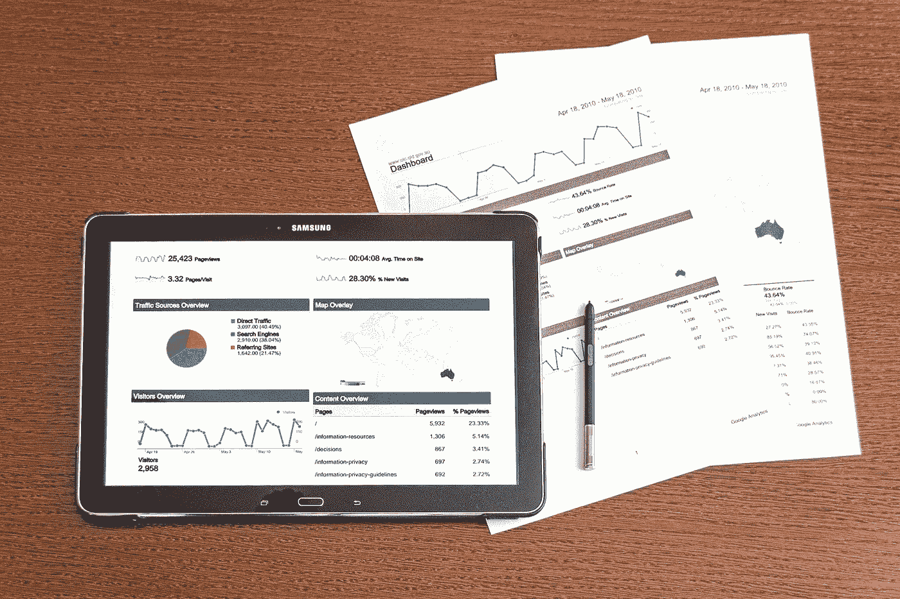

# RFM 细分:如何利用基于行为的客户细分

> 原文：<https://medium.com/analytics-vidhya/rfm-segmentation-how-to-leverage-behavior-based-customer-segmentation-c989fda280bc?source=collection_archive---------17----------------------->

RFM 分析:新近性、频率和货币价值

所有公司都有越来越多的基于行为的客户数据，对这些客户进行分类的简单而有效的方法是 RFM 细分。
RFM 细分是一种根据客户的行为(如近期、频率和货币价值)将我们的客户细分(集群)的解决方案。