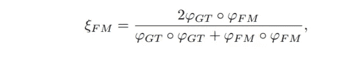
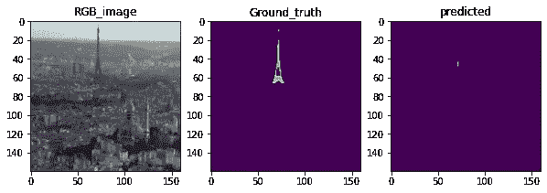

# 使用暹罗网络的 RGB-D 显著目标检测

> 原文：<https://medium.com/analytics-vidhya/rgb-d-salient-object-detection-using-the-siamese-network-3ff20ea04955?source=collection_archive---------8----------------------->

RGB _ 图像，地面 _ 真实，模型 _ 预测

# 简介:

显著目标检测(SOD)只不过是检测或识别图像中的目标，当人类看到该图像时，他/她通常关注该图像。已经开发了许多模型来使用 RGB 图像和深度图像进行 SOD，其中一些也是最先进的模型。这些现有的模型分别处理 RGB 图像和深度图像，以提取特征并融合这些特征用于最终预测。这些特征融合可以通过三种方式完成。早期融合 2。晚期融合和 3。中间融合如图。由于这些模型独立地从 RGB 和深度图像中提取特征，因此它们生成大量的参数，并且它们需要大量的数据来训练。

图片来自研究论文

在这里，我们正在实现一种新颖的联合学习和密集协作融合(JL-DCF)架构，这在 [**这篇**](https://arxiv.org/pdf/2008.12134.pdf) 论文中有所解释。与现有模型不同的是，该方法通过一个共享主干网络同时从 RGB 图像和深度图像中提取特征。它使用中间融合方法来融合特征。由于该方法使用单个 CNN 类型的网络来从两个输入中提取特征，因此它具有更少的参数和存储器，在计算方面比现有模型更好。模型的架构如下所示。

图片来自研究论文

该框架由两个模块组成:如上所示的联合学习和密集合作融合。联合学习组件将 RGB 图像和深度图像像 320 x 320 x 3 x 2 一样作为一批，通过暹罗网络(CNN)同时提取特征。这些特征然后通过 CP(压缩模块)被馈送到 DCF 组件，该 CP 模块通过侧路径接收来自暹罗网络的输入并压缩信道，然后在与 FA 模块的输出级联之前传递到交叉模式融合模块(CM)。

我们可以使用不同的网络，如 ResNet-101、ResNet-50、VGG-16 作为 JL 组件的主干。这里，在这个项目中，我们使用 Resnet101 和 VGG16 作为主干网络来训练不同的模型，并在 NJU2K 数据集上执行 SOD 任务。数据取自[这里的**这里的**](https://drive.google.com/file/d/1R1O2dWr6HqpTOiDn6hZxUWTesOSJteQo/view) 。

# 模型架构:

让我们更深入地理解模型架构，我们可以将整个框架分为两部分，即联合学习(JL)和密集协作融合(DCF)

## 联合学习:

在联合学习组件中，我们可以使用 CNN 类型的网络作为共享主干。如上图所示，我们将 RGB 图像和它在第四维(即像 320x320x3x2 这样的批处理维)中对应的深度图像组合起来，然后将其作为 CNN 网络的输入。如图所示，来自共享 CNN 骨干网的分级特征然后通过副路径以副输出的方式被利用。这些旁路包含不同的过滤器尺寸和通道号。这些旁路的输出具有不同的信道号，我们将它们传递到压缩模块(CP)(图 3 中的 CP1∞CP6，实际上由卷积层加上 ReLU 非线性实现)。在这个 CP 模块中，我们将特征压缩到标准的 k 个信道。这些 CP 模块的输出仍然是批量的，我们将这些输出馈送到 DCF 组件的跨模态融合(CM)模块。我们将最后一个压缩模块(即 CP6)的输出分成两部分，然后通过 1×1，1 卷积层，然后将这些输出与下采样的地面真实值进行比较，并计算损耗。这种损失被称为全局损失 Lg，骨干网从这种损失中学习，并通过反向传播得到更新。

## 密集合作融合(DCF):

CP 模块的输出包含成批的 RGB 和深度信息。我们通过跨模态融合模块(CM)将这些输出馈送到 DCF 组件。在这个 CM 模块中，我们首先分割批次，然后执行元素相加和元素相乘来进行特征融合，我们称之为合作融合，如图所示。数学上，让批特征由{Xrgb，Xd}表示，其中 Xrgb，Xd 表示 rgb 和深度特征张量，每个张量分别具有 k 个通道。CM 模块以如下方式进行融合:

CM({Xrgb，Xd}) = Xrgb ⊕ Xd ⊕ (Xrgb ⊗ Xd)

**来自纸张的 CM 模块图像**

其中“⊕”和“⊗”表示逐元素的加法和乘法。因为我们做了元素加法和乘法，所以混合输出仍然包含 k 个通道。

然后，我们将这些来自 CM 模块的输出提供给特征聚合(FA)模块。如上图所示，这些 FA 模块通过密集连接进行连接。在这些 FA 模块中，我们使用不同的卷积层和 max-pooling 层执行非线性聚合和转换，如图所示。最终的 FA 模块 FA1 具有最好的特征，我们将这些特征馈送到 1x1，1 卷积层以获得最终的输出。如图所示，该最终预测由训练期间调整大小的地面实况(GT)图监控。我们将这一阶段产生的损耗称为最终损耗，记为 Lf。

**来自纸张的 FA 模块图像**

# 损失函数:

我们模型的总损失函数由总制导损失 Lg 和最终损失 Lf 组成。假设 G 表示来自地面实况的监督，Sc rgb 和 Sc d 表示包含在模块 CP6 之后的批次中的粗略预测图，Sf 是模块 FA1 之后的最终预测。总损失函数定义为:

Ltotal = Lf (S f，G) + λ X x∈{rgb，d} Lg(S c x，G)，(2)

在本项目中，λ平衡了全局指导的重点，我们给出了相等的权重，即λ=1，我们采用广泛使用的 Lg 和 Lf 的二进制交叉熵损失为:

L(S，G)= Xi[Gi log(Si)+(1 Gi)log(1 Si)]，(3)

其中 I 表示像素索引，S ∈ {Scrgb，Scd，Sf }。

# 绩效指标:

出于评估目的，我们使用了五个指标，所有指标都是基于 FA1 模块的最终输出计算的。这些指标是:

1.  **精度:**精度可以定义为真阳性(TP)与真阳性(TP)和假阳性(FP)之和的比值。我们可以通过比较来自 FA1 模块的二进制输出和调整大小的二进制基础真值来计算精度。
2.  **召回:**召回可以定义为真阳性(TP)与真阳性(TP)和假阴性(FN)之和的比值。我们可以通过比较来自 FA1 模块的二进制输出和调整大小的二进制基础事实来计算召回率。
3.  **F-β测度:**F-测度可以定义为

其中β是精确度和召回率之间的权重。我们按照论文中的建议设定β^2 = 0.3。

4. **E-Score:** 在我们的任务中使用了增强对齐度量(E-measure)来评估模型的性能。 [**这篇**](https://www.ijcai.org/proceedings/2018/0097.pdf) 论文帮助我们更好地理解了度量。该度量同时考虑了像素级和图像级统计。它将按如下方式计算:

首先计算偏置矩阵ϕ，它是二进制(预测显著图)FM 的每个像素值与其全局平均值之间的距离。

**来自纸张的图像**

其中 A 是所有元素的值都为 1 的矩阵。计算前景图(FM)和地面实况(GT)的偏差矩阵，如ϕgt. ϕfm 然后，计算对齐矩阵ξFM，它是ϕFM 和ϕGT.之间的相关矩阵

**图片来自纸张**

其中，o 表示 Hadamard 乘积，它只不过是元素态乘积。现在，计算如下所示的增强对齐矩阵:

φFM = f(ξFM)

其中，f 是二次型函数 f(x) = 1/ 4 (1 + x) 2

最后，现在计算增强对齐度量(E-measure)

**图片来自纸张**

其中，w 和 h 是前景图即预测图的宽度和高度。

5.**平均绝对误差:**平均绝对误差可定义为

其中 Smap(x，y)和 G(x，y)对应于像素位置(x，y)处的显著值和地面真实值。

# 模型实现:

让我们一步一步地实现模型。分别构建模型的子部分，然后我们将使用一个功能 API 来组合所有这些部分。这里，我们使用 VGG16 主干构建模型。整个模型在 Tensorflow 中构建和执行。

1.  **VGG16 主干:**我们使用函数式 API 构建了没有顶部三个密集层的 VGG16。为了计算速度，我们将输入形状，即图像尺寸减少到 160×160×3。VGG16 的构造代码如下:

这里是[的**要诀**的](https://gist.github.com/sureshreddy129/a8cde790fb987b24a8d0e77b5a88f0fb)

下面是 [**要诀**](https://gist.github.com/sureshreddy129/f38474390c53143451fab82d97daa791)

2.**次要路径:**主干之后，我们必须构建次要路径。这些侧路径只不过是如图所示的具有不同参数的卷积层。下面括号中的参数从左到右依次是:内核大小、通道号、步幅、膨胀率和填充

**来自纸张的图像**

这些是本文中推荐的旁道参数，我们据此建立了旁道。我们在类对象中构建了这些侧路径，代码如下:

这里是[的**要诀**的](https://gist.github.com/sureshreddy129/6e3239fd5f336fc0cf568380d7c6a13d)

3.**压缩模块(CP):** CP 模块是简单的卷积层，其核大小为 3×3，滤波器数量为 64，如本文所建议的。

4.**跨模态融合模块(CM):**CM 模块的构建如上图所示。这里，我们必须首先分离 CP 模块的输出，然后进行元素加法和乘法。代码如下所示:

这里是[的**要诀**的](https://gist.github.com/sureshreddy129/910344be0e737c36aa483b40a7a334c1)

5.**特征聚合模块(FA):**FA 模块按照上面给出的 FA 图中的说明进行构建。代码如下:

这里是 [**的要诀**](https://gist.github.com/sureshreddy129/455e26caa23779367d7bb1a16e731d5f)

到目前为止，我们已经构建了模型所需的所有子模块。现在，让我们定义性能指标。我们使用 model.fit 中的回调函数计算指标。回调函数的代码如下:

**电子分数:**

这里是 [**的要诀**](https://gist.github.com/sureshreddy129/1c8302329f667df9f7697f964c0e1bf5)

所有其他指标:

这里是[**要诀**](https://gist.github.com/sureshreddy129/b34accf72bce046e0ed601c873a44074)

我们创建了所需的所有子模块和性能指标。现在，让我们建立最终的模型。

## 最终型号:

在这里，我们连接所有子模块并构建最终模型。首先，我们需要提供 RGB 图像和深度图像作为输入，需要形成一批 2 个图像，需要获得三个输出，两个来自联合学习组件，一个是最终输出。为此，我们使用 tensorflow 的多输入多输出模型。输入层的代码如下所示。

这里是[的**要诀**的](https://gist.github.com/sureshreddy129/e0ef95d583c27170d90112c5101e0509)

现在，我们将旁路与 VGG16 连接起来，如下所示:

side_path1 至 conv1_2

side_path2 至 conv2_2

side_path3 至 conv3_3

side_path4 至 conv4_3

side_path5 至 conv5_3

VGG16 网络的 side_path6 到 pool5。

我们将这些旁路连接到 CP 模块，并将这些 CP 模块的输出馈送到 CM 模块。为了连接 CM 模块的输出和 FA 模块的输出，我们必须以不同的速率对 FA 模块的输出进行上采样，以匹配 CM 模块输出的空间维度。最终模型的代码如下所示:

这里是[的**要诀**的](https://gist.github.com/sureshreddy129/f58509cd07a8a7f722f3c3e810cbe5e2)

现在，我们用 0.0001 的 learning_rate 用 Adam 优化器编译这个模型。尝试了不同的学习速率，但是 0.0001 给出了更好的收敛性。

像这样，我们建立了 4 个不同的模型，它们是:

1.  带 VGG16 和基本参数的 JL_DCF。这里是 [**代码**。](https://github.com/sureshreddy129/Salien-Object-Detection/blob/main/Case_Study2_basic_modelling_.ipynb)
2.  带有 VGG16 和附加 conv 层的 JL_DCF。这里是 [**代码。**](https://github.com/sureshreddy129/Salien-Object-Detection/blob/main/Case_study2_modified_.modelling.ipynb)
3.  带有 ResNet101 和基本参数的 JL_DCF。这里是 [**代码。**](https://github.com/sureshreddy129/Salien-Object-Detection/blob/main/Case_Study2_Resnet_basic_modelling_.ipynb)
4.  带有 ResNet101 和附加 Conv 图层的 JL_DCF。这里是 [**代码。**](https://github.com/sureshreddy129/Salien-Object-Detection/blob/main/Case_Study2_Resnet_modified_modelling_.ipynb)

对于带有额外 Conv 层的模型，除了 FA 模块中的现有层以及 CP6 和 FA1 的输出之外，我们还添加了额外的 Conv 层。

对于配有 Resnet101 网络的型号，我们只需更改主干网络，其余所有设置保持不变。由于 ResNet101 的第一个卷积层的步幅已经为 2，因此在我们的示例中，最浅级别的要素的空间大小为 80x80。为了获得完整尺寸(160x160)的特征而不进行琐碎的上采样，我们借用 VGG-16 的 conv1_1 和 conv1_2 层进行特征提取。侧 path 1∞path 6 分别连接到 ResNet101 的 conv1_2、conv1、res2c、res3b3、res4b22 和 res5c。我们还将 res5a 块的步距从 2 更改为 1。以上给出了这些模型的完整代码。

# 培训后分析:

在对四个模型进行了 40 个时期的训练后，我们对所有四个模型进行了训练后分析，以挑选最佳模型。对于这项任务，我们使用预测的图像和这些图像的 E 分数作为参考。基于这些预测和 E 分数，我们选择了 JL DCF，VGG16 作为主干网络，其他 Conv 层作为我们的最佳网络。[**这里的**](https://github.com/sureshreddy129/Salien-Object-Detection/blob/main/Post_training_Analysis.ipynb) 是岗位培训分析笔记本的全部代码。

在训练后分析中，我们还检查了模型对哪种类型的图像工作最差，我们将 E 分数小于 0.50 的图像区分为最差。在 397 个测试样本中，模型预测 14 个样本最差，占总样本的 3.52%。我们的结论是，在具有多个对象、低光照、模糊的图像以及具有薄且深的对象的图像上，该模型表现很差。对于这些图像，模型检测另一个对象，而不是在地面真实图像中被遮蔽的对象，如下所示:

**来自模型预测的图像**

# 构建最终检测系统:

到目前为止，我们用不同的参数建立了不同的模型，并在 NJU2K 数据集上对它们进行了训练。基于它们的性能，我们选择了具有 VGG16 和附加 conv 层的 JL DCF 作为我们的最佳模型。这里，我们正在构建最终的检测系统，其中模型以 RGB_image 和深度图像作为输入，并检测图像中的显著对象。 [**这里的**](https://github.com/sureshreddy129/Salien-Object-Detection/blob/main/Final_notebook_cs2.ipynb) 是最终的笔记本代码，我们部署了这个代码。下面给出了部署的演示视频。

 [## 模型的部署](https://drive.google.com/file/d/1fsF6P8M2NiZzxADug6FdhQBJZNemQJyQ/view?usp=sharing) 

# 未来工作:

我们仅在包含 1985 幅图像的 NJU2K 数据集上训练所有模型，如果我们在除 NJU2K 之外的其他 RGB-D 数据集上训练，模型的性能可能会提高。我们还可以通过锐化、旋转等数据增强来提高模型的性能。，我们也可以尝试 JL DCF 模型与其他骨干像 VGG19，ResNet152 和 DenseNet 等。和额外的 Conv 层来提高性能。

# Github:

你可以在这里看到我的代码

 [## GitHub-sureshreddy 129/Salien-Object-Detection:使用暹罗的 RGB-D 显著对象检测…

### 以暹罗网络为骨干的 RGB-D 显著目标检测-GitHub-sureshreddy 129/Salien-Object-Detection…

github.com](https://github.com/sureshreddy129/Salien-Object-Detection) 

# Linkedin 个人资料:

【linkedin.com/in/suresh-kumarreddy-573b25a1 

# 参考资料:

[https://www.appliedaicourse.com](https://www.appliedaicourse.com)

[用于 RGB-D 显著物体检测的连体网络及其他](https://arxiv.org/pdf/2008.12134.pdf)

[https://open access . the CVF . com/content _ ICCV _ 2017/papers/Fan _ Structure-Measure _ A _ New _ ICCV _ 2017 _ paper . pdf](http://.https://openaccess.thecvf.com/content_ICCV_2017/papers/Fan_Structure-Measure_ A_New_ICCV_2017_paper.pdf)

[http://dpfan . net/WP-content/uploads/ijcv 2021 _ s measure-minor . pdf](http://dpfan.net/wp-content/uploads/IJCV2021_Smeasure-Minor.pdf)

[https://www.ijcai.org/proceedings/2018/0097.pdf](https://www.ijcai.org/proceedings/2018/0097.pdf)

[https://online help . explorance . com/blueml/Content/articles/get started/ml calculations。htm？TocPath = Get % 20 started % 7C _ _ _ _ _ 3](https://onlinehelp.explorance.com/blueml/Content/articles/getstarted/mlcalculations. htm?TocPath=Get%20started%7C_____3)

 [## 功能 API | TensorFlow 核心

### 函数式 API 将模型视为层的 Dag。对于大多数深度学习架构来说是这样，但并不是所有的…

www.tensorflow.org](https://www.tensorflow.org/guide/keras/functional#models_with_multiple_inputs_and_outputs) 

[https://towards data science . com/one-shot-learning-with-siamese-networks-using-ker as-17 f 34 e 75 bb 3d](https://towardsdatascience.com/one-shot-learning-with-siamese-networks-using-ker as-17f34e75bb3d)

[https://towards data science . com/a-friendly-introduction-to-siamese-networks-85ab 17522942](https://towardsdatascience.com/a-friendly-introduction-to-siamese-networks-85ab17522942)