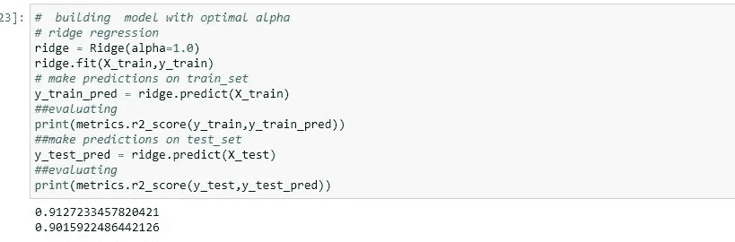
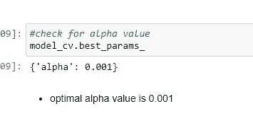

# Python 中的脊和套索回归

> 原文：<https://medium.com/analytics-vidhya/ridge-and-lasso-regression-in-python-60cf1af69cfe?source=collection_archive---------5----------------------->

尼古拉斯·洛沃斯在 [Unsplash](https://unsplash.com?utm_source=medium&utm_medium=referral) 上的照片

在我以前的帖子中，我谈到了与脊和套索回归相关的理论以及它们背后的数学方程。

在本文中，让我们用 python 实现脊和套索回归。

**注**:如果你不知道山脊和拉索背后的数学和理论概念，我强烈推荐你点击这个链接:[https://manojgadde . medium . com/ridge-and-lasso-regression-made-easy-343 df45 a90 b 9 # 4be 1-463 c284 CFB 2d](https://manojgadde.medium.com/ridge-and-lasso-regression-made-easy-343df45a90b9#4be1-463c284cfb2d)

## **简介:**

幸运的是，实现任何机器学习算法并不困难，Scikit-learn 库提供了许多机器学习算法。让我们使用 scikit-learn 库实现脊和套索回归。

在这种情况下，我们使用的是令人惊讶的住房数据集，我们需要使用正则化建立一个回归模型，以预测未来房产的实际价值，并决定是否投资。

你可以在这里找到数据集:[https://www . ka ggle . com/c/house-prices-advanced-regression-techniques/data](https://www.kaggle.com/c/house-prices-advanced-regression-techniques/data)

**注意**:我不会经历所有的预处理步骤，我会直接跳转到脊和套索实现。

我们将数据集分为 70%的训练规模和 30%的测试规模，并使用 minmaxscaler 缩放训练和测试数据。

## **1。岭回归:**

这里，我们从 sklearn 库导入了 ridge，并使用 X_train 和 y_train 拟合模型，其中 y_train 包含目标变量，即“销售价格”, X_train 包含所有独立变量。

这里需要注意的一点是，我们向岭传递了一个名为“alpha”的附加参数，这个 alpha 只是岭回归数学方程中的λ值，这个 alpha 也是一个要调整的超参数，我们需要找出最佳的 alpha 值。

我们只取一个 0.01 的随机 alpha 值，看看我们的岭回归模型在训练数据上表现如何。这里，我们在训练数据上得到 91%的 r2 分数。

让我们对测试数据进行预测，以检查我们的模型在看不见的数据上表现如何。

我们得到了 89%的 r2 分数，这相当不错，但我们不能说这个 alpha(0.01)值是唯一的最佳 alpha 值，我们需要使用 gridsearchcv 找到最佳 alpha 值，让我们这样做吧

## **超参数调谐:**

这里，我们已经定义了 kfold(5 倍)交叉验证和阿尔法值范围，即超参数值，并选择评估指标作为 r2 得分，我们得到了 1.0 的最佳阿尔法值，并使用该阿尔法值再次训练我们的模型。

因此，最终使用最佳 alpha 值 1.0 给出了岭回归的最佳训练(91%)和测试(90%)结果。

**注**:岭回归也降低了系数的大小。

## 2.**拉索回归:**

这里，我们从 sklearn 库中导入 lasso，并使用 X_train 和 y_train 拟合模型，其中 y_train 包含目标变量，即“销售价格”, X_train 包含所有独立变量。

## **超参数调谐:**

这里，我们使用了 5 重交叉验证，定义了 alpha 值的范围，并选择评估指标为 r2 分数，得到了最佳 alpha 值 0.001。让我们使用这个 alpha 值再次训练我们的模型，我们得到的训练和测试分数几乎相似。

**注意:** lasso 回归也使冗余变量系数为零，这意味着它将有助于特征选择。

我们关于山脊和套索回归的 python 实现的文章到此结束。我希望这篇文章能帮助你理解 python 的实现。

这是我的第二篇媒体文章，如果你喜欢这篇文章，请在下面为这篇文章鼓掌以示支持，这真的激励我写更多有趣的文章，如果你有任何问题，请在下面留下评论，我很乐意收到你的来信。

我是一个数据科学爱好者，目前正在班加罗尔国际信息技术学院攻读机器学习和人工智能的 pg 文凭。

你也可以在[www.linkedin.com/in/manoj-gadde](http://www.linkedin.com/in/manoj-gadde)找到我