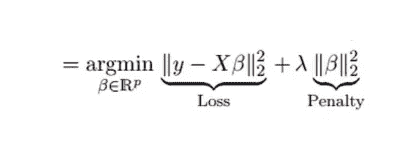
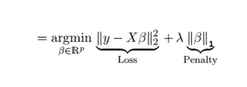

# 脊和套索回归变得容易

> 原文：<https://medium.com/analytics-vidhya/ridge-and-lasso-regression-made-easy-343df45a90b9?source=collection_archive---------7----------------------->

由 [Unsplash](https://unsplash.com?utm_source=medium&utm_medium=referral) 上 [Greg Rakozy](https://unsplash.com/@grakozy?utm_source=medium&utm_medium=referral) 拍摄的照片

在本文中，让我们来理解正则化回归中的两种不同技术

1.  里脊回归
2.  套索回归

让我们从理解什么是正规化开始学习。

**什么是正规化？**
在 ml 中，我们经常会遇到这样的情况:我们的模型在训练数据上表现很好，但在看不见的数据上却无法推广(过拟合条件)或(低偏差和高方差条件)。正则化是一种降低模型复杂性的方法，或者是一种创建最佳复杂模型的过程。由于高系数值和大量特征，模型的复杂性增加，正则化的目标是处理这两个问题。

1.  **岭回归(L2)**

正则化成本函数有两个组成部分误差项，正则化项

这里的损耗只是一个误差项，后面跟着一个正则项，“lambda”是一个需要调整的超参数或平衡因子，“beta”是系数的平方和。因此，通过改变' **λ'** ，我们正在控制惩罚项，如果 **λ=0** 则意味着我们仅使用误差项而没有任何惩罚，如果' **λ'** 是一个高值，则意味着惩罚更大，因此系数的幅度减小，选择最佳' **λ'** 值很重要。

本质上，岭回归的目标是通过降低系数的大小来降低模型的复杂性。我们也可以说岭回归解决了多重共线性问题。

2.**拉索回归(L1)**

lasso 的意思是“最小绝对收缩选择算子”,它类似于岭回归，唯一的区别是 lasso 使用系数的绝对值，它使冗余特征的系数为零，这意味着它有助于选择最佳特征。

即使对于' **λ'** 的小值，特征的系数减小到零，我们需要选择最佳的' **λ** 值。

注意:我们也可以使用**弹性网**，它是脊线和套索回归的组合。假设我们有一个 500 个变量的情况，如果我们使用 ridge，它只会减少系数的大小，如果我们使用 lasso，它会将冗余要素的系数减少到零(要素选择)，这将导致信息丢失，这里使用弹性网很好，它在大型数据集上表现良好。

我们关于正则化回归的文章到此结束。我希望这篇文章能帮助你理解正则化回归。

这是我的第一篇媒体文章，如果你喜欢这篇文章，请在下面为这篇文章鼓掌以示支持，这真的激励我写更多有趣的文章，如果你有任何问题，请在下面留下评论，我很乐意听到你的意见。

我是一名数据科学爱好者，目前正在班加罗尔国际信息技术学院攻读机器学习和人工智能的 pg 文凭。

你也可以在 www.linkedin.com/in/manoj-gadde 找到我