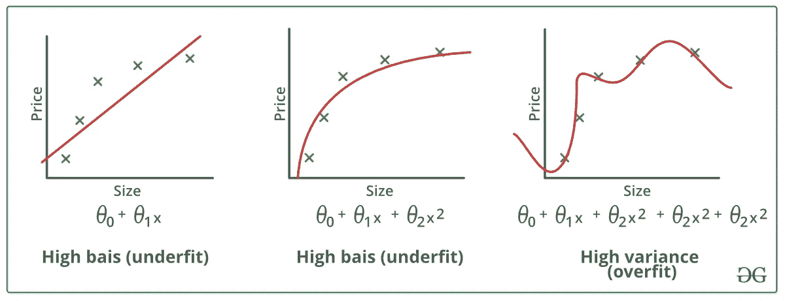
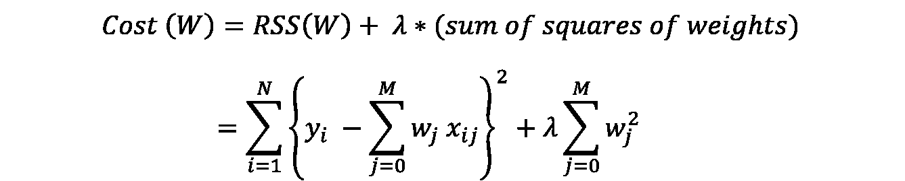
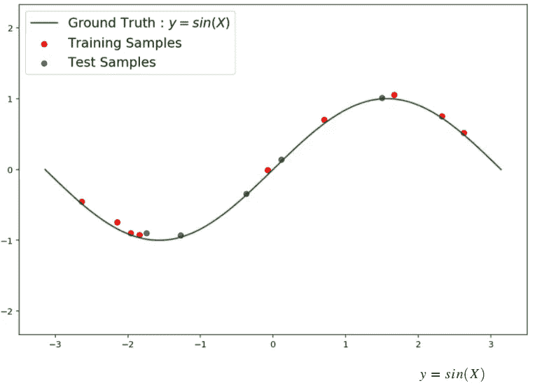
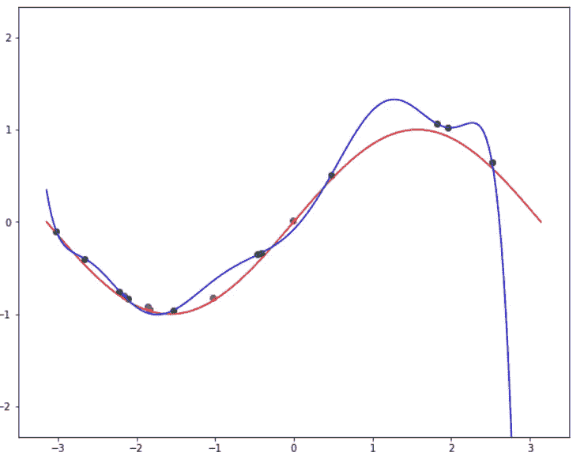
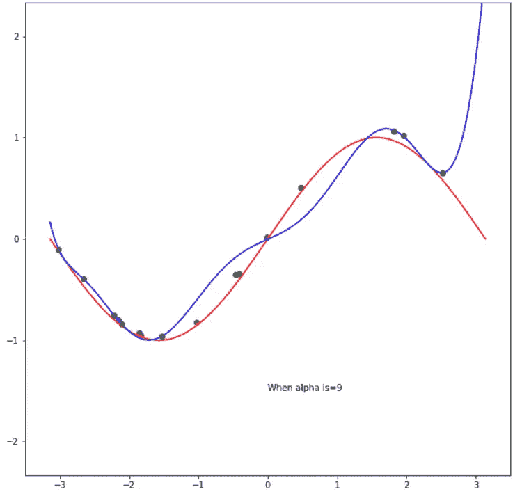

# 里奇或 L2 正则化

> 原文：<https://medium.com/analytics-vidhya/ridge-or-l2-regularization-43ae5c3037cf?source=collection_archive---------24----------------------->

为了克服过拟合和欠拟合的情况，使用了正则化方法。L2 或岭正则化就是这样一种技术。

# 过拟合和欠拟合是什么意思？

当模型的特征过于复杂，并且在训练集上给出高精度而在测试集上给出低精度时，就称之为过度拟合。

L2 正则化是一种向这样的系统添加惩罚以减少方差的方法。

乘坐回归公式

如果斜率太高，增加λ x(斜率)可确保惩罚，从而减少复杂特征。

# 举例理解

从图像中可以明显看出，这是 sin(x)的函数，模型将在训练样本上进行训练，然后用于预测测试样本，以研究其行为。

当λ设置为零时，基本上意味着没有应用正则化，过度拟合模型看起来有点像这样

过度拟合模型

当λ设置为 9 时，让我们看看效果

λ被设置为 9

请注意 1 附近圆顶形状的**变化，这是因为我们的成本函数因其更陡的斜率而惩罚了模型。**

如果你想使用不同的参数或者检查正则化技术的代码，请点击下面的链接

[Github 回购链接](https://github.com/RheagalFire/L2-Regularization/blob/main/L2-Regularization.ipynb)