# 从数字上看，乘风破浪。

> 原文：<https://medium.com/analytics-vidhya/riding-the-wave-numerically-85f1ef461c95?source=collection_archive---------6----------------------->

有限差分法简介及其在数值求解偏微分方程中的应用。

图像[来源](https://www.insynergy.net.au/insights/tidal-wave-effect/)

宇宙是一个复杂的实体，其中各种自然现象由依赖于多个变量并具有非线性行为的方程控制。这些方程可以采用常微分方程或偏微分方程的形式。在之前的[文章](/analytics-vidhya/flying-a-rocket-numerically-404ed271ee23?sk=01af95073fd59344c7d7ed4559cad5f1)中，我们看到了数值求解常微分方程(ODEs)的数值积分方法。在这篇文章中，我们将试图理解什么是偏微分方程，然后使用有限差分方法来解决一个物理现象。在这个过程中，我们还将学习一些广泛的 python 函数和库。

# ODE vs PDE

在常微分方程的情况下，我们根据时间积分解。因此，我们需要知道***u***vs***t***曲线上某一点的解，然后，从那里，我们可以整合我们的解，也称为*初值问题*。这意味着我们的解决方案只依赖于时间的演变，因此，一个单变量函数。然而，在 PDEs 的情况下，属性的解的演化可能依赖于时间 ***t*** 和一个空间维度(或更多)，比如说 ***x*** 。

# 线性对流

线性对流方程是双曲方程的最简单形式，可用于了解 PDEs 的数值解。我们将使用一维形式的方程来进一步简化解决方案。这个等式可以写成

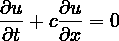

这只是以速度***【c】***(此处为常数)向右(沿正 ***x*** 方向)传播任何轮廓，而不改变其形状。这也是为什么其有时也被称为*(或*平流方程*)。*

*这是双曲偏微分方程中的一个重要概念，也被称为 ***特征***——这些是时空中的曲线，沿着这些曲线解是常数。与这些曲线相关联的是波速，以该波速传递关于溶液如何变化的信息。*

*为简单起见，我们将使用方波初始条件，定义如下:*

*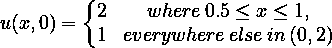*

*我们还需要一个关于 ***x*** 的边界条件:设***u = 1***at***x = 0***。我们对于数值解的空间域范围将是 ***x ∈ (0，2)*** 。*

*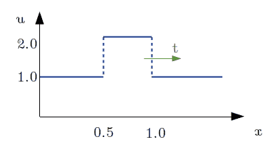*

*方波初始条件(图片由作者提供)*

# *有限差分*

## *区域离散化*

*想象一个时空图，垂直方向的坐标代表时间上的推进——比如说 ***tⁿ*** 到 ***tⁿ* ⁺** 水平方向的坐标代表空间上的推进——比如说***xᵢ₋₁******xᵢ***和 ***xᵢ₊₁*** 。这将创建一个网格，其中的点同时具有空间和时间索引。下面的每个网格点具有对应于向右增加的空间位置的索引 I 和对应于向上增加的时刻的索引 n。*

*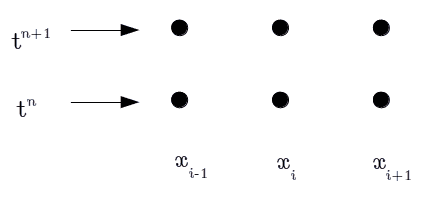*

*时空格网(图片由作者提供)*

*对于数值解***【x，t】***，我们将使用上标表示时间索引***【uⁿ***，下标表示空间索引***【uᵢ***。一个小网格段在每一点的数值解如下:*

*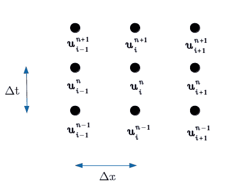*

*位于 **i，n** 的网格点及其邻居(图片由作者提供)*

## *方程离散化*

*是时候在空间和时间上对一维线性对流方程进行离散化，并在我们在上一节中描述的时空网格上使用它了。根据定义，相对于 ***t*** 的偏导数仅随时间变化，而不随空间变化，即仅指数 ***n*** 受影响。类似地，相对于 ***x*** 的偏导数仅随空间而不随时间变化，即仅 ***i*** 指数受影响。*

*从导数的定义，我们知道对于***δx***足够小:*

*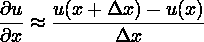*

*但这不是我们估计导数的唯一方法。一阶导数 ***∂u/∂x*** 在任一点的几何解释是，它代表曲线***【x】***切线的斜率。*

*我们有三种可能的方式来表示 ***∂u/∂x*** 的离散形式，如下所示:*

*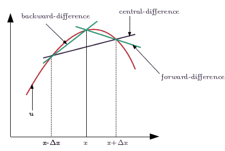*

*三种有限差分(图片由作者提供)*

*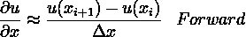**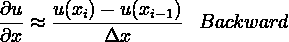**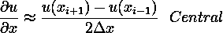*

*[欧拉方法](/analytics-vidhya/flying-a-rocket-numerically-404ed271ee23?sk=01af95073fd59344c7d7ed4559cad5f1)相当于使用时间导数的前向差分方案。让我们坚持这一点，选择空间导数的后向差分格式。我们的离散方程变成:*

*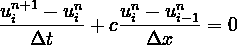*

*其中 ***n*** 和 ***n+1*** 是时间上连续的两步，而 ***i-1*** 和 ***i*** 是离散化后的 ***x*** 坐标的两个相邻点。在给定初始条件的情况下，这个离散化过程中唯一未知的是 ***uᵢⁿ* ⁺** 。*

*我们解出这个未知数，得到一个方程式，让我们及时步入:*

*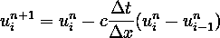*

*但是这里到底发生了什么？让我们回到网格视图。*

*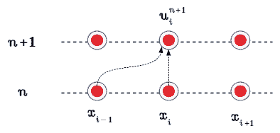*

*“向前时间/向后空间”方案的模板(图片由作者提供)*

*因此，我们可以观察到，下一个解 ***uᵢⁿ* ⁺** 是从相邻网格点的前一个解中导出的。这个图叫做 ***蜡纸*** 。*

# *数解*

*现在让我们开始使用 python 吧！首先，我们需要加载数组和绘图库。*

*现在让我们定义一些变量。请注意，我们希望在空间域内创建一个均匀间隔的点网格。*

*现在，我们将使用一些 NumPy 函数来定义我们的初始条件。比如，`np.ones()`定义一个`nx`元素长的数组，每个值为 ***1*** 。然后，我们将数组的一部分更改为值 ***u=2*** ，以获得带有 NumPy 函数`np.where()`的方波，该函数返回一个索引列表，其中向量 *x* 满足某些条件和`np.logical_and()`，这些条件计算给定范围的真值。*

*有了指数列表，我们现在可以更新初始条件，得到方波。*

*我们用一个情节来看初始条件。*

*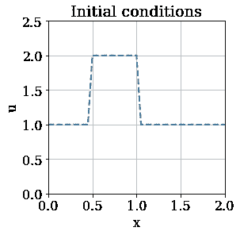*

*是时候用我们选择的有限差分格式为对流方程的离散形式写一些代码了。对于数组`u`的每个元素，我们需要求解上面看到的离散化方程。*

*我们将结果存储在一个新的数组(临时)`un`中，这将是下一个时间步的解 ***u*** 。该操作将在所有时间步重复进行。我们将初始化占位符数组`un`来保存我们为 ***n+1*** 时间步长计算的值，再次使用 NumPy 函数`np.ones()`。*

*作为一个更大的图片，我们有两个迭代操作，一个在空间中，即在一个时间瞬间在空间中的每个网格点求解方程，然后通过***δt***来步进时间。所以，我们可以从在时间循环中嵌套一个空间循环开始。*

*这里，我们没有在每次迭代中强加边界条件，因为我们的离散化不会改变`u[0]`的值。*

*让我们画出我们最终的解决方案。*

*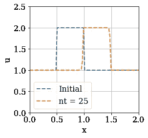*

*从图中可以看出，波以 25 个时间步长向右移动，保持了波的特征。如果我们想看到波浪实时移动，我们需要更进一步来创建动画。*

*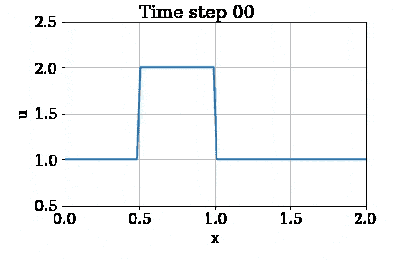*

*注意，对于这里使用的 gif，mp4 视频剪辑是使用 Matplotlib 的*动画*模块和 IPython.display 的 *HTML* 模块创建的。*

# *结论*

*我们看到了由一阶双曲型偏微分方程控制的方波是如何沿一个方向传播的。对剧情和动画的快速观察显示，波动实际上有点失真。这是因为离散化的方程是我们要求解的连续微分方程的近似。*

*完整的代码可以在的链接[中找到。](https://github.com/sidhantjain90/Numerical-Methods/blob/master/SquareWaveModel.ipynb)*

*如果你喜欢这篇文章，想让我发表更多这样的文章，请打个掌，评论一下！*