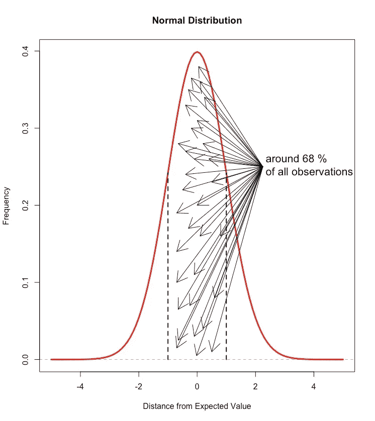
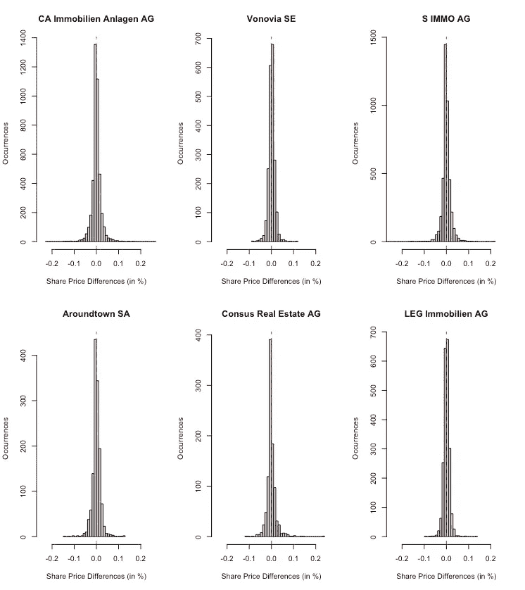
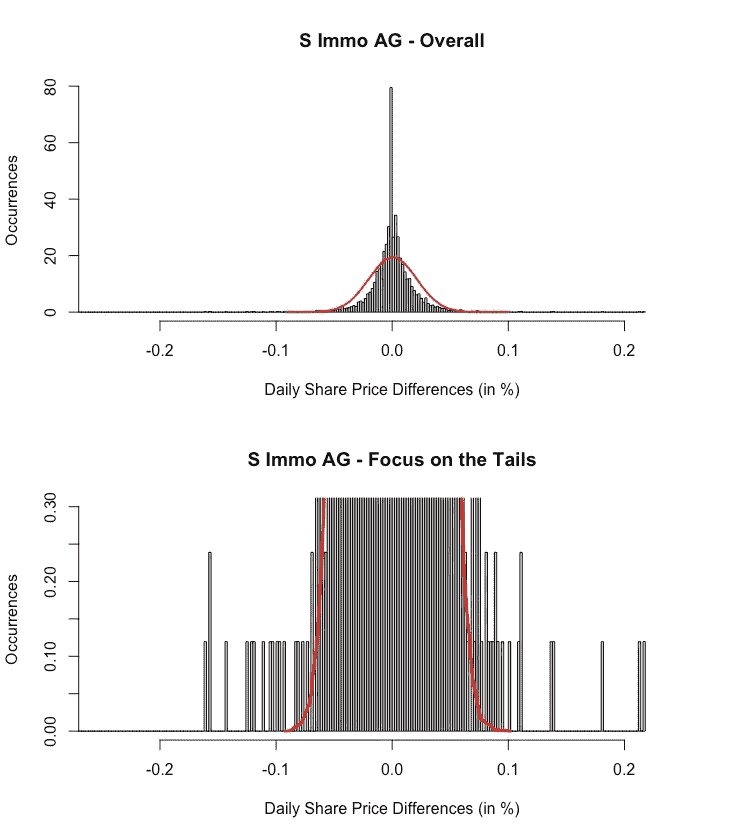
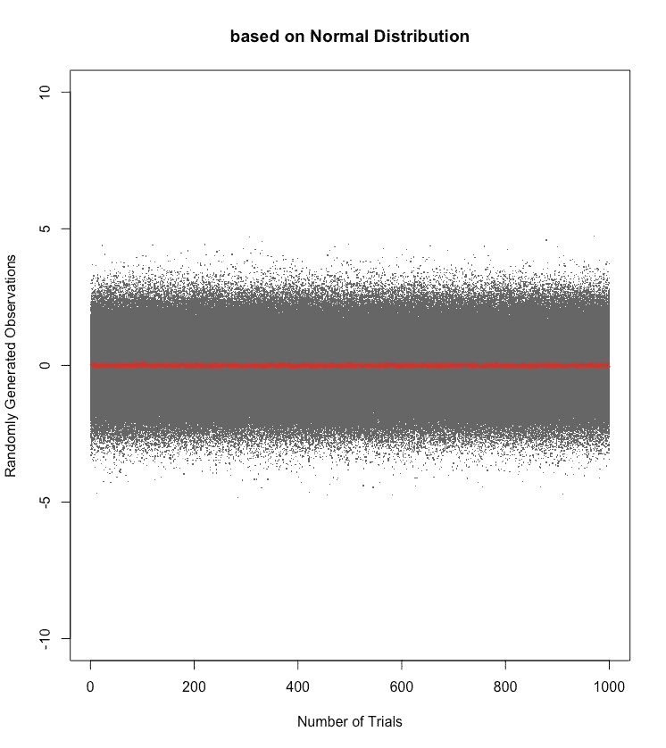
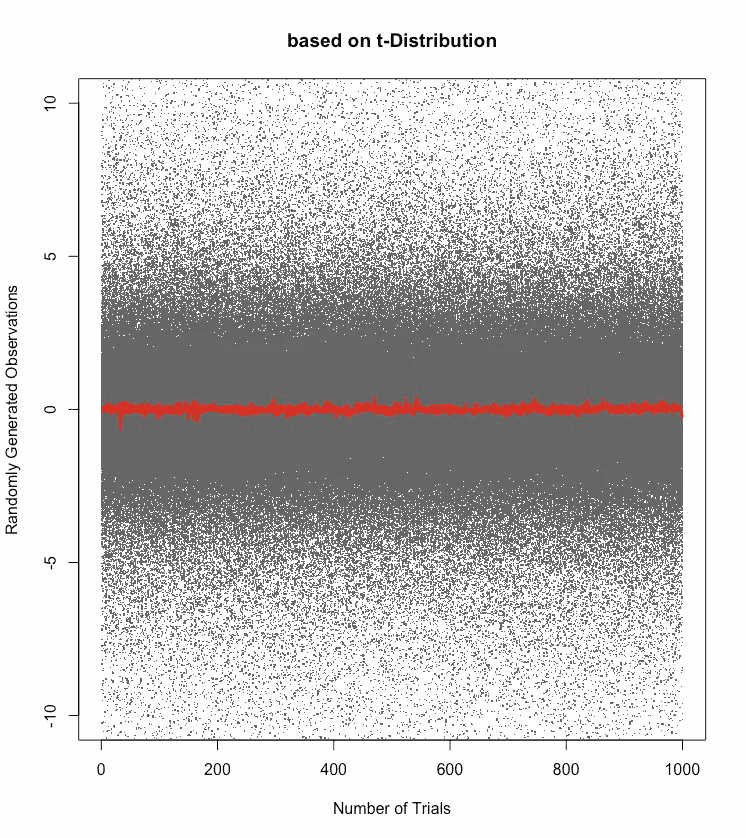
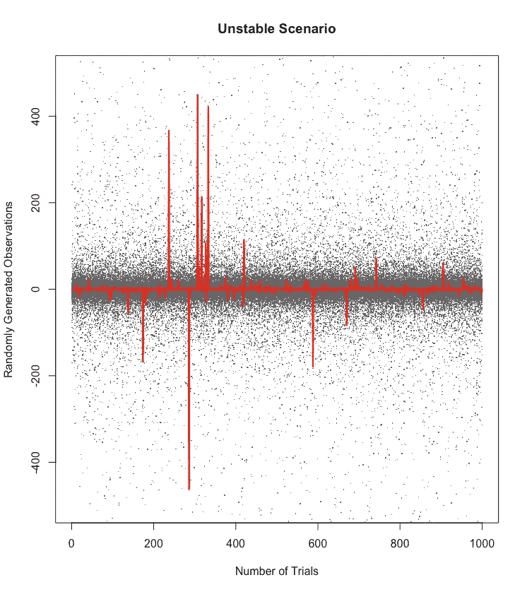

# 风险管理——保持形象

> 原文：<https://medium.com/analytics-vidhya/risk-management-keeping-up-appearances-bc3369e97eae?source=collection_archive---------3----------------------->

# 三适马事件的神话

在我们开始之前，同名电视剧的风信子水桶女士(发音为' *bu:ke:* '而不是' *baket* ')可能会原谅我在本文中使用了相同的标题。

尽管如此，风险管理框架可能会诱使你产生一种错误的印象，即通过**保持良好的风险覆盖**的外表，一切都在控制之中。

对风险进行识别、彻底分析和评估，并最终纳入管理信息系统的工作流程，以确保对风险进行持续监测并及时向相关决策者报告。

然后——不可思议的事情发生了。一个**风险事件触发**，这**超出了任何可能的范围**以至于**没有人浪费任何时间或精力来建立适当的防御措施**。

当一个公司运气好的时候，这种极不可能发生的事件并不会造成太大的伤害。但当它发生时，这只不光彩的黑天鹅就有能力从财务上摧毁一个组织。

无论如何，当面对这种情况时,“3-sigma”事件的**颂歌就会出现。在每一次更严重的危机(如 1987 年的股市崩盘或 2007 年至 2009 年的大金融危机)之后，都会有这样一种持续的讨论:这样的发展是多么不可思议。**

举个例子，让我引用纳斯达克主页上的一篇文章:

> “根据一般统计原则，大约每 31，560 天，或者大约 126 年中的一个交易日，就会发生一次 4-sigma 事件。预计每 3，483，046 天就会发生一次 5-sigma 事件，即每 13，932 年发生一次。”

每 13，932 年有 1 天的几率——所以为什么还要麻烦呢？

因为那些 3-sigma、4-sigma、5-sigma 甚至更多的 sigma 事件**经常发生**！

但是为什么呢？

# 注意风险假设

风险评估是在对手头数据可能如何表现的一系列假设下完成的。

问题是，在大多数情况下，可用的数据只是一个快照，一个当前的表现，后院正在发生的事情。而正是这种快照(即样本)可能无法准确揭示总体人口的行为。

如何处理这类问题，这里可能看[这里看](/analytics-vidhya/strategic-risk-management-in-real-estate-a-snapshot-into-simulations-d2ddb0bbe724)。

**另一个令人惊讶的主要来源**来自于这样一个事实:许多风险管理模型都是基于数据呈正态分布(正态分布，也称为高斯分布)的**假设。**

这是什么意思？

正态分布的数据在大多数观察值中围绕期望值(分布的平均值)聚集。离期望值越远，观察值出现的可能性就越小(期望值和观察值之间的距离用标准差表示)。

问题是，距离越短，这种可能性越小。请参见下图:

作者图片

在这里，期望值等于 0。在距离预期值 1 个标准偏差(见虚线)的范围内，大约 68 %的观察发生。两个标准偏差的距离已经覆盖了大约 96 %的观察值。

因此，在这些“正态分布”假设下，3-sigma 事件(或更高事件)的概率小于 0.3 % —可以说是极不可能的。

这正是问题所在。在很多情况下，现实生活中的数据并不遵循正态分布。

# 一个例子:股票价格

基于正态分布假设运行的风险模型可能**忽略数据的尾部区域**。然而，这是离群值或极端值隐藏的领域。

**这就是为什么一些真正重大的事件预计会发生，比如*“126 年来的第一个交易日”*，但却发生得更加频繁。**

为了说明这一点，让我们看看(房地产)股价。

最近我在 LinkedIn 上读到，一般来说，股价波动性很低，每日价格差异经常在零附近波动。

我不能谈论所有的资产类别，但在维也纳和法兰克福交易的房地产股票样本证实了这一点。以下是几家上市房地产公司每日股价差异的摘录:

作者图片

因此，**试图用正态分布**(红线)来近似那些公司(灰色区域)**之一的每日股价差异**的发展结果是**不是这样的燃烧器**。S Immo AG 为例:

作者图片

我们在上图中看到的是，即使是正态分布对中心的压力也太小，即每天几乎没有价格差异。

经验观察表明，在 60 %的情况下，每日价格差异在+/- 1%以内。另一方面，正常近似值允许在此范围内有 37 %的每日价格差异机会，这要低得多。

下图显示了与正态分布近似相比，经验数据的尾部行为。

在这种情况下，正态分布过早“淡出”,忽略了极端事件，即每个方向的价格差异超过 10 %。从经验上看，每日价格上涨超过 10 %的概率为 0.5 %。与此相反，正态分布会给我们 0.0001 %的机会

听起来没那么壮观，是吗？

尽管使用“西格玛事件”术语，**我们的风险模型**(基于正态分布的**)会低估 5-西格玛事件发生的 5000 倍**。

五千次！这就是“一生一次”的惊喜的来源，也是为什么它们发生得如此频繁。

如果一个组织开始对这 0.5 %的概率做出反应，那就是另一回事了，主要取决于潜在事件对这个组织的影响。

# 另一个视角

让我们假设，我们合并了一个风险模型，该模型假设相关数据集呈正态分布。

如果我们使用模型随机生成数据(例如，1，000 次试验，每次试验有 1，000 次观察)，我们将得到以下结果:

作者图片

大部分随机生成的观察值(灰色数据点)与预期值(红线)相差 2σ以内。请记住，在正态分布中，大约 96 %的数据位于平均值的 2 倍标准差范围内。

任何事情似乎都是稳定的，3-sigma 事件(或更高)是绝对罕见的事件。

但是，如果你的真实风险框架表现如下:

作者图片

数据点(灰色区域)更加分散，尾部有**更多的“生命”(即 sigma = |3|或更多)。因此，平均值比正态分布的情况更不稳定。**

**如果你试图用一个 3-sigma 事件已经非常罕见的风险模型来涵盖这个现实环境，你可能会面临一些令人不快的意外。**

最后，让我们看看**真正不稳定的风险暴露场景**:

作者图片

不要被图表中庞大的灰色区域所迷惑。大多数观测值聚集在 10 到 15σ(！)从平均值(红线)。在这种情况下，平均值相当不稳定，冲击事件的频率相当高。

在这种情况下，数据框架遵循属于极值分布类的柯西分布。

无论如何，尝试通过基于正态分布假设的风险模型来涵盖这种环境…

# 结论

正如《风险与随机性》中的大领主纳西姆·尼古拉斯·塔勒布所说

> 当有人告诉你这是一个 10 sigma 事件时，意味着它是 10 个标准差，并且是高斯分布的；除非信息来自上帝，否则你可以拒绝该域的高斯分布。

换句话说，**对观察到的数据**作出错误的假设，并用不适当的概率分布(尤其是正态分布)**对其进行近似，会导致在评估一家公司的风险敞口**时得出完全错误的结论。

作为一名**决策者**，你必须**了解管理信息系统得出其风险结论的背景**。

**否则**，你可能会**被引诱到一个良好的风险敞口的错误印象中，而潜在的灾难就在拐角处等待着——远远没有被注意到**。

一个**精心调整的风险模型**，在所有**严密组织的随机模型**面前，**是一家公司以适当方式覆盖其风险敞口的关键**。

# 参考

闪光修正暴跌了多少 Sigmas？凯文·库克在 nasdaq.com/articles/2020 年 3 月 4 日

纳西姆·尼古拉斯·塔勒布/ 2020 肥胖尾巴的统计结果

关于 10-sigma 事件的纳西姆·尼古拉斯·塔勒布简短演讲:[https://www.youtube.com/watch?v=k_lYeNuBTE8&ab _ channel = nnta leb % 27 sprobabilitymoocs](https://www.youtube.com/watch?v=k_lYeNuBTE8&ab_channel=NNTaleb%27sProbabilityMoocs)