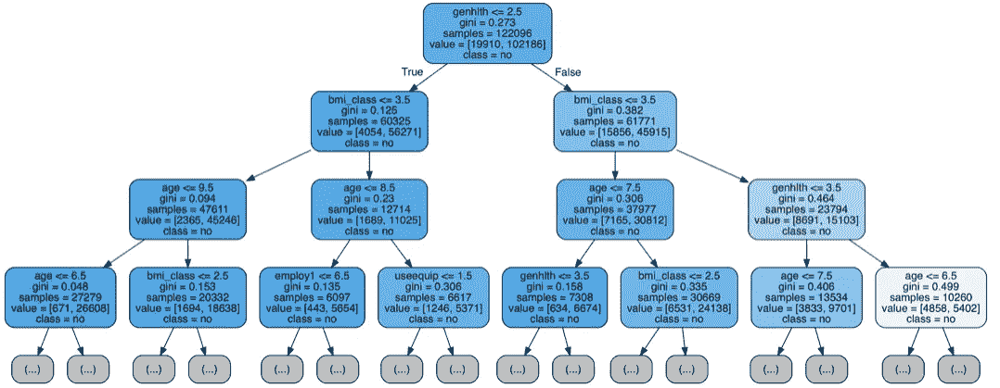

# II 型糖尿病的风险预测(Python 中的随机森林模型)

> 原文：<https://medium.com/analytics-vidhya/risk-prediction-models-for-type-ii-diabetes-random-forest-model-in-python-a512b13da26c?source=collection_archive---------6----------------------->

在萨福克大学的商业分析硕士课程中，我们有一门 Python 入门课，这是数据分析的一个组成部分。我们已经讨论了 Python 开发环境、语法和基础。然后，用熊猫文库进行探索性数据分析和假设检验。在所有的基础知识之后，我们深入到主要的统计概念和模型，如线性回归、训练-测试分割、偏差-方差权衡、K-最近邻(KNN)和分类。然后，我们学习了逻辑回归、决策树，最后我们学习了数据 API 和时间序列介绍。我们的核心书籍是由 Andreas C. Müller & Sarah Guido 所著的[《Python 机器学习导论》。](https://www.amazon.com/Introduction-Machine-Learning-Python-Scientists/dp/1449369413)

这篇文章将描述我在本课程结束时完成的最终项目。该项目基于两项研究[“使用机器学习技术为二型糖尿病构建风险预测模型”，作者分别是谢 Z、尼古拉耶娃 O、罗 J、李 D.](https://www.cdc.gov/pcd/issues/2019/pdf/19_0109.pdf) 和[“为二型糖尿病开发风险预测模型:方法和报告的系统回顾”由柯林斯 GS，马利特 S，奥马尔 O，余 LM。](https://bmcmedicine.biomedcentral.com/track/pdf/10.1186/1741-7015-9-103)


用于分析的数据来自[行为风险因素监测系统(BRFSS)](https://www.cdc.gov/brfss/index.html) ，该系统收集美国居民健康相关的电话调查数据。由于 BRFSS 调查数据文件的格式不同于 csv 格式，我使用了 github 上的 Winston Larson 的作品，他在 github 上做了大量的 BRFSS 数据提取和清理工作。

2014 年的原始数据有 279 个变量和 464，644 条记录。基于上面提到的同行评议文章，我选择了 26 个主要的个人和一般健康相关特征，如一般健康、身体质量指数、年龄、睡眠时间等。目标变量表示对“您是否被告知患有糖尿病？”的回答为*是*或*否*的二元分类问题。源代码可以在[链接](https://github.com/asoloveva/Random_Forest_Modeling_BFRSS_Data_Type2_Diabetes/blob/master/Random%20Forest(CDC%20Project).ipynb)中查看。

# 清洁

第一步，我们排除 30 岁以下可能患有 1 型糖尿病的人，怀孕的人和患有前期糖尿病的人，这些人不是我们的主要关注点。下一步，我们永久删除 NA 值，剩下 143，383 个观察值供我们分析，我们运行*描述*函数，在NA 值删除*后，检查数据的汇总统计。*此外，我们为每个变量构建了一个直方图，以验证它们是否正态分布。

```
*# Dropping permanently NA values and run summary statistics*
df.dropna(inplace=**True**)
df.describe()
df.hist(figsize=(20,20))
```

下一步是检查我们的数据是否平衡，当我们的目标变量在一个类别中的相对频率比另一个类别中的相对频率低时，这是推荐的(对于我们的主要问题“您是否被告知患有糖尿病？”)

```
# Is our data balanced? It is!
df.diabete3.value_counts(normalize=**True**)
```

来自 Pandas 库的上述 *value_counts* 函数产生包含唯一值计数的比率。在我们的例子中，它给出了以下比率:0.83 人回答*否*，0.16 人回答*是*。最好有一个 10%左右的平衡比例，或者使用基于 Daniel T.Larose 的书*“发现数据中的知识-数据挖掘简介”*的重采样技术

在我们验证了我们的数据是平衡的，有 16%的比例后，我们将我们的特征(个人和健康信息)分配给 X，将我们的目标变量(是或否答案)分配给 y。

```
feature_cols =['genhlth','age','bmi_class','checkup1','income2','race','mscode','flushot6','employ1','sex','marital','education','sleptim1','cvdcrhd4','hlthcvr1','menthlth','chckidny','useequip','exercise','addepev2','renthom1','exerany2','blind','decide','hlthpln1','smoker']

X = df[feature_cols]
y = df.diabete3
```

# 创建训练和测试数据

下一步是将数据分成两个数据集，即训练数据集和测试数据集。对于这些数据，我使用 70/30 的方法，留下 30%的数据用于测试。Sikit-learn 库有一个函数 *train_test_split* ，该函数随机拆分训练集和测试集上的数据。随机状态参数设置为 50，用于控制估计器的随机性。(简单地说，每次运行模型时，我们都会得到相同的随机精确分割，并且每次运行都不会不同)。

```
X_train, X_test, y_train, y_test = train_test_split(X,y, random_state = 50, test_size=0.3)
```

# 决策树模型

首先创建一个简单的决策树模型，以便在最后将其与随机森林模型进行比较。Sikit-learn 库有一个*决策树分类器*函数，用于创建一个决策树分类器，然后拟合训练数据。用来衡量分割质量的默认标准是“基尼系数”。树的最大深度是默认的 None(这肯定不是最好的方法；然而，它不会干扰项目的目标)。该功能的其余参数可在[文档](https://scikit-learn.org/stable/modules/generated/sklearn.tree.DecisionTreeClassifier.html)中找到。

```
*# Make a decision tree and train*
tree = DecisionTreeClassifier(random_state=50)*# Train tree*
tree.fit(X_train, y_train)
```

然后，我们使用拟合的模型，通过 Sikit-learn 库中的*预测*函数进行预测。该函数获取拟合数据并预测新数据的标签。另一个函数， *predict_proba，*为每个类找到一个概率。

```
*# Using fitted model and Make predictions*
X_train_tree_predictions = tree.predict(X_train)
X_train_tree_probs = tree.predict_proba(X_train)[:, 1]tree_predictions = tree.predict(X_test)
tree_probs = tree.predict_proba(X_test)[:, 1]
```

下一步是用 *roc_auc_score* 函数根据我们的预测得分计算受试者工作特征曲线下的面积(ROC AUC)。它显示了我们的分类模型在所有分类阈值的性能。在我们的例子中，ROC AUC 是 0.59。

```
*# Calculate ROC AUC*
roc_value = roc_auc_score(y_test, tree_probs)
```

现在，我们需要检查哪些特征在预测糖尿病中是最重要的。特征重要性函数确定最重要的特征是一般健康、收入、睡眠时间和年龄。

```
feature_tree = pd.DataFrame({'Feature': feature_cols,
                   'Importance': tree.feature_importances_}).\
                    sort_values('Importance', ascending = **False**)
```

最后一步是进行样本检验，如交叉验证(CV ),以确定我们模型的最终估计。对于该步骤，我们使用 *cross_val_score* 函数，并将 k-folds 设置为 10，并计算这些交叉验证分数平均值。在我们的例子中，分数是 0.76，准确率为 76%。

```
scores = cross_val_score(tree, X, y, cv=10, scoring= 'accuracy')
np.mean(scores)
```



*决策树可视化*

# 随机森林模型

随机森林建模过程包括与决策树模型构建过程相似的所有步骤。随机森林是产生具有所有这些树的平均预测的类的树的集合。在我们的例子中，我们构建了 100 棵树，我们没有指定树的最大深度。

```
*# Create the model with 100 trees*
model = RandomForestClassifier(n_estimators=100, max_features='sqrt', oob_score=**True**, random_state=50, n_jobs=-1, verbose = 1)

*#Fit the Model on Training data*
model.fit(X_train, y_train)
```

接下来，我们使用我们的拟合模型进行预测，并找到每一类的概率，就像我们之前对决策树模型所做的那样。

```
*#Using fitted model, make predictions*
X_train_rf_predictions = model.predict(X_train)
X_train_rf_probs = model.predict_proba(X_train)[:, 1]

rf_predictions = model.predict(X_test)
rf_probs = model.predict_proba(X_test)[:, 1]
```

下一步是使用 *roc_auc_score* 函数根据我们的预测得分计算 ROC AUC。在这个模型中，ROC AUC 是 0.78，比我们在决策树模型中得到的要高。

```
*# Calculate ROC AUC*
roc_value = roc_auc_score(y_test, rf_probs)
```

现在，我们需要检查哪些特征在预测糖尿病中是最重要的。特征重要性函数确定最重要的特征是收入、睡眠时间、年龄和总体健康状况。

```
*# Compute feature importances*
feature_model = pd.DataFrame({'Feature': feature_cols,
                   'importance': model.feature_importances_}).\
                    sort_values('importance', ascending = **False**)
```

最后一步是运行交叉验证(CV ),以确定我们模型的最终估计。在随机森林模型中，准确率为 0.84，比简单决策树模型高 8%。

```
scores = cross_val_score(model, X, y, cv=10, scoring= 'accuracy')
np.mean(scores)
```

谢谢你和我一起阅读或完成这个项目！我真的很感谢你在评论中的反馈或使用的其他模型的例子。欢迎任何问题和批评！

# 参考

[1]谢 Z，尼古拉耶娃 O，罗 J，李 d .利用机器学习技术为建立风险预测模型.Prev 慢性 Dis 201916:190109.http://dx.doi.org/10.5888/pcd16.190109external 图标。

[2]柯林斯 GS，马利特 S，奥马尔 O，余 LM。为二型糖尿病开发风险预测模型:方法和报告的系统回顾。BMC Med 20119(1):103.[https://BMC medicine . biomed central . com/articles/10.1186/1741-7015-9-103](https://bmcmedicine.biomedcentral.com/articles/10.1186/1741-7015-9-103)

[3] Larson W .利用疾病预防控制中心的数据对健康和行为的见解。【https://github.com/winstonlarson/brfss 号

[4]纳尔逊 j .决策树。摘自《统计学习导论》第八章。【http://faculty.marshall.usc.edu/gareth-james/ 