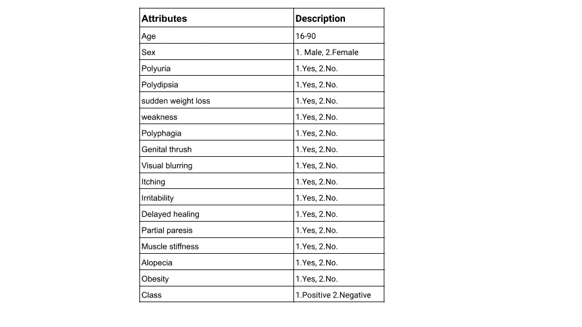
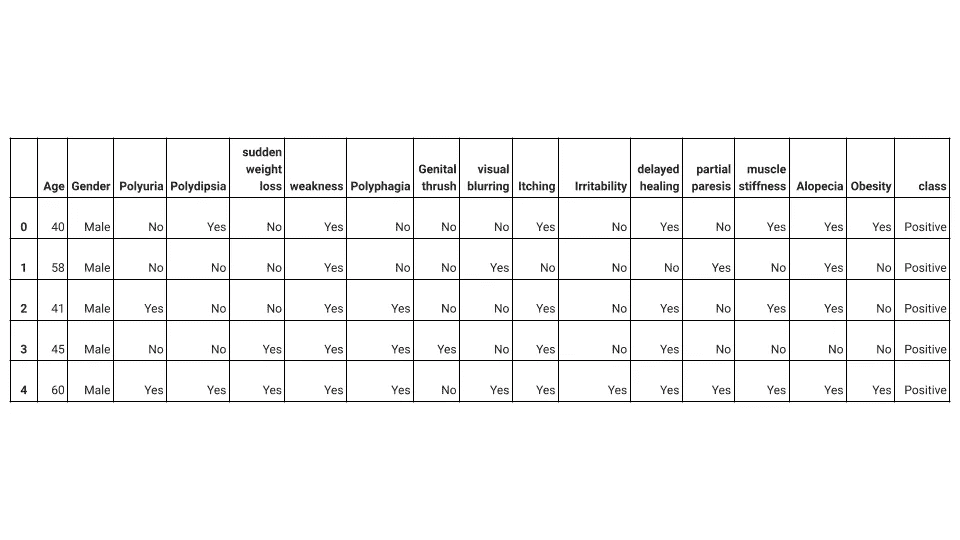
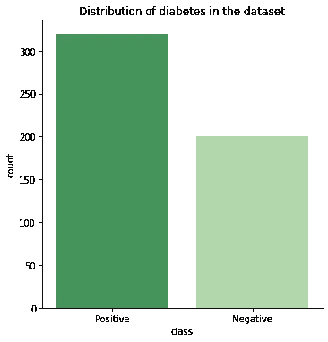
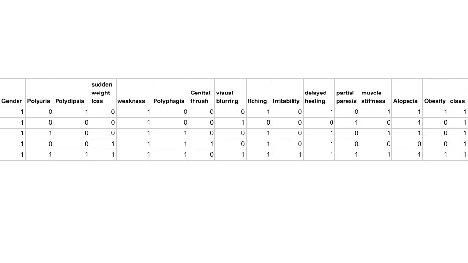
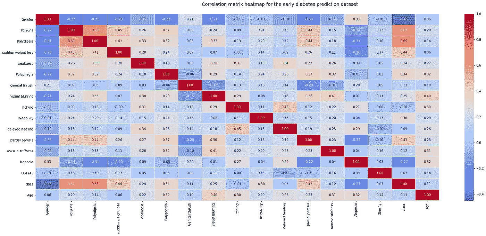
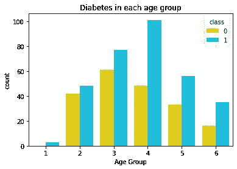
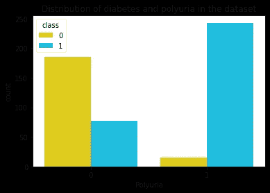
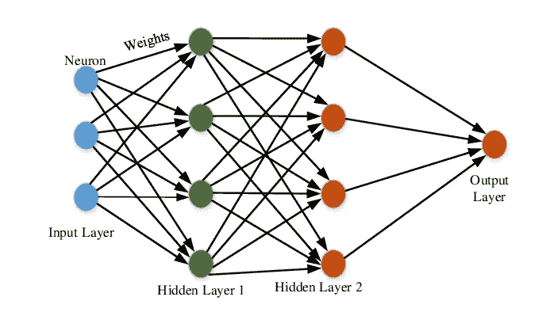
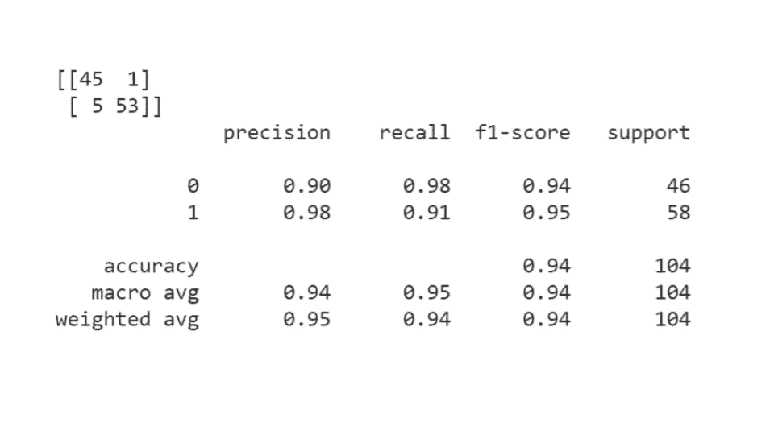

# 基于机器学习方法的早期糖尿病风险预测

> 原文：<https://medium.com/analytics-vidhya/risk-prediction-of-diabetes-at-an-early-stage-using-machine-learning-approach-fe8eb256b6f8?source=collection_archive---------14----------------------->

糖尿病是增长最快的慢性威胁生命的疾病，影响着全球超过 4.22 亿人。2 型糖尿病主要由环境因素和生活方式选择引起。这是一种发展缓慢的疾病，在发展成疾病之前就开始出现代谢指标，通常通过空腹血糖测试进行诊断。这里使用的数据集包含 520 名患者的糖尿病相关症状的报告。它包括关于人们的数据，例如他们的年龄、性别和可能导致糖尿病的症状。该数据集是由孟加拉国 Sylhet 的 Sylhet 糖尿病医院的一份直接问卷创建的，并在一名医生的监督下填写。

在这份报告中，考虑了其他代谢指标来诊断糖尿病前期人群。糖尿病医学数据集(早期糖尿病数据集)是从加州大学欧文分校 [(UCI)机器学习库中收集的。](https://archive.ics.uci.edu/ml/datasets/Early+stage+diabetes+risk+prediction+dataset.)

**本项目的研究问题是:**常见和不太常见的糖尿病症状能否用于早期预测？

**数据描述:**

数据集没有任何缺失值。此数据集的数据形状有 16 个属性，将用于预测结果，类变量为正(表示个人有糖尿病)，类变量为负(表示个人没有糖尿病)。我们有 16 个用于预测糖尿病类别的属性。除年龄之外的所有属性都有两个唯一结果的分类数据。患者的年龄在 16 到 90 岁之间。数据集中没有缺失值。

数据集描述

df.head(5)

61.5%的患者患有糖尿病，38.5%的患者没有糖尿病。37%的患者为女性，67%的患者为男性。90%的女性和 45%的男性分别患有糖尿病。

# **数据操作:**

数据集从非数字标签转换为数字标签，为机器学习和关联功能准备数据。

从 sklearn 导入预处理

进口熊猫作为 pd

从 sklearn 导入预处理

进口熊猫作为 pd

标签=预处理。标签编码器()

定义分类标签(列):

返回 label.fit(col)。转换(列)

df= df.apply(分类标签)

df.head()

#关联矩阵热图

f，ax = plt.subplots(figsize=(28，10))

corr = df.corr()

hm = sns.heatmap(round(corr，2)，annot=True，ax=ax，cmap="coolwarm "，fmt = ' .2f '，

线宽=.05)

f .支线剧情 _ 调整(top=0.93)

t= f.suptitle(“早期糖尿病预测数据集的相关矩阵热图”，fontsize=14)

来自肖恩伯恩

多尿和多饮与糖尿病的相关性最高(相关系数分别为 0.67 和 0.65)。年龄与糖尿病的相关性较低(相关系数为 0.11)。年龄被分类(1.15-25，2。26–35，3.36–45，4.46–55，5.56–65，6.65 以上)，以进一步研究其与糖尿病的关系。

Category= pd.cut (df['Age']，bin =[15，25，35，45，55，65，90]，labels=['1 '，' 2 '，' 3 '，' 4 '，' 5 '，' 6'])

df。插入(7，“年龄组”，类别)

患者年龄分布中，年龄组 4(46-55 岁)的人较多。年龄组和糖尿病之间没有统计学上的显著关系，因为糖尿病在所有年龄组中的分布相似。进行卡方检验，得出 p 值为 0.076。p 值> 0.05，因此我们无法拒绝年龄组和糖尿病之间没有关系的无效假设。

在进行卡方检验以研究多尿症和糖尿病之间的关系后，获得的 p 值小于 0.05。因此，我们拒绝零假设，并得出结论，多尿症和糖尿病之间有显著的关系。

## 用多层感知器预测糖尿病

来源:使用软计算技术预测每月电力需求( [**艾萨克·科菲·恩蒂**](https://www.researchgate.net/profile/Isaac_Kofi_Nti) **，** [阿萨福-阿杰·塞缪尔](https://www.researchgate.net/scientific-contributions/Asafo-Adjei-Samuel-2158785917))

多层感知器是首选的神经网络，因为它在医学领域广泛用于预测复杂的疾病过程。数据被分成训练和测试部分，以训练和评估神经网络的性能。隐藏层大小调整为 3 层，每层 11 个节点，并使用默认的最大迭代次数 1000。

MLP = MLP classifier(hidden _ layer _ size =(11，11，11)，max_iter=1000)

mlp.fit(X_train，y_train.values.ravel())

对数据进行训练后，对测试数据进行预测，最后对算法的性能进行评估。根据混淆矩阵，104 名患者中有 6 名被错误分类，导致 95%的准确率和 94.5%的 F 值，这是良好的预测指标。

MLP 机器学习模型结果

结论:从混淆矩阵来看，104 例患者中有 6 例被错误分类，其准确率为 94%，F 值为 94.5%。这些都是很好的预测指标。使用机器学习方法，常见和不太常见的糖尿病症状都可以用于糖尿病的早期预测。MLP 机器学习模型是一个很好的拟合，因为它的准确性。

[点击获取 Github 笔记本:](https://github.com/Fellylove/Buildweek-projects/blob/main/Early_Diabetes_prediction_portifolio_project.ipynb)