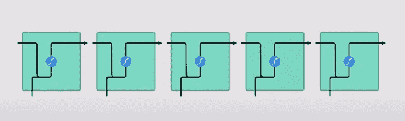

# RNN 和 lst ms-5 分钟内轻松掌握概念

> 原文：<https://medium.com/analytics-vidhya/rnn-and-lstms-easy-concept-grasp-in-under-5-minutes-ff1a106e4674?source=collection_archive---------16----------------------->

# **RNN =递归神经网络:**

RNNs 的主要用途是预测数据序列。例如:诗歌生成器或自动填充句子。当我们谈论 RNNs 时，我们脑海中会出现这样的图片。这些只是基本的 RNN 细胞。

RNN 模型演示

# **需要记住的一些基本知识:**