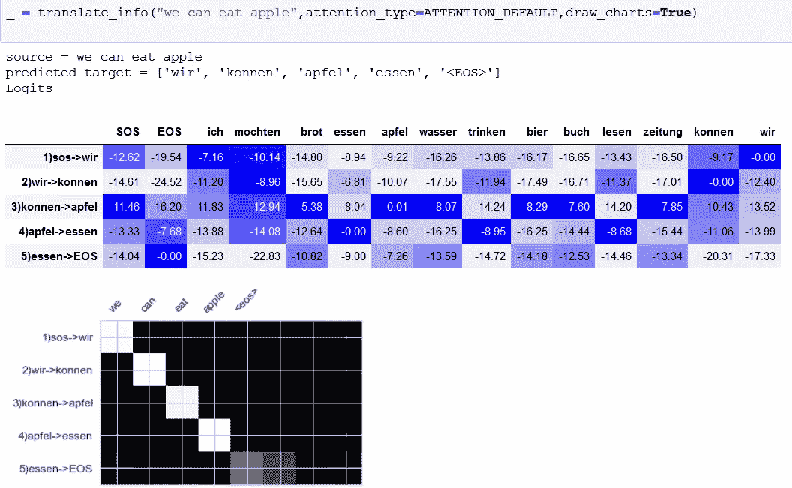
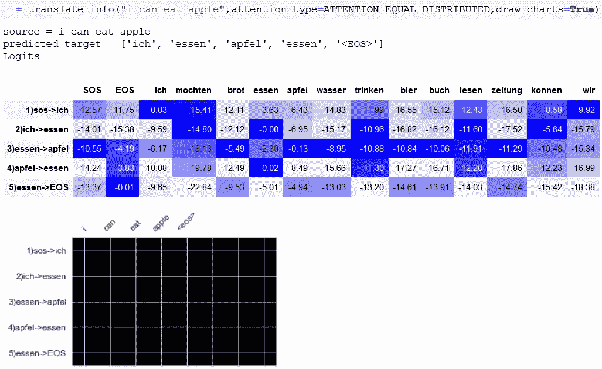
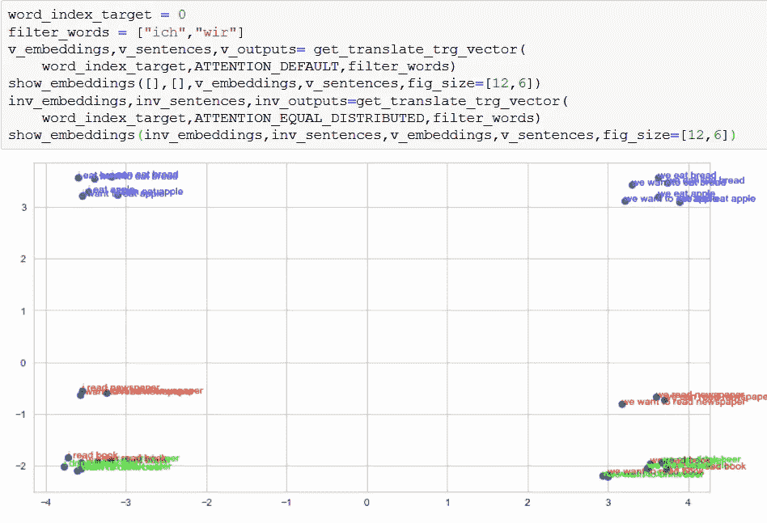
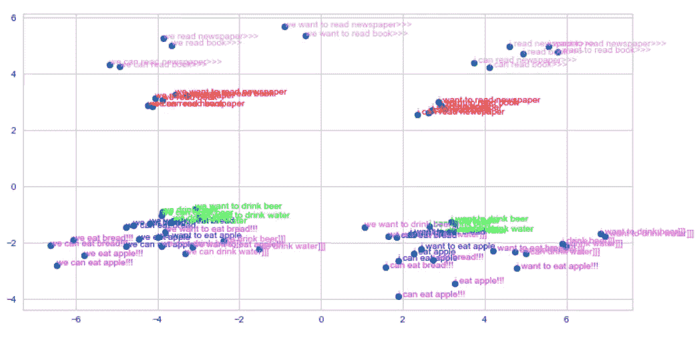
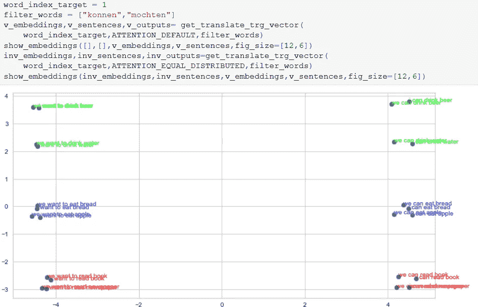
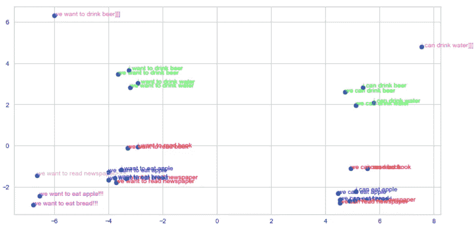
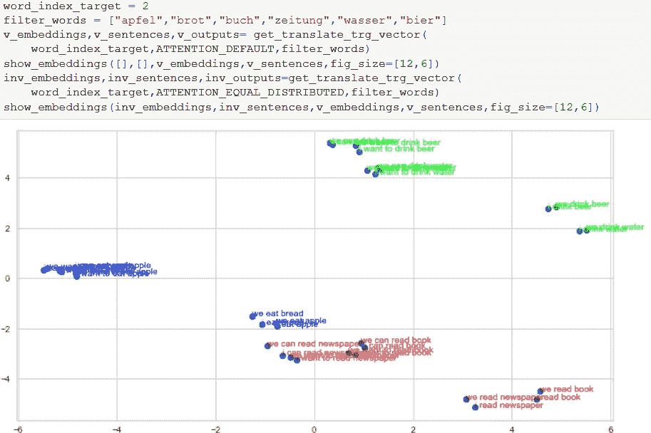
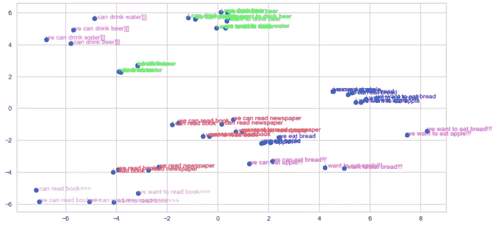

# 注意单元测试的 RNN

> 原文：<https://medium.com/analytics-vidhya/rnn-with-attention-unit-testing-825b2963d31e?source=collection_archive---------23----------------------->

我写过一篇 **Transformer(自我关注)**机制的教程。([链接](https://celikkam.medium.com/nlp-transformer-unit-test-95459fefbea9))那个教程从注意力机制开始似乎有点难，所以我决定做一个更简单版本的**注意力**对 **RNN** 。标题有点误导:)我只是想写一个非常小的，可测试的和类似单元测试的东西，所以你可以测试网络的小部分。虽然标题有点误导，但我认为我创建了一个可测试的网络，你可以玩网络的不同部分，看看它对整体架构的影响。
代码在 github( [链接](https://github.com/mcelikkaya/medium_articles/blob/main/rnnattention.ipynb) )
中，用于使用 nbviewer ( [链接](https://nbviewer.jupyter.org/github/mcelikkaya/medium_articles/blob/main/rnnattention.ipynb))查看彩色视图

我假设你已经知道**编码器-解码器**的架构，并对注意力机制有所了解。为了更好地理解，我将只尝试解释、想象一些注意力方面。我将尝试用一个非常简单的数据集来形象化注意力的好处。

该数据集包含英语到德语的句子。这是一个平衡的集合，每个单词在它的组(主语、宾语、动词)中出现的频率相同。有一种“想”的模式，导致翻译长短不一。此外,“能”和“想要”模式在翻译中导致不同的顺序，因此翻译也必须了解位置。还有简单的句型“我吃苹果”和情态动词，生成不同的(动词、宾语)顺序。即使你不懂德语，单词也很简单。你可以查下表，看看哪个单词对应哪个英语单词。此外，句子非常简单，不完全正确(丢失的文章…)事实上，你可以改变第二栏，把你的语言和尝试。(还必须将笔记本中的德语单词换成您的语言中的单词。)

在 RNN 编码器-解码器中(无需关注)，我们创建编码器状态的摘要，并将此作为初始状态提供给解码器。解码器使用这个初始状态，在第一步产生输出字。然后在下一步，使用解码器最后状态，并丢弃编码器状态。如果我们不仅仅总结和创建 1 个向量(在编码过程结束时)，而是在解码过程的所有步骤中使用所有编码器状态(编码过程中的所有步骤)，会发生什么？这会提高我们网络的建模能力吗？

编码过程从源句子的第一个单词开始，并为以“eos”结尾的输入句子创建向量。【sos，我，能，吃，苹果，eos】。这个过程有 5 个步骤。这里我们给编码器这 5 个向量，创建 5 个输出向量。在**第 8 行**你可以看到循环，它在每一步创建编码器输出向量。(查看 tensorFromSentence 方法以了解输入准备)

当我们完成编码过程，我们有 5 个矢量的 5 个编码步骤。现在我们想学习这些在目标语言(德语)中的表示。在上面的代码行 18，我们开始一次创建一个输出向量。正如你在第 20 行看到的，"**编码器 _ 输出**"向量在这个过程中总是一个参数。
为什么我们在所有步骤中都使用这个输入，而不是在初始步骤。语言有不同的顺序。因此，我们可以假设源语言的 5 个步骤在解码所有状态时并不同等重要。所以最好把这些都交给解码器，让它学习这种潜在的关系。

我想我给出了 100 个句子，形式为" **I can 动词宾语**"英语句子，其中将有一个翻译为" **Ich konnen 宾语动词**"。正如你在德语中看到的，动词和宾语的顺序是变化的。当我们通过训练重复这个编码-解码过程时，我们的网络就学会了这种交换。怎么会？因为在每个时期，我们都会计算损耗，并更新我们的权重，因此我们的网络层权重会进行这种交换计算。

如果你检查解码器代码，我们正在学习一种带有 torch.nn.Embedding 的编码，并注意创建一个。并将这 2 ^ 2 个向量与“attention_combine”，线性层(第 11 行)组合。所以解码器使用两个数据源并一起学习它们。所以注意力向量并不是网络唯一使用的东西，对此要小心。有时你可以看到网络把很多注意力放在错误的单词上，但仍然做出正确的猜测。

检查第 9 行，有一个创建矢量的 torch . nn . embedding 层。NLP 问题中的向量是输入的多维表示。如果你想写出一个单词的所有语言属性，你需要几千列。苹果->“红色、可食用、水果、颜色(红、黄、绿)、形状、质地、神话、科学……”。因此，实际上，NLP 问题是对这种有限资源的无限表示的近似。所以当你为一个 **torch.nn.Embedding** 层定义维度(256)时，实际上就是用一个 256 的维度来表达这个无穷无尽的矩阵。我们对网络所做的是，用我们的数据来近似这个维度上的真实值。

# 注意与否

正如我上面展示的，解码器有复杂的(没有那么多)架构来计算输出。而注意力只是其中的一部分。我可以写一个测试代码来展示注意力的重要性吗？假设我们有两个句子。
**-我们吃苹果
-我们吃面包**
我们会为【我们，吃，苹果，面包】生成向量，为句子生成向量。我们在 RNN 注意到的是，利用编码过程的步骤，改变解码步骤的重要性。所以我会消除这种注意力变化的重要性，把所有的步骤都视为同等重要。如果你认为，这是我能做的测试效果的最小改变。为了展示这一点的重要性，我将把这个过程创建的矢量转储到 2d 上。

我有一个方法叫做 translate_info，它展示了翻译的逻辑性和自我关注。 **Logits** 是 Softmax 之前分类模型的原始(非标准化)分数。在这个笔记本中，方法是 LogSoftmax，所以要小心，值都是负数。越接近 0，越好。(思考对数图)

翻译是从输入**【SOS】**生成下一个单词，直到生成输出**【EOS】**的过程(或者到我们尝试的最大长度)。所以当你看到下图时，它显示了每个翻译步骤的逻辑和注意事项。所以如果输入句子是**“我能吃苹果”**，翻译过程有 5 个步骤，**“ich konnen apfel essen<EOS>”**。

**逻辑和注意事项**

查看表格第一行。

**"1)sos- > wir"** 显示当前预测步骤，“sos”是当前单词“ich”将在该步骤结束时生成的单词，颜色显示最可能的列。在其他教程中他们写“ **sos** ”，但我认为这种方式更好。

如果您检查**,**的得分为 0.0，概率最高。检查其他步骤以更好地理解。你仍然可以认为，即使所有的值都是负的，最接近 0 的值是最好的。上面的热图显示了对所有步骤的关注。在翻译步骤 1，注意力在**“我们”**，在步骤 2，注意力在**“能”**。检查每一步，并理解网络如何在每一步运用注意力。由于我们在这一步生成了 **"we"** ，在第二行 u 见 **"2)wir- > konnen"** ，这意味着第二步解码器已经生成了【sos，ich】并将生成“konnen”。(如果运行 notebook，可能会有不同的结果，因为数据集很小，有时网络可能会过度适应，或者因为数据非常小，它可以在不注意的情况下学习生成正确的输出。)

# 可视化解码器输出

AttnDecoderRNN 处有一个名为**“output”**的向量。我在翻译过程的每一步都保存这个向量。我将用两种方式生成它。第一，我将应用 RNN 编解码器注意(默认方式)。第二种方法，我会告诉网络不要使用学习过的向量，只是对所有的编码句子使用相同的注意力。我将努力展示这一变化所带来的不同。字面意思是，认为在所有的输出步骤中，所有的输入状态都是同等重要的。

还有我一定要小心，不要**去“拿橘子和苹果比”**。例如，如果我在第一步检查输出向量，网络必须正常生成**【ich】**或**【wir】**。我的第二个网络可以生成不同的东西，如果翻译如此糟糕，但我只会选择那些创建了**【ich】**或**【wir】**的网络。我的意思是，即使没有适当的注意，对于一些句子，网络仍然会在第一步产生**【ich】**。所以我要调查一下这个**【ich】**和另一个**【ich】**是否不同。所以我比较苹果和苹果，橘子和橘子。

让我给你看一个逻辑和注意力的例子，用“平均分配注意力”来说明我的意思。在下图中，您可以看到注意力热图完全是黑色，因为注意力在任何地方都是一样的。由于网络逐步学习注意力，当注意力相等时，网络不知道根据当前状态它必须产生什么。“essen -> apfel -> essen”序列实际上是我们训练集中多个模式的组合。网络不知道翻译步骤的确切位置。当它生成足够多的“ **apfel** ”、“**埃森**”时，它就能明白它必须生成“ **eos** ”。

以下是收集解码过程输出的方法。

在上面，我得到所有的句子(第 2 行)，我用 **attention_type** 输入(适当地或同等地注意)翻译它们(第 7 行)，然后我收集“AtnnDecoderRNN”层的“**输出**向量。我检查输出长度(第 9 行)和 filter_words(第 10 行)，如果它们符合我的期望，就保留结果。

在下面你可以看到我是如何调用这个方法的。我给“word_index_target”取 0。因此，收集在翻译过程的第一步创造的单词。(第一步数组索引 0)。可以看到“filter_words”是[ich，wir]。意思是如果这个步骤产生了" **ich** 或" **wir** "保留它们。
我把同样的方法调用了两次，第一次用“ATTENTION_DEFAULT”，正常的方式，第二次用“ATTENTION_EQUAL_DISTRIBUTED”。在下图中，通过一个学习注意力的 RNN，你可以看到生成的向量，如左边的 **"ich"** ，右边的 **"wir"** 。(我使用英语源句子作为标签，这给出了更多的想法)
你也可以看到这些是根据句子的动词分组的。现在你可以看到我们的网络是如何成功区分**【ich】**向量和**【wir】**向量的。也看到吃(蓝)、读(红)、喝(绿)是分开的。我们的网络也知道如何通过动词区分“ich”向量。在一个好的 NLP 模型中，**“我”**，**我读**，**我吃**一定是不一样的。这就是人类和机器捕捉上下文的方式。

现在让我们看看，如果我们给予同等的关注，一代人会发生怎样的变化。在下图中，我将正确的项目(上图)和不正确的项目(同等关注)放在同一张图中。不合适的用粉色表示。如你所见，粉色物品散落在周围。

让我们口头陈述下图:

> 没有适当的注意(运用同等的注意)
> 即使我们创造了
> 相同的向量【ich，wir】
> 在同一个步骤(翻译的第一步)
> 那些向量【ich，wir】不同于用注意创造的相同向量【ich，wir】
> 。

在翻译步骤 2，网络生成[konnen，mochten](对于 **can** 和 **want** 句子，我过滤掉类似“我吃苹果”的模式)。在下图中你可以看到，左边是“ **mochten** ”，右边是“ **konnen** ”。

现在，当我们添加注意平均分布的句子时，(带有粉红色的项目)你可以看到它们是分散的。

在翻译步骤 3，网络正在生成对象。在下面，你可以看到一簇簇的物体。子集群向我们展示了我们的模型也捕捉到了意义。由于能(能力)、要(意志)和裸动作不同，它们为同一物体占据 2d 空间的不同部分。这个小样本展示了机器是如何理解语言的。

当我们以同样的注意力添加句子时，我们可以看到这些句子是分散的。(下面的粉色项目)

在这里，我试图通过一些形象化的方法来展示注意力机制的好处。
在一个 NLP 问题中，我们的意图是捕捉**上下文**。因此，当我们通过解码器步骤传播编码器状态时，我们在每一步都有源的摘要。这实现了一个学习阶段，以便在每一步进行最佳编码。