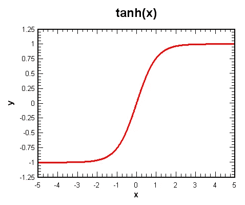

# RNNs 与注意力的进化

> 原文：<https://medium.com/analytics-vidhya/rnns-and-the-evolution-of-attention-f92deb76b51a?source=collection_archive---------18----------------------->

预测未来一直是实践中最令人着迷的课题之一，并且已经发展了一段时间。尤其是在这个信息时代，现代计算的发展和人工智能的进步使它比以往任何时候都更有趣。序列对序列建模一直是主要的研究领域之一，其中模型学习在一段时间内捕获的观察，并能够在给定的场景下生成这样的模式。虽然统计方法已经存在了很长一段时间，但神经网络特别是 RNNs 的最新进展在当今所有应用中抢尽了风头，如自然语言处理、语音转文本、时间序列分析等。我们将对 rnn、它们的流行变体 LSTM 和 GRU 以及注意力机制的演变进行概述，注意力机制是当今最先进的网络(如 GPT3)的核心。

**递归神经网络(RNN):**

众所周知，典型的全连接神经网络有三层，即输入层、隐藏层和输出层。这些在回归和分类问题方面非常出色，在这些问题中，输入不相互依赖，或者一个输入/观察值与另一个输入/观察值之间没有相关性。

*图 1a——全连通网络*

但是在序列预测问题中，观察值通过时间彼此相关，因此全连接层通过设计不能对这种数据建模，因为它记住了前一步骤中发生的事情，这影响了当前的预测。这就是为什么 RNNs 被认为是解决这种存储器/环境问题的概念的确切原因。

*图 1b —递归神经网络*

如上所述，通过简单地添加从输出到下一个输入的反馈回路来形成 RNNs，这种设计向网络提供了关于先前观察是什么的想法，这固有地向 RNNs 提供了记住上下文的能力。让我们看看它是如何反向传播的。

**通过时间的反向传播:**

与全连接层不同，输入通过 rnn 顺序馈入，因此每个时间步都会发生反向传播。因此权重更新或梯度流随时间反向传播。例如，在如下所示的 FC(全连接)和 RNN 之间的输入转发之间的比较中，我们清楚地看到 FC 网络将有一次梯度更新，但在 RNN 的情况下，将有 5 次。

由于这种性质，rnn 需要在每个时间步进行反向传播。如果序列很长，梯度可能会随着时间反向传播而呈指数收缩。这种现象被称为**消失梯度**问题，其中 RNN 无法在长序列中学习(更新权重)，或者被称为跨不同时间步长的上下文。为了理解这一点，让我们考虑一个电影评论，它说*“我很可能不会推荐这部电影”*，这是一个积极的评论。但由于 RNNs 无法记住长期依赖或短期记忆，他们可能只会看到*“不推荐这部电影”*，并将此归类为负面评论。

为了解决 RNNs 中的短期记忆问题，引入了 RNNs 的新变体，命名为**长短期记忆(LSTM)** 和**门控循环单元(GRU)**

**长短期记忆(LSTM)**

想象一下，当你第一次坐过山车的时候，在每一次转弯、高峰和低谷的时候，你都会尖叫着死去，就好像这是你生命的最后一刻。但是当你习惯了这种乘坐，并且更频繁地乘坐时，那些尖叫声就变成了一种乐趣，现在你似乎很享受这种乐趣。这种转变的原因是因为你的大脑能够在一段时间内保持这种体验，并且在你脑海深处的某个地方，你知道这次旅行是安全和快乐的。这种在脑海深处的东西被称为背景！这正是 LSTM 正在努力做的。

LSTMs 具有保持沿着整个网络运行的长期依赖性的小区状态/上下文向量。

*图:3a LSTM 建筑*

如上图所示，沿着网络顶部的水平线被称为保持记忆的单元状态。现在让我们看看不同的组件是如何一起工作的，以及它们存在的必要性。

LSTM 的主要目标是维护和利用 c。有门和激活功能可以做到这一点。

**遗忘门:**遗忘门控制需要从存储器中删除的内容。这有助于网络消除干扰预测的不必要的噪声。

**输入门:**输入门控制需要添加到存储器中的内容，这些内容在新输入中可能是必不可少的。这过滤了需要添加到单元状态 c 的候选存储器数据。

**输出门:**输出门通过将当前输入与存储器 c 相乘产生新的隐藏状态。

**乙状结肠功能**

*图:3b — Sigmoid 函数*

对于任何给定的输入，sigmoid 函数返回范围从 0 到 1 的值。由于这一特性，该函数被用作选择函数。它允许接近 1 的值通过，并过滤接近 0 的值。这就是为什么这个函数被用于 LSTM 单元的输入和遗忘门。

**双曲正切函数**

图 3c —双曲正切函数

双曲正切函数产生-1 和+1 之间的输出。这有助于输出一个较小的数字，否则当迭代次数增加时会爆炸。

**门控循环单元(GRU)**

*图 4a GRU 建筑*

gru 是对 LSTMs 的一个微小的修改。

*   它将遗忘门和输入门合并成一个“更新门”。
*   它还合并了单元格状态和隐藏状态
*   它更新存储器两次，第一次(使用旧状态和新输入，称为复位门)和第二次(作为最终输出)。
*   旧单元状态或隐藏状态(具有输入)用于其自身的更新以及预测。

**RNNs 中的编码器和解码器架构**

与分类或回归问题不同，序列到序列预测问题具有挑战性，因为输入和输出观察值的数量是不确定的。为了缓解这个问题，引入了编码器-解码器架构。

*图 5a 编码器-解码器网络*

在这种架构中，C 从编码器传递到解码器模块。这里的复杂性在于 C 向量需要有效地编码所有的输入。另一方面，解码器应该能够以非常小的误差对预测进行精确解码。并且在序列预测中，解码器可能不知道其他解码器的结果是什么。为了克服这些问题，引入了注意机制

**注意**

*图 6a 编码器-解码器架构注意*

关注层通过从所有解码器层中提取隐藏状态并为这些状态分配权重来解决这个问题。这些加权状态被传递到解码器层以预测 y1。现在细胞状态 S1 和隐藏状态一起反馈到注意层。这一次，注意力层给隐藏状态分配不同的权重，因为它知道解码器层已经预测了什么。这在解码器端顺序发生，并且消除了从单个内容向量预测序列的限制。

注意力层只是一个完全连接的层，它在训练时学习注意力权重。这种机制被证明是非常强大的，为变压器及其变体奠定了基础。

我们正处于一个激动人心的时代，人工智能领域的日常研究数量正在增加。理解核心概念对于理解新的研究领域、应用和跟上时代是很重要的。感谢阅读！

*最初发表于*[*【https://www.linkedin.com】*](https://www.linkedin.com/pulse/rnns-evolution-attention-saravana-alagar/)*。*