# 使用 YOLOv3 检测多个国家的道路损坏情况

> 原文：<https://medium.com/analytics-vidhya/road-damage-detection-for-multiple-countries-using-yolov3-51fc7c6b43bd?source=collection_archive---------7----------------------->

作为深度学习自我案例研究的一部分，我选择了一个关于检测多个国家的道路损坏的问题，这几乎是全球每个国家的一个主要问题。

在这篇博客中，我将向你解释我是如何使用 YOLOv3 架构来检测印度和日本道路的道路损坏，并解决这个问题的。

# 内容:

1.  商业问题
2.  资料组
3.  探索性数据分析
4.  YOLOv3
5.  数据准备
6.  Yolo 盒子
7.  约洛损失
8.  首次切割方法
9.  结论
10.  生成自定义锚定框
11.  使用增强和自定义锚盒的模型训练
12.  预测评估
13.  最终模型
14.  模型量化
15.  简化应用程序
16.  未来的工作
17.  参考

# 业务问题:

道路基础设施在挽救生命和一个国家的经济发展中起着至关重要的作用，因此，为了减少由于坑洼和道路损坏造成的道路事故，及时管理和检查道路是一项重要的任务，因为考虑到与位置、年龄、温度等相关的各种因素，道路会随着时间的推移而恶化。鉴于道路或高速公路的长度很长，工程师对道路的目视检查非常耗时。因此，提出一种基于自动化人工智能的解决方案，可以检测损坏类型，有助于改善道路状况的监控方式。

因此，这个问题的主要议程是分析我们如何利用日本的数据集，通过添加该国的图像来检测其他国家的道路损坏，人工智能系统必须在这些国家发展。

# 数据集:

针对这个问题，我从这个[链接](https://github.com/sekilab/RoadDamageDetector)收集数据集。

这个数据集由三个 zip 文件组成，一个用于训练数据，另外两个用于包含图像和带注释的 xml 文件的测试数据。而对于这个问题

1.  train.tar:该文件包含 26620 幅图像及其各自的注释 xml 文件，从三个不同的国家(即日本、印度和捷克)收集，与印度和捷克相比，日本数据集包含更多使用智能手机生成的图像。
2.  test1.tar:这个文件由 2282 张图片组成，除了没有注释文件，因为我必须在这些图片上测试模型性能。

# 探索性数据分析:

作为 EDA 的一部分，我分析了每个国家给定数据集的损坏类型的分布。为了检查我的模型将如何根据类的分布来执行。

对于这个问题，只考虑了 4 种类型的损坏类别:

1.  D00:纵向裂纹
2.  D10:横向裂纹
3.  D20:对准器裂纹
4.  D40:坑洞

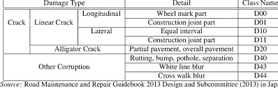

researchgate.net

针对印度数据集的 EDA:

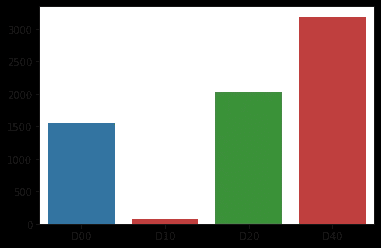

条形图

观察:

1.  从上图可以看出，印度大部分道路损坏属于 D40 类，即坑洼。
2.  其次是 D20 类即鳄鱼裂纹和 D00 类即纵向裂纹
3.  而 D10 损伤类别即横向裂纹在印度图像中很少出现。因此，当仅考虑印度图像作为训练数据时，在评估包含 D10 损坏类型的测试数据的性能时，这会导致一些问题。

日本数据集的 EDA:

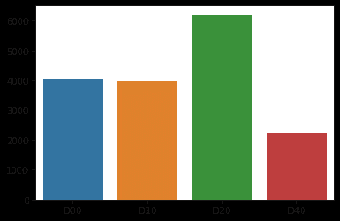

箱形图

观察结果:

1.  从上图中可以看出，D20 类别的损坏类型，即鳄鱼皮开裂，在日本道路上最为常见。
2.  对于日本图像，D00 和 D10 类别被平均分配。
3.  在日本，与鳄鱼开裂相比，路面坑洼对道路的损害要小得多。

捷克数据集的 EDA:

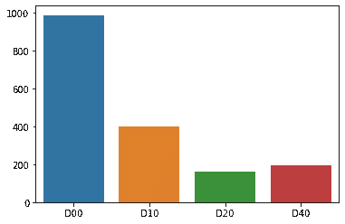

条形图

观察结果:

1.  在捷克，大多数道路损坏属于 D00 类，即纵向裂缝。
2.  其次是 D10(横向裂缝)和坑洼(D40)
3.  与其他类型的道路损坏相比，捷克的鳄鱼裂缝道路损坏非常少。

# YOLOv3:

为了解决道路损坏检测问题，我选择了 YOLOv3 架构来训练我的模型并检测道路损坏类型，这是用于对象检测问题的最先进技术之一。

我在我的 jupyter 笔记本上构建并移植了 YOLOv3 架构。关于 YOLOv3 的详细架构和解释，你可以参考这个[博客](https://towardsdatascience.com/yolo-v3-object-detection-53fb7d3bfe6b)。

如果你想参考 YOLOv3 的原始研究论文，你可以在这里找到。

# 数据准备:

在将数据输入模型之前，首先要根据可训练的模型格式转换给定的数据集。

为了数据准备，为了扩充图像和它的边界框，我使用了 [imgaug](https://imgaug.readthedocs.io/en/latest/) 库来实现对训练数据的扩充。

作为数据增强的一部分，我使用了 FlipLR 增强技术，通过水平翻转来增强图像。

为了将数据输入到模型中，我准备了 TFRecords 形式的训练和验证数据集。

TFRecord 格式是一种用于存储二进制记录序列的简单格式。TFRecord 将数据存储为二进制字符串序列。关于 TFRecord 的更多解释，你可以看看这个[博客](/mostly-ai/tensorflow-records-what-they-are-and-how-to-use-them-c46bc4bbb564)。

但是在创建 TFRecord 之前，我解析了注释 xml 文件，以便使用递归创建 TFRecord。

在解析 xml 文件并为每个标签生成字典之后，我实现了创建 TFRecords 的函数。

# YOLO 盒子:

YOLOv3 输出边界框的相对坐标，而不是绝对坐标，所以为了计算绝对坐标，我实现了 yolo_boxes 函数。

YOLOv3 的预测将是(batch_size，grid，grid，anchors，(tx，ty，tw，th，obj，…classes))，现在为了得到绝对的盒子坐标正如作者在[论文](https://arxiv.org/pdf/1804.02767.pdf)中所说。

```
bx = sigmoid(tx) + Cx
by = sigmoid(ty) + Cy
```

这里 bx 和 by 是绝对坐标，通常用作图像方框的质心坐标，Cx 和 Cy 表示当前网格单元左上角的绝对位置。tx 和 ty 是相对于网格单元的质心位置。要深入了解网格、锚定框和网格单元，你可以参考这个[博客](https://towardsdatascience.com/dive-really-deep-into-yolo-v3-a-beginners-guide-9e3d2666280e)。

但是将 sigmoid 应用于相对质心坐标，并将其与网格单元的坐标相加是不够的，我通过将结果除以网格大小来归一化它。

在获得绝对质心坐标后，将 sigmoid 函数应用于客观分数和类别。

文中的 bw、bh 是箱子的宽度和高度，pw 和 ph 是锚箱坐标。所以根据论文，为了得到预测包围盒的绝对高度和宽度。

```
bw = exp(tw) * pw
bh = exp(th) * ph
```

这里 pw、ph 是锚箱的高度和宽度，bw、bh 是绝对高度和宽度。

现在我们计算了 bbox 中心的位置，但是我们需要角的位置，所以我在代码下面应用了角的位置，并连接了输出。

# YOLO 损失:

YOLO 的损失函数由四部分组成:质心损失(xy)、宽度和高度损失(wh)、目标损失和分类损失。

在计算 YOLO 损失之前，我计算了计算损失函数所需的各种掩码，即 obj_mask 和 ignore_mask。

obj_mask:指定对象是否存在的掩码。1 表示存在，0 表示不存在。

ignore_mask : Mask 指定如果真框和预测框的 iou 低于阈值，则忽略这些预测。

在论文中，作者提到 YOLOv3 模型很难处理小对象，我用下面的代码片段给小盒子更高的权重。

这里，在 YOLO 损失函数中，质心损失和宽高损失构成回归问题，因为 YOLO 预测的是实值坐标，所以我使用[平方损失](/data-science-group-iitr/loss-functions-and-optimization-algorithms-demystified-bb92daff331c)通过对所有框坐标求和来最小化。除此之外，我用 box_loss_scale 和 obj_mask 分别乘以损失的平方，box _ loss _ scale 赋予较小的盒子较高的权重，obj _ mask 指定对象是否存在。

在计算平方损失后，我计算了客观分数和分类分数的二元交叉熵损失。

但是，在计算对象损失时，会有一些情况，其中模型会预测不在图像基本事实中的边界框，所以为了在计算对象损失时处理这种情况，如果对象存在，我使用 obj_mask 给对象损失加权，并使用(1-obj_mask)和 ignore_mask 将其与对象损失加权相加。

在计算了目标损失之后，我计算了这个问题中每个类的交叉熵损失。我使用了稀疏分类交叉熵损失。

在计算所有 4 部分损失后，模型的最终损失将是所有 xy_loss、wh_loss、obj_loss 和 class _ losss 的总和。

# 首次切割方法:

作为第一种方法，我使用印度和日本的数据集训练模型，没有增加和预计算锚盒。

我只使用日本数据集、印度数据集和第三个结合日本和印度数据集来训练模型。

对于模型训练，我首先将暗网层的预训练权重加载到我的模型中，该暗网层是在由 80 个类组成的大型 COCO 数据集上训练的，并在我的模型中冻结暗网层，即暗网层中的整个训练权重不会改变。

可通过此[链接](https://pjreddie.com/media/files/yolov3.weights)下载预训练重量。

在加载权重和冻结我的模型的暗网层之后，我使用 Adam optimizer 进行优化，学习率为 0.001。关于各种优化算法更详细的解释，你可以参考这个[博客](/datadriveninvestor/overview-of-different-optimizers-for-neural-networks-e0ed119440c3)。

创建 Adam optimizer 实例后，我使用损失函数作为 YOLO 损失来编译模型。

在上面的代码中，yolo_anchors 是一个由 9 个锚框坐标组成的元组列表，这些坐标是在 COCO 数据集上使用称为 K means 的聚类技术预先计算的。我通过将 0.4 作为 IOU 阈值来训练模型。

yolo_anchor_masks : Masks 告诉层哪个锚框负责预测边界框。

第一层预测 6，7，8，因为这些是最大的盒子，第二层预测较小的盒子，等等。

之后，我使用回调来训练模型，以改变学习率，即使用 ReduceLROnPlateau，提前停止，生成 tensorboard 日志并节省重量。

在数据集的不同组合上训练模型后，我通过可视化错过的预测和额外预测的图来评估模型，我在预测评估部分对此进行了解释。

# 推论:

在通过在第 10 个时期提前停止来训练模型之后，首先我在训练的数据集上推断训练的模型，并将其与模型是否能够正确预测的基本事实进行比较。然后我根据测试图像推断出我的模型。

## 仅在日本数据集上训练的模型的推论:

**对于列车图像上的日本道路:**

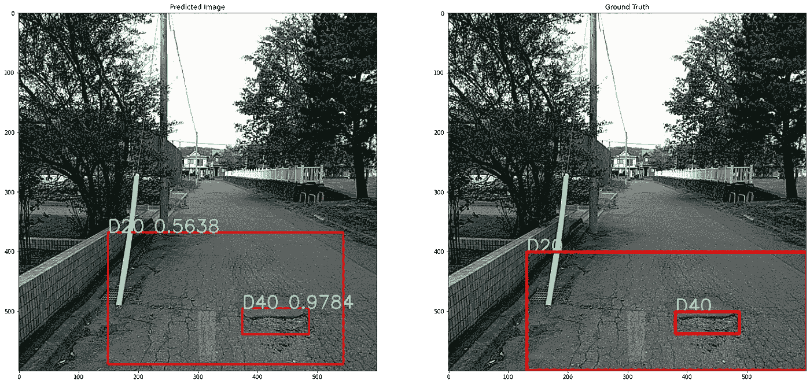

**测试图像上的日本道路:**

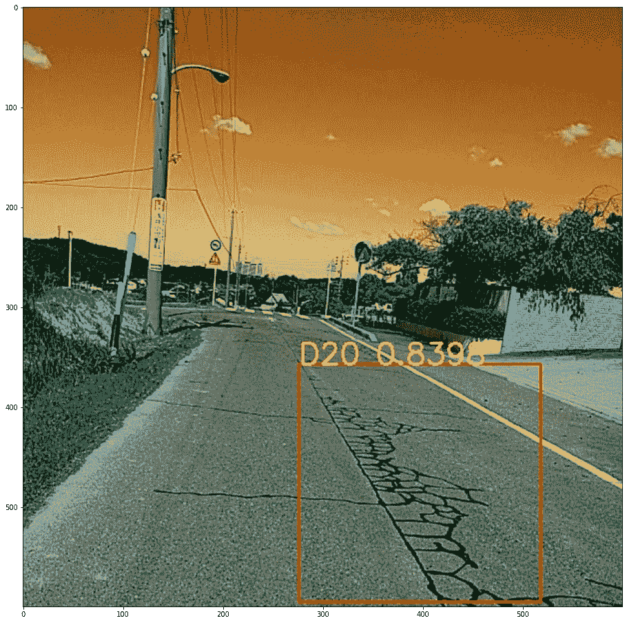

## 仅在印度数据集上训练的模型的推论:

**对于印度公路上的列车数据:**

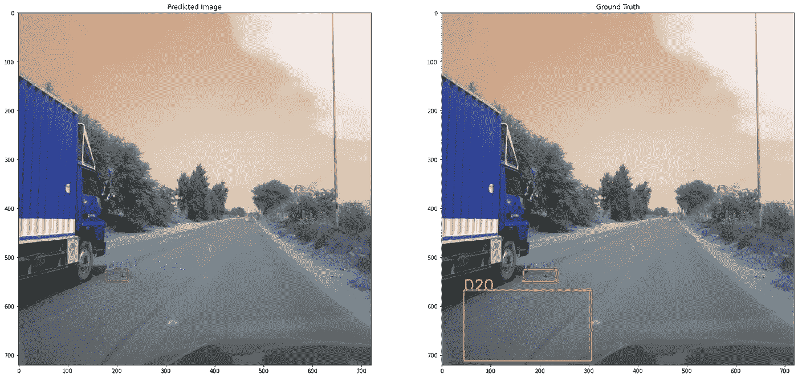

**针对印度道路的测试数据:**

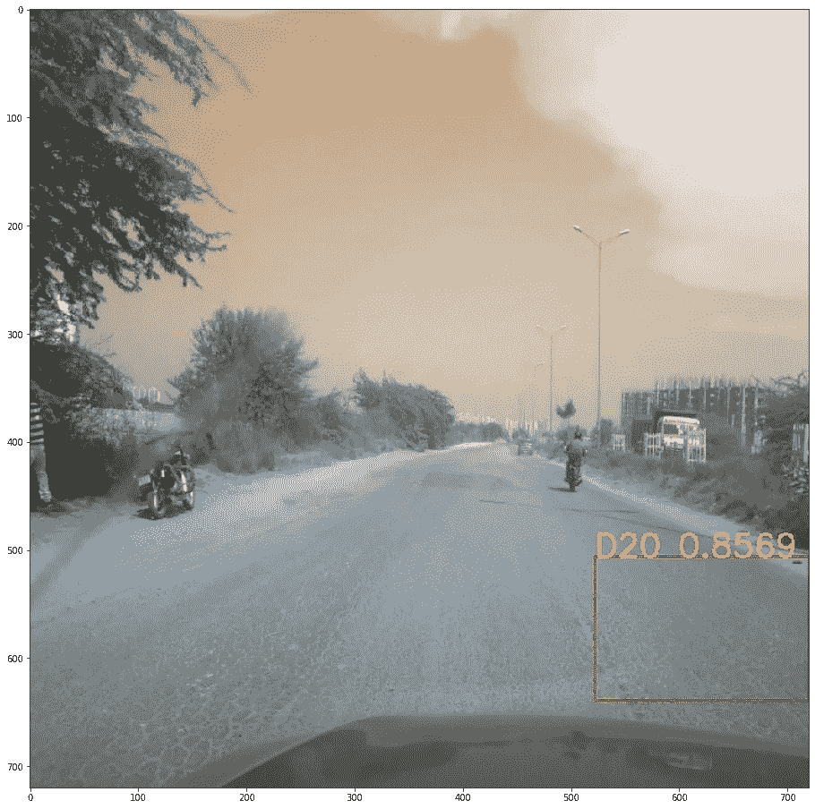

## 在组合数据集上训练的模型的推理:

**对于列车图像上的日本道路:**

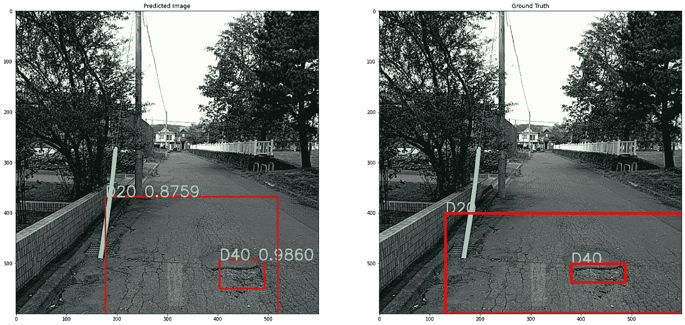

**对于测试图像上的日本道路:**

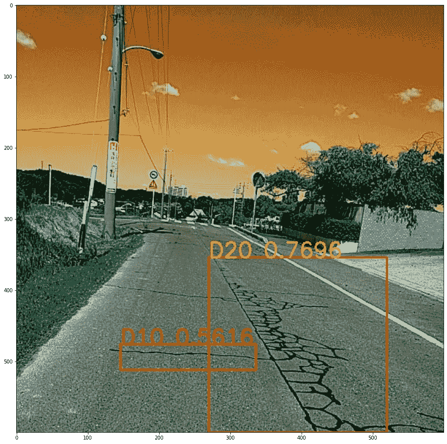

**对于列车图像上的印度道路:**

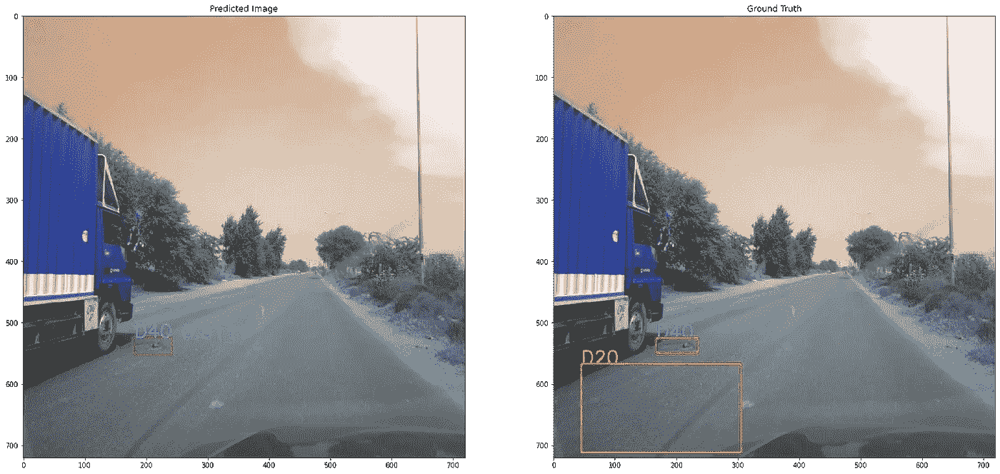

**对于印度道路上的测试法师:**

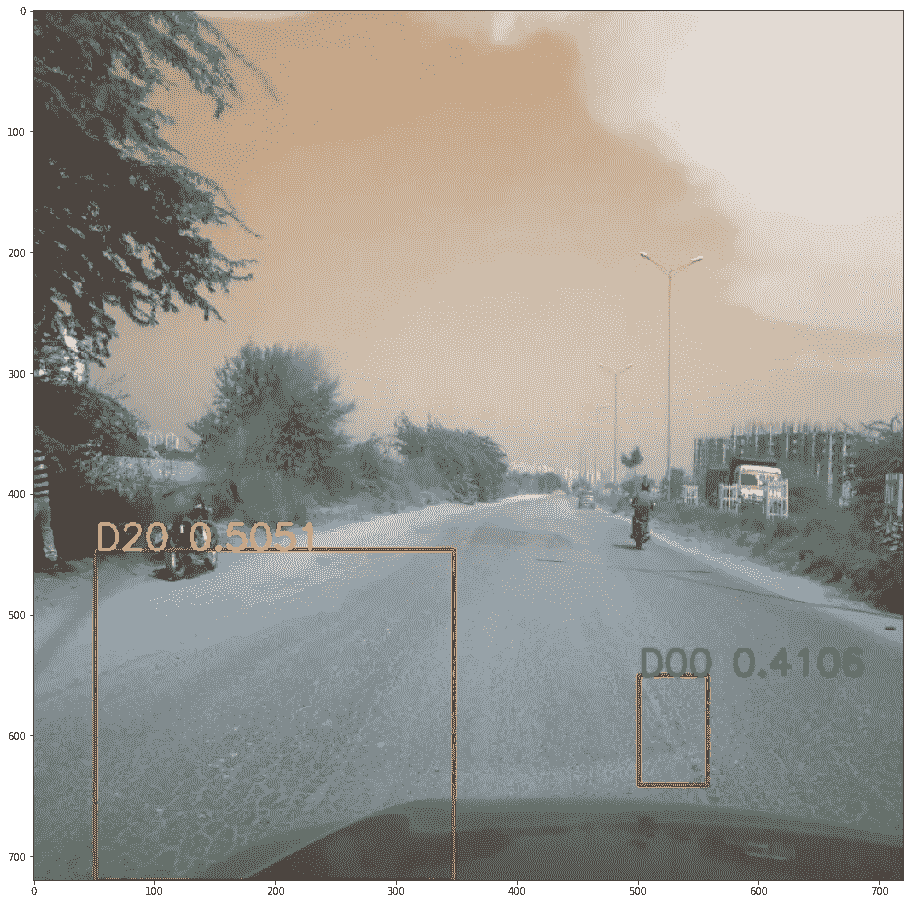

现在，当您比较分别在印度和日本道路数据集上训练的模型的推断，以及当模型在印度和日本的组合数据集上训练时，模型预测得到了改进。

# 生成自定义锚定框:

在实现了第一次切割方法之后，我根据这个问题的给定数据集计算了锚盒。

锚盒是使用 K 均值聚类算法来计算的，正如作者在论文中所描述的，作者使用 K 均值来计算锚盒。关于 K 均值算法更详细的解释可以参考这个[博客](/@dilekamadushan/introduction-to-k-means-clustering-7c0ebc997e00)。

我使用 K=9，因为我必须生成 9 个定位框坐标。并在给定数据集上应用了使用 IOU 度量的 K 均值聚类技术。

# 使用增强和定制锚盒的模型训练:

在根据给定的问题数据集计算锚盒之后，我在增强的训练数据上训练该模型，并分别在日本和印度数据集以及组合数据集上使用定制的锚盒。

其余时间，我使用相同的 Adam 优化器，学习率为 0.001，IOU 阈值为 0.4。

## 日本数据集上的推论:

**在列车图像上:**

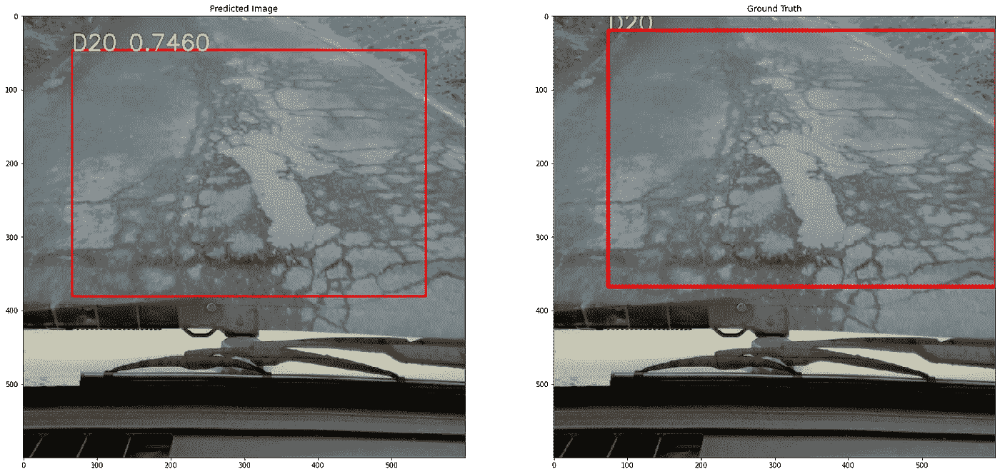

**关于测试图像:**

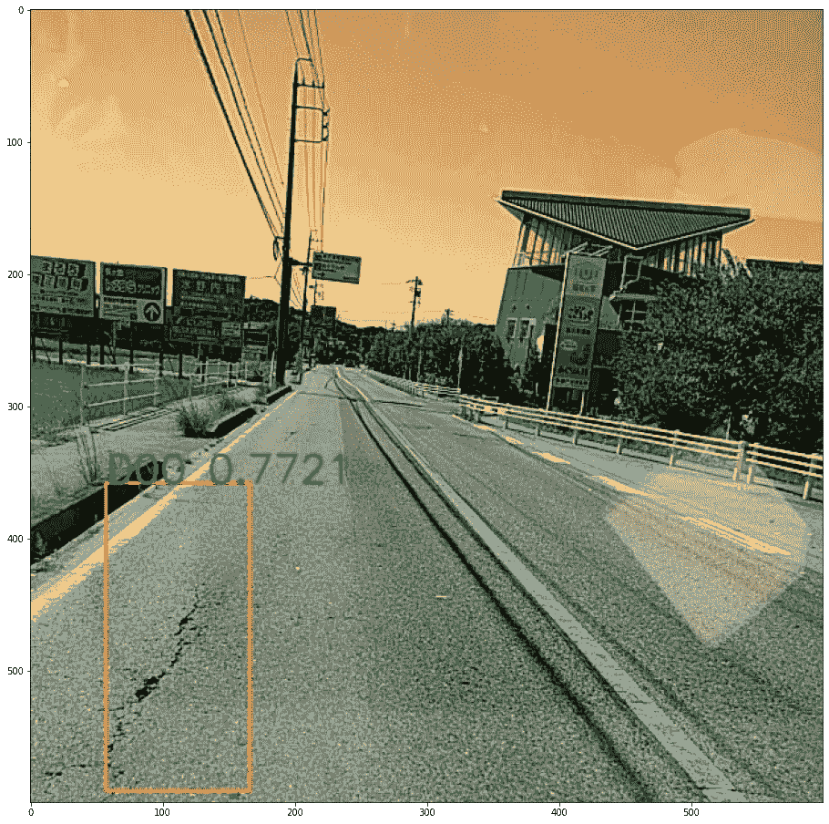

## 印度数据集上的推论:

**在列车图像上:**

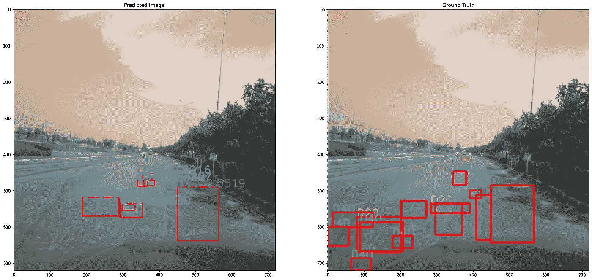

**在测试图像上:**

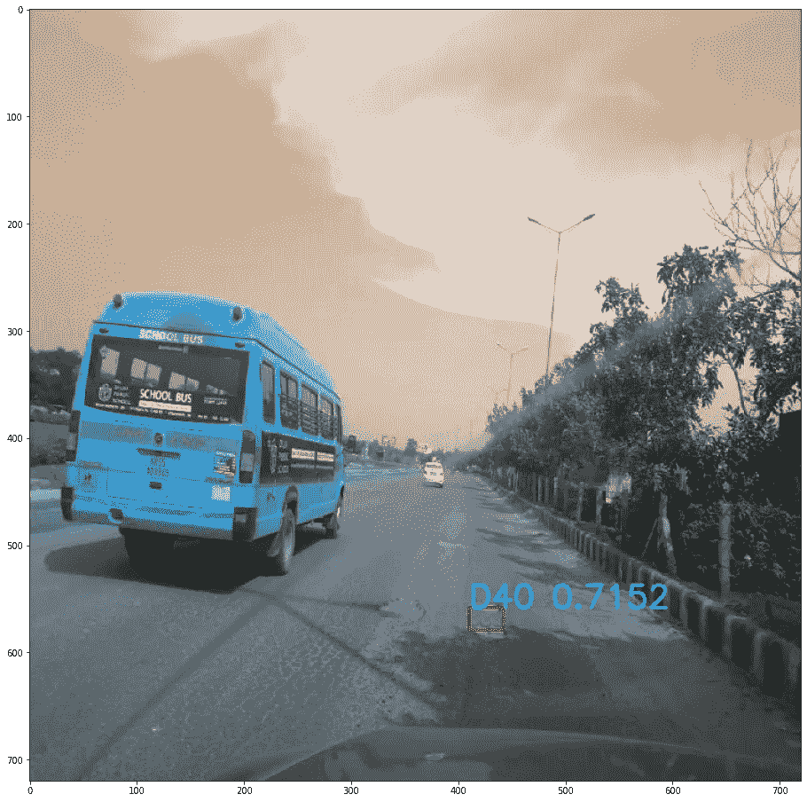

# 预测评估:

为了评估我的模型对列车数据的预测，我首先运行训练好的模型，并对所有列车图像进行推理，然后将预测保存在文本文件中，格式如下:

```
<image_name> <class_name> <confidence_score> <bounding boxes coordinates>
```

并使用注释文件在 groundtruth 上创建了另一个具有上述格式的文本文件。

生成文本文件后，我为每个类绘制了柱状图，以可视化错过的预测和额外的预测，以检查我的模型预测了多少额外的边界框(如果有的话)。

## 对于型号 1:

**在组合数据集上训练的模型的图:**

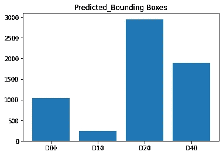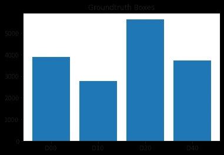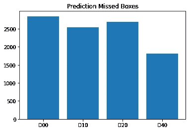

**仅在日本数据集上训练的模型的图:**

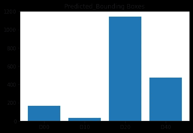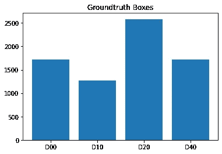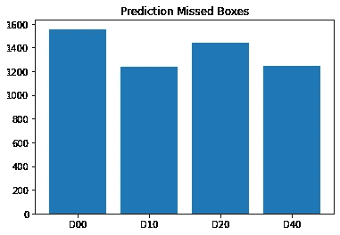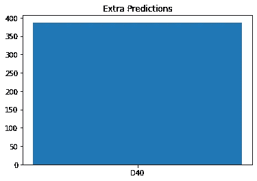

**在印度数据集上训练的模型的图:**

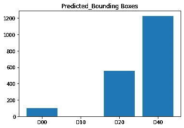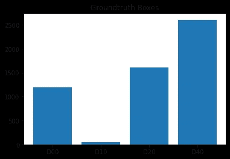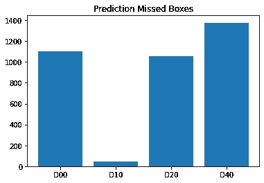

## 对于使用数据扩充和自定义锚盒的模型 2:

**仅在日本数据集上训练的模型的图:**

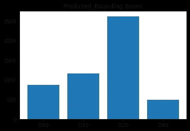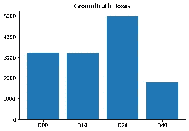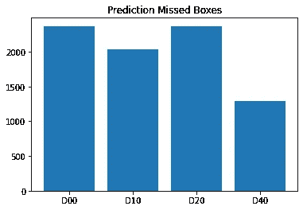

**仅在印度数据集上训练的模型的图:**

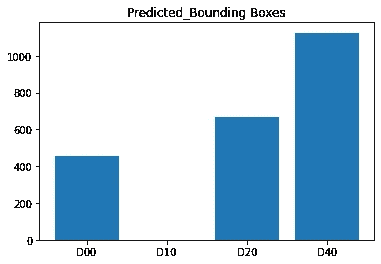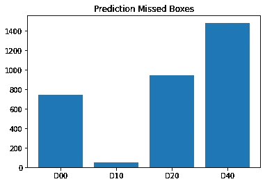

## 观察结果:

1.  从上面的柱状图可以看出，当模型在两个国家(即日本和印度)的独立数据集上训练时，某些类型的损坏的预测失误率很高，但当模型通过组合数据集进行训练时，模型得到了改进，与在单个数据集上训练的模型相比，模型能够更好地检测道路损坏
2.  对于模型 1 日本数据集，与模型 2 和在组合数据集上训练的模型相比，模型预测了 D40 类别的额外道路损坏，即坑洼。
3.  D40 类别的预测失误非常高，因为 YOLOv3 对于通常被认为是较小物体的小物体和坑洼没有给出更好的结果，所以模型可能已经错过了那些物体。

# 最终型号:

我选择了在组合数据集上训练的模型作为量化的最终模型，并将其部署在 Streamlit 上。

# 模型量化:

选定最终模型后，我尝试了后训练量化。

训练后量化是一种减小模型大小的技术，同时也改善了 CPU 延迟。

我应用了训练后 float16 量化，它使用 TFLiteConverter 将权重量化为 float 16，与未量化的模型相比，它将模型大小减少了 2 倍，还改善了 CPU 上的延迟。

还有各种其他的后量化技术，比如可以将模型权重量化为整数，这比原始模型小 4 倍，速度快 3 倍，不仅在 GPU 中，而且整数量化模型在 CPU、TPU 和微控制器上工作得相当好，速度也更快。你可以参考这篇[文章](https://www.tensorflow.org/lite/performance/post_training_quantization)了解更多后量化技术。

## 模型尺寸:

在使用 post training float 16 量化对模型进行量化之后，我的模型大小减少到了 2x。

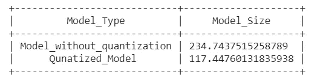

模型尺寸比较

我还在 CPU 和 GPU 上测量了测试数据每张图片的量化模型和未量化模型的预测率。

## CPU 上的预测速率:

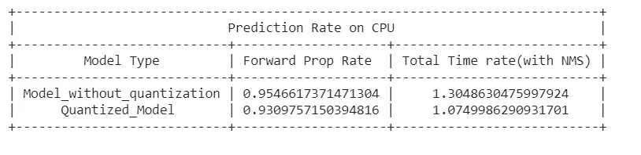

**观察:**

1.  从上表的比较中，我们可以得出结论并观察到，我们在 CPU 上进行的量化模型实验给出的结果比没有量化的模型稍快
2.  因此，该模型在 CPU 上的推理速度比在 GPU 上的推理速度快，因此，如果机器只有 CPU 架构，那么量化模型对于推理或预测是有用的

## GPU 上的预测速率:

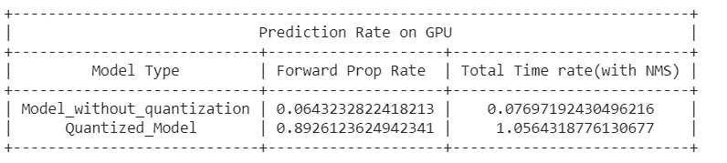

**观察:**

1.  从上表比较中，我们可以得出结论并观察到，我们在 GPU 上用非量化模型进行的实验比量化模型给出的结果更快
2.  因此，如果计算机体系结构有 GPU，那么非量子化的模型可以比量子化的模型推断得更快。

# Streamlit 应用:

在训练我的模型并选择最终模型后，我为这个问题创建了 streamlit 应用程序。

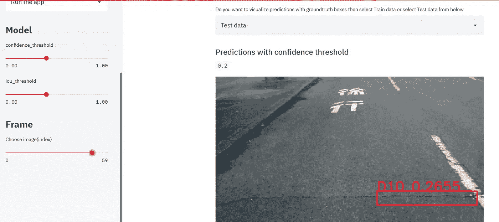

由于存储限制，我将训练和测试数据限制为 100 和 60 张图像，以便在应用程序中选择，但如果您有来自印度和日本的损坏道路图像，我添加了在捕获的图像上测试的选项，其中模型 api 将预测道路损坏的类型(如果在上传的图像中有)。

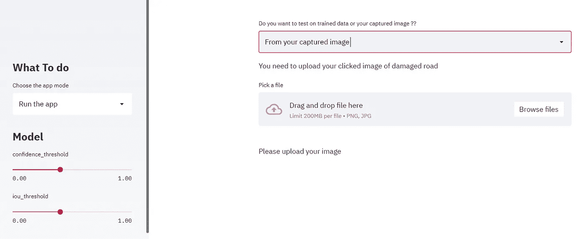

您甚至可以使用置信度阈值和 IOU 阈值来检查图像上各种阈值的预测。

你可以参考[这个](https://share.streamlit.io/jugaloza/road_damage_detection_streamlit/main/app.py)链接来试用这个 app。

# **未来工作:**

我的工作可以作为未来工作的一部分进行改进如下:

1.  现在，我们已经改进了 YOLO 的技术，如 YOLOv4 和 YOLOv5，因此可以使用改进的技术来训练道路损坏检测，作为未来工作的一部分。
2.  可以使用各种其他增强技术来改进模型，如在数据准备第一部分中提到的，我已经使用了 FlipLR 技术，但是还有各种其他技术来增强数据和边界框。
3.  作为未来工作的一部分，除了浮点 16 量化技术之外，还可以使用各种其他量化技术。
4.  作为未来的工作，人们也可以尝试使用捷克数据集来训练模型，除了印度和日本，我没有使用捷克数据集进行训练。
5.  作为未来工作的一部分，上述模型可以扩展到除日本和印度之外的任何其他国家，如果您使用智能手机或任何其他设备点击您想要检测道路损坏的国家的图像，我的模型可以通过组合所有数据集(包括模型必须训练的国家的数据集)或使用这些数据集从头开始训练来进行微调。

你可以在我的 [github repo](https://github.com/jugaloza/Road_Damage_Detection_Using_YOLOV3) 中查阅我的代码、训练过的模型和 ipython 笔记本。

如果你喜欢我的博客，别忘了拍下来分享。

感谢您的阅读。

# 参考资料:

[https://arxiv.org/pdf/1804.02767.pdf](https://arxiv.org/pdf/1804.02767.pdf)

[https://www.tensorflow.org/model_optimization](https://www.tensorflow.org/model_optimization)

[https://github.com/zzh8829/yolov3-tf2](https://github.com/zzh8829/yolov3-tf2)

[https://github . com/Lars 76/k means-anchor-boxes/blob/master/k means . py](https://github.com/lars76/kmeans-anchor-boxes/blob/master/kmeans.py)

[https://towards data science . com/anchor-boxes-the-key-to-quality-object-detection-ddf9d 612 D4 f 9](https://towardsdatascience.com/anchor-boxes-the-key-to-quality-object-detection-ddf9d612d4f9)

[https://planspace.org/20170323-tfrecords_for_humans/](https://planspace.org/20170323-tfrecords_for_humans/)

[https://towards data science . com/dive-really-deep-into-yolo-v3-a-初学者指南-9e3d2666280e](https://towardsdatascience.com/dive-really-deep-into-yolo-v3-a-beginners-guide-9e3d2666280e)

[https://towards data science . com/yolo-v3-object-detection-53 FB 7d 3 bfe 6 b](https://towardsdatascience.com/yolo-v3-object-detection-53fb7d3bfe6b)

[](https://www.linkedin.com/in/jugal-oza-974048109/) [## Jugal Oza -助理工程师- Atos | LinkedIn

### 查看 Jugal Oza 在全球最大的职业社区 LinkedIn 上的个人资料。Jugal 有 2 个工作列在他们的…

www.linkedin.com](https://www.linkedin.com/in/jugal-oza-974048109/)