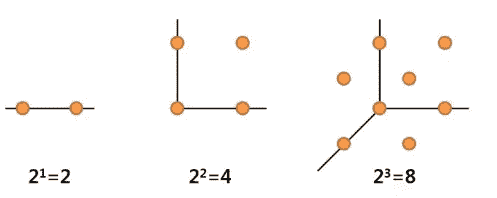
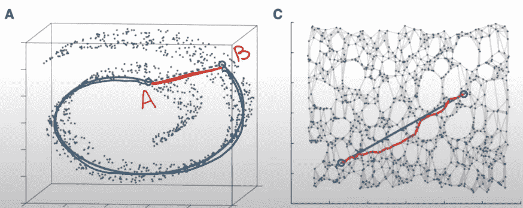

# 降维专家之路

> 原文：<https://medium.com/analytics-vidhya/road-to-dimensionality-reduction-expert-7f4aa425c140?source=collection_archive---------8----------------------->

Haneul Kim 摄

# 目录

> [1。简介](#f9cb)
> 
> [2。维度的诅咒](#06c6)
> 
> [3。线性降维技术](#7c3f)
> 
> [4。非线性降维技术](#8e79)
> 
> [5。结论](#1f4b)

# **简介**

大数据是 3Vs、**量**、**种**、**速**高的数据。大数据有很多好处，但它也带来了一些后果，比如增加了**计算复杂性**，遏制了**噪声数据**，并且**难以可视化**。

# 维度的诅咒

维数高会导致众所周知的“维数灾难”问题，即**随着维数的增加，行数必须呈指数增长，以便具有相同的解释能力**。例如，如果你有 10000x100 个数据集，如果你增加 2 个维度，你将需要 10000 x102 个数据集才能有相同的解释能力。

从左至右看下图:

1.  dimension = 1，2 数据(行数)需要获取表示数据间距离= 1 的信息。
2.  维度= 2，2**2=4 获取相同信息所需的数据(数据之间的距离= 1)。
3.  维度= 3，2**3=8 获取相同信息所需的数据(数据之间的距离= 1)。
4.  维度= 4，2**4=16，以此类推…

[https://www.youtube.com/watch?v=ytRmxBvyGG0&t = 650s](https://www.youtube.com/watch?v=ytRmxBvyGG0&t=650s)

**其他问题**:

*   数据中有噪声的百分比更高
*   增加计算负担
*   需要更多数据来确保泛化能力(如上所述)

因此，随着数据量的增加，需要使用降维技术来提取关键信息并减少计算时间。

它们分为两种主要类型:

*   **特征选择** : **选择**特征子集以减少尺寸。
*   **特征提取** : **从原始特征创建**新的特征集。它涉及特征的转换，因此不是完全可逆的(可以逆转，但会丢失一些信息)。

特征提取有两种方式:

*   线性:使用**线性函数**将高维转换为低维，当数据是线性可分时效果很好。这些被称为线性降维技术(LDRTs)。
*   非线性:不属于 LDRTs 的任何东西，当数据不是线性可分的时候使用= >复杂的非线性结构。这些技术被称为 NLDRTs。

线性技术计算效率高并且能够找到全局最优，但是它不能理解数据的非线性结构。这就是更复杂的非线性降维的用武之地，尽管计算量更大，但它能够找出数据的非线性结构。

# **线性 DRTs**

**主成分分析**

*   目标是通过执行解释大多数数据差异的线性变换来找到特征，这些特征被称为主成分(PCs)。
*   应用:图像、语音处理、可视化、EDA 和机器人传感器数据。

给定 n(特征数)，PCA 将输出 n 个 PC(第一个 PC，第二个 PC，…第 n 个 PC)，其中第一个 PC 解释了原始数据中最大的变化量，因此我们选择 n-k 个 PC 来降低维数。通常，在实践中，我们保留 95%方差的 PC 数量，例如，当 n=100 时，只需要前 50 个 PC 来解释我们数据中 95%的方差，那么 k 将被设置为 50，这样我们就剩下原始维度的一半大小。

**奇异值分解**

*   计算量大且对异常值敏感。
*   应用:数字图像处理、模式识别、自然语言处理、文本摘要、推荐系统等。…

所有实矩阵 a 都可以分解成唯一的 USV^T.，也就是说，有一种方法可以通过再次旋转(u)、缩放(s)和 rotating(V^T 将 NxN 单位矩阵变换成 a。矩阵 S 是一个对角矩阵，奇异值按降序排列，因此使用的奇异值越多，矩阵看起来就越接近 A。因此，就像 PCA 一样，我们只保留足够数量的奇异值，以构建足够接近原始数据(A)的矩阵。

**潜在语义分析(LSA)**

*   用于从大型文本文档中提取相关文本。
*   尝试学习文本的语义表示和单词之间的联系。
*   使用 SVD 来实现上述目标。
*   应用:术语分类、摘要、单词搜索、查找同义词和反义词、分析开药时患者和医生之间的交流等

**局部保留投影(LPP)**

*   目标是保留数据集的邻域结构，类似于 LLE(NDRT)，但是 LPP 是线性的，因此在环境空间的任何地方都可以定义。
*   应用:图像检索、图像和视频分类、人脸/语音/模式识别和计算机视觉。

我并不完全了解 LPP，但只是想提一下，因为它有很多应用。如果您有兴趣深入了解 LPP，参考资料部分将列出何晓飞的著名论文《局部保存投影》,请阅读！

**独立成分分析**

*   目标是找到独立的组件。
*   用于分隔信息。而 PCA 压缩信息。
*   应用:信号处理，消除噪音，以及许多科学领域。

与 PCA 的唯一区别是 P 被独立变量取代。它将原始特征映射到新的特征空间。新特征空间中的特征必须尽可能独立，同时保留原始特征空间中的许多信息。注意，映射特征空间(独立分量)中的数据被假设为**非高斯**。

# **非线性 DRTs**

**内核主成分分析(KPCA)**

*   PCA 的扩展，用于处理不可线性分离的数据。
*   应用:健康、传感器和图像数据

使用核方法增加维数，使数据成为线性可分的，然后进行主成分分析。这是可能的原因，因为核方法允许创建线性判定边界，当它被投影回原始空间时，它变成非线性判定边界，因此我们可以使用非线性判定边界成功地分离非线性可分离数据。有多种核，如高斯核、多项式核和径向基核，根据您的数据进行选择。

**t 分布随机邻居嵌入(t-SNE)**

*   在保留数据簇的同时降低维度。
*   基于分布之间的匹配距离。
*   非常适合可视化具有非线性结构的数据。
*   应用:生物数据和各种科学领域。

它的目标是在降维的同时保持相似性度量。相似性度量是我们想要优化的成本函数(Kullback-Liebler 散度),但是由于非凸性，需要良好的初始化来达到全局最优。

**等距映射(Isomap)**

*   流行的 NDRT 在许多领域表现出高性能。
*   属于多种学习方法。
*   目标是在保持**测地线距离**的同时减少尺寸。
*   使用邻域图计算数据点之间的测地线距离。

[https://www.youtube.com/watch?v=3FAAILDbDd8&t = 918s](https://www.youtube.com/watch?v=3FAAILDbDd8&t=918s)

图 A 显示了原始数据结构，在给定的数据结构中，使用欧几里得距离(红线)计算 A-B 之间的距离是不正确的，A-B 之间的距离应使用蓝线来测量。为了实现这一点，Isomap 通过连接边和它的相邻点来创建一个图，然后使用最短路径算法从 A-B(图 C 中的红线)获得。

# 结论

这个博客的目标是获得不同类型的降维技术的广泛观点。这些技术是为处理特定数据而开发的，这意味着没有一个 DRT 能很好地处理所有数据。提到的所有维度技术都有多种变体来满足更具体的需求，请参考我在下面链接的研究论文(第一参考文献)了解更多信息。

由于计算速度更快(随着数据集变大，执行 DRT 需要很长时间)，从简单的技术开始总是一个好的做法，它会告诉你下一步需要走哪个方向。

对每种技术的深入解释以及用 python 例子对非线性和线性 DRT 的比较是下一篇博客的主题，敬请关注！

感谢您的阅读，如果您发现任何不正确的信息，请评论:)

**参考文献:**

*   [高维数据降维技术综述及比较研究](https://www.sciencedirect.com/science/article/pii/S156625351930377X)
*   [奇异值分解和图像压缩](https://www.youtube.com/watch?v=DG7YTlGnCEo&ab_channel=ArtificialIntelligence-AllinOneArtificialIntelligence-AllinOne)
*   [奇异值分解——斯坦福大学](https://www.youtube.com/watch?v=P5mlg91as1c&t=3s&ab_channel=ArtificialIntelligence-AllinOne)
*   [局部保留投影— NIPS](https://papers.nips.cc/paper/2003/file/d69116f8b0140cdeb1f99a4d5096ffe4-Paper.pdf)
*   [ICA](https://www.youtube.com/watch?v=2WY7wCghSVI&ab_channel=Udacity)
*   [ICA 与鸡尾酒会示例](https://www.youtube.com/watch?v=GgLaP4Des1Q&ab_channel=ShawhinTalebiShawhinTalebi)
*   [PCA 与内核 PCA](https://nirpyresearch.com/pca-kernel-pca-explained/)
*   [非线性降维:KPCA —加州理工](https://www.youtube.com/watch?v=HbDHohXPLnU&t=485s&ab_channel=caltechcaltech)
*   t-SNE，解释清楚— StatQuest
*   [使用 Python 示例介绍 t-SNE](https://towardsdatascience.com/an-introduction-to-t-sne-with-python-example-5a3a293108d1)
*   [流形学习](https://scikit-learn.org/stable/modules/manifold.html)
*   [ISOMAP & LLE —高丽大学(韩语)](https://www.youtube.com/watch?v=3FAAILDbDd8&t=918s)
*   [降维概述(维数灾难)——高丽大学(韩语)](https://www.youtube.com/watch?v=ytRmxBvyGG0&t=650s)